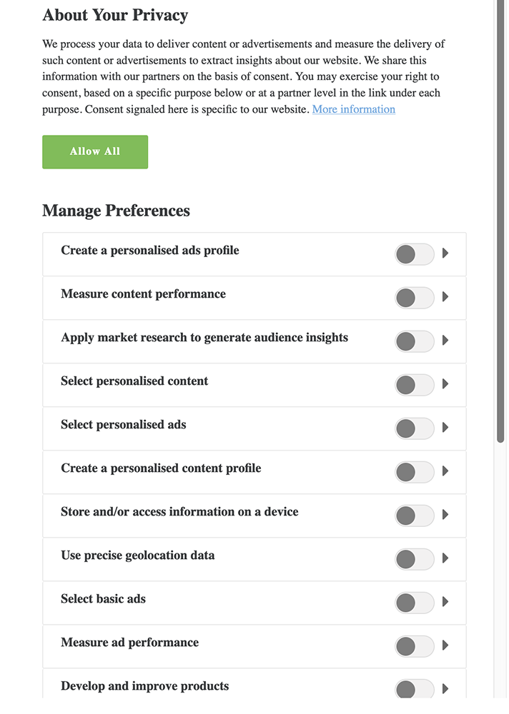

# IAB TCF 2.0 support in Real-time Customer Data Platform

The Transparency & Consent Framework (TCF), as outlined by the Interactive Advertising Bureau (IAB), is an open-standard technical framework intended to enable organizations to obtain, record, and update consumer consent for the processing of their personal data, in compliance with the European Union's General Data Protection Regulation (GDPR). The second iteration of the framework, TCF 2.0, grants more flexibility for how consumers can provide or withhold consent, including whether and how vendors may use certain features of data processing, such as precise geolocation.

>[!NOTE] More information on TCF 2.0 can be found on the [IAB Europe website](https://iabeurope.eu/tcf-2-0/), including support materials and technical specifications.

In compliance with the requirements put forth by TCF 2.0, Real-time Customer Data Platform (Real-time CDP) allows you to collect customer consent data and integrate it into your stored customer profiles. This consent data can then factored into whether profiles are included in audience segments, depending on their use case.

This document provides an overview of how to configure your data operations and profile schemas to accept customer consent data, and how Real-time CDP enforces consent when exporting segments.

## Prerequisites

This guide requires a working understanding of the following Adobe Experience Platform Services:

* [Experience Data Model (XDM)](../../xdm/home.md): The standardized framework by which [!DNL Experience Platform] organizes customer experience data.
* [Real-time Customer Profile](../../profile/home.md): Leverages Identity Service to create detailed customer profiles from your datasets in real-time. Real-time Customer Profile pulls data from the Data Lake and persists customer profiles in its own separate data store.
* [Segmentation Service](../../segmentation/home.md): Allows you divide Real-time Customer Profile data into groups of individuals that share similar traits and will respond similarly to marketing strategies.
* [Experience Platform Web SDK](../../edge/home.md): A client-side JavaScript library that allows you to integrate various Experience Platform services into your customer-facing website.

In addition, you should also be familiar with [destinations](../destinations/destinations-overview.md) and their use in Real-time CDP.

## Customer consent flow summary

After the system has been properly configured, the way in which Real-time CDP collects and processes customer consent data can be summarized as follows:

* A customer provides their consent preferences for data collection through a dialog on your website.
* The customer's identity and corresponding consent data are collected using the Experience Platform Web SDK.
* The collected consent data is ingested into a Profile-enabled dataset whose schema contains IAB consent fields.
* Real-time Customer Profile updates the stored consent data for that customer's profile, based on the collected identity data.
* Segmentation rules define specific consent values as a requirement for the profile's inclusion in exported segments.

The rest of the sections in this document provide guidance on how to configure Real-time CDP and your data operations to fulfill the requirements described above.

## Determine how to generate customer consent data within your CMP

Since each CMP system is unique, you must determine the best way to allow your customers to provide consent as they interact with your service. A common way to achieve this is through the use of a cookie disclaimer dialog, similar to the following example:

<br />

### Consent strings

Regardless of the method you use to collect the data, the goal is to generate a string value based on the consent options chosen by the customer, called a **consent string**.

In the TCF specification, consent strings are used to encode relevant details about a customer's consent settings, in terms specific marketing purposes as defined by policies and vendors. Real-time CDP utilizes these strings to store the consent settings for each customer, and therefore a new consent string must be generated each time those settings change.

For more information on how to generate a TCF consent string, refer to the [consent string formatting guide](https://github.com/InteractiveAdvertisingBureau/GDPR-Transparency-and-Consent-Framework/blob/master/TCFv2/IAB%20Tech%20Lab%20-%20Consent%20string%20and%20vendor%20list%20formats%20v2.md) in the TCF GitHub repo.

## Integrate the [!DNL Experience Platform] Web SDK to collect customer consent data

Once you are able to generate consent strings based on customer interactions with your service, you must integrate the [!DNL Experience Platform] Web SDK to collect those strings and send them to [!DNL Platform], along with the primary identity of the logged-in customer.

This data should conform to the structure of the Profile Privacy XDM mixin, which is covered in the next section. For information on how to send XDM data using the SDK, see the document on [tracking events](../../edge/fundamentals/tracking-events.md).

## Create a Profile-enabled dataset with IAB consent fields

Customer consent data must be sent to a Profile-enabled dataset whose schema contains IAB consent fields. These fields are provided by the Adobe-defined **Profile Privacy mixin**.

The following example shows the schema fields provided by the mixin, and the types of values they expect:

```json
{
  "xdm:optOutConsentLevel": {
    "xdm:privacyOptOuts": [
      {
        "xdm:optOutType": "general_opt_out",
        "xdm:optOutValue": "out",
        "xdm:timestamp": "2019-01-01T15:52:25+00:00"
      }
    ]
  },
  "xdm:identityPrivacyInfo": {
    "ECID": {
      "24162382913728446": {
        "xdm:identityIABConsent": {
          "xdm:consentTimestamp": "2020-04-11T05:05:05Z",
          "xdm:consentString": {
            "xdm:consentStandard": "IAB TCF",
            "xdm:consentStandardVersion": "2.0",
            "xdm:consentStringValue": "BObdrPUOevsguAfDqFENCNAAAAAmeAAA.PVAfDObdrA.DqFENCAmeAENCDA",
            "xdm:gdprApplies": true,
            "xdm:containsPersonalData": false
          }
        }
      }
    }
  }
}
```

| Property | Description |
| --- | --- |
| `xdm:optOutConsentLevel` | Contains an array of opt-out objects, used for general and sale opt-outs. While included in the Profile Privacy mixin, these are not required for TCF 2.0 compliance. |
| `xdm:identityPrivacyInfo` | Contains privacy information for individual customers, organized by identity namespace and value. In the above example, a single customer is identified under the `ECID` namespace, with a value of `24162382913728446`. |
| `xdm:identityIABConsent` | Each customer identity within `xdm:identityPrivacyInfo` must contain this field its associated subfields in order to update those customers' consent settings in [!DNL Profile]. |
| `xdm:consentTimestamp` | The datetime of when the consent update occurred, in ISO 8601 format. |
| `xdm:consentString` | Contains the customer's updated consent data and other contextual information. |
| `xdm:consentStandard` | The consent framework that the data applies to. For TCF compliance, the value should be "IAB TCF". |
| `xdm:consentStandardVersion` | The version number of the consent framework indicated by `xdm:consentStandard`. For TCF 2.0 compliance, the value should be "2.0". |
| `xdm:consentStringValue` | The consent string that was generated based on the customer's selected consent settings. |
| `xdm:gdprApplies` | A boolean value indicating whether or not the GDPR applies to this customer. Defaults to false if not included. |
| `xdm:containsPersonalData` | A boolean value indicating whether or not the consent update contains personal data. Defaults to false if not included. |

### Add the Profile Privacy mixin to a schema

### Create a [!DNL Profile]-enabled dataset based on the Profile Privacy schema

## Update [!DNL Profile] merge policies to include consent data