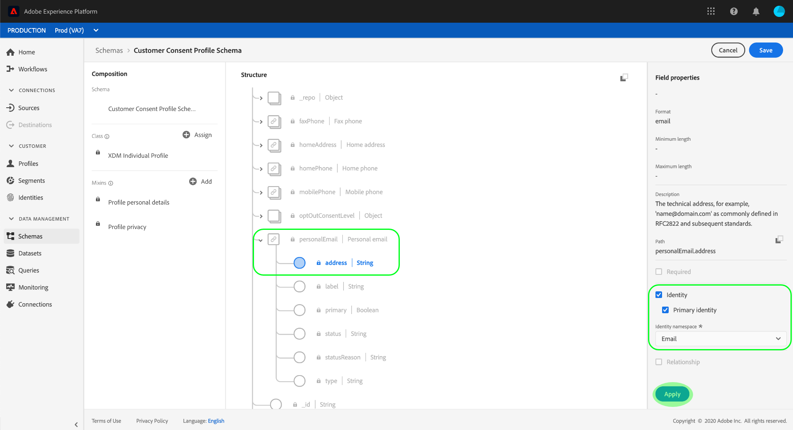
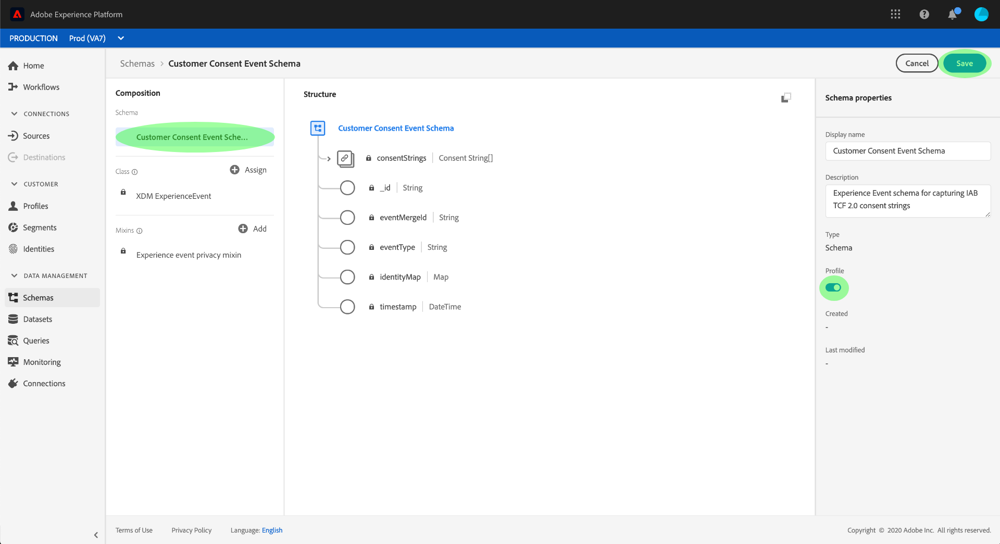
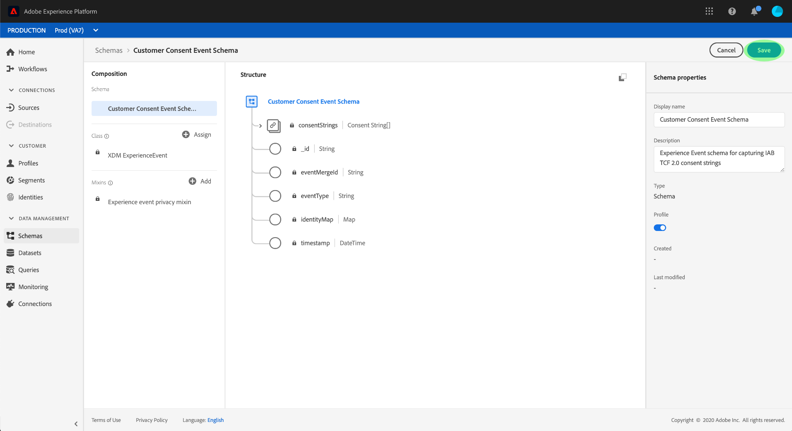

# Create datasets for capturing IAB TCF 2.0 consent data

In order for Real-time Customer Data Platform to collect customer consent data in compliance with the IAB Transparency & Consent Framework (TCF) 2.0, that data must be sent to datasets whose schemas contain IAB consent fields and are enabled for use in Real-time Customer Profile.

This document provides steps for setting up datasets to collect IAB TCF 2.0 consent data. For an overview of the full workflow to configure Real-time CDP for TCF 2.0 compliance, refer to the [IAB TCF 2.0 compliance overview](./overview.md).

## Prerequisites

This tutorial requires a working understanding of the following components of Adobe Experience Platform:

* [Experience Data Model (XDM)](../../../xdm/home.md): The standardized framework by which Experience Platform organizes customer experience data.
    * [Basics of schema composition](../../../xdm/schema/composition.md): Learn about the basic building blocks of XDM schemas.
    * [Create a schema in the UI](../../../xdm/tutorials/create-schema-ui.md): A tutorial covering the basics of working with the Schema Editor.
* [Identity Service](../../../identity-service/home.md): Bridges customer identities from disparate data sources across devices and systems.
* [Real-time Customer Profile](../../../profile/home.md): Leverages Identity Service to create detailed customer profiles from your datasets in real-time. Real-time Customer pulls data from the Data Lake and persists customer profiles in its own separate data store.

## Consent schema structure {#structure}

There are two XDM mixins that provide customer consent fields that are required for TCF 2.0 compliance: one for record-based data, and another for time-series-based data.

| Schema | Description |
| --- | --- |
| Profile privacy mixin (**required**) | This mixin captures the current consent preferences of a customer. When used in a Profile-enabled schema, the values provided in this mixin are taken as the source of truth for how consent enforcement should apply to a customer's data. The use of this mixin in a Profile-enabled schema is **required** in order for consent enforcement to occur. |
| Experience Event privacy mixin (*optional*) | This mixin captures the consent preferences of a customer at a given point in time. When used in a Profile-enabled schema, the data captured in these fields can be used to track changes in a customer's consent preferences over time. The use of this mixin is optional. |

While the use case of each mixin is different, the specific fields that they provide are roughly the same. These fields are explained further in the following section.

### Consent mixin fields {#privacy-mixin}

The example below shows the schema fields provided by both consent mixins, and the types of values they expect:

```json
{
  "xdm:optOutConsentLevel": {
    "xdm:privacyOptOuts": [
      {
        "xdm:optOutType": "general_opt_out",
        "xdm:optOutValue": "out",
        "xdm:timestamp": "2019-01-01T15:52:25+00:00"
      }
    ]
  },
  "xdm:identityPrivacyInfo": {
    "ECID": {
      "24162382913728446": {
        "xdm:identityIABConsent": {
          "xdm:consentTimestamp": "2020-04-11T05:05:05Z",
          "xdm:consentString": {
            "xdm:consentStandard": "IAB TCF",
            "xdm:consentStandardVersion": "2.0",
            "xdm:consentStringValue": "BObdrPUOevsguAfDqFENCNAAAAAmeAAA.PVAfDObdrA.DqFENCAmeAENCDA",
            "xdm:gdprApplies": true,
            "xdm:containsPersonalData": false
          }
        }
      }
    }
  }
}
```

| Property | Description |
| --- | --- |
| `xdm:optOutConsentLevel` | Contains an array of opt-out objects, used for general and sale opt-outs. While included in the Profile Privacy mixin, these are not required for TCF 2.0 compliance. |
| `xdm:identityPrivacyInfo` | Contains privacy information for individual customers, organized by identity namespace and value. In the above example, a single customer is identified under the `ECID` namespace, with a value of `24162382913728446`. |
| `xdm:identityIABConsent` | Each customer identity within `xdm:identityPrivacyInfo` must contain this field its associated subfields in order to update those customers' consent settings in [!DNL Profile]. |
| `xdm:consentTimestamp` | The datetime of when the consent update occurred, in ISO 8601 format. |
| `xdm:consentString` | Contains the customer's updated consent data and other contextual information. |
| `xdm:consentStandard` | The consent framework that the data applies to. For TCF compliance, the value should be "IAB TCF". |
| `xdm:consentStandardVersion` | The version number of the consent framework indicated by `xdm:consentStandard`. For TCF 2.0 compliance, the value should be "2.0". |
| `xdm:consentStringValue` | The consent string that was generated based on the customer's selected consent settings. |
| `xdm:gdprApplies` | A boolean value indicating whether or not the GDPR applies to this customer. Defaults to false if not included. |
| `xdm:containsPersonalData` | A boolean value indicating whether or not the consent update contains personal data. Defaults to false if not included. |

## Create customer consent schemas {#create-schemas}

In the Platform UI, click **[!UICONTROL Schemas]** in the left navigation to open the *[!UICONTROL Schemas] workspace*. From the **[!UICONTROL Browse]** tab, create a new schema based on the **XDM Individual Profile class**. If you wish to track consent preference changes over time, you must also create a separate schema based on the **XDM ExperienceEvent class**.

>[!NOTE] If you have existing XDM schemas that you want to use to capture consent data instead, you can edit those schemas instead of creating new ones.

The sections below explain how to add the appropriate consent mixins for each schema.

### Create a consent schema based on [!DNL XDM Individual Profile] {#profile-schema}

Within the Schema Editor for your [!DNL XDM Individual Profile] schema, click **[!UICONTROL Add]** within the *[!UICONTROL Mixins]* section on the left side of the canvas.


The *[!UICONTROL Add mixin]* dialog appears. From here, select **[!UICONTROL Profile privacy]** from the list. You can optionally use the search bar to narrow down results to locate the mixin easier. Once the mixin is selected, click **[!UICONTROL Add mixin]**.


The Schema Editor canvas reappears, allowing you to review the structure of the added consent string fields.


If you are editing an existing schema that has already been enabled for use in Real-time Customer Profile, click **[!UICONTROL Save]** to confirm your changes before skipping ahead to the section on [creating a consent schema based on XDM ExperienceEvent](#event-schema). If you are creating a new schema, continue following the steps outlined in the subsection below.

#### Enable the schema for use in Real-time Customer Profile

In order for Real-time CDP to associate the consent data it receives to specific customer profiles, the consent schema must be enabled for use in Real-time Customer Profile.

To enable the schema for Profile, you must first choose a **primary identity** for the schema. Depending on the types of data you collect from your customers, you may need to add additional mixins to the schema in order to represent the customer's unique identity.

>[!NOTE] If you require further guidance on which field to set as a primary identity, review the Identity Service documentation. In particular, the overview on [identity namespaces](../../../identity-service/namespaces.md) provides important information on different accepted identity types.

In this example, an email address field is set as the primary identity. Select the field from the canvas, then select the **[!UICONTROL Identity]** and **[!UICONTROL Primary identity]** checkboxes in the right-hand rail. Next, select the appropriate identity namespace in the provided dropdown menu before clicking **[!UICONTROL Apply]**.



Once you have applied a primary namespace to the schema, click the schema's name in the left-hand rail to open the *[!UICONTROL Schema properties]* dialog in the right-hand rail. From here, click the **[!UICONTROL Profile]** toggle button to enable the schema. Finally, click **[!UICONTROL Save]** to confirm your changes.


### Create a consent schema based on XDM ExperienceEvent {#event-schema}

>[!NOTE] This step is optional. If you do not wish to track customer consent changes over time, you can skip to the next section on [creating datasets based on your consent schemas](#datasets).

Within the Schema Editor for your XDM ExperienceEvent schema, click **[!UICONTROL Add]** within the *[!UICONTROL Mixins]* section on the left side of the canvas.


The *[!UICONTROL Add mixin]* dialog appears. From here, select **[!UICONTROL Experience event privacy mixin]** from the list. You can optionally use the search bar to narrow down results to locate the mixin easier. Once the mixin is selected, click **[!UICONTROL Add mixin]**.


The Schema Editor canvas reappears, showing the added consent string fields. Review the structure of the schema before clicking **[!UICONTROL Save]** to confirm your changes.


If you are editing an existing schema that has already been enabled for use in Real-time Customer Profile, click **[!UICONTROL Save]** to confirm your changes before skipping ahead to the section on [creating datasets based on your consent schemas](#datasets). If you are creating a new schema, continue following the steps outlined in the subsection below.

#### Enable the schema for use in Real-time Customer Profile

In order for Real-time CDP to associate the consent data it receives to specific customer profiles, the consent schema must be enabled for use in Real-time Customer Profile.

>[!NOTE] The example shown below uses the schema's `identityMap` field as its primary identity. Depending on your purposes, you may want to add additional fields to the schema to serve as the primary identity instead.

To enable an ExperienceEvent schema for Profile, click the schema's name in the left-hand rail to open *[!UICONTROL Schema properties]* dialog in the right-hand rail. From here, click the **[!UICONTROL Profile]** toggle button to enable the schema. Finally, click **[!UICONTROL Save]** to confirm your changes.



If you have not previously set up a primary identity for the schema, you are given the option of using the schema's `identityMap` field instead. Select the checkbox and click **[!UICONTROL Enable]** to enable the schema.

<br/>

The canvas reappears with the **[!UICONTROL Profile]** toggle enabled. Click **[!UICONTROL Save]** to confirm your changes.



## Create [!DNL Profile]-enabled datasets based on your consent schemas {#datasets}

Once you have created schemas that include consent mixins, you must create datasets based on those schemas which will ultimately ingest your customers' consent data.

>[!NOTE] The steps below cover how to make a dataset for the XDM Individual Profile schema you created earlier, which is required for consent enforcement to occur. If you also created the optional XDM ExperienceEvent schema for tracking changes over time, follow the steps in this section again to create a separate dataset for that schema.

Select **[!UICONTROL Datasets]** in the left navigation, then click **[!UICONTROL Create dataset]** in the top-right corner.


On the next page, select **[!UICONTROL Create dataset from schema]**.


The _[!UICONTROL Create dataset from schema]_ workflow appears, starting at the _[!UICONTROL Select schema]_ step. In the provided list, locate the consent schema that you created earlier. You can optionally use the search to narrow down results and locate your schema easier. Click the radio button next to the schema to select it, then click **[!UICONTROL Next]** to continue.


The _[!UICONTROL Configure dataset]_ step appears. Provide a unique, easily identifiable name and description for the dataset before clicking **[!UICONTROL Finish]**.


The details page for the newly created dataset appears. The final step in the process is to enable the dataset for use in Real-time Customer Profile. In the right-hand rail, click the **[!UICONTROL Profile]** toggle button enable the dataset.


## Next steps

By following this tutorial, you have created a Profile-enabled dataset that can now be used to collect customer consent data. If you followed the optional steps, you have also created a Profile-enabled dataset that can be used to track consent preference changes over time.

You can now return to the [IAB TCF 2.0 overview](./overview.md#merge-policies) to continue the process of configuring Real-time CDP for TCF 2.0 compliance.