# Create datasets for capturing IAB TCF 2.0 consent data

In order for [!DNL Real-time Customer Data Platform] to process customer consent data in accordance with the IAB [!DNL Transparency & Consent Framework] (TCF) 2.0, that data must be sent to datasets whose schemas contain TCF 2.0 consent fields.

Specifically, two datasets are required for capturing TCF 2.0 consent data:

* A dataset based on the [!DNL XDM Individual Profile] class, enabled for use in [!DNL Real-time Customer Profile].
* A dataset based on the [!DNL XDM ExperienceEvent] class.

This document provides steps for setting up these two datasets to collect IAB TCF 2.0 consent data. For an overview of the full workflow to configure [!DNL Real-time CDP] for TCF 2.0, refer to the [IAB TCF 2.0 compliance overview](./overview.md).

## Prerequisites

This tutorial requires a working understanding of the following components of Adobe Experience Platform:

* [Experience Data Model (XDM)](../../../xdm/home.md): The standardized framework by which [!DNL Experience Platform] organizes customer experience data.
    * [Basics of schema composition](../../../xdm/schema/composition.md): Learn about the basic building blocks of XDM schemas.
    * [Create a schema in the UI](../../../xdm/tutorials/create-schema-ui.md): A tutorial covering the basics of working with the Schema Editor.
* [Adobe Experience Platform Identity Service](../../../identity-service/home.md): Allows you to bridge customer identities from your disparate data sources across devices and systems.
* [Real-time Customer Profile](../../../profile/home.md): Leverages [!DNL Identity Service] to let you create detailed customer profiles from your datasets in real-time. [!DNL Real-time Customer Profile] pulls data from the Data Lake and persists customer profiles in its own separate data store.

## Consent schema structure {#structure}

There are two XDM mixins that provide customer consent fields that are required for TCF 2.0 support: one for record-based data ([!DNL XDM Individual Profile]), and another for time-series-based data ([!DNL XDM ExperienceEvent]):

| Schema | Description |
| --- | --- |
| Profile privacy mixin | This mixin captures the current consent preferences of a customer. When used in a [!DNL Profile]-enabled schema, the values provided in this mixin are taken as the source of truth for how consent enforcement should apply to a customer's data. |
| [!DNL Experience Event] privacy mixin | This mixin captures the consent preferences of a customer at a given point in time. The data captured in these fields can be used to track changes in a customer's consent preferences over time. |

While the use case of each mixin is different, the specific fields that they provide are roughly the same. These fields are explained further in the following section.

### Consent mixin fields {#privacy-mixin}

While each privacy mixin varies in structure and the types of fields they contain, they both provide the `xdm:consentString` attribute, whose subfields are required for TCF 2.0 enforcement to take place. The structure of these fields is shown below, along with the types of values they expect:

```json
{
  "xdm:consentString": {
    "xdm:consentStandard": "IAB TCF",
    "xdm:consentStandardVersion": "2.0",
    "xdm:consentStringValue": "BObdrPUOevsguAfDqFENCNAAAAAmeAAA.PVAfDObdrA.DqFENCAmeAENCDA",
    "xdm:gdprApplies": true,
    "xdm:containsPersonalData": false
  }
}
```

| Property | Description |
| --- | --- |
| `xdm:consentString` | Contains the customer's updated consent data and other contextual information. |
| `xdm:consentStandard` | The consent framework that the data applies to. For TCF compliance, the value should be "IAB TCF". |
| `xdm:consentStandardVersion` | The version number of the consent framework indicated by `xdm:consentStandard`. For TCF 2.0 compliance, the value should be "2.0". |
| `xdm:consentStringValue` | The consent string that was generated based on the customer's selected consent settings. |
| `xdm:gdprApplies` | A boolean value indicating whether or not the GDPR applies to this customer. The value must be set to "true" in order for TCF 2.0 enforcement to occur. Defaults to "false" if not included. |
| `xdm:containsPersonalData` | A boolean value indicating whether or not the consent update contains personal data. Defaults to "false" if not included. |

## Create customer consent schemas {#create-schemas}

In the Platform UI, click **[!UICONTROL Schemas]** in the left navigation to open the *[!UICONTROL Schemas] workspace*. From here, follow the steps in the sections below to create each required schema.

>[!NOTE]
>
>If you have existing XDM schemas that you want to use to capture consent data instead, you can edit those schemas instead of creating new ones. However, when editing existing schemas, it is important to follow the [principles of schema evolution](../../../xdm/schema/composition.md#evolution) to avoid breaking changes.

### Create a record-based consent schema {#profile-schema}

From the **[!UICONTROL Browse]** tab in the **[!UICONTROL Schemas] workspace*, create a new schema based on the **[!DNL XDM Individual Profile] class**. Once you have the schema open within the Schema Editor, click **[!UICONTROL Add]** under the *[!UICONTROL Mixins]** section on the left side of the canvas.

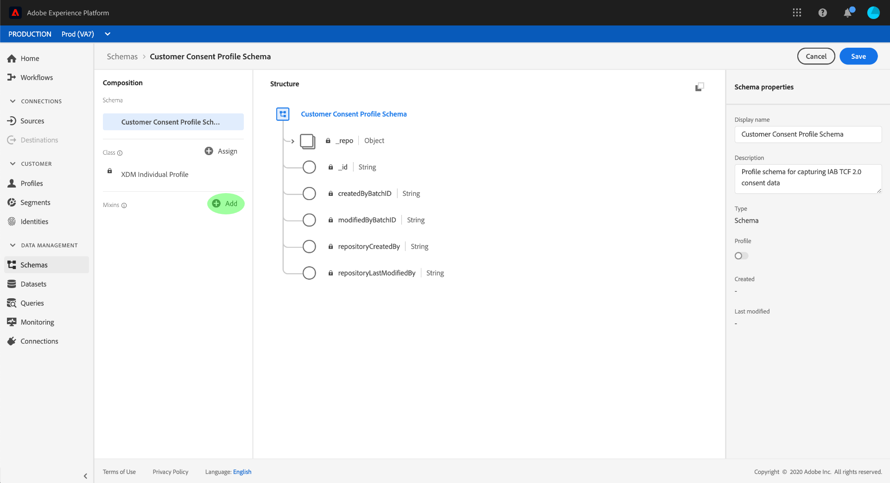

The **[!UICONTROL Add mixin]* dialog appears. From here, select **[!UICONTROL Profile privacy]** from the list. You can optionally use the search bar to narrow down results to locate the mixin easier. Once the mixin is selected, click **[!UICONTROL Add mixin]***.

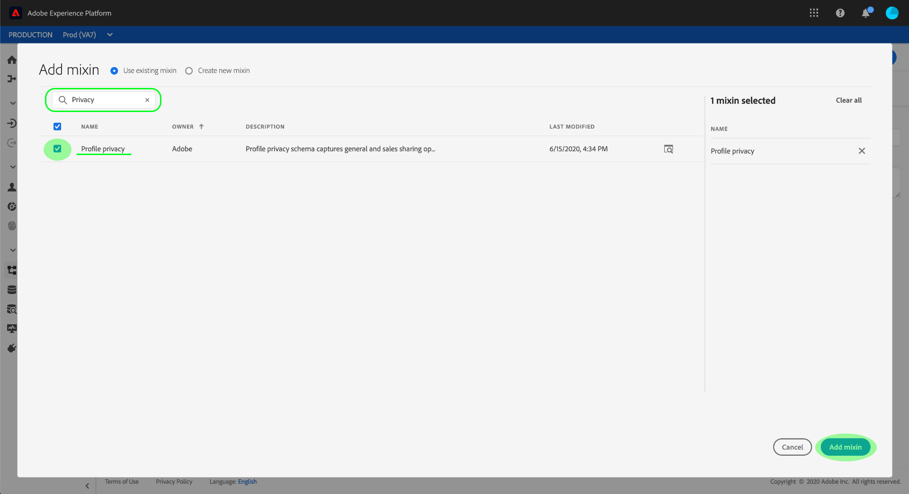

The Schema Editor canvas reappears, allowing you to review the structure of the added consent string fields.

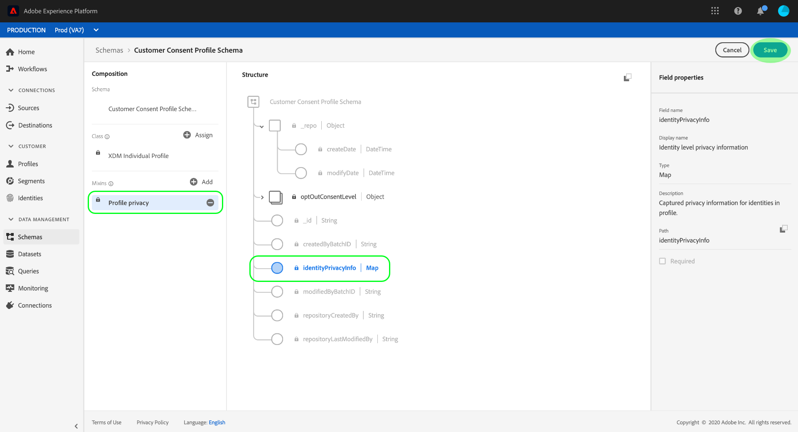

From here, repeat the above steps to add the following additional mixins to the schema:

* [!UICONTROL IdentityMap]
* [!UICONTROL Data capture region for Profile]
* [!UICONTROL Profile person details]
* [!UICONTROL Profile personal details]

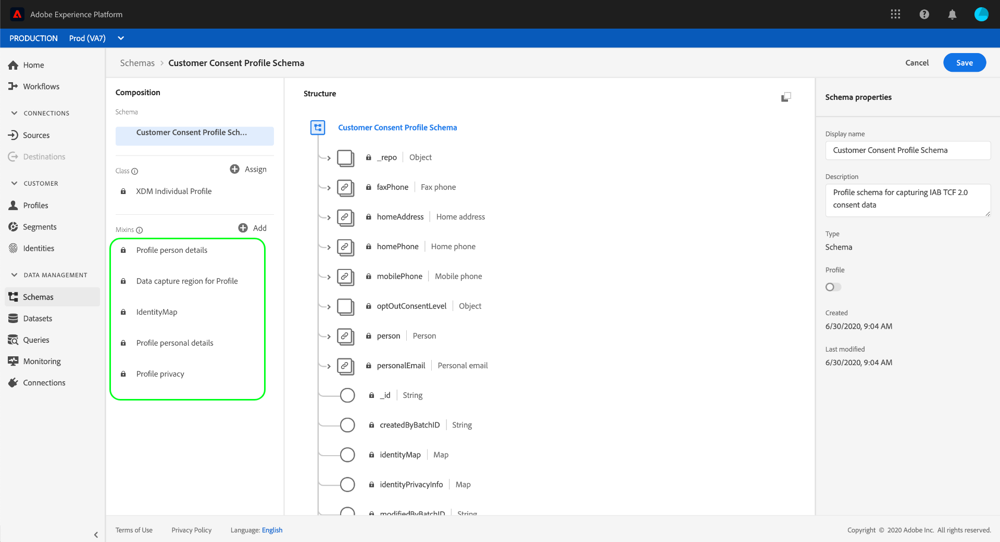

If you are editing an existing schema that has already been enabled for use in [!DNL Real-time Customer Profile], click **[!UICONTROL Save]** to confirm your changes before skipping ahead to the section on [creating a dataset based on your consent schema](#dataset). If you are creating a new schema, continue following the steps outlined in the subsection below.

#### Enable the schema for use in [!DNL Real-time Customer Profile]

In order for [!DNL Real-time CDP] to associate the consent data it receives to specific customer profiles, the consent schema must be enabled for use in [!DNL Real-time Customer Profile].

>[!NOTE]
>
>The example schema shown in this section uses its `identityMap` field as its primary identity. If you wish to set another field as a primary identity, ensure that you are using an indirect identifier like a cookie ID, and not a directly identifiable field that is prohibited from use in interest-based advertising, such as an email address. Consult your Legal Counsel if you are unsure which fields are restricted.
>
>Steps on how to set a primary identity field for a schema can be found in the [schema creation tutorial](../../../xdm/tutorials/create-schema-ui.md#identity-field).

To enable the schema for [!DNL Profile], click the schema's name in the left-hand rail to open the **[!UICONTROL Schema properties]* dialog in the right-hand rail. From here, click the **[!UICONTROL Profile]*** toggle button.

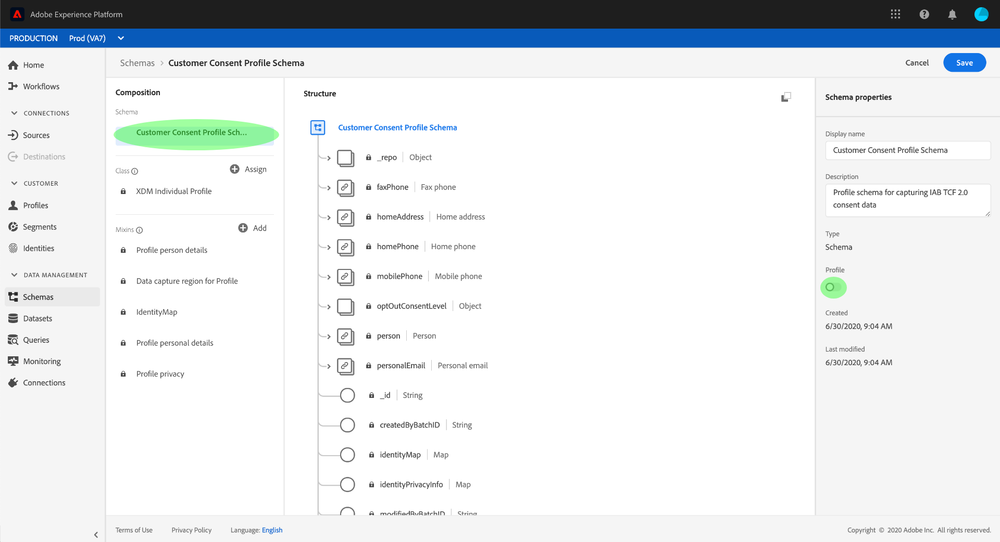

A popover appears, indicating a missing primary identity. Select the checkbox for using an alternate primary identity, as the primary identity will be contained in the identityMap field.

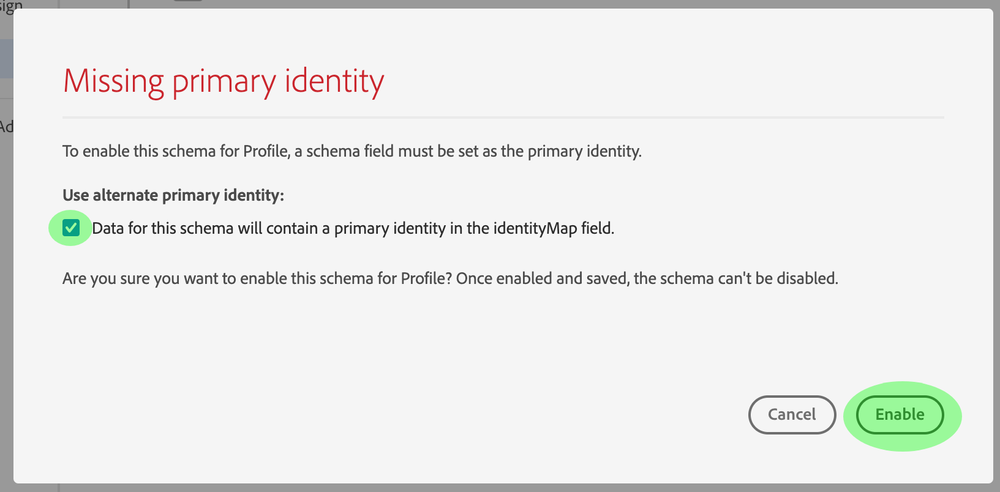<br>

Finally, click **[!UICONTROL Save]** to confirm your changes.

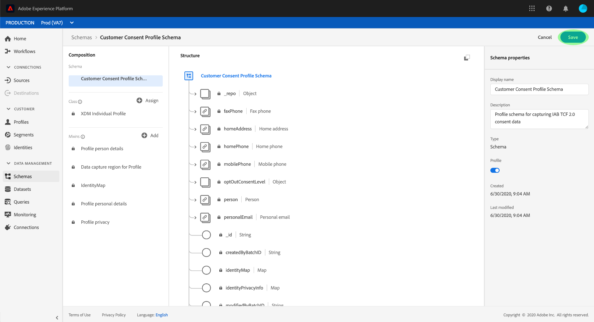

### Create a time-series-based consent schema {#event-schema}

From the **[!UICONTROL Browse]** tab in the **[!UICONTROL Schemas] workspace*, create a new schema based on the **[!DNL XDM ExperienceEvent] class**. Once you have the schema open within the Schema Editor, click **[!UICONTROL Add]** under the *[!UICONTROL Mixins]** section on the left side of the canvas.

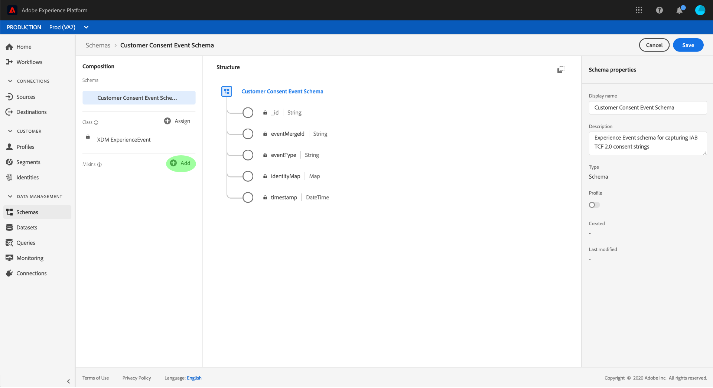

The **[!UICONTROL Add mixin]* dialog appears. From here, select **[!UICONTROL Experience event privacy mixin]** from the list. You can optionally use the search bar to narrow down results to locate the mixin easier. Once the mixin is selected, click **[!UICONTROL Add mixin]***.

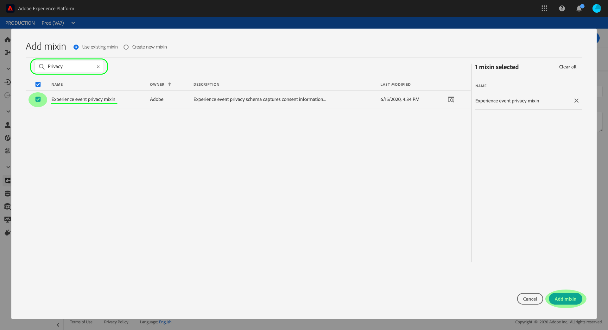

The Schema Editor canvas reappears, showing the added consent string fields.

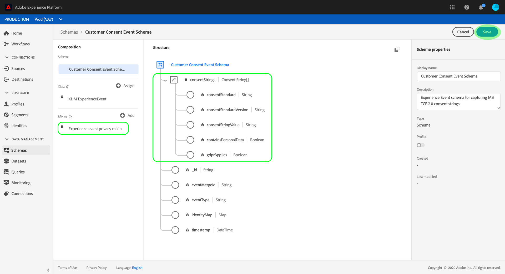

From here, repeat the above steps to add the following additional mixins to the schema:

* [!UICONTROL IdentityMap]
* [!UICONTROL ExperienceEvent environment details]
* [!UICONTROL ExperienceEvent web details]
* [!UICONTROL ExperienceEvent implementation details]

Once the mixins have been added, finish by clicking **[!UICONTROL Save]**.

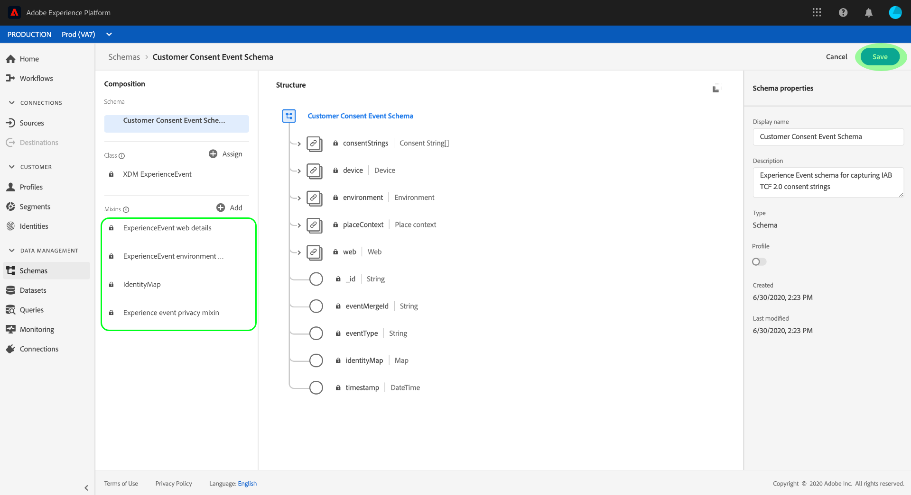

## Create datasets based on your consent schemas {#datasets}

For each of the required schemas described above, you must create a dataset that will ultimately ingest your customers' consent data. The dataset based on the [!DNL XDM Individual Profile] schema must be enabled for [!DNL Real-time Customer Profile], while the dataset based on the [!DNL XDM ExperienceEvent] schema should not be [!DNL Profile]-enabled.

To begin, select **[!UICONTROL Datasets]** in the left navigation, then click **[!UICONTROL Create dataset]** in the top-right corner.

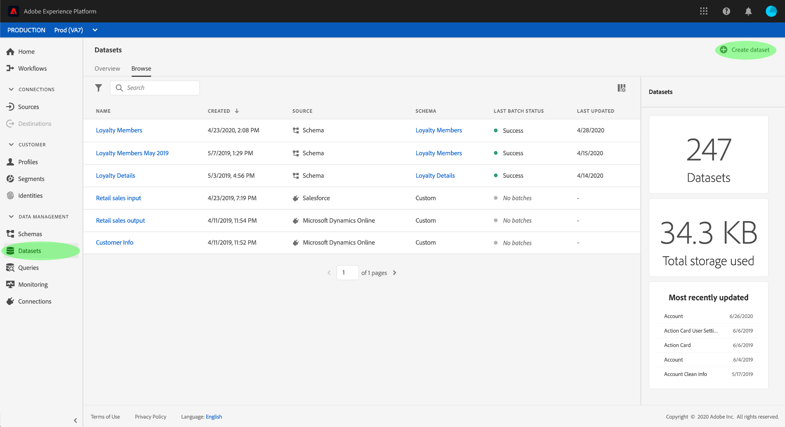

On the next page, select **[!UICONTROL Create dataset from schema]**.


The **[!UICONTROL Create dataset from schema]_ workflow appears, starting at the _[!UICONTROL Select schema]** step. In the provided list, locate one of the consent schemas that you created earlier. You can optionally use the search to narrow down results and locate your schema easier. Click the radio button next to the schema to select it, then click **[!UICONTROL Next]** to continue.

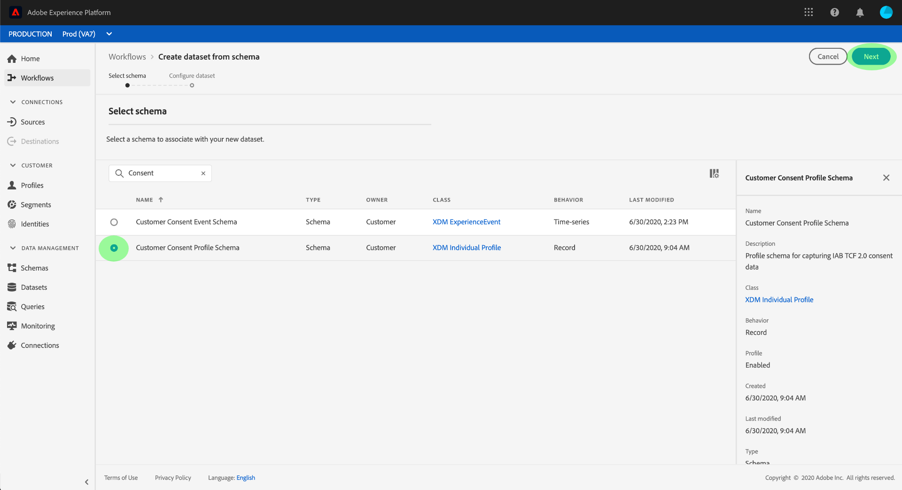

The **[!UICONTROL Configure dataset]** step appears. Provide a unique, easily identifiable name and description for the dataset before clicking **[!UICONTROL Finish]**.

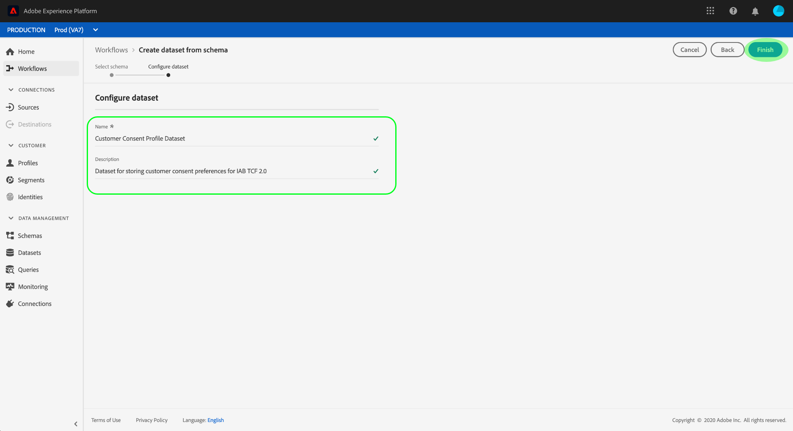

The details page for the newly created dataset appears. If the dataset is based on your [!DNL XDM ExperienceEvent] schema, then the process is complete. If the dataset is based on your [!DNL XDM Individual Profile] schema, the final step in the process is to enable the dataset for use in [!DNL Real-time Customer Profile]. In the right-hand rail, click the **[!UICONTROL Profile]** toggle button to enable the dataset.

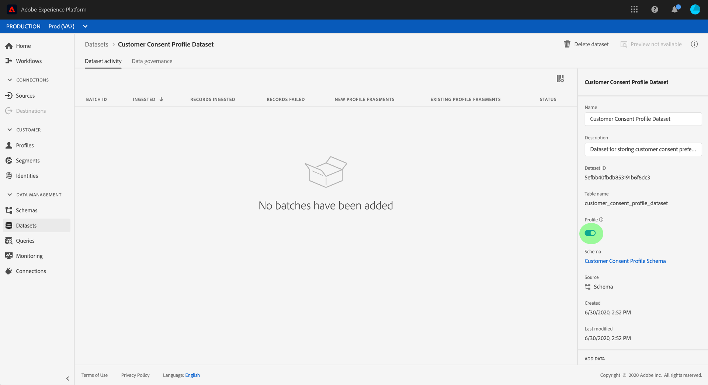

Follow the above steps again to create the other required dataset for TCF 2.0 compliance.

## Next steps

By following this tutorial, you have created two datasets that can now be used to collect customer consent data:

* A [!DNL Profile]-enabled dataset based on your [!DNL XDM Individual Profile] schema.
* A dataset based on your [!DNL XDM ExperienceEvent] schema that is not enabled for [!DNL Profile].

You can now return to the [IAB TCF 2.0 overview](./overview.md#merge-policies) to continue the process of configuring [!DNL Real-time CDP] for TCF 2.0 compliance.