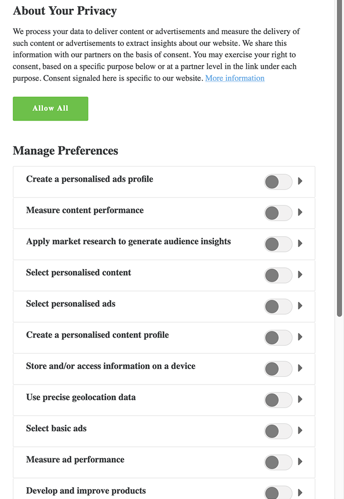

# IAB TCF 2.0 support in Real-time Customer Data Platform

The Transparency & Consent Framework (TCF), as outlined by the Interactive Advertising Bureau (IAB), is an open-standard technical framework intended to enable organizations to obtain, record, and update consumer consent for the processing of their personal data, in compliance with the European Union's General Data Protection Regulation (GDPR). The second iteration of the framework, TCF 2.0, grants more flexibility for how consumers can provide or withhold consent, including whether and how vendors may use certain features of data processing, such as precise geolocation.

>[!NOTE] More information on TCF 2.0 can be found on the [IAB Europe website](https://iabeurope.eu/tcf-2-0/), including support materials and technical specifications.

Real-time Customer Data Platform (Real-time CDP) is part of the registered [IAB TCF 2.0 vendor list](https://iabeurope.eu/vendor-list-tcf-v2-0/), under the ID 565. In compliance with TCF 2.0 requirements, Real-time CDP allows you to collect customer consent data and integrate it into your stored customer profiles. This consent data can then be factored into whether profiles are included in audience segments, depending on their use case.

This document provides an overview of how to configure your data operations and profile schemas to accept customer consent data, and how Real-time CDP conveys user consent choices when exporting segments.

## Prerequisites

In order to follow along with this guide, you must be using a Consent Management Platform (CMP), either commercial or your own, that is integrated and compliant with the IAB TCF. See the [list of compliant CMPs](https://iabeurope.eu/cmp-list/) for more information.

This guide also requires a working understanding of the following Adobe Experience Platform Services:

* [Experience Data Model (XDM)](../../../xdm/home.md): The standardized framework by which [!DNL Experience Platform] organizes customer experience data.
* [Real-time Customer Profile](../../../profile/home.md): Leverages Identity Service to create detailed customer profiles from your datasets in real-time. Real-time Customer Profile pulls data from the Data Lake and persists customer profiles in its own separate data store.
* [Segmentation Service](../../../segmentation/home.md): Allows you divide Real-time Customer Profile data into groups of individuals that share similar traits and will respond similarly to marketing strategies.
* [Experience Platform Web SDK](../../../edge/home.md): A client-side JavaScript library that allows you to integrate various Experience Platform services into your customer-facing website.

In addition, you should also be familiar with [destinations](../../destinations/destinations-overview.md) and their use in Real-time CDP.

## Customer consent flow summary

After the system has been properly configured, the way in which Real-time CDP collects and processes customer consent data can be summarized as follows:

* A customer provides their consent preferences for data collection through a dialog on your website.
* The customer's identity and corresponding consent data are collected using the Experience Platform Web SDK.
* The collected consent data is ingested into a Profile-enabled dataset whose schema contains IAB consent fields.
* Real-time Customer Profile updates the stored consent data for that customer's profile, based on the collected identity data.
* Segmentation rules define specific consent values as a requirement for the profile's inclusion in exported segments.
* Applicable destinations only accept data from activated segments if the appropriate consent string is included.

The rest of the sections in this document provide guidance on how to configure Real-time CDP and your data operations to fulfill the requirements described above.

## Determine how to generate customer consent data within your CMP

Since each CMP system is unique, you must determine the best way to allow your customers to provide consent as they interact with your service. A common way to achieve this is through the use of a cookie disclaimer dialog, similar to the following example:

 

### Consent strings

Regardless of the method you use to collect the data, the goal is to generate a string value based on the consent options chosen by the customer, called a **consent string**.

In the TCF specification, consent strings are used to encode relevant details about a customer's consent settings, in terms of specific marketing purposes as defined by policies and vendors. Real-time CDP utilizes these strings to store the consent settings for each customer, and therefore a new consent string must be generated each time those settings change.

Consent strings may only be created by a CMP that is registered with the IAB TCF. For more information on how to generate consent strings, refer to the [consent string formatting guide](https://github.com/InteractiveAdvertisingBureau/GDPR-Transparency-and-Consent-Framework/blob/master/TCFv2/IAB%20Tech%20Lab%20-%20Consent%20string%20and%20vendor%20list%20formats%20v2.md) in the IAB TCF GitHub repo.

## Integrate the [!DNL Experience Platform] Web SDK to collect customer consent data

Once you have configured your CMP to generate consent strings, you must integrate the [!DNL Experience Platform] Web SDK to collect those strings and send them to [!DNL Platform], along with the primary identity of the logged-in customer.

This data should conform to the structure of the Profile Privacy XDM mixin, which is covered in the next section. For information on how to send XDM data using the SDK, see the document on [tracking events](../../../edge/fundamentals/tracking-events.md).

## Create a Profile-enabled dataset with IAB consent fields

Customer consent data must be sent to a Profile-enabled dataset whose schema contains IAB consent fields. Refer to the tutorial on [creating datasets for capturing TCF 2.0 consent](./dataset-preparation.md) for how to create the required dataset(s) before continuing with this guide.

## Update [!DNL Profile] merge policies to include consent data

## Export segments

### Export to downstream destinations

<!-- Which purposes does the user need to consent to in the CMP dialogue so that Real-time CDP can function properly?
Mention how different vendors cross-check if the other ones have the necessary consent permissions from the user. -->

### Export to other Experience Cloud applications

<!-- How is consent conveyed when segments are shared (e.g. via Segue) with other solutions. The person to ask here might be Shelby Farmer. -->

## Test your IAB TCF implementation

<!-- Since this is a privacy-sensitive feature, our customers will probably want to test out their implementation of IAB TCF. A section that guides them to testing might be helpful. -->

## Next steps