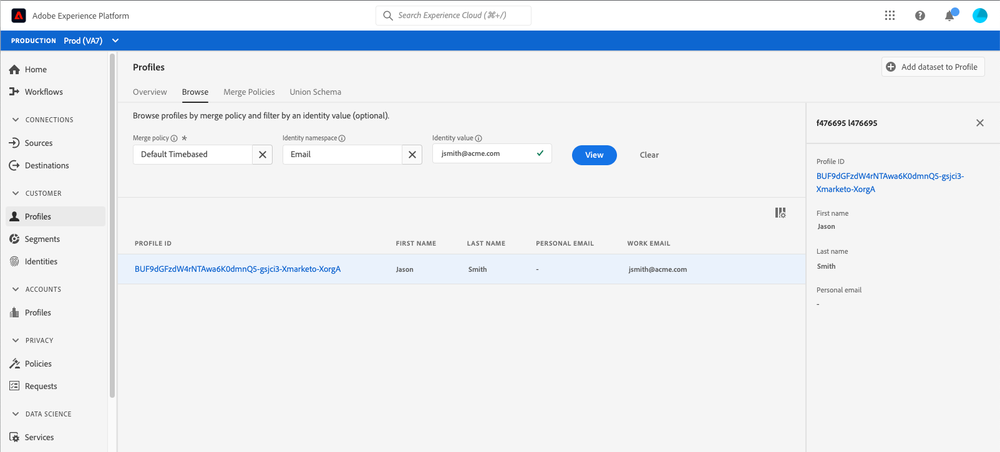
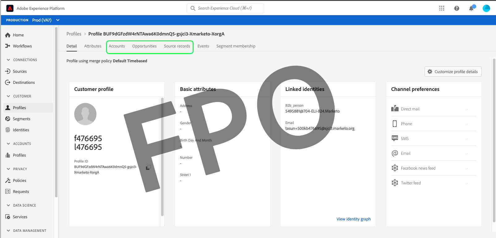
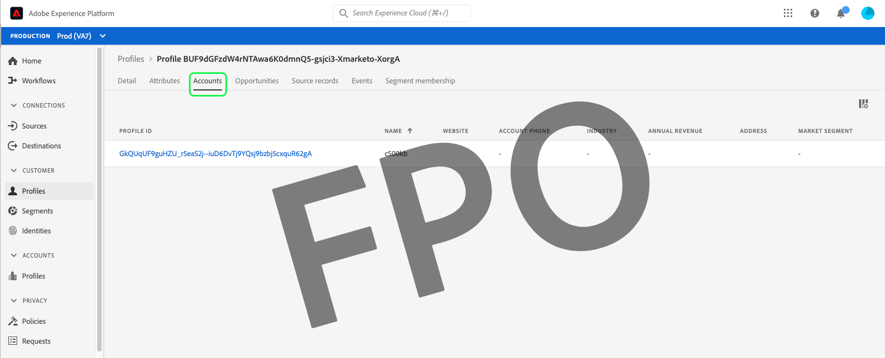
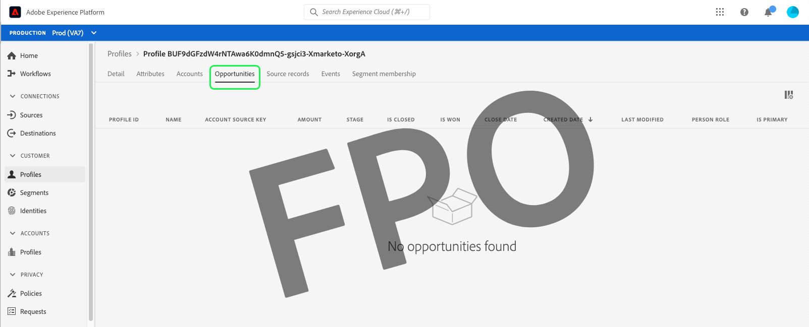
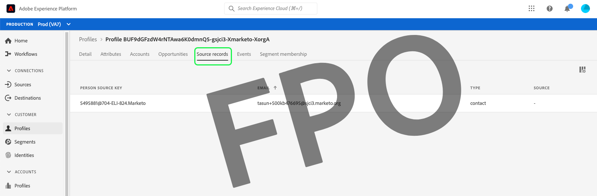

# Browse profiles in Real-Time Customer Data Platform

Real-Time Customer Profile creates a holistic view of each of your individual customers, combining data from multiple channels including online, offline, CRM, and third-party data. As individual profiles are aggregated based on data being brought into the system from various sources, each profile becomes an actionable, timestamped account of every interaction your customer has with your brand.

Within the Adobe Experience Platform user interface, you can view these read-only profiles and see important information regarding each of your individual customers, including their preferences, past events, interactions, and the audiences to which the individual belongs.

Adobe Real-Time Customer Data Platform is built on top of Adobe Experience Platform and is thereby able to make use of the profile viewing capabilities in the Experience Platform UI. For a detailed guide to viewing customer profiles within the Platform user interface, refer to the [Real-Time Customer Profile user guide](../../profile/ui/user-guide.md).

## Profile enhancements for Real-Time CDP, B2B Edition

In addition to the profile browse capabilities supported by Adobe Experience Platform, Real-Time CDP, B2B Edition users can access B2B attributes and events within the customer profile on the [!UICONTROL Attributes] and [!UICONTROL Events] tabs, respectively. B2B data can also be used to perform segmentation, with those audiences appearing under the customer's [!UICONTROL Audience membership] tab alongside non-B2B audiences.

Real-Time CDP, B2B Edition also enables you to browse [!UICONTROL Accounts], [!UICONTROL Opportunities], and [!UICONTROL Source records] from across your enterprise sources that are associated with an individual customer.

To explore these enhancements, begin by following the steps outlined in the [Real-Time Customer Profile user guide](../../profile/ui/user-guide.md) to browse a profile by merge policy or identity namespace. 

The profile detail includes access to [!UICONTROL Accounts], [!UICONTROL Opportunities], and [!UICONTROL Source records] tabs in addition to the standard information provided in the customer profile that is has also been enhanced with B2B events and attributes.

### Accounts tab

Select **[!UICONTROL Accounts]** to view a list of accounts related to the profile. This list includes basic information from the account profile such as the name, website, and industry of the account, as well as a link to the account profile. 

For more information on viewing and exploring account profiles, begin by reading the [account profiles overview](../accounts/account-profile-overview.md).

### Opportunities tab

The **[!UICONTROL Opportunities]** tab provides details related to open and closed opportunities related to the account. These opportunities may be ingested into Experience Platform from multiple sources, however Real-Time CDP, B2B Edition makes it easy for marketers to see all of these opportunities together in one place.

Each opportunity includes information such as the name of the opportunity, its amount, stage, and whether the opportunity is open, closed, won, or lost.

### Source records tab

The **[!UICONTROL Source records]** tab enables you to easily see the multiple source records coming from your enterprise sources that are contributing to the single customer profile. In addition to the [!UICONTROL Person source key] and email address, each source record also provides the type of record (for example, a "contact" or "lead" record), as well as the source. 

