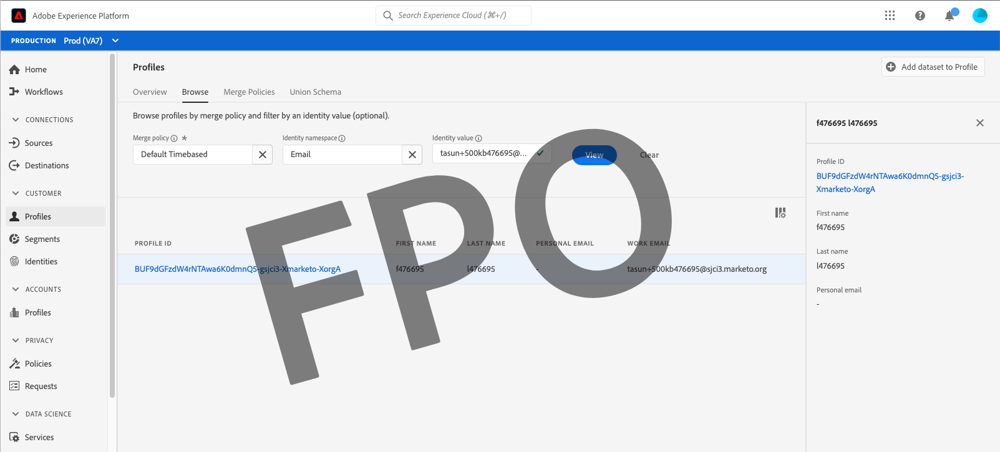

# Browse profiles in Real-time Customer Data Platform

Real-time Customer Profile creates a holistic view of each of your individual customers, combining data from multiple channels including online, offline, CRM, and third-party data. As individual profiles are aggregated based on data being brought into the system from various sources, each profile becomes an actionable, timestamped account of every interaction your customer has with your brand.

Within the Adobe Experience Platform user interface, you can view these read-only profiles and see important information regarding each of your individual customers, including their preferences, past events, interactions, and the segments to which the individual belongs.

Real-time Customer Data Platform is built on top of Adobe Experience Platform and is thereby able to make use of the profile viewing capabilities in the Experience Platform UI. For a detailed guide to viewing customer profiles within the Platform user interface, refer to the [Real-time Customer Profile user guide](../../profile/ui/user-guide.md).

## Profile enhancements for Real-time CDP, B2B Edition

>[!IMPORTANT]
>
>Real-time Customer Data Platform B2B Edition is currently in beta. The documentation and functionality are subject to change.

In addition to the profile browse capabilities supported by Adobe Experience Platform, you can use Real-time CDP, B2B Edition to browse [!UICONTROL Accounts], [!UICONTROL Opportunities], and [!UICONTROL Source records] associated with an individual.

To explore these enhancements, begin by following the steps outlined in the [Real-time Customer Profile user guide](../../profile/ui/user-guide.md) to browse a profile by merge policy or identity namespace. 

The profile detail now includes [!UICONTROL Accounts], [!UICONTROL Opportunities], and [!UICONTROL Source records] tabs in addition to the standard information provided in the customer profile.

Select **[!UICONTROL Accounts]** to view a list of accounts related to the profile. This list includes basic information from the account profile such as the name, website, and industry of the account, as well as a link to the account profile itself. 

For more information on viewing and exploring account profiles, begin by reading the [account profiles overview](../accounts/account-profile-overview.md).

The **[!UICONTROL Opportunities]** tab provides details related to open and closed opportunities related to the contact. These opportunities may be brought into Experience Platform from multiple sources and Real-time CDP, B2B Edition makes it easy for marketers to see all of these opportunities together in one place.

Each opportunity includes information such as the name of the opportunity, its amount, stage, and whether the opportunity is open, closed, won, or lost.

