# Audience Builder in Real-Time Customer Data Platform

Built on top of Adobe Experience Platform, [!DNL Adobe Real-Time Customer Data Platform] is able to make use of the full Audience Builder capabilities that are a part of [!DNL Experience Platform]. The workspace provides intuitive controls for building and editing rules, such as drag-and-drop tiles used to represent data properties. 

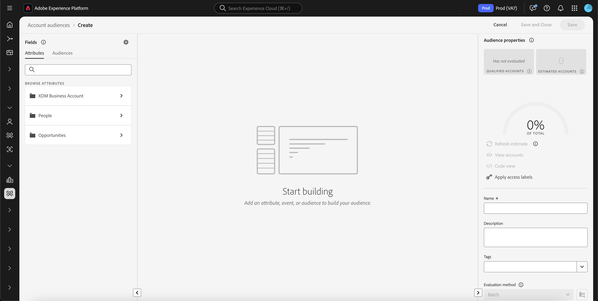{zoomable="yes"}

## Fields {#fields}

>[!CONTEXTUALHELP]
>id="platform_b2b_audiencebuilder_showfullxdmschema"
>title="Show full XDM schema"
>abstract="By default, only fields that contain data are displayed. Enable this option to show all the fields in the XDM schema."

>[!CONTEXTUALHELP]
>id="platform_b2b_audiencebuilder_showrelationselectors"
>title="Show relation selectors"
>abstract="By default, the standard relations for your organization are used. Enable this option to show the relation selectors used."

>[!CONTEXTUALHELP]
>id="platform_b2b_audiencebuilder_showconstrainedfields"
>title="Show constrained fields"
>abstract="By default, only fields that do not have any constraints on them are displayed. Enable this option to show fields that have constraints on them."

When using Audience Builder for accounts, you can use account attributes or existing audiences as your audience's fields.

You can select the  to adjust the settings for the displayed fields.

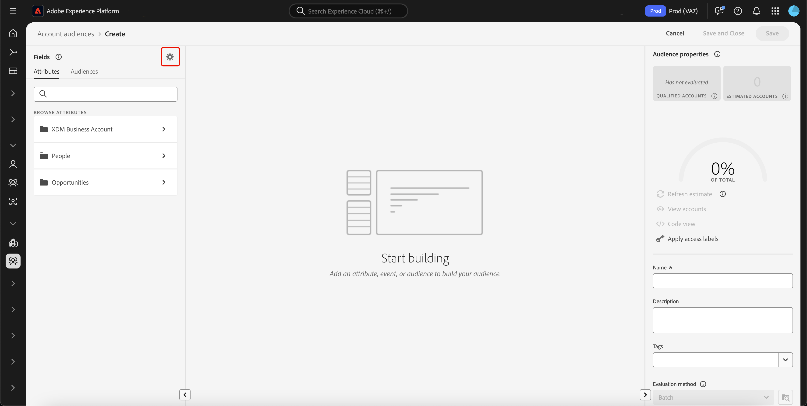{zoomable="yes"}

>[!NOTE]
>
>The **[!UICONTROL Field options]** section is currently in beta, and is available only to select customers. Please contact Adobe Customer Care for more information.

The [!UICONTROL Settings] section is displayed. In this section, you can update which fields are displayed as well as the relationship of the fields.

For the **[!UICONTROL Field options]**, you can either show only the fields that contain data or the full XDM schema.

For the **[!UICONTROL Relationship of fields]**, you can either use the standard relations for your organization or you can show the relation selectors.

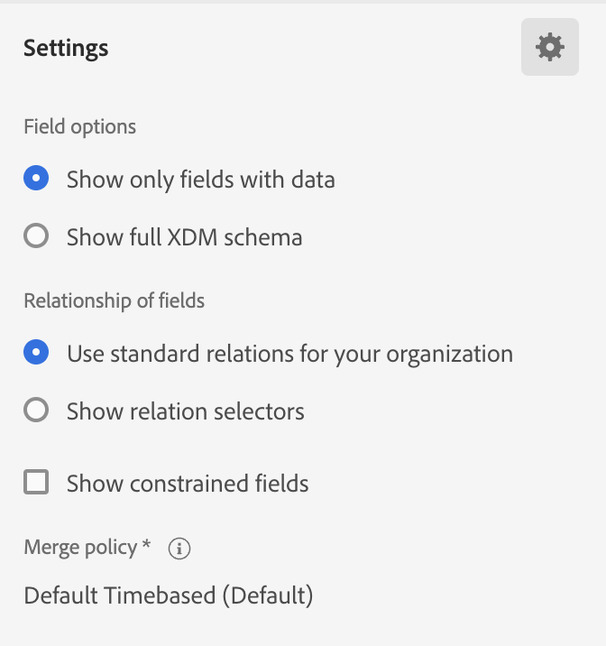{width="300"}

### Attributes {#attributes}

The [!UICONTROL Attributes] tab lets you browse Account attributes belonging to the XDM Business Account class, as well as opportunities and people-based attributes. Each folder can be expanded to reveal additional attributes, where each attribute is a tile that can be dragged onto the [rule builder canvas](#rule-builder-canvas) in the center of the workspace.

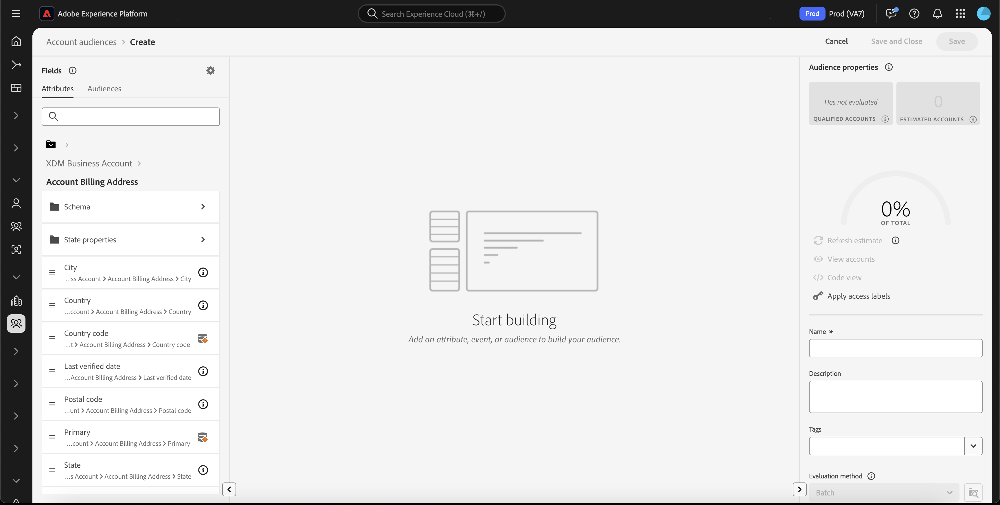

When selecting an attribute, you can see summary data by selecting the [information icon](../../images/icons/info.png). The summary data includes information such as top values, an explanation of what the field is, as well as the percentage of accounts that contain values for this attribute.

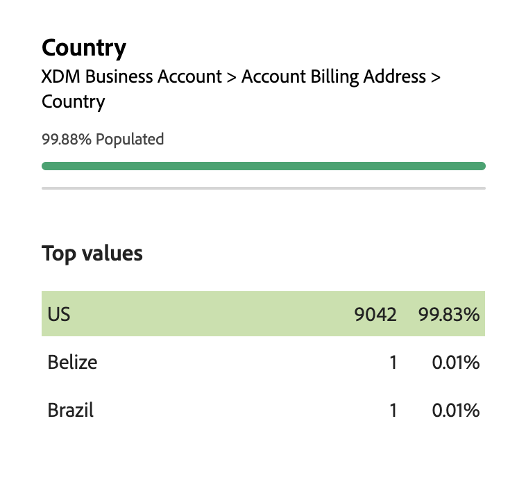{width="300"}

If an attribute is populated by less than 25% of accounts, the  will be displayed instead. The same summary data will be displayed for the attribute, regardless.

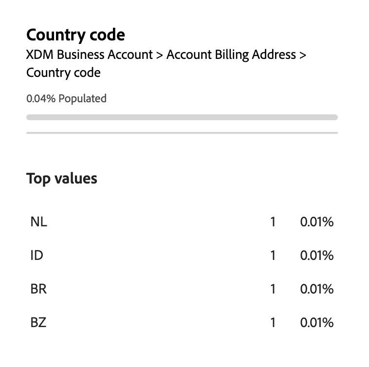{width="300"}

>[!NOTE]
>
>Summary data is only available if the attribute belongs to the Account, Person, or Opportunity schema. Additionally, the top values are only displayed if the field does **not** contain too many different values and if those field's values are commonly repeated.
>
>This summary data is updated on a **daily** basis.

For a more detailed guide on the Audience Builder, read the [Audience Builder user guide](../../segmentation/ui/segment-builder.md){target="_blank"}.

### Audiences {#audiences}

The **[!UICONTROL Audiences]** tab lists all the people-based and account-based audiences available within Experience Platform.

You can hover over the  next to an audience to view information about the audience including its ID, description, and the folder hierarchy to locate the audience.

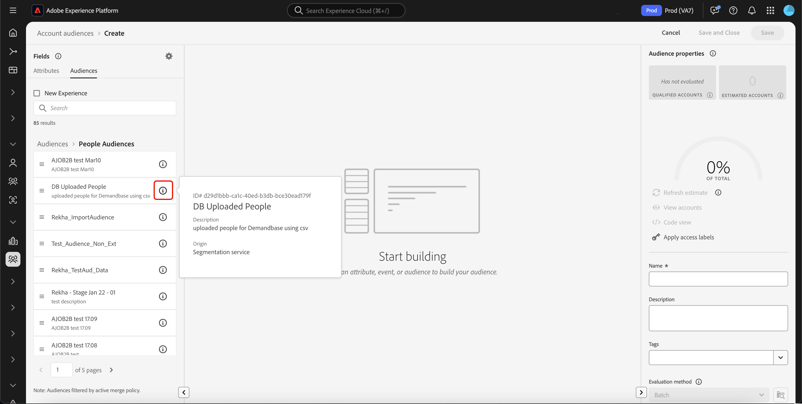{zoomable="yes"}

## Rule builder canvas {#rule-builder-canvas}

An audience created in Audience Builder is a collection of rules used to describe key characteristics or behaviors of a target audience. These rules are created using the rule builder canvas, located in the center of Audience Builder.

To add a new rule to your segment definition, drag a tile from the **[!UICONTROL Fields]** tab and drop it onto the rule builder canvas. 

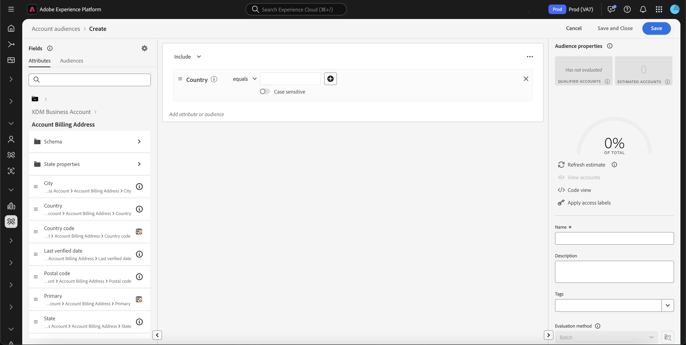{zoomable="yes"}

For more information on using the rule builder canvas, read the [Segment Builder documentation](../../segmentation/ui/segment-builder.md#rule-builder-canvas){target="_blank"}.

### Containers {#containers}

Audience rules are evaluated in the order they are listed. You can use containers to allow greater control over the order of execution, through the usage of nested queries.

For more information on containers, read the [Segment Builder documentation](../../segmentation/ui/segment-builder.md#containers){target="_blank"}.

## Audience properties {#properties}

The **[!UICONTROL Audience properties]** section displays information about the audience including an estimated size of the audience. You can also specify details about your audience, including its name, description, and tags.

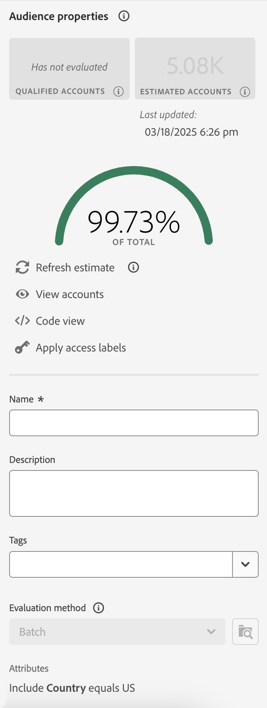{width="300"}

The **[!UICONTROL Qualified accounts]** indicates the actual number of accounts that match the audience's rules. This number updates every 24 hours, after the segmentation job has ran.

The **[!UICONTROL Estimated accounts]** indicates the approximate number of accounts based off of the sample job. You can update this value after adding new rules or conditions and selecting **[!UICONTROL Refresh estimate]**.

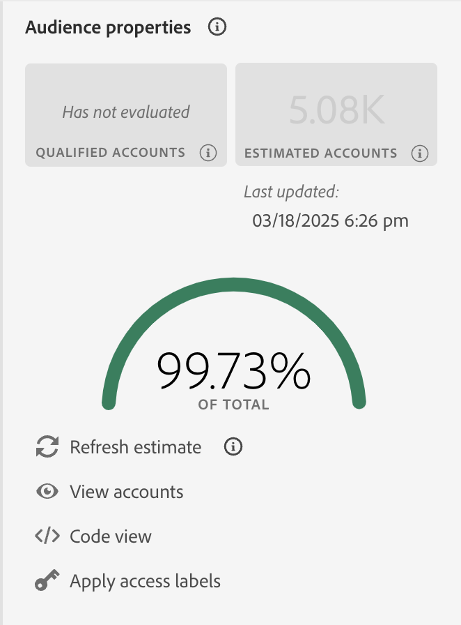{width="300"}

You can select **[!UICONTROL View accounts]** to see a sampling of the accounts that would qualify for the audience with the current rules.

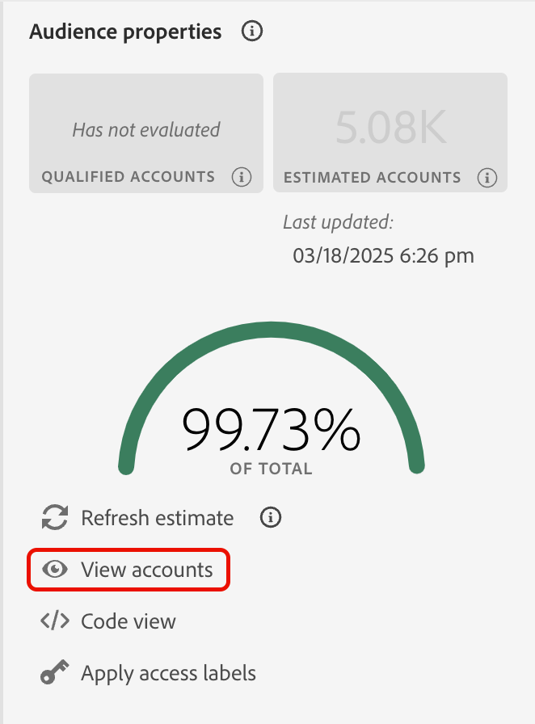{width="300"}

The **[!UICONTROL Code view]** provides a text-based-code description of the audience's rules.

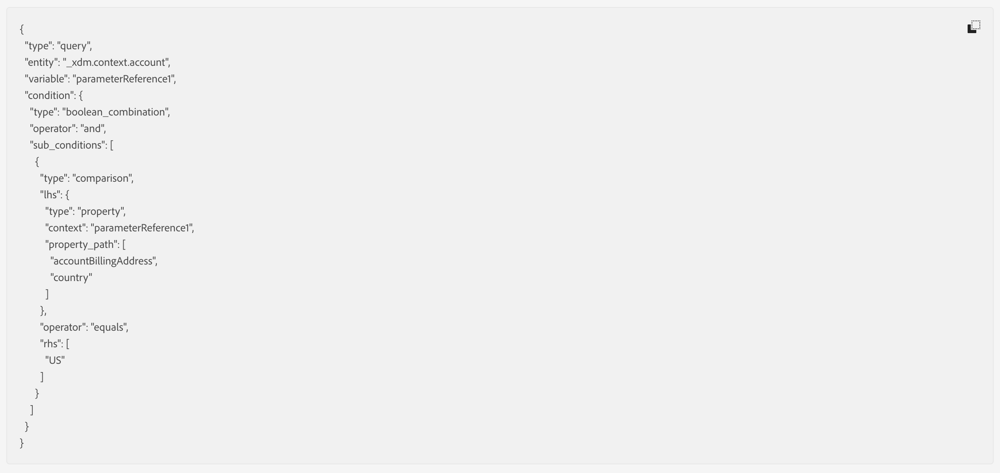

You can select **[!UICONTROL Apply access labels]** to apply the relevant access labels for the audience. More information on access labels can be found in the [managing labels guide](../../access-control/abac/ui/labels.md){target="_blank"}.

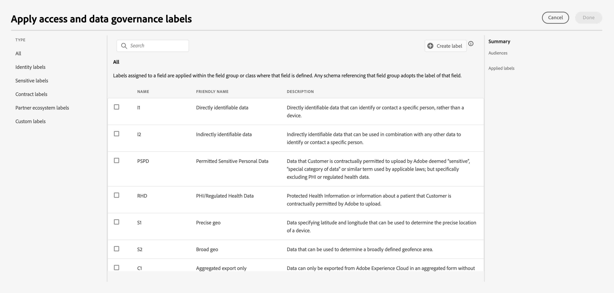

The rest of the audience properties section lets you edit details related to the account audience, including the name, description, and tags.

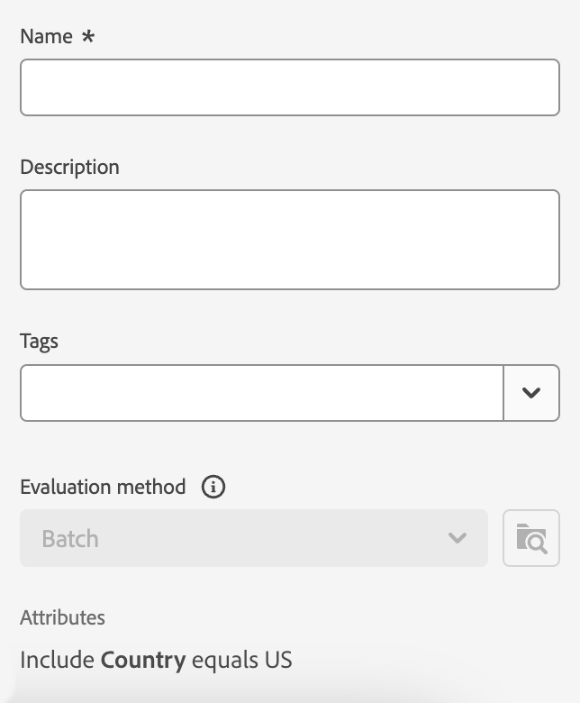{width="300"}

You **cannot** change the evaluation method for account audiences, as all account audiences are evaluated using batch segmentation.

## Next steps {#next-steps}

Audience Builder provides a rich workflow that lets you create audiences from your XDM Business Account data.

To learn more about Segmentation Service for customer profile data, please read the [Segmentation Service overview](../../segmentation/home.md){target="_blank"}.
