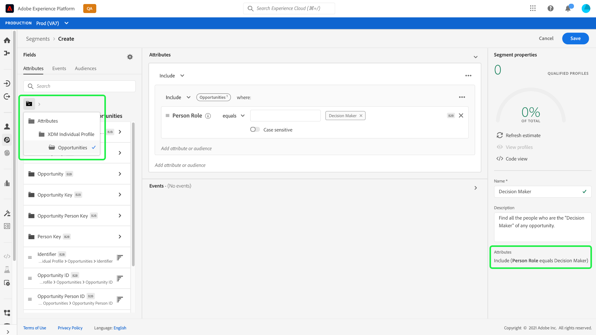

# Tutorial of Segmentation Enhancements for Real-time CDP B2B Edition

>[!IMPORTANT]
>
>The Real-time CDP Business to Business Edition is currently in beta. The documentation and the functionality are subject to change.

(This document shows all the different types of attributes that can be combined for common B2B use cases.)

This document provides guidance on the segmentation enhancements available for the Real-time CDP B2B Edition.

This document relates to this [ticket](https://jira.corp.adobe.com/browse/PLAT-100468)

## Prerequisites

The following pre-requisites are required to use the enhanced B2B segmentation attributes.

- Need to have schemas set up that use the B2B classes. These include: Account, Account Person Relation, Campaign, Campaign Members, Opportunity, Opportunity Person Relation, Marketing List, Marketing List Members. For documentation on [how to set up schemas with B2B classes](https://experienceleague.adobe.com/docs/experience-platform/xdm/home.html))
- You can create segments based on these attribute however you will need relationships between the classes to fully use the extended B2B Segmentation functionality. See the documentation on how to [create relationships between XDM B2B schemas](https://experienceleague.adobe.com/docs/experience-platform/xdm/home.html) for more information.
- Data must be ingested to use with these segments. See the sources documentation for information on [how to ingest data](https://experienceleague.adobe.com/docs/experience-platform/ingestion/home.html?lang=en). 

Once these requirements have been met you are able to combine these attributes for common B2B use cases.

Once the 'things' are set up the attributes will be available in the left rail. You can do the following 'things' with this stuff once you have it set up.

## Examples of different use cases

The following use cases are available for segmentation. 

### Example 1

People who are the "Decision Maker" of any opportunity (Person - Opportunity Person Relation). This is achieved linking the Person class to the opportunity-person relation class. This shows how they are related to an opportunity.

### Example 2

People who are directly assigned to any opportunities of which the opportunity amount is more than the given amount. This segment requires a link between the Person class, the Opportunity-Person Relation class, and the Opportunity class.
