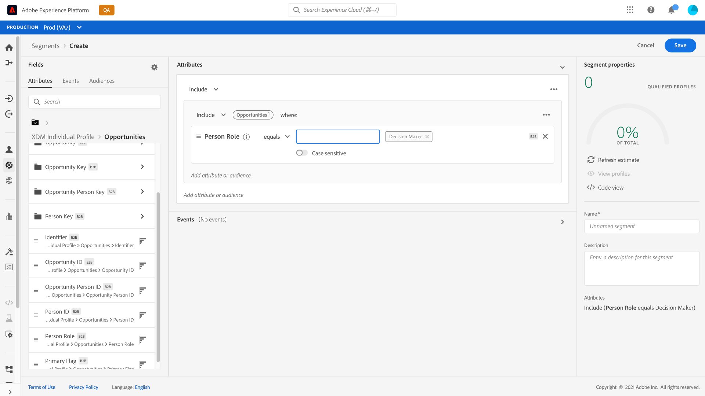
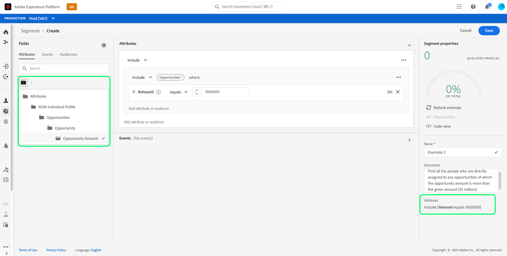
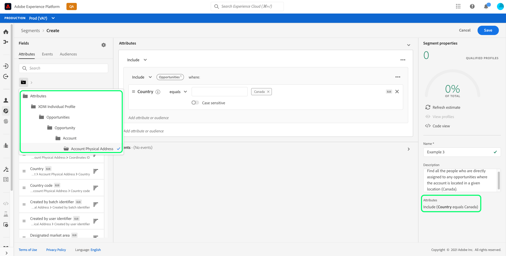
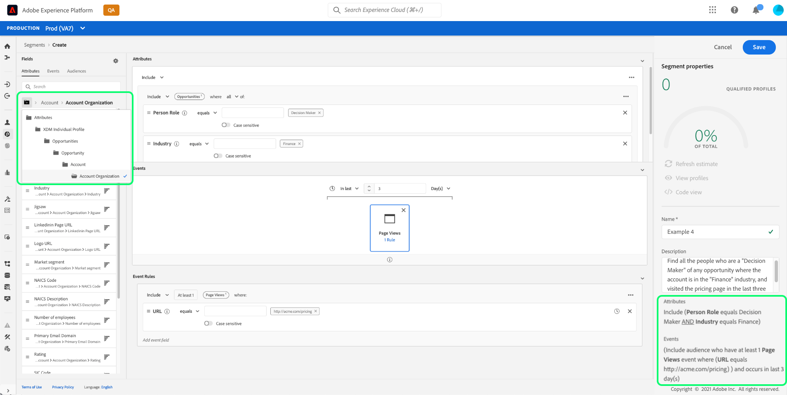
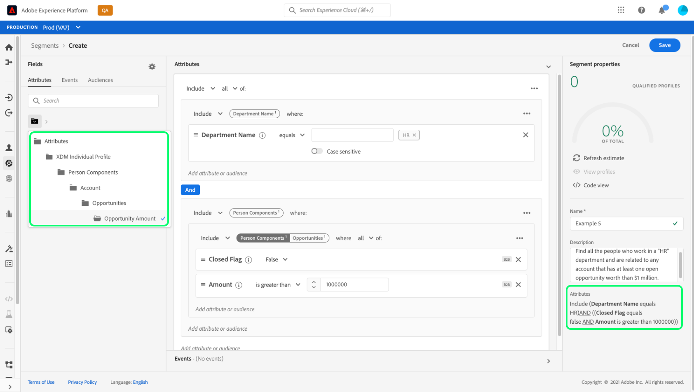
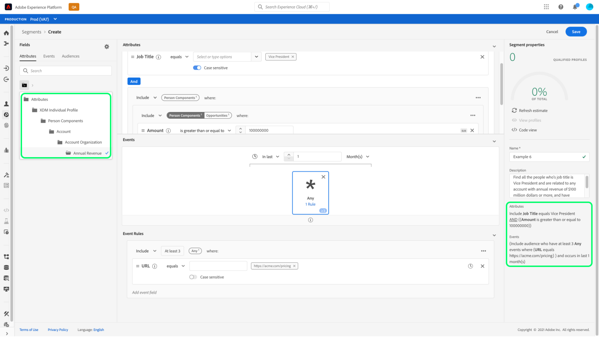
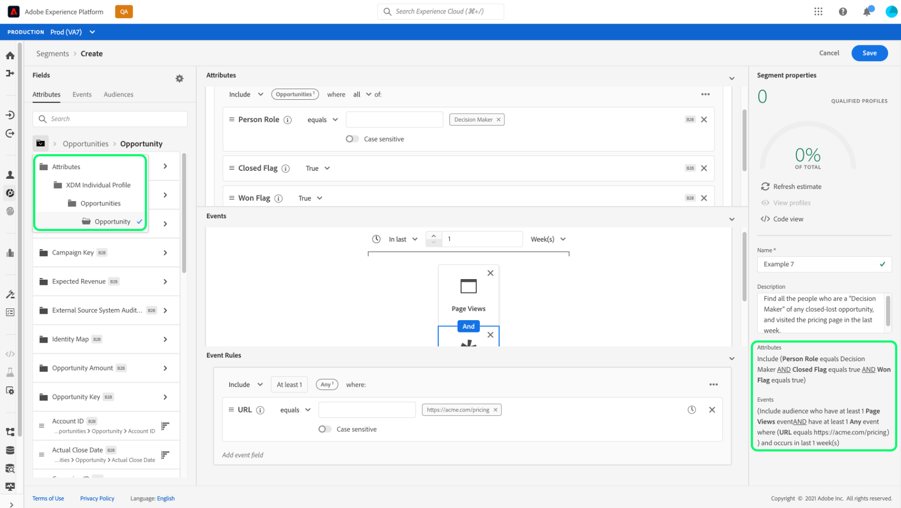

# Overview of Segmentation use cases for Real-time Customer Data Platform Business-to-Business Edition

<!-- This document relates to this [ticket](https://jira.corp.adobe.com/browse/PLAT-100468) -->

>[!IMPORTANT]
>
>Real-time CDP Business-to-Business Edition is currently in beta. The documentation and the functionality are subject to change.

This document provides examples regarding the segmentation available for Real-time CDP, B2B Edition and how the different types of attributes can be combined for common B2B use cases.

>[!NOTE]
>
>The attributes required for these segmentation use cases are only available to Real-time Customer Data Platform B2B Edition customers. To learn more about Real-time CDP, including the features and functionality available to each license type, please begin by reading the [Real-time CDP overview](../overview.md).

## Prerequisites

Before you can use the segmentation attributes for B2B classes, you must complete the following steps:

1. Create schemas that use the B2B classes. The B2B Edition classes include Account, Campaign, Opportunity, Marketing List, and more. For information on how to set up schemas for use with B2B classes please see the schema documentation.
  <!-- [PLACEHOLDER how to set up schemas for use with B2B classes]()] -->
1. Create relationships between your Experience Data Model (XDM) B2B schemas. Segments based on B2B Edition attributes require relationships between the classes to fully use the extended B2B Segmentation functionality.
  <!-- [PLACEHOLDER Create relationships between your XDM B2B schemas]() -->
1. Ingest data using datasets based on your B2B schemas. See the sources documentation for information on how to ingest data. 
  <!-- [PLACEHOLDER how to ingest data](../../sources/home.md). -->

Once these requirements have been met you are able to combine these attributes for common B2B use cases.

## Getting started

Once the union schemas that use B2B classes have data ingested and relationships established between them, the segmentation attributes are made available in the left rail. The examples below can be used to help you create your own segments.

## Examples of different use cases

The following use cases are available for segmentation with the B2B Edition. Each example provides a description of what the segment does and a description of the classes used to create them. The images provided highlight the file path in the [!UICONTROL Attributes] side rail which reflects the structure of the schema. The [!UICONTROL Segment properties] section on the right of the display contains a written breakdown of the segment's attributes. 

See the documentation on the schema auto generation utility for use cases that require [relations between schemas](../../sources/connectors/adobe-applications/marketo/marketo-namespaces.md).
<!-- [possible PLACEHOLDER] -->

<!-- short blurb explaining what the segment does, and then an accompanying screenshot to show how it’s built -->

### Example 1

Find all the people who are the "Decision Maker" of any opportunity. This segment requires a link between the [!UICONTROL Person] class and the [!UICONTROL Opportunity Person Relation] class. 

### Example 2

Find all the people who are directly assigned to any opportunities of which the opportunity amount is more than the given amount ($1 million). This segment requires a link between the [!UICONTROL Person] class, [!UICONTROL Opportunity Person Relation] class, and [!UICONTROL Opportunity] class.

### Example 3

Find all the people who are directly assigned to any opportunities where the account is located in a given location (Canada). This segment requires a link between the [!UICONTROL Person] class, [!UICONTROL Opportunity Person Relation] class, [!UICONTROL Opportunity] class, and [!UICONTROL Account] class.

### Example 4

Find all the people who are a "Decision Maker" of any opportunity where the account is in the "Finance" industry, and visited the pricing page in the last three days. This segment requires a link between the [!UICONTROL Person] class, [!UICONTROL Opportunity Person Relation] class, [!UICONTROL Opportunity] class, and [!UICONTROL Account] class, and [!UICONTROL XDM ExperienceEvent] class.

### Example 5

Find all the people who work in a Human Resources (HR) department and are related to any account that has at least one open opportunity worth the given amount ($1 million) or more. This segment requires a link between the [!UICONTROL Person] class, [!UICONTROL Account] class, and [!UICONTROL Opportunity] class.

### Example 6

Find all the people whose job title is Vice President and are related to any account with annual revenue of the given amount ($100 million) or more, and have visited the pricing page at least 3 times in the last month. This segment requires a link between the [!UICONTROL Person] class, [!UICONTROL Account] class, and [!UICONTROL XDM ExperienceEvent] class.

### Example 7

Find all the people who are a "Decision Maker" of any closed-lost opportunity, and visited the pricing page in the last week. This segment requires a link between the [!UICONTROL Person] class, [!UICONTROL Opportunity Person Relation] class, [!UICONTROL Opportunity] class, and [!UICONTROL XDM ExperienceEvent] class.

## Next steps

After reading this overview, you now have an understanding of the segmentation possibilities that are available using Real-time CDP, B2B Edition. For more information about the Segmentation Service, please read the [Segmentation documentation](../../segmentation/home.md).
