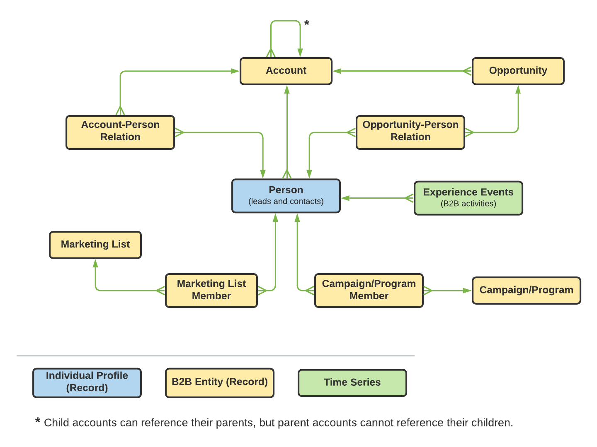
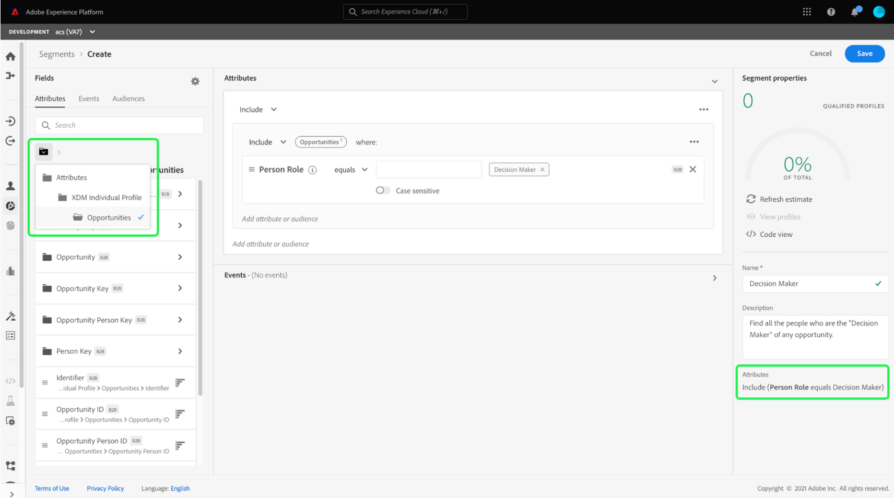
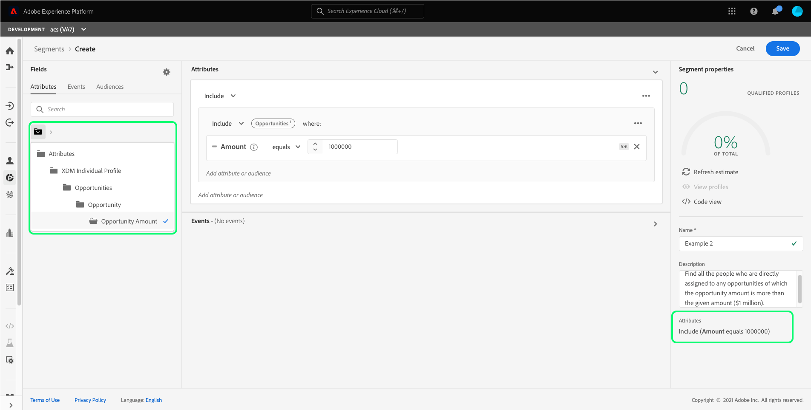
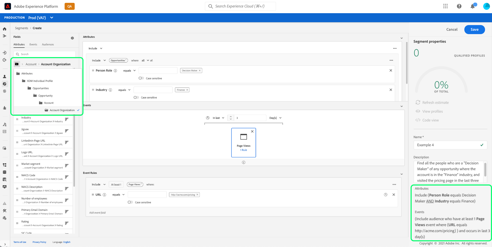
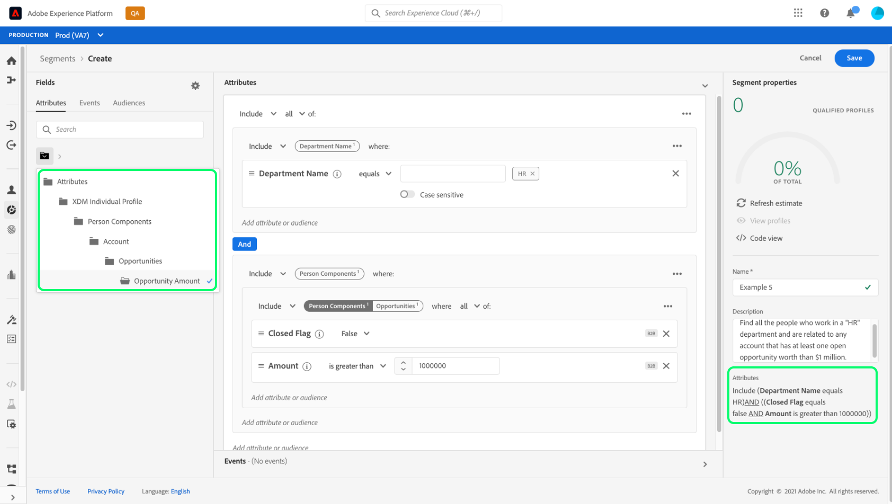
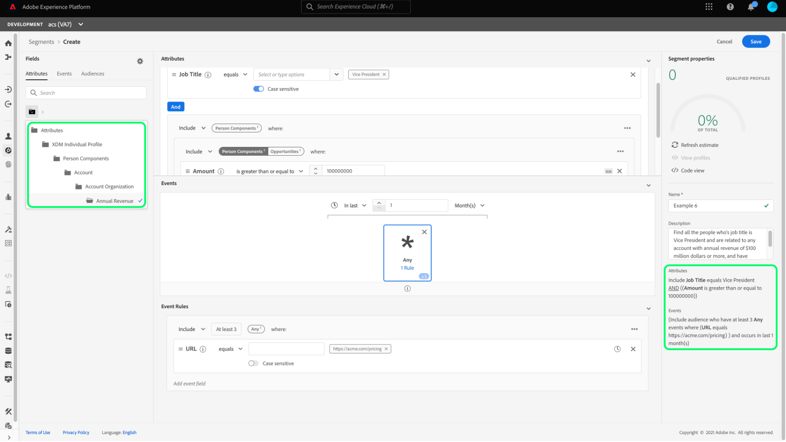
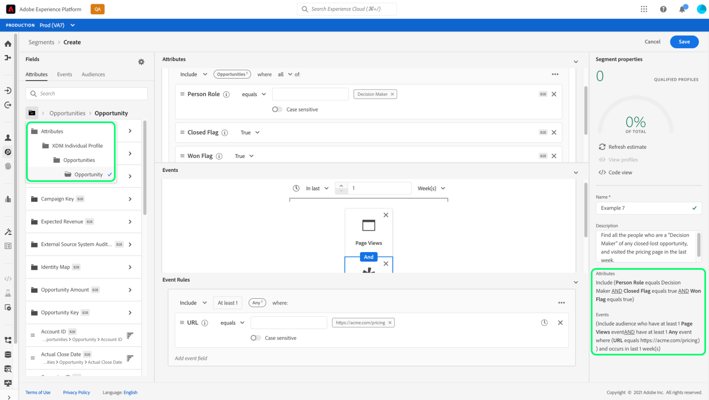
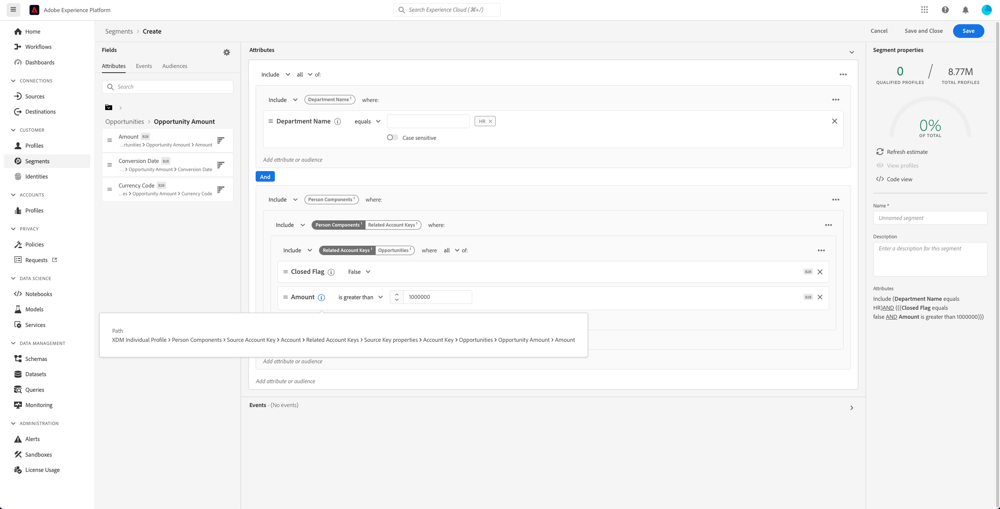
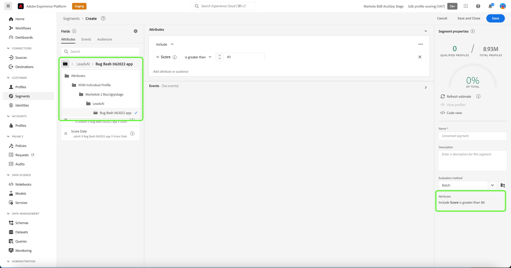

# Segmentation use cases for Real-Time Customer Data Platform B2B Edition

This document provides examples of segment definitions in Adobe Real-Time Customer Data Platform B2B Edition and how different types of attributes can be combined for common B2B use cases. To understand how destinations fit into your B2B workflow, please see the [end-to-end tutorial](../b2b-tutorial.md#create-a-segment-to-evaluate-your-data).

>[!NOTE]
>
>The attributes required for these segmentation use cases are only available to Real-Time Customer Data Platform B2B Edition customers. If you are not using Real-Time Customer Data Platform B2B Edition, see the [segmentation overview](./segmentation-overview.md) instead.

## Prerequisites {#prerequisites}

Before you can use the segmentation attributes for B2B classes, you must complete the following steps:

1. Create schemas that use the B2B classes. The B2B Edition classes include Account, Campaign, Opportunity, Marketing List, and more. For information on [how to set up schemas for use with B2B classes](../schemas/b2b.md) please see the schema documentation.
1. Create relationships between your Experience Data Model (XDM) B2B schemas. Segments based on B2B Edition attributes require relationships between the classes to fully use the extended B2B Segmentation functionality. See the documentation on [how to define a relationship between two B2B schemas](../../xdm/tutorials/relationship-b2b.md) for more information.
1. Ingest data using datasets based on your B2B schemas. See the sources documentation for [information on how to ingest data](../../sources/connectors/adobe-applications/marketo/marketo.md).
1. Read the [Segment builder user guide](../../segmentation/ui/segment-builder.md) for a more detailed guidance on how to build segments.

Once these requirements have been met you are able to combine these attributes for common B2B use cases.

## Getting started {#getting-started}

Once the union schemas for the B2B classes have relationships established and have been used to ingest data, their attributes are made available in the left rail of the Segment Builder. 

B2B classes and their attributes are appended with a `B2B` label within the Segmentation workspace to differentiate them from those available as standard within Real-Time Customer Data Platform. 

In order to effectively create segments for B2B use cases, it is important to have an intimate knowledge of the schema and understand what the data model looks like. It is also useful to be aware of the path that the data takes from one data object to another.

The image below illustrates the relationships between the B2B classes available within Real-Time CDP B2B Edition.

Since your data model can be complicated, you can use the Platform UI to view a more detailed visual representation of your data model in order to help find the relevant attributes for your use case. To start, go to the Platform UI and select Schemas in the left navigation.

Select the appropriate schema from the available list and select the appropriate relationship from the [!UICONTROL Composition] side rail. In the example below, selecting the "Person" relationship reveals which attribute in the current schema references the related "Person" schema (if it is the source schema in the relationship), or is referenced by the "Person" schema (if it is the reference schema in the relationship).

This relationship is reflected within the Segment Builder through the use of `Key` folders as shown in the image below.

Please refer to the [schemas in Real-Time Customer Data Platform B2B Edition documentation](../schemas/b2b.md) for more information on the available B2B classes.

The use cases below provide information on which classes are used to establish relationships between the different schemas to achieve these results. These examples can be used to help you create your own segments.

## Examples of different segmentation use cases {#use-cases}

The following use cases are available for segmentation with the B2B Edition. Each example provides a description of what the segment does and a description of the classes used to create them. The images provided highlight the file path in the [!UICONTROL Attributes] side rail which reflects the structure of the schema. The [!UICONTROL Segment properties] section on the right of the display contains a written breakdown of the segment's attributes. 

### Example 1: Find "decision-makers" for B2B opportunities {#find-decision-maker}

Find all the people who are the "Decision Maker" of any opportunity. This segment requires a link between the [!UICONTROL XDM Individual Profile] class and the [!UICONTROL XDM Business Opportunity Person Relation] class. 

### Example 2: Find B2B profiles assigned to opportunities over a certain dollar amount {#find-opportunities-amount}

Find all the people who are directly assigned to any opportunities of which the opportunity amount is more than the given amount ($1 million). This segment requires a link between the [!UICONTROL XDM Individual Profile] class, [!UICONTROL XDM Business Opportunity Person Relation] class, and [!UICONTROL XDM Business Opportunity] class.

### Example 3: Find B2B profiles assigned to opportunities by location {#find-opportunities-location} 

Find all the people who are directly assigned to any opportunities where the account is located in a given location (Canada). This segment requires a link between the [!UICONTROL XDM Individual Profile] class, [!UICONTROL XDM Business Opportunity Person Relation] class, [!UICONTROL XDM Business Opportunity] class, and [!UICONTROL XDM Business Account] class.

### Example 4: Find "decision-makers" for opportunities by industry and browsing behavior {#find-industry-browsing-behavior}

Find all the people who are a "Decision Maker" of any opportunity where the account is in the "Finance" industry, and visited the pricing page in the last three days. This segment requires a link between the [!UICONTROL XDM Individual Profile] class, [!UICONTROL XDM Business Opportunity Person Relation] class, [!UICONTROL XDM Business Opportunity] class, and [!UICONTROL XDM Business Account] class, and [!UICONTROL XDM ExperienceEvent] class.

### Example 5: Find B2B profiles for opportunities by department name and opportunity amount {#find-department-opportunity-amount}

Find all the people who work in a Human Resources (HR) department and are related to any account that has at least one open opportunity worth the given amount ($1 million) or more. This segment requires a link between the [!UICONTROL XDM Individual Profile] class, [!UICONTROL XDM Business Account] class, and [!UICONTROL XDM Business Opportunity] class.

### Example 6: Find B2B profiles by job title and annual account revenue {#find-by-job-title-and-revenue}

Find all the people whose job title is Vice President and are related to any account with annual revenue of the given amount ($100 million) or more, and have visited the pricing page at least 3 times in the last month. This segment requires a link between the [!UICONTROL XDM Individual Profile] class, [!UICONTROL XDM Business Account] class, and [!UICONTROL XDM ExperienceEvent] class.

### Example 7: Find "decision-makers" by opportunity status and browsing behavior {#find-by-opportunity-status-and-browsing-behavior}

Find all the people who are a "Decision Maker" of any closed-lost opportunity, and visited the pricing page in the last week. This segment requires a link between the [!UICONTROL XDM Individual Profile] class, [!UICONTROL XDM Business Opportunity Person Relation] class, [!UICONTROL XDM Business Opportunity] class, and [!UICONTROL XDM ExperienceEvent] class.

### Example 8: Use related accounts to expand segmentation reach {#related-accounts}

Find all the people who work in a Human Resources (HR) department and are related to any account *or any one of the account's related accounts* that has at least one open opportunity worth the given amount ($1 million) or more. This segment requires a link between the [!UICONTROL XDM Individual Profile] class, [!UICONTROL XDM Business Account] class, and [!UICONTROL XDM Business Opportunity] class.

### Example 9: Use lead scores and/or account scores to qualify profile {#account-scoring}

Find all profiles with the lead score over 80. 

## Next steps {#next-steps}

After reading this overview, you now have an understanding of the segmentation possibilities that are available using Real-Time CDP, B2B Edition. For more information about the Segmentation Service, please read the [Segmentation documentation](../../segmentation/home.md).
