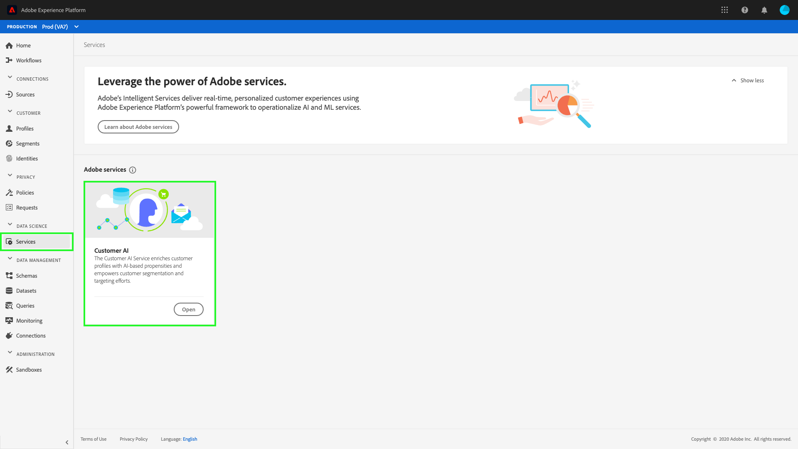

# [!DNL Segmentation Service] in [!DNL Real-Time Customer Data Platform]

[!DNL Adobe Real-Time Customer Data Platform] (Real-Time CDP) allows you to bring data from multiple sources to drive a coordinated and consistent experience for your customers. Delivering relevant personalized marketing campaigns can be achieved using the [!DNL Segmentation Service], part of Adobe Experience Platform.

Real-Time CDP is built on top of Adobe Experience Platform and utilizes many of the [!DNL Experience Platform] services and functionality. Using the [!DNL Segmentation Service], you can provide tailor-made marketing by dividing your customers into smaller groups with similar traits.

## Segmentation

Segmentation is the process of defining specific attributes or behaviors shared by a subset of profiles from your profile store to distinguish a marketable group of people from your customer base. For example, in an email campaign called "Did you forget to buy your sneakers?", you may want an audience of all users who searched for running shoes within the last 30 days, but who did not complete a purchase. Using different segments, you can focus on your various audiences, delivering a more customized marketing experience.

## [!DNL Segment Builder]

[!DNL Platform] allows you to easily create and access segments, as well as use different building blocks to further characterize your segments. For more information about how to use the Segment Builder, please read the [Segment Builder guide](./segment-builder-guide.md).

## Customer AI

Customer AI, included with Real-Time Customer Data Platform, provides you with the power to generate customer predictions at the individual level with explanations.

With the help of influential factors, Customer AI can tell you what a customer is likely to do and why. Additionally, you can benefit from Customer AI predictions and insights to personalize customer experiences by serving the most appropriate offers and messaging. Customer AI can assist with:

* Providing high accuracy customer propensity models for stronger segmentation and targeting.
* Understanding the influential factors and likelihood behind certain customer behaviors.
* Providing customizable options for your company's unique use cases and data.
* Enhancing Real-Time Customer Profile with customer propensity scores such as churn and conversion.
* Enhancing customer profiles with influential factors for propensity scores.
* Creating segments of customers based on influential factors and propensity scores.

Customer AI is located in the **[!UICONTROL Services]** tab under **[!UICONTROL Adobe services]**.

### Getting started with Customer AI

In order to get started with Customer AI you need to follow the [data preperation tutorial](../../intelligent-services/data-preparation.md) and configure the input schema based on your use case. Next, you will need to [configure a Customer AI instance](../../intelligent-services/customer-ai/user-guide/configure.md). After configuring an instance, a model is generated where you can [view your insights and scores](../../intelligent-services/customer-ai/user-guide/discover-insights.md). Using the data generated from your model, you can create segments for data driven activation.

To learn more about Customer AI, start by visiting the [Customer AI overview](../../intelligent-services/customer-ai/overview.md). Additionally, the following video shows how Customer AI enriches customer profiles with AI-based propensities and empowers customer segmentation and targeting efforts.

>[!VIDEO](https://video.tv.adobe.com/v/40374/?quality=12&learn=on)

## Next steps

After reading this overview, you should now understand how Real-Time CDP utilizes [!DNL Segmentation Service] to enhance customization and personalization of marketing campaigns. For more information about the [!DNL Segmentation Service], please read the [Segmentation documentation](../../segmentation/home.md).
