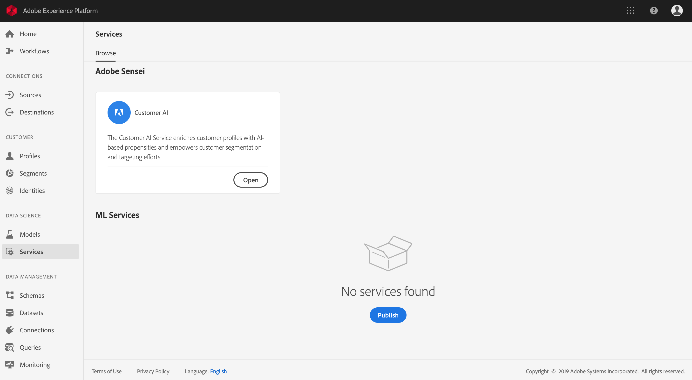
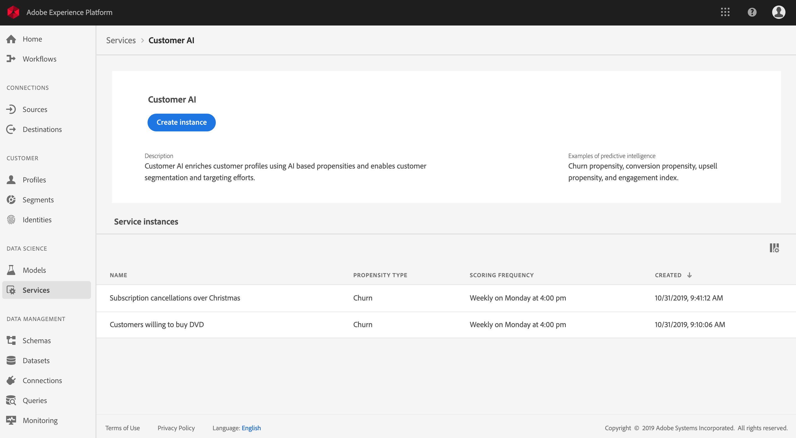
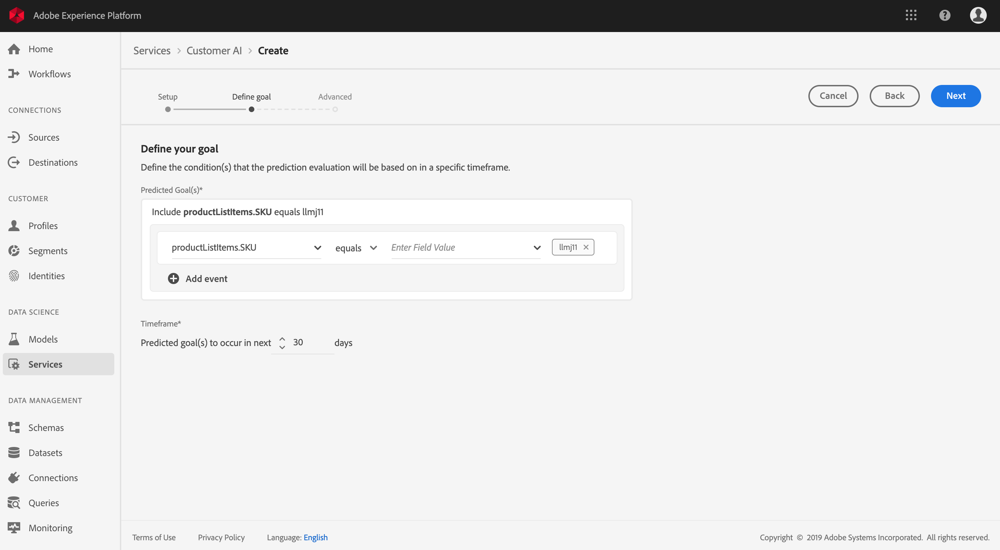
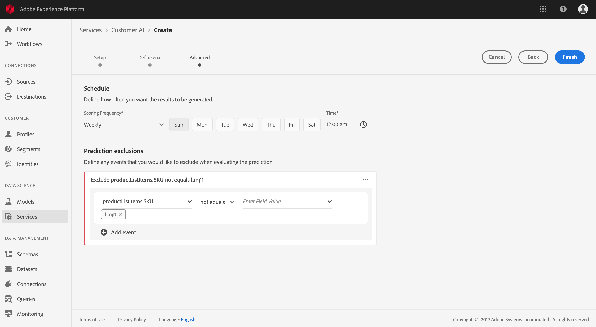
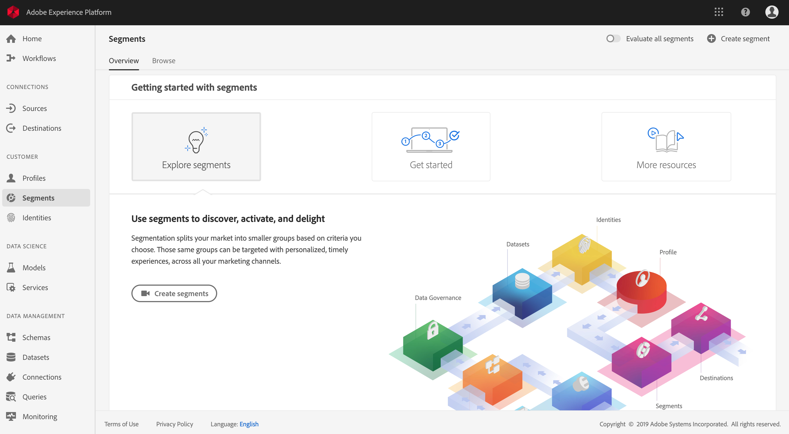
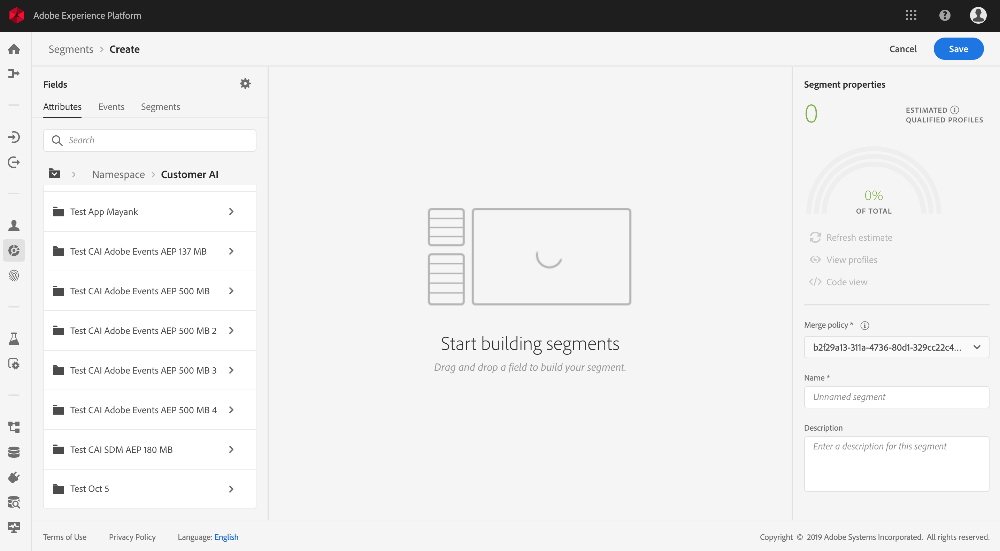
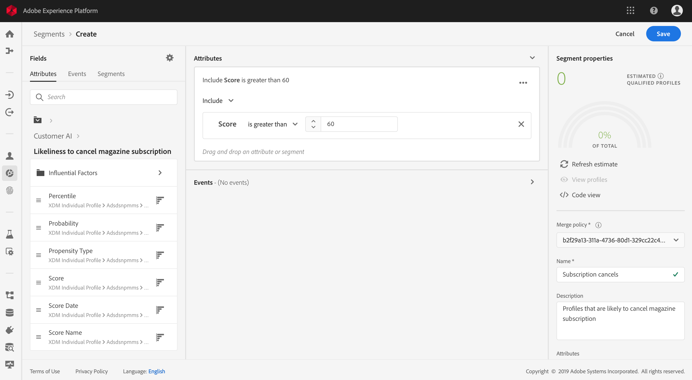

# Predict customer propensity scores using Customer AI (alpha)

>   **Note**: The Customer AI functionality outlined in this document is in alpha. The documentation and the functionality are subject to change.

Built and powered by Adobe Sensei, Customer AI in Adobe Experience Platform enables you to generate custom propensity scores without having to worry about the machine learning aspects.

This tutorial covers steps for working with Customer AI using the Experience Platform user interface. Steps are provided for the following topics:

*   [Configure an instance](#configure-an-instance)
*   [Create customer segments with predicted scores](#create-customer-segments-with-predicted-scores)

## Getting Started

This guide requires a working understanding of the various Platform services involved in using Customer AI. Before beginning this tutorial, please review the following documents:

*   [Real-time Customer Profile overview](https://www.adobe.io/apis/experienceplatform/home/profile-identity-segmentation/profile-identity-segmentation-services.html#!api-specification/markdown/narrative/technical_overview/unified_profile_architectural_overview/unified_profile_architectural_overview.md)
*   [Segmentation Service overview](https://www.adobe.io/apis/experienceplatform/home/profile-identity-segmentation/profile-identity-segmentation-services.html#!end-user/markdown/segmentation_overview/segmentation.md)
*   [Segment Builder user guide](https://www.adobe.io/apis/experienceplatform/home/profile-identity-segmentation/profile-identity-segmentation-services.html#!end-user/markdown/segmentation_overview/segment-builder-guide.md)

## Configure an instance

Experience Platform provides Customer AI as a simple to use Adobe Sensei service that can be configured for different use cases. The following sections provide steps for configuring an instance of Customer AI.

### Setup your instance

In the Platform UI, click **Services** in the left navigation. The **Services** browser appears and displays all available services at your disposal. In the container for Customer AI, click **Open**.

The *Customer AI* screen displays all existing Customer AI instances. Click **Create instance**.

The instance creation workflow appears, starting on the *Setup* step.

Below are important information on values for which you must provide the instance with:

*   The instance's name will be used in all places where Customer AI score is displayed. Hence names should describe what the prediction scores represent, for example, "Likelihood to cancel magazine subscription".

*   The propensity type determines the intent of the score and metric polarity. You can either choose **Churn** or **Conversion**.

*   Data source refers to the input dataset which will be used to predict scores. By design, Customer AI uses Consumer Experience Event data to calculate propensity scores. When selecting a dataset from the dropdown selector, only ones that are compatible with Customer AI will be listed.

*   By default, propensity scores are generated for all profiles unless an eligible population is specified. You can specify an eligible population by defining conditions to include or exclude profiles based on events.

Provide the required values and then click **Next**.

### Define a goal

The *Define goal* step appears and it provides an interactive environment for you to visually define a goal. A goal is composed of one or more events, where each event's occurrence is based on the condition it holds. The objective of a Customer AI instance is to determine the likeliness of achieving its goal within a given time frame.

Click **Enter Field Name** and select a field from the dropdown list. Click the second input and select a clause for the event's condition, then provide target value to complete the event. Additional events can be configured by clicking **Add event**. Lastly, complete the goal by applying a prediction time frame in number of days, then click **Next**.

### Configure a schedule *(optional)*

The *advanced* step appears. This optional step allows you to configure a schedule to automate prediction runs, define prediction exclusions to filter certain events, or click **Finish** if nothing is needed. 

Setup a scoring schedule by configuring the *Scoring Frequency*. Automated prediction runs can be scheduled to run on either a weekly or a monthly basis.

Below the schedule configuration, you have the ability to define prediction exclusions to prevent events that meet certain conditions from being evaluated when generating scores. This feature can be used to filter out irrelevant data inputs.

To exclude certain events, click **Add exclusion** and define the event in the same fashion as to how the goal is defined. To remove an exclusion, click the ellipses (**...**) to the top-right of the event container and then click **Remove Container**.

Exclude events as needed and then click **Finish** to create the instance.

If the instance is created successfully, a prediction run will be immediately triggered and subsequent ones will execute according to your defined schedule.

>   **Note:** Depending on the size of the input data, prediction runs can take up to 24 hours to complete.

By following this section, you have configured an instance of Customer AI and a prediction run was executed. Upon the run's successful completion, scored insights will automatically hydrate Profiles with predicted scores. Please wait 24 hours before continuing to the next section of this tutorial.

## Create customer segments with predicted scores

When a prediction run completes, predicted propensity scores are automatically consumed by Profiles. Enriching Profiles with Customer AI scores allows for the creation of customer segments that are based on propensity scores. This section provides steps for creating segments using the Segment Builder. For a more robust tutorial on creating segments, please see the [Segment Builder user guide](https://www.adobe.io/apis/experienceplatform/home/profile-identity-segmentation/profile-identity-segmentation-services.html#!end-user/markdown/segmentation_overview/segment-builder-guide.md).

In the Platform UI, click **Segments** in the left navigation, and then click **Create segment**. 

The *Segment Builder* appears. From the left *Fields* column and under the *Attributes* tab, click the folder named **XDM Individual Profile** and then click the folder with the namespace of your organization. The folder named **Customer AI** contains the results of prediction runs and are named after the instance the scores belong to. Click and access the results of the desired instance.

Located in the center of Segment Builder, drag and drop the **Score** attribute onto the *rule builder canvas* to define a rule.

Under the right *Segment properties* column, select a *Merge policy* and provide a name for the segment, then click **Save** to create the segment.

## Next steps

By following this tutorial, you have successfully configured an instance of Customer AI, generated propensity scores, and create a segment enforced by propensity scores using the Segment Builder. Your customer segment can now be used by activated destinations to target your audiences. See the [Destinations overview](../destinations/destinations-overview.md) for more information.
