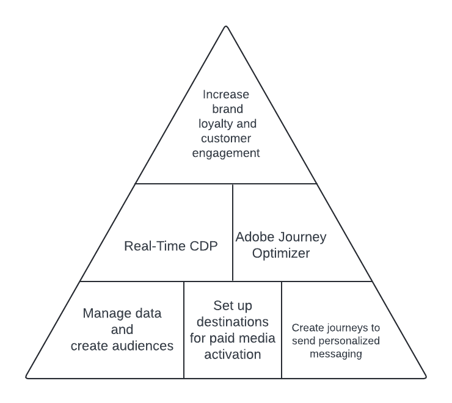
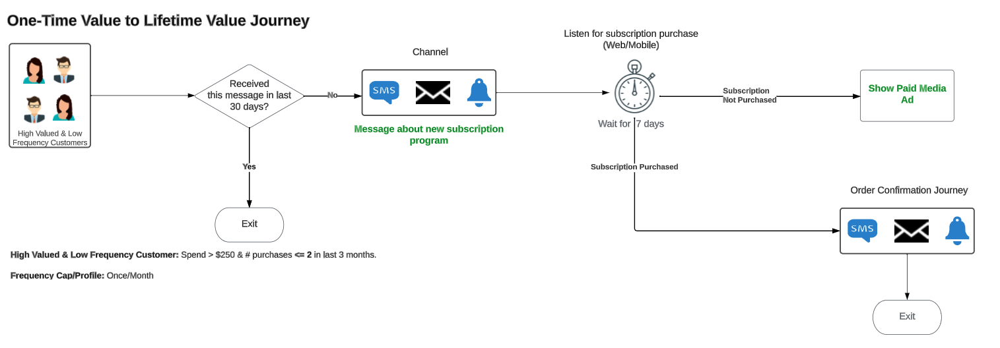

# Evolve one-time customer value to lifetime value

>[!IMPORTANT]
> 
>* This page presents a sample implementation of Real-Time CDP and Adobe Journey Optimizer to achieve the described use case. Use the figures, qualification criteria, and other fields given on the page as a guide, not as prescriptive figures.
>* To complete this use case, you need to be licensed for Real-Time CDP and Adobe Journey Optimizer. Read more in the [prerequisites and planning section](#prerequisites-and-planning) further below.

Implement the one-time customer value to lifetime value use case to drive brand engagement and brand loyalty. Build a connected customer experience on multiple channels or journey by using the power of Experience Platform, augmented by [Real-Time CDP](/help/rtcdp/home.md) and [Journey Optimizer](https://experienceleague.adobe.com/en/docs/journey-optimizer/using/ajo-home). 

The personas that you are targeting are the infrequent visitors to your properties who have made some purchases within the last three months.

Consider these customers who visit your properties and sporadically purchase the products or services that you offer. You may want to create personalized campaigns to appeal to these customers so your brand can offer them longer-term value instead of one-time value. Learn how to:

* Collect and manage data
* Create audiences
* Create journeys to target these audiences in Adobe Journey Optimizer and activate them in Real-Time CDP.

{zoomable="yes"}

## Prerequisites and planning {#prerequisites-and-planning}

Considering that internally you have defined a business goal and objective to increase brand loyalty. This can translate into executing a use case to drive customer engagement and loyalty.

To achieve this, the technology required consists of the two Experience Platform apps [Real-Time CDP](https://experienceleague.adobe.com/docs/experience-platform/rtcdp/overview.html) and [Adobe Journey Optimizer](https://experienceleague.adobe.com/docs/journey-optimizer/using/get-started/get-started.html). Listed below are various functionality and UI elements from the two apps that you will use when implementing the use case.
 
>[!TIP]
>
>Make sure that you have the necessary [attribute-based access control permissions](/help/access-control/abac/end-to-end-guide.md) for all these areas, or ask your system administrator to grant you the necessary permissions.

* [[!DNL Adobe Real-Time Customer Data Platform (Real-Time CDP)]](https://experienceleague.adobe.com/docs/platform-learn/tutorials/rtcdp/understanding-the-real-time-customer-data-platform.html): Integrate data across data sources to fuel the campaign. This data is then used to create the campaign audiences and surface personalized data elements used in the email and the web promo tiles (for example, name or account-related information). Finally, Real-Time CDP is also used to activate audiences to paid media destinations.
  * [Schemas](/help/xdm/home.md)
  * [Profiles](/help/profile/home.md)
  * [Datasets](/help/catalog/datasets/overview.md)
  * [Audiences](/help/segmentation/home.md)
  * [Destinations](/help/destinations/home.md)
* [[!DNL Adobe Journey Optimizer]](https://experienceleague.adobe.com/docs/journey-optimizer/using/orchestrate-journeys/journey.html): Design journeys, set up triggers, and create the right messaging to address your visitors.
  * [Event or Audience Trigger](https://experienceleague.adobe.com/docs/journey-optimizer/using/offer-decisioning/collect-event-data/data-collection.html)
  * [Audiences and Events](https://experienceleague.adobe.com/docs/journey-optimizer/using/audiences-profiles-identities/audiences/about-audiences.html)
  * [Journeys](https://experienceleague.adobe.com/docs/journey-optimizer/using/orchestrate-journeys/journey.html)

## Real-Time CDP and Journey Optimizer architecture

Below is a high-level architecture view of the various components of Real-Time CDP and Journey Optimizer. This diagram shows how data flows through the two Experience Platform apps from data collection up to the point where it is activated through journeys or campaigns to destinations, to achieve the use case described on this page.

{zoomable="yes"}

## How to achieve the use case: high-level overview {#achieve-the-use-case-high-level}

Below is a high-level overview of the workflow, a combination of a journey workflow and an activation workflow.

In the sample workflow pictured below, you look for customers who meet a certain criteria and you want to entice them to return to your website or app. You are looking to set them on a journey where instead of limited activity on your property, they return in a more recurrent manner. You are trying to get them back to your property and then once they are back, you have them enter the journey to  make recurrent purchases on your site. The campaign set up here is capped at one engagement with customers per month. 

You start by sending your audience of high-valued and low-frequency customers a message. You then check if they received this message within the last thirty days. If they have not, then you can enter them into a journey about, for example, a new subscription program. You can then wait for a few days (seven days in this example). After this time, if they have not purchased the subscription that you messaged them about, you can deliver paid media ads via destinations. If they have purchased the subscription, you can have them enter an order confirmation journey, thereby completing the use case. 

>[!IMPORTANT]
>
>As described further below on this page, by having a [dedicated consent field group in your schema](#customer-attributes-schema) and by [implementing consent policies](#privacy-consent), all the actions and workflows are implemented in a privacy and consent-first manner. 

>[!BEGINSHADEBOX]

{zoomable="yes"}

1. You create schemas and datasets, then mark these for [!UICONTROL Profile].
2. Data is collected and integrated into Experience Platform via Web SDK, Mobile Edge SDK, or API. Analytics Data Connector can also be utilized, but may result in journey latency.
3. You load profiles into Real-Time CDP and build governance policies to ensure responsible use.
4. You build focused audiences from the list of profiles to check for high-valued and low-frequency customers.
5. You create two journeys in [!DNL Adobe Journey Optimizer], one to message users about a new subscription program, and another to message them to confirm the purchase later on.
6. If desired, you activate the audience of customers who have not purchased your subscription to desired paid-media destinations.

>[!ENDSHADEBOX]

## How to achieve the use case {#achieve-use-case-instruction}

To complete each of the steps in the high-level overview above, read through the sections below, which offer links to more information and more detailed instructions.

### UI functionality and elements that you will use {#ui-functionality-and-elements}

As you complete the steps to implement the use case, you'll use the Real-Time CDP, Adobe Journey Optimizer functionality, and UI elements listed at the beginning of this document. Make sure that you have the necessary attribute-based access control permissions for all these areas, or ask your system administrator to grant you the necessary permissions. 

### Create a schema design and specify field groups {#schema-design}

Experience Data Model (XDM) resources are managed in the [!UICONTROL Schemas] workspace in [!DNL Adobe Experience Platform]. You can view and explore core resources provided by [!DNL Adobe] (for example, [!UICONTROL field groups]) and create custom resources and schemas for your organization.

For more information about creating [schemas](https://experienceleague.adobe.com/docs/experience-platform/xdm/home.html), read the [create schema tutorial.](/help/xdm/tutorials/create-schema-ui.md) 

There are several schema designs that you can use in this sample implementation for the use case to evolve one-time value to lifetime value. Each schema includes specific required fields to be set up, and some fields that are suggested.

Based on sample implementations, Adobe suggests that you create the following three schemas to accomplish this use case: 

* [Customer attributes schema](#customer-attributes-schema) (a profile schema)
* [Customer digital transactions schema](#customer-digital-transactions-schema) (an experience event schema)
* [Customer offline transactions schema](#customer-offline-transactions-schema) (an experience event schema)

#### Customer attributes schema {#customer-attributes-schema}

Use this schema to structure and reference the profile data that makes up your customer information. This data is typically ingested into [!DNL Adobe Experience Platform] via your CRM or similar system and is necessary to reference customer details that are used for personalization, marketing consent, and enhanced segmentation capabilities.

The customer attributes schema is represented by an [!UICONTROL XDM Individual Profile] class, which includes the following field groups:

+++Demographic Details (Field Group)

[Demographic Details](/help/xdm/field-groups/profile/demographic-details.md) is a standard schema field group for the XDM Individual Profile class. The field group provides a root-level person object, whose sub-fields describe information about an individual person.

+++

+++Personal Contact Details (Field Group)

[Personal Contact Details](/help/xdm/field-groups/profile/personal-contact-details.md) is a standard schema field group for the XDM Individual Profile class, which describes the contact information for an individual person.

+++

+++External Source System Audit Details (Field Group)

[External Source System Audit Attributes](/help/xdm/data-types/external-source-system-audit-attributes.md) is a standard Experience Data Model (XDM) data type that captures audit details about an external source system.

+++

+++Consent and Preference Field Groups (Field Group)

[The Consents and Preferences](/help/xdm/field-groups/profile/consents.md) field group provides a single object-type field, consents, to capture consent and preference information.

+++

#### Customer digital transactions schema {#customer-digital-transactions-schema}

This schema is used to structure and reference the event data that makes up your customer activity that occurs on your website or on other associated digital platforms. This data is typically ingested into [!DNL Adobe Experience Platform] via [Web SDK](/help/collection/js/js-overview.md) and is necessary to reference the various browse and conversion events that are used for triggering journeys, detailed online customer analysis, and enhanced segmentation capabilities.

The customer digital transactions schema is represented by an [!UICONTROL XDM ExperienceEvent] class, which includes the following field groups:

+++Adobe Experience Platform Web SDK ExperienceEvent (Field Group)

| Fields | Requirement |
| --- | --- |
| `device.model` | Suggested |
| `environment.browserDetails.userAgent` | Suggested |

+++

+++Web Details (Field Group)

[Web Details](/help/xdm/field-groups/event/web-details.md) is a standard schema field group for the XDM ExperienceEvent class, used to describe information regarding web details events such as interaction, page details, and referrer.

+++

+++Consumer Experience Event (Field Group)

This field group includes various information about actions, such as purchase or browsing events, taken by users on your web property.

| Field | Requirement |
| --- | --- |
| `commerce.cart.cartID` | Suggested |
| `commerce.cart.cartSource` | Suggested |
| `commerce.cartAbandons.id` | Suggested |
| `commerce.cartAbandons.value` | Suggested |
| `commerce.order.orderType` | Suggested |
| `commerce.order.payments.paymentAmount` | Suggested |
| `commerce.order.payments.paymentType` | Suggested |
| `commerce.order.payments.transactionID` | Suggested |
| `commerce.order.priceTotal` | Suggested |
| `commerce.order.purchaseID` | Suggested |
| `commerce.productListAdds.id` | Suggested |
| `commerce.productListAdds.value` | Suggested |
| `commerce.productListOpens.id` | Suggested |
| `commerce.productListOpens.value` | Suggested |
| `commerce.productListRemoval.id` | Suggested |
| `commerce.productListRemoval.value` | Suggested |
| `commerce.productListViews.id` | Suggested |
| `commerce.productListViews.value` | Suggested |
| `commerce.productViews.id` | Suggested |
| `commerce.productViews.value` | Suggested |
| `commerce.purchases.id` | Suggested |
| `commerce.purchases.value` | Suggested |
| `marketing.campaignGroup` | Suggested |
| `marketing.campaignName` | Suggested |
| `marketing.trackingCode` | Suggested |
| `productListItems.name` | Suggested |
| `productListItems.priceTotal` | Suggested |
| `productListItems.product` | Suggested |
| `productListItems.quantity` | Suggested |

+++

+++End User ID Details (Field Group)

The [End User ID Details](/help/xdm/field-groups/event/enduserids.md) field group includes various information about your users, such as whether they are authenticated on your site when visiting, and information about their identity.

+++

+++External Source System Audit Details (Field Group)

External Source System Audit Attributes is a standard Experience Data Model (XDM) data type that captures audit details about an external source system.

+++

#### Customer offline transactions schema {#customer-offline-transactions-schema}

This schema is used to structure and reference the event data that makes up your customer activity that occurs on platforms outside of your website. This data is typically ingested into [!DNL Adobe Experience Platform] from a POS (or similar system) and most often streamed into Experience Platform via an API connection. Read about [batch ingestion](/help/ingestion/batch-ingestion/getting-started.md). Its purpose is to reference the various offline conversion events that are used for triggering journeys, deep online and offline customer analysis, and enhanced segmentation capabilities.

The customer offline transactions schema is represented by an [!UICONTROL XDM ExperienceEvent] class, which includes the following field groups:

+++Commerce Details (Field Group)

[Commerce Details](/help/xdm/field-groups/event/commerce-details.md) is a standard schema field group for the [!DNL XDM ExperienceEvent] class, used to describe commerce data such as product information (SKU, name, quantity), and standard cart operations (order, checkout, abandon).

+++

+++Personal Contact Details (Field Group)

[[!UICONTROL Personal Contact Details]](/help/xdm/field-groups/profile/personal-contact-details.md) is a standard schema field group for the [!DNL XDM Individual Profile] class, which describes the contact information for an individual person.

+++

+++External Source System Audit Details (Field Group) 

External Source System Audit Attributes is a standard Experience Data Model (XDM) data type that captures audit details about an external source system.

+++

#### Adobe web connector schema {#adobe-web-connector-schema}

>[!NOTE]
>
>This is an optional implementation if you are using the [!DNL Adobe Analytics Data Connector].

This schema is used to structure and reference the event data that makes up your customer activity that occurs on your website or on other associated digital platforms. This schema is similar to the Customer Digital Transactions schema but differs in that it can when Web SDK is not an option for data collection. As such, you can use this schema when you are utilizing the [!DNL Adobe Analytics Data Connector] to send your online data into [!DNL Adobe Experience Platform] either as a primary or secondary datastream.

The [!DNL Adobe] web connector schema is represented by a [!UICONTROL XDM ExperienceEvent] class, which includes the following field groups:

+++Adobe Analytics ExperienceEvent Template (Field Group)

[[!UICONTROL Adobe Analytics ExperienceEvent Full Extension]](/help/xdm/field-groups/event/analytics-full-extension.md) is a standard schema field group, which captures common metrics that are collected by Adobe Analytics.

+++

### Create a dataset from a schema {#dataset-from-schema}

A dataset is a storage and management structure for a group of data. Each schema used to accomplish this sample implementation has a single dataset. 

For more information on how to create a [dataset](/help/catalog/datasets/overview.md) from a schema, read the [Datasets UI guide](/help/catalog/datasets/user-guide.md).

>[!NOTE] 
>
>Similar to the step to create a schema, you need to enable the dataset to be included in the Real-Time Customer Profile. For more information about enabling the dataset for use in Real-Time Customer Profile, read the [create schema tutorial.](/help/xdm/tutorials/create-schema-ui.md#profile).

### Privacy, consent, and data governance {#privacy-consent}

#### Consent policies

>[!IMPORTANT]
>
>Providing customers with the capability to unsubscribe from receiving communications from a brand, as well as ensuring this choice is honored, is a legal requirement. Learn more about the applicable legislation in the [Privacy regulations overview](https://experienceleague.adobe.com/docs/experience-platform/privacy/regulations/overview.html).

Consider implementing the following [consent policies](https://experienceleague.adobe.com/docs/platform-learn/data-collection/web-sdk/consent/overview.html) and asking your visitors for consent before you  reach out to them:

* If `consents.marketing.email.val = "Y"` then Can Email
* If `consents.marketing.sms.val = "Y"` then Can SMS
* If `consents.marketing.push.val = "Y"` then Can Push
* If `consents.share.val = "Y"` then Can Advertise

#### Data Governance label and enforcement

Consider adding and enforcing the following [data governance labels](/help/data-governance/labels/overview.md):

* Personal email addresses are utilized as directly identifiable data that is used for identifying or getting in touch with a specific individual rather than a device.
    * `personalEmail.address = I1`

#### Marketing policies

There are no [marketing policies](/help/data-governance/policies/overview.md) required for the journeys that you create as part of this use case. However, you can consider the following policies as desired:

* Restrict Sensitive Data
* Restrict Onsite Advertising
* Restrict Email Targeting
* Restrict cross-site Targeting
* Restrict combining directly identifiable data with anonymous data

### Create audiences {#create-audiences}

This use case requires that you create two audiences to define specific attributes or behaviors shared by a subset of profiles from your Profile store to distinguish a marketable group of people. Audiences can be created in multiple ways in Adobe Experience Platform:

* For information on how to create an audience, read the [Audience service UI guide](https://experienceleague.adobe.com/docs/experience-platform/segmentation/ui/overview.html#create-audience).
* For information on how to compose [audiences](/help/segmentation/home.md), read the [Audience Composition UI guide](/help/segmentation/ui/audience-composition.md).
* For information on how to build audiences through Experience Platform-derived segment definitions, read the [Audience Builder UI guide](/help/segmentation/ui/segment-builder.md).

Specifically, you must create and use two audiences at different steps of the use case, as shown in the image below.

{zoomable="yes"}

>[!BEGINTABS]

>[!TAB Adobe Journey Optimizer Qualifying Audience]

This high-value and low-frequency audience includes the profiles that you want to reach out to via a journey, to let them know about a new subscription program. The audience details are below:

* Description: Profiles who have spent more than $250 in aggregate in the last 3 months
* Fields and Conditions Needed in the audience:
  * Event: `commerce.order.payments.paymentamount`
        * Aggregate Sum: >= $250
  * EventType: `commerce.purchases`
        * Timestamp: less than 3 months before now

>[!TAB Paid media audience]

This audience is created to include profiles who have spent more than $250 in aggregate in the last 3 months, and have not had a purchase in the last 7 days. The audience details are below:

* Description: profiles who have spent more than $250 in aggregate in the last 3 months, and have not had a purchase in the last 7 days. 
* Fields and Conditions Needed:
  * EventType: `journey.feedback`
    * Operand: = true
  * Event: `experience.journeyOrchestration.stepEvents.nodeName`
    * Operand: = JourneyStepEventTracker - Subscription Not Purchased
    * Timestamp: in last 7 days
  * EventType is not: `commerce.purchases`
    * Timestamp: <= 7 days before now
  * Event: SKU
    * Value: = `subscription`

>[!ENDTABS]

### Journey setup in Adobe Journey Optimizer {#journey-setup}

>[!NOTE]
>
>[!DNL Adobe Journey Optimizer] does not encompass everything shown in the diagrams. All [paid media ads](/help/destinations/catalog/social/overview.md) are created in the [!UICONTROL destinations] [workspace](/help/destinations/ui/destinations-workspace.md).

[[!DNL Adobe Journey Optimizer]](https://experienceleague.adobe.com/docs/journey-optimizer/using/orchestrate-journeys/journey.html) helps you deliver connected, contextual, and personalized experiences to your customers. The customer journey is the entire process of a customer's interactions with the brand. Each use case journey requires specific information. 

To accomplish this use case, you must create two separate journeys: 

* The lifetime journey, which includes the message that you send to your high-value, low-frequency customers
* The order confirmation journey for the users who respond to your call and purchase a subscription. 

{zoomable="yes"}

Listed below is the precise data needed for each Journey branch.

>[!BEGINTABS]

>[!TAB Lifetime Journey]

The lifetime journey addresses the audience of high-value and low-frequency customers who were not targeted within the last 30 days. A message is shown to these customers and then, if after 7 days they still do not purchase, you can include the non-purchasers in an audience that you can show paid media ads to. If they do purchase, you can set the purchasers on an order confirmation journey, detailed in the separate tab.

{zoomable="yes"}

+++Detailed Journey Logic

The journey shown above follows the following logic.

1. Read audience: Use a [read audience activity](https://experienceleague.adobe.com/docs/journey-optimizer/using/orchestrate-journeys/about-journey-building/read-audience.html?lang=en) for the first audience created in the audiences section above. 

2. Condition - Preferred Channel: Use a [condition activity](https://experienceleague.adobe.com/docs/journey-optimizer/using/orchestrate-journeys/about-journey-building/condition-activity.html) to determine how to reach out to customers, whether through email, SMS, or push notifications. Use three action activities to create the three branches.

3. Wait: Use a [wait activity](https://experienceleague.adobe.com/docs/journey-optimizer/using/orchestrate-journeys/about-journey-building/read-audience.html) to wait until you listen for purchases.

4. Condition - Purchased Subscription in last 7 days?: use a condition activity to listen for product purchases in the last seven days. 

5. JourneyStepEventTracker - Subscription Not Purchased: Use a [custom action](https://experienceleague.adobe.com/docs/journey-optimizer/using/orchestrate-journeys/about-journey-building/using-custom-actions.html) for the visitors who have not yet purchased your subscription, despite receiving your message. As part of the custom condition at the end of journey, create a `journey.feedback` event and add it to a dataset based on the [!UICONTROL Journey Step Event] schema. You will use this event to segment the audience that has not purchased the subscription and that you can target via paid media ads.

+++

>[!TAB Order Confirmation Journey]

The order confirmation journey focuses on whether a purchase was made through the website or mobile app. After a customer successfully completed the purchase of, for example, a subscription with your company, you can set them on an order confirmation journey.

{zoomable="yes"}

+++Journey logic

Use the suggested events, fields, and actions below in your confirmation journey:

* The journey is triggered by an online purchase event
    * Schema: Customer Digital Transactions
    * Fields:
        * `EventType`
    * Condition: 
        * `EventType = commerce.purchases`
        * Fields: 
            * `Commerce.purchases.id`
            * `Commerce.purchases.value`
            * `eventType`
            * `identityMap.authenticatedState`
            * `identityMap.id`
            * `identityMap.primary`
            * `productListItems.SKU`
            * `productListItems.currencyCode`
            * `productListItems.name`
            * `productListItems.priceTotal`
            * `productListItems.product`
            * `productListItems.productImageUrl`
            * `productListItems.quantity`
            * `timestamp`
            * `endUserIDs._experience.emailid.authenticatedState`
            * `endUserIDs._experience.emailid.id`
            * `endUserIDs._experience.emailid.namespace.code`
            * `_id`

+++

+++Key Journey logic

* Journey Entry Logic
    * Order Event

* Conditions 
    * Select Target Channel (you can select one or multiple channels for wider reach).
        * Order confirmation is considered serving in nature, so consent checking is usually unnecessary.
        * Email
        * Push
        * SMS

    * Channel Content Personalization
        * Display order details information and can display a list of products using a table format. 

+++

>[!ENDTABS]

For more information about creating journeys in [!DNL Adobe Journey Optimizer], read the [get started with journeys](https://experienceleague.adobe.com/docs/journey-optimizer/using/orchestrate-journeys/journey.html) guide.

### Set up a destination to display paid media ads {#paid-media-ads}

Some users might not have purchased your subscription even after you message them about the new program. After waiting for a number of days (seven in this example use case), you can decide to show paid media ads to those users, to encourage them to purchase your subscription. 

Use the destinations framework in Real-Time CDP for paid media ads. Select one of the many available advertising destinations to display paid media ads to your customers and activate the Paid media audience that you [created earlier](#create-audiences) to a destination of your choice. See an overview of available [advertising](/help/destinations/catalog/advertising/overview.md) and [social](/help/destinations/catalog/social/overview.md) destinations. 

To learn how to activate data to destinations (for example [The Trade Desk](/help/destinations/catalog/advertising/tradedesk.md) or [Google Customer Match](/help/destinations/catalog/advertising/google-customer-match.md)), read the documentation below: 

* [Create a new destination connection](/help/destinations/ui/connect-destination.md)
* [Activate audience data to streaming audience export destinations](/help/destinations/ui/activate-segment-streaming-destinations.md)

## Next steps {#next-steps}

By setting your low-frequency and high-value users on a journey and by displaying paid media ads to a subset of them, you have hopefully turned some of them from one-time value to lifetime value customers, thereby improving your brand loyalty and customer engagement metrics. 

Next, you can explore other use cases supported by Real-Time CDP, such as [intelligently re-engaging customers](/help/rtcdp/use-case-guides/intelligent-re-engagement/intelligent-re-engagement.md) or [displaying personalized content to unauthenticated users](/help/rtcdp/partner-data/onsite-personalization.md) on your web properties.
