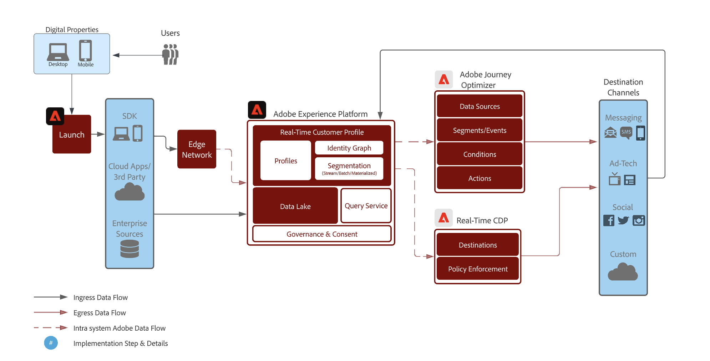
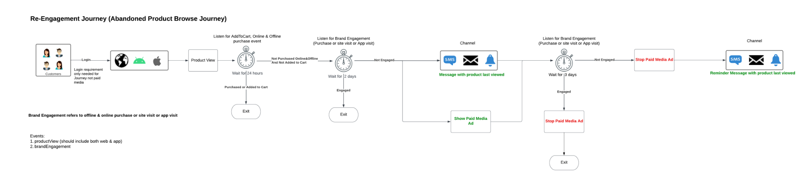
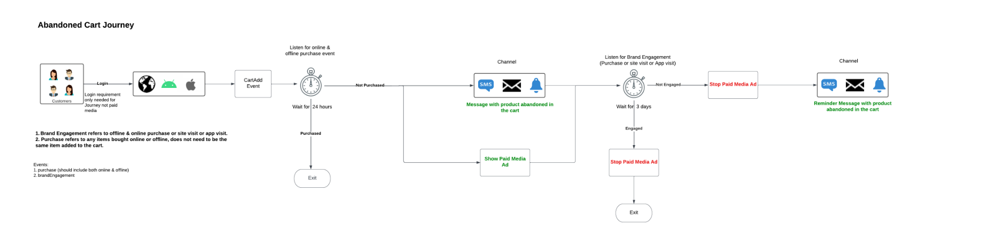
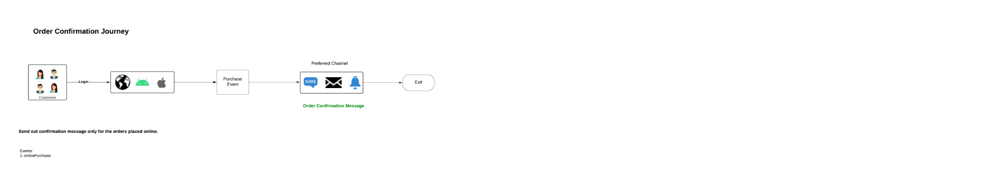

# Intelligently re-engage your customers to return

>[!NOTE]
>
>This is a sample implementation, and the examples on this page, such as segment syntax, are merely examples. You should use the examples as a guide, as your implementation may differ.

Re-engage customers who have abandoned a conversion in an intelligent and responsible way. Engage lapsed customers with experiences to increase conversion and increase the client lifetime value.

Employ real-time considerations, take into account all consumer qualities and behaviors, and offer fast re-qualification based on both online and offline events.

Below is a high-level architecture view of the various components of Real-Time CDP and Journey Optimizer. This diagram shows how data flows through the two Experience Platform apps from data collection up to the point where it is activated through journeys or campaigns to destinations, in order to achieve the use case described on this page.

 

## Use case overview {#overview}

You will construct schemas, datasets, and audiences as you work through examples of re-engagement scenarios. You will also discover the features needed to set up the example journeys in [!DNL Adobe Journey Optimizer] and those needed to create paid media advertisements in destinations. This guide uses examples of re-engaging customers in the use case journeys outlined below:

* **Abandoned product browse scenario** - Target customers who have abandoned product browsing on both the website and mobile app.
* **Abandoned cart scenario** - Target customers who have placed products in the cart but have not yet been purchased on both the website and mobile app.
* **Order confirmation scenario** - Focus on product purchases made through the website and mobile app.

## Prerequisites and planning {#prerequisites-and-planning}

As you complete the steps to implement the use case, you will make use of the following Real-Time CDP and Adobe Journey Optimizer functionality (listed in the order in which you will use them). Make sure that you have the necessary [attribute-based access control permissions](/help/access-control/home.md) for all these areas, or ask your system administrator to grant you the necessary permissions.

* [[!DNL Adobe Real-Time Customer Data Platform (Real-Time CDP)]](https://experienceleague.adobe.com/docs/platform-learn/tutorials/rtcdp/understanding-the-real-time-customer-data-platform.html) - Integrates data across data sources to fuel the campaign. This data is then used to create the campaign audiences and surface personalized data elements used in the email and the web promo tiles (for example, name or account-related information). The CDP is also used to activate audiences across email and the web (via [!DNL Adobe Target]).
    * [Schemas](/help/xdm/home.md)
    * [Profiles](/help/profile/home.md)
    * [Datasets](/help/catalog/datasets/overview.md)
    * [Audiences](/help/segmentation/home.md)
    * [[!DNL Adobe Journey Optimizer]](https://experienceleague.adobe.com/docs/journey-optimizer/using/orchestrate-journeys/journey.html)
    * [Destinations](/help/destinations/home.md)

* [[!DNL Adobe Journey Optimizer]](https://experienceleague.adobe.com/docs/journey-optimizer-learn/tutorials/introduction-to-journey-optimizer/introduction.html) - Helps you deliver connected, contextual, and personalized experiences to your customers.
    * [Event or Audience Trigger](https://experienceleague.adobe.com/docs/journey-optimizer/using/offer-decisioning/collect-event-data/data-collection.html)
    * [Audiences/ Events](https://experienceleague.adobe.com/docs/journey-optimizer/using/audiences-profiles-identities/audiences/about-audiences.html)
    * [Journey Actions](https://experienceleague.adobe.com/docs/journey-optimizer/using/orchestrate-journeys/journey.html)

## How to achieve the use case {#achieve-use-case-instruction}

Below is a high level overview of the three example re-engagement scenarios.

>[!BEGINTABS]

>[!TAB Abandoned Product Browse Scenario]

The abandoned product browse scenario targets abandoned product browsing on both the website and mobile app. This scenario is triggered when a product has been viewed but not purchased or added to the cart. In this example, brand engagement is triggered after three days if there are no list additions within the last 24 hours.
{width="1920" zoomable="yes"}

1. You create schemas and datasets, then enable for [!UICONTROL Profile].
2. You ingest data into Experience Platform via Web SDK, Mobile SDK or API. Analytics Source Connector can also be utilized, but may result in journey latency.
3. You ingest additional profile-enabled data, which can be linked to the authenticated web and mobile app visitor via identity graphs.
4. You build focused audiences from the list of profiles to check if a **customer** has made an engagement in the last three days.
5. You create a abandoned product browse journey in [!DNL Adobe Journey Optimizer].
6. If needed, work with the **data partner** for the activation of audiences to desired paid-media destinations.
7. [!DNL Adobe Journey Optimizer] checks for consent and sends out the various actions configured.

>[!TAB Abandoned Cart Scenario]

The abandoned cart scenario applies when products have been placed in the cart but have not yet been purchased on both the website and mobile app. Also, Paid Media campaigns are started and stopped using this method.
{width="1920" zoomable="yes"}
 

1. You create schemas and datasets, the enable for [!UICONTROL Profile].
2. You ingest data into Experience Platform via Web SDK, Mobile SDK or API. Analytics Source Connector can also be utilized, but may result in journey latency.
3. You ingest additional profile-enabled data, which can be linked to the authenticated web and mobile app visitor via identity graphs.
4. You build focused audiences from the list of profiles to check if a **customer** has placed an item in their cart but has not completed the purchase. The **[!UICONTROL Add to cart]** event kicks off a timer that waits for 30 minutes, then checks for purchase. If no purchase has been made, then the **customer** is added to the **[!UICONTROL Abandon Cart]** audiences.
5. You create an abandoned cart journey in [!DNL Adobe Journey Optimizer].
6. If needed, work with the **data partner** for the activation of audiences to desired paid-media destinations.
7. [!DNL Adobe Journey Optimizer] checks for consent and sends out the various actions configured.

>[!TAB Order Confirmation Scenario]

The order confirmation scenario focuses on product purchases made through the website and mobile app.
{width="1920" zoomable="yes"}

1. You create schemas and datasets, then enable for [!UICONTROL Profile].
2. You ingest data into Experience Platform via Web SDK, Mobile SDK or API. Analytics Source Connector can also be utilized, but may result in journey latency.
3. You ingest additional profile-enabled data, which can be linked to the authenticated web and mobile app visitor via identity graphs.
4. You create a confirmation journey in [!DNL Adobe Journey Optimizer].
5. [!DNL Adobe Journey Optimizer] sends out an order confirmation message using the preferred channel.

>[!ENDTABS]

To complete each of the steps in the high-level overviews above, read through the sections below, which offer links to more information and more detailed instructions.

### Create schemas and specify field groups {#schema-design}

Experience Data Model (XDM) resources are managed in the [!UICONTROL Schemas] workspace in [!DNL Adobe Experience Platform]. You can view and explore core resources provided by [!DNL Adobe] (for example, field groups) and create custom resources and schemas for your organization.

For more information about creating [schemas](/help/xdm/home.md), see the [create schema tutorial.](/help/xdm/tutorials/create-schema-ui.md) and [Model Your Customer Experience Data with XDM](https://experienceleague.adobe.com/docs/courses/using/experienceplatform-d-1-2021-1-xdm.html).

There are four schema designs that are used for the re-engagement use case. Each schema requires specific fields to be set up. You need to enable the schema to be included in the Real-Time Customer Profile. For more information about enabling the schema for use in Real-Time Customer Profile, read [enable a schema for Real-Time Customer Profile](/help/xdm/ui/resources/schemas.md#enable-a-schema-for-real-time-customer-profile).

#### Customer attributes schema

This schema is used to structure and reference the profile data that makes up your customer information. This data is typically ingested into [!DNL Adobe Experience Platform] via your CRM or similar system and is necessary to reference customer details that are used for personalization, marketing consent, and enhanced audience capabilities.

The customer attributes schema is represented by an [[!UICONTROL XDM Individual Profile]](/help/xdm/classes/individual-profile.md) class, which includes the following field groups:

+++Personal Contact Details (Field Group)

[Personal Contact Details](/help/xdm/field-groups/profile/personal-contact-details.md) is a standard schema field group for the XDM Individual Profile class which describes the contact information for an individual person.

| Fields | Description |
| --- | --- |
| `mobilePhone.number` |  The person's mobile phone number, which will be used for SMS. |
| `personalEmail.address` | The person's email address. |

+++

+++External Source System Audit Details (Field Group)

[External Source System Audit Attributes](/help/xdm/data-types/external-source-system-audit-attributes.md) is a standard Experience Data Model (XDM) data type that captures audit details about an external source system.

+++

+++Consent and Preference Field Groups (Field Group)

The [Consents and Preferences](/help/xdm/field-groups//profile/consents.md) field group provides a single object-type field, consents, to capture consent and preference information.

| Fields | Requirement |
| --- | --- |
| `consents.marketing.email.val` | Required |
| `consents.marketing.preferred` | Required |
| `consents.marketing.push.val` | Required |
| `consents.marketing.sms.val` | Required |
| `consents.personalize.content.val` | Required |
| `consents.share.val` | Required |

+++

+++Profile Test Details (Field Group)

This field group allows you to test your journey before it is published, using test profiles. For more information about creating test profiles, read the [create test profiles tutorial](https://experienceleague.adobe.com/docs/journeys/using/building-journeys/about-journey-building/creating-test-profiles.html) and [testing the journey tutorial](https://experienceleague.adobe.com/docs/journeys/using/building-journeys/testing-the-journey.html).

+++

#### Customer digital transactions schema

This schema is used to structure and reference the event data that makes up your customer activity that occurs on your website or associated digital platforms. This data is typically ingested into [!DNL Adobe Experience Platform] via [Web SDK](/help/web-sdk/home.md) and is necessary to reference the various browse and conversion events that are used for triggering journeys, detailed online customer analysis, enhanced audience capabilities, and personalized messaging.

The customer digital transactions schema is represented by an [[!UICONTROL XDM ExperienceEvent]](/help/xdm/classes/experienceevent.md) class. 

+++XDM ExperienceEvent (Class)

The [[!UICONTROL XDM ExperienceEvent]](/help/xdm/classes/experienceevent.md) class includes the following field groups:

| Fields | Description |
| --- | --- |
| `_id` | Uniquely identifies individual events that are ingested into [!DNL Adobe Experience Platform]. |
| `timestamp` | An ISO 8601 timestamp of when the event occurred, formatted as per RFC 3339 Section 5.6. This timestamp must occur in the past. |
| `eventType` | A string that indicates the type of category for the event. |

+++

+++End User ID Details (Field Group)

The [End User ID Details](/help/xdm/field-groups/event/enduserids.md) field group is used to describe an individual's identity information across several Adobe applications.

| Fields | Description |
| --- | --- |
| `endUserIDs._experience.emailid.authenticatedState` | End user email address ID authenticated state. |
| `endUserIDs._experience.emailid.id` | End user email address ID. |
| `endUserIDs._experience.emailid.namespace.code` | End user email address ID namespace code. |
| `endUserIDs._experience.mcid.authenticatedState` | [!DNL Adobe] Marketing Cloud ID (MCID) authenticated state. The MCID is now known as the Experience Cloud ID (ECID). |
| `endUserIDs._experience.mcid.id` | [!DNL Adobe] Marketing Cloud ID (MCID). The MCID is now known as the Experience Cloud ID (ECID). |
| `endUserIDs._experience.mcid.namespace.code` | [!DNL Adobe] Marketing Cloud ID (MCID) namespace code. |

+++

+++Commerce Details (Field Group)

The [Commerce Details](/help/xdm/field-groups/event/commerce-details.md) field group is used to describe commerce data such as product information (SKU, name, quantity), and standard cart operations (order, checkout, abandon).

| Fields | Description |
| --- | --- |
| `commerce.cart.cartID` | An ID for the shopping cart. |
| `commerce.order.orderType` | An object that describes product order type. |
| `commerce.order.payments.paymentAmount` | An object that describes product order payment amount. |
| `commerce.order.payments.paymentType` | An object that describes product order payment type. |
| `commerce.order.payments.transactionID` | An object product order transaction ID. |
| `commerce.order.purchaseID` | An object product order purchase ID. |
| `productListItems.name` | A list of item names representing the product(s) selected by a customer. |
| `productListItems.priceTotal` | The total price of list of items representing the product(s) selected by a customer. |
| `productListItems.product` | The product(s) selected. |
| `productListItems.quantity` | The quantity of list of items representing the product(s) selected by a customer. |

+++

+++External Source System Audit Details (Field Group)

External Source System Audit Attributes is a standard Experience Data Model (XDM) data type that captures audit details about an external source system.

+++

#### Customer offline transactions schema

This schema is used to structure and reference the event data that makes up your customer activity that occurs on platforms outside of your website. This data is typically ingested into [!DNL Adobe Experience Platform] from a POS (or similar system) and most often streamed into Platform via an API connection. Its purpose is to reference the various offline conversion events that are used for triggering journeys, deep online and offline customer analysis, enhanced audience capabilities and personalized messaging.

The customer offline transactions schema is represented by an [[!UICONTROL XDM ExperienceEvent]](/help/xdm/classes/experienceevent.md) class.

+++XDM ExperienceEvent (Class)

The [[!UICONTROL XDM ExperienceEvent]](/help/xdm/classes/experienceevent.md) class includes the following field groups:

| Fields | Description |
| --- | --- |
| `_id` | Uniquely identifies individual events that are ingested into [!DNL Adobe Experience Platform]. |
| `timestamp` | An ISO 8601 timestamp of when the event occurred, formatted as per RFC 3339 Section 5.6. This timestamp must occur in the past. |
| `eventType` | A string that indicates the type of category for the event. |

+++

+++Commerce Details (Field Group)

The [Commerce Details](/help/xdm/field-groups/event/commerce-details.md) field group is used to describe commerce data such as product information (SKU, name, quantity), and standard cart operations (order, checkout, abandon).

| Fields | Description |
| --- | --- |
| `commerce.cart.cartID` | An ID for the shopping cart. |
| `commerce.order.orderType` | An object that describes product order type. |
| `commerce.order.payments.paymentAmount` | An object that describes product order payment amount. |
| `commerce.order.payments.paymentType` | An object that describes product order payment type. |
| `commerce.order.payments.transactionID` | An object product order transaction ID. |
| `commerce.order.purchaseID` | An object product order purchase ID. |
| `productListItems.name` | A list of item names representing the product(s) selected by a customer. |
| `productListItems.priceTotal` | The total price of list of items representing the product(s) selected by a customer. |
| `productListItems.product` | The product(s) selected. |
| `productListItems.quantity` | The quantity of list of items representing the product(s) selected by a customer. |

+++

+++Personal Contact Details (Field Group)

[Personal Contact Details](/help/xdm/field-groups/profile/personal-contact-details.md) is a standard schema field group for the XDM Individual Profile class which describes the contact information for an individual person.

| Fields | Description |
| --- | --- |
| `mobilePhone.number` | The person's mobile phone number, which will be used for SMS. |
| `personalEmail.address` | The person's email address. |

+++

+++External Source System Audit Details (Field Group) 

External Source System Audit Attributes is a standard Experience Data Model (XDM) data type that captures audit details about an external source system.

+++

#### Adobe web connector schema

>[!NOTE]
>
>This is an optional implementation if you are using the [[!DNL Adobe Analytics Source Connector]](/help/sources/connectors/adobe-applications/analytics.md).

This schema is used to structure and reference the event data that makes up your customer activity that occurs on your website or associated digital platforms. This schema is similar to the Customer Digital Transactions schema but differs in that it is intended to be used when [Web SDK](/help/web-sdk/home.md) is not an option for data collection; thus, this schema is needed when you are utilizing the [!DNL Adobe Analytics Source Connector] to send your online data into [!DNL Adobe Experience Platform] either as a primary or secondary datastream.

The [!DNL Adobe] web connector schema is represented by an [[!UICONTROL XDM ExperienceEvent]](/help/xdm/classes/experienceevent.md) class.

+++XDM ExperienceEvent (Class)

The [[!UICONTROL XDM ExperienceEvent]](/help/xdm/classes/experienceevent.md) class includes the following field groups:

| Fields | Description |
| --- | --- |
| `_id` | Uniquely identifies individual events that are ingested into [!DNL Adobe Experience Platform]. |
| `timestamp` | An ISO 8601 timestamp of when the event occurred, formatted as per RFC 3339 Section 5.6. This timestamp must occur in the past. |
| `eventType` | A string that indicates the type of category for the event. |

+++

+++Adobe Analytics ExperienceEvent Template (Field Group)

The [Adobe Analytics ExperienceEvent](/help/xdm/field-groups/event/analytics-full-extension.md) field group captures common metrics that are collected by Adobe Analytics.

| Fields | Description |
| --- | --- |
| `endUserIDs._experience.emailid.authenticatedState` | End user email address ID authenticated state. |
| `endUserIDs._experience.emailid.id` | End user email address ID. |
| `endUserIDs._experience.emailid.namespace.code` | End user email address ID namespace code. |
| `endUserIDs._experience.mcid.authenticatedState` | [!DNL Adobe] Marketing Cloud ID (MCID) authenticated state. The MCID is now known as the Experience Cloud ID (ECID). |
| `endUserIDs._experience.mcid.id` | [!DNL Adobe] Marketing Cloud ID (MCID). The MCID is now known as the Experience Cloud ID (ECID). |
| `endUserIDs._experience.mcid.namespace.code` | [!DNL Adobe] Marketing Cloud ID (MCID) namespace code. |

+++

+++External Source System Audit Details (Field Group)

External Source System Audit Attributes is a standard Experience Data Model (XDM) data type that captures audit details about an external source system.

+++

### Create a dataset from a schema {#create-datasets}

A dataset is a storage and management structure for a group of data. Each schema for intelligent re-engagement scenarios should have its own dataset. 

For more information on how to create a [dataset](/help/catalog/datasets/overview.md) from a schema, read the [Datasets UI guide](/help/catalog/datasets/user-guide.md).

>[!NOTE] 
>
>Similar to the step to create a schema, you need to enable the dataset to be included in the Real-Time Customer Profile. For more information about enabling the dataset for use in Real-Time Customer Profile, see tutorial on [bringing data into Real-Time Customer Profile](https://experienceleague.adobe.com/docs/platform-learn/tutorials/profiles/bring-data-into-the-real-time-customer-profile.html).

### Consent and data governance {#privacy-consent}

>[!IMPORTANT]
>
>Providing customers with the capability to unsubscribe from receiving communications from a brand, as well as ensuring this choice is honored, is a legal requirement. Learn more about the applicable legislation in the [Privacy regulations overview](https://experienceleague.adobe.com/docs/experience-platform/privacy/regulations/overview.html).

#### Consent policies

When creating a re-engagement path, consider adding the following [consent policies](https://experienceleague.adobe.com/docs/platform-learn/data-collection/web-sdk/consent/overview.html):

* If `consents.marketing.email.val = "Y"` then Can Email
* If `consents.marketing.sms.val = "Y"` then Can SMS
* If `consents.marketing.push.val = "Y"` then Can Push
* If `consents.share.val = "Y"` then Can Advertise

#### Data Governance labelling and enforcement

When creating a re-engagement path, consider adding the following [Data Governance labels](/help/data-governance/labels/overview.md):

* Personal email addresses are utilized as direct identifiable data that is used for identifying or getting in touch with a specific individual rather than a device.
    * `personalEmail.address = I1`

#### Data usage policies

There are no [data usage policies](/help/data-governance/policies/overview.md) required for the abandoned product browse scenario. However, you should consider the following:

* Restrict Sensitive Data
* Restrict Onsite Advertising
* Restrict Email Targeting
* Restrict cross site Targeting
* Restrict combining directly identifiable data with anonymous data

### Create audiences {#create-audience}

The re-engagement scenarios use audiences to define specific attributes or behaviors shared by a subset of profiles from your profile store to distinguish a marketable group of people from your customer base. Audiences can be created in multiple ways in [!DNL Adobe Experience Platform].

For more information on how to create an audience, read the [audience service UI guide](https://experienceleague.adobe.com/docs/experience-platform/segmentation/ui/overview.html#create-audience).

For more information on how to directly compose [Audiences](/help/segmentation/home.md), read the [Audience Composition UI guide](/help/segmentation/ui/audience-composition.md).

For more information on how to build audiences through Platform-derived audience definitions, read the [Audience Builder UI guide](/help/segmentation/ui/segment-builder.md).

>[!BEGINTABS]

>[!TAB Abandoned Product Browse Scenario]

This audience is created as an enhancement to the classic "Cart Abandonment" scenario. Whereas cart abandonment typically focuses on a cart addition without a subsequent purchase in a certain period of time, this audience looks for an earlier engagement, specifically those who may have browsed a particular product but did not add it to their cart and had no follow-up activity on your site within a certain time frame. This audience helps to keep your brand "top of mind" for customers who meet this inclusion criteria and can also be leveraged for customers whose digital properties may differ from a traditional e-commerce model.

+++Abandoned product view with no engagement in the last three days

The following event is used for the abandoned product browse scenario where users viewed products online, and did not engage (site visits, app visits, online purchase, offline purchase, and add to cart events) in the 3 days following.

The following fields and conditions are required when setting up this audience:

* `eventType: commerce.productViews`
* And `THEN` (sequential event) exclude `eventType: commerce.productListAdds` AND `application.launch` AND `web.webpagedetails.pageViews` AND `commerce.purchases` (this includes both online and offline)
    * `Timestamp: > 3 days after productView`
* `Timestamp: > 4 days`

+++

+++Product view with engagement in the last three days

The following event is used for the abandoned product browse scenario where users viewed products online, and did engage (site visits, app visits, online purchase, offline purchase, and add to cart events) in the 3 days following.

The following fields and conditions are required when setting up this audience:

* `eventType: commerce.productViews`
* And `THEN` (sequential event) include `eventType: commerce.productListAdds` OR `application.launch` OR `web.webpagedetails.pageViews` OR `commerce.purchases` (this includes both online and offline)
    * `Timestamp: > 3 days after productView`
* `Timestamp: > 4 days`
+++

+++Engagement streaming in the last one day

The following event is used for the abandoned product browse scenario where users have engaged (site visits, app visits, online purchase, offline purchase, and add to cart events) in the last 1 day.

The following fields and conditions are required when setting up this audience:

* `eventType: commerce.productListAdds OR application.launch OR web.webpagedetails.pageViews OR commerce.purchases`
    * `Timestamp: in last 1 day` (Streaming)

+++

+++Engagement batch in the last three days

The following event is used for the abandoned product browse scenario where users have engaged (site visits, app visits, online purchase, offline purchase, and add to cart events) in the last 3 days.

The following fields and conditions are required when setting up this audience:

* `EventType: commerce.productListAdds OR application.launch OR web.webpagedetails.pageViews OR commerce.purchases`
    * `Timestamp: in last 3 days` (Batch) 

+++

>[!TAB Abandoned Cart Scenario]

This audience is created to support the classic "Cart Abandonment" scenario. Its purpose is to find customers who added a product to their shopping cart but ultimately did not follow through with a purchase. This audience will help keep not only your brand "top of mind" for your customers but also the products that they left behind without a subsequent purchase.

The following events are used for the abandoned cart scenario where users added a product to their cart between 1 and 4 days ago, but did not complete the purchase or clear their cart.

The following fields and conditions are required when setting up this audience:

* `eventType: commerce.productListAdds`
    * `Timestamp: >= 1 days before now AND <= 4 days before now `
* `eventType: commerce.purchases`
    * `Timestamp: <= 4 days before now` 
* `eventType: commerce.productListRemovals`
    * `Timestamp: <= 4 days before now`

The descriptor for the abandoned cart scenario appears as:

`Include eventType = commerce.productListAdds between 30 min and 1440 minutes before now. exclude eventType = commerce.purchases 30 minutes before now OR eventType = commerce.productListRemovals AND Cart ID equals Product List Adds1 Cart ID (the inclusion event).`

>[!TAB Order Confirmation Scenario]

This journey does not require any audiences to be created.

>[!ENDTABS]

### Journey setup in Adobe Journey Optimizer {#journey-setup}

>[!NOTE]
>
>[!DNL Adobe Journey Optimizer] does not encompass everything shown in the diagrams. All [paid media ads](/help/destinations/catalog/social/overview.md) are created in [!UICONTROL Destinations].

[[!DNL Adobe Journey Optimizer]](https://experienceleague.adobe.com/docs/journey-optimizer/using/orchestrate-journeys/journey.html) helps you deliver connected, contextual, and personalized experiences to your customers. The customer journey is the entire process of a customer's interactions with the brand. Each use case journey requires specific information. Listed below is the precise data needed for each journey.

>[!BEGINTABS]

>[!TAB Abandoned Product Browse Scenario]

The abandoned product browse scenario targets abandoned product browsing on both the website and mobile app.
{width="1920" zoomable="yes"}

+++Events

Events allow you to trigger your journeys unitarily to send messages, in real-time, to the individual flowing into the journey. For more information on events, read the [general events guide](https://experienceleague.adobe.com/docs/journey-optimizer/using/orchestrate-journeys/about-journey-building/general-events.html).

* Event 1: Product Views
    * Schema: Customer Digital Transactions
    * Fields:
        * `eventType`
    * Condition: 
        * `eventType = commerce.productViews`
        * Fields:
            * `eventType`
            * `productListItems.name`
            * `productListItems.priceTotal`
            * `productListItems.product`
            * `productListItems.productImageUrl`
            * `productListItems.quantity`
            * `timestamp`
            * `endUserIDs._experience.emailid.authenticatedState`
            * `endUserIDs._experience.emailid.id`
            * `endUserIDs._experience.emailid.namespace.code`
            * `_id`

* Event 2: Add to Cart
    * Schema: Customer Digital Transactions
    * Fields:
        * `eventType`
    * Condition:
        * `eventType = commerce.productListAdds`
        * Fields:
            * `commerce.productListAdds.id`
            * `commerce.productListAdds.value`
            * `eventType`
            * `identityMap.authenticatedState`
            * `identityMap.id`
            * `identityMap.primary`
            * `productListItems.SKU`
            * `productListItems.currencyCode`
            * `productListItems.name`
            * `productListItems.priceTotal`
            * `productListItems.product`
            * `productListItems.productImageUrl`
            * `productListItems.quantity`
            * `timestamp`
            * `commerce.cart.cartID`
            * `endUserIDs._experience.emailid.authenticatedState`
            * `endUserIDs._experience.emailid.id`
            * `endUserIDs._experience.emailid.namespace.code`
            * `_id`

* Event 3: Brand Engagement
    * Schema: Customer Digital Transactions
    * Fields:
        * `eventType`
    * Condition: 
        * `eventType in application.launch, commerce.purchases, web.webpagedetails.pageViews`
        * Fields:
            * `eventType`
            * `identityMap.authenticatedState`
            * `identityMap.id`
            * `identityMap.primary`
            * `productListItems.SKU`
            * `productListItems.currencyCode`
            * `productListItems.name`
            * `productListItems.priceTotal`
            * `productListItems.product`
            * `productListItems.productImageUrl`
            * `productListItems.quantity`
            * `timestamp`
            * `web.webpagedetails.URL`
            * `web.webpagedetails.isHomePage`
            * `web.webpagedetails.name`
            * `endUserIDs._experience.emailid.authenticatedState`
            * `endUserIDs._experience.emailid.id`
            * `endUserIDs._experience.emailid.namespace.code`
            * `_id`
            * `commerce.purchases.id`
            * `commerce.purchases.value`
            * `shipping.address.city`
            * `shipping.address.countryCode`
            * `shipping.address.postalCode`
            * `shipping.address.state`
            * `shipping.address.street1`
            * `shipping.address.street2`
            * `shipping.shipDate`
            * `shipping.trackingNumber`
            * `shipping.trackingURL`

+++

+++Journey canvas key logic

The journey canvas key logic requires you to identify specific events and configure actions to take place after the event occurs.

* Journey Entry Logic
    * Product View Event

* Conditions 
    * Check for at least one online or offline purchase event since the product was last viewed.
        * Schema: Customer Digital Transactions
        * `eventType = commerce.purchases` 
        * `timestamp > timestamp of product last viewed`
    
    * Check for at least one offline purchase since product last viewed: 
        * Schema: Customer Offline Transactions
        * `eventType = commerce.purchases`
        * `timestamp > timestamp of product last viewed`

    * Conditions - Select the Target channel
        * Email
            * `consents.marketing.email.val = y`
        * Push 
            * `consents.marketing.push.val=y`
        * SMS
            * `consents.marketing.sms.val = y`

    * Channel Personalization
        * Personalized channel content based on product view.

+++

>[!TAB Abandoned Cart Scenario]

The abandoned cart scenario targets products that have been placed in the cart but have not yet been purchased on both the website and mobile app.
{width="1920" zoomable="yes"}

+++Events

Events allow you to trigger your journeys unitarily to send messages, in real-time, to the individual flowing into the journey. For more information on events, read the [general events guide](https://experienceleague.adobe.com/docs/journey-optimizer/using/orchestrate-journeys/about-journey-building/general-events.html).

* Event 2: Add to Cart
    * Schema: Customer Digital Transactions
    * Fields:
        * `eventType`
    * Condition:
        * `eventType = commerce.productListAdds`
        * Fields:
            * `commerce.productListAdds.id`
            * `commerce.productListAdds.value`
            * `eventType`
            * `identityMap.authenticatedState`
            * `identityMap.id`
            * `identityMap.primary`
            * `productListItems.SKU`
            * `productListItems.currencyCode`
            * `productListItems.name`
            * `productListItems.priceTotal`
            * `productListItems.product`
            * `productListItems.productImageUrl`
            * `productListItems.quantity`
            * `timestamp`
            * `commerce.cart.cartID`
            * `endUserIDs._experience.emailid.authenticatedState`
            * `endUserIDs._experience.emailid.id`
            * `endUserIDs._experience.emailid.namespace.code`
            * `_id`

* Event 4: Online Purchases
    * Schema: Customer Digital Transactions
    * Fields:
        * `eventType`
    * Condition:
        * `eventType = commerce.purchases`
        * Fields: 
            * `commerce.purchases.id`
            * `commerce.purchases.value`
            * `eventType`
            * `identityMap.authenticatedState`
            * `identityMap.id`
            * `identityMap.primary`
            * `productListItems.SKU`
            * `productListItems.currencyCode`
            * `productListItems.name`
            * `productListItems.priceTotal`
            * `productListItems.product`
            * `productListItems.productImageUrl`
            * `productListItems.quantity`
            * `timestamp`
            * `endUserIDs._experience.emailid.authenticatedState`
            * `endUserIDs._experience.emailid.id`
            * `endUserIDs._experience.emailid.namespace.code`
            * `_id`

* Event 3: Brand Engagement
    * Schema: Customer Digital Transactions
    * Fields:
        * `eventType`
    * Condition:
        * `eventType in application.launch, commerce.purchases, web.webpagedetails.pageViews`
        * Fields:
            * `eventType`
            * `identityMap.authenticatedState`
            * `identityMap.id`
            * `identityMap.primary`
            * `productListItems.SKU`
            * `productListItems.currencyCode`
            * `productListItems.name`
            * `productListItems.priceTotal`
            * `productListItems.product`
            * `productListItems.productImageUrl`
            * `productListItems.quantity`
            * `timestamp`
            * `web.webpagedetails.URL`
            * `web.webpagedetails.isHomePage`
            * `web.webpagedetails.name`
            * `endUserIDs._experience.emailid.authenticatedState`
            * `endUserIDs._experience.emailid.id`
            * `endUserIDs._experience.emailid.namespace.code`
            * `_id`
            * `commerce.purchases.id`
            * `commerce.purchases.value`
            * `shipping.address.city`
            * `shipping.address.countryCode`
            * `shipping.address.postalCode`
            * `shipping.address.state`
            * `shipping.address.street1`
            * `shipping.address.street2`
            * `shipping.shipDate`
            * `shipping.trackingNumber`
            * `shipping.trackingURL`

+++

+++Journey canvas key logic

The journey canvas key logic requires you to identify specific events and configure actions to take place after the event occurs.

* Journey Entry Logic
    * `AddToCart` Event

* AuthenticatedState in authenticated

* Condition: Offline purchases since the cart was last abandoned: 
    * Schema: Customer Offline Transactions
    * `eventType = commerce.purchases` 
    * `timestamp > timestamp of cart was last abandoned`

* Condition: Cart cleared since the cart was last abandoned:
    * Schema: Customer Digital Transactions
    * `eventType = commerce.cartCleared`
    * `cartID` (ID of the cart)
    * `timestamp > timestamp of cart was last abandoned`

* Select Target Channel (Select one or multiple channels for wider reach)
    * Email
        * `consents.marketing.email.val = y`
    * Push
        * `consents.marketing.push.val = y`
    * SMS
        * `consents.marketing.sms.val = y`
    * Channel Personalization
        * Display cart detail information and can display multiple products in a table format.

+++

>[!TAB Order Confirmation Scenario]

The order confirmation scenario focuses on product purchases made through the website and mobile app.
{width="1920" zoomable="yes"}

+++Events

Events allow you to trigger your journeys unitarily to send messages, in real-time, to the individual flowing into the journey. For more information on events, read the [general events guide](https://experienceleague.adobe.com/docs/journey-optimizer/using/orchestrate-journeys/about-journey-building/general-events.html).

* Event 4: Online Purchases
    * Schema: Customer Digital Transactions
    * Fields:
        * `eventType`
    * Condition: 
        * `eventType = commerce.purchases`
        * Fields: 
            * `commerce.purchases.id`
            * `commerce.purchases.value`
            * `eventType`
            * `identityMap.authenticatedState`
            * `identityMap.id`
            * `identityMap.primary`
            * `productListItems.SKU`
            * `productListItems.currencyCode`
            * `productListItems.name`
            * `productListItems.priceTotal`
            * `productListItems.product`
            * `productListItems.productImageUrl`
            * `productListItems.quantity`
            * `timestamp`
            * `endUserIDs._experience.emailid.authenticatedState`
            * `endUserIDs._experience.emailid.id`
            * `endUserIDs._experience.emailid.namespace.code`
            * `_id`

+++

+++Journey canvas key logic

The journey canvas key logic requires you to identify specific events and configure actions to take place after the event occurs.

* Journey Entry Logic
    * Order Event

* Conditions 
    * Select Target Channel (Select one, or multiple channels for wider reach).
        * Order confirmation is considered serving in nature, so consent checking is usually unnecessary.
        * Email
        * Push
        * SMS

    * Channel Content Personalization
        * Display order details information and can display a list of products using a table format. 

+++

>[!ENDTABS]

For more information about creating journeys in [!DNL Adobe Journey Optimizer], read the [Get started with journeys guide](https://experienceleague.adobe.com/docs/journey-optimizer/using/orchestrate-journeys/journey.html).

### Setting up paid media ads in destinations {#paid-media-ads}

The destinations framework is used for paid media ads. Once consent has been checked it sends out to the various destinations configured. For more information about destinations, read the [Destinations overview](/help/destinations/home.md) document.

#### Data required for destinations

Streaming audience export destinations (such as Facebook, Google Customer Match, Google DV360) support various identities from customer data: 

* `personalEmail.address`
* `ECID`
* `mobilePhone.number`

You can activate abandoned product browse and abandon cart audiences to paid media ads.

* Stream/Triggered
    * [Advertising](/help/destinations/catalog/advertising/overview.md)/[Paid Media & Social](/help/destinations/catalog/social/overview.md)
    * [Mobile](/help/destinations/catalog/mobile-engagement/overview.md)
    * [Streaming Destination](/help/destinations/catalog/streaming/http-destination.md)
    * [Custom destination created by using Destination SDK.](/help/destinations/destination-sdk/overview.md). If you are a Real-Time CDP Ultimate customer, you can also create a private [custom destination using Destination SDK](/help/destinations/destination-sdk/overview.md#productized-and-custom-integrations)

## Next steps {#next-steps}

By re-engaging your customers who abandoned a conversion in an intelligent and responsible way, you have hopefully increased conversions and increased the client lifetime value.

Next, you can explore other use cases supported by Real-Time CDP, such as [displaying personalized content to unauthenticated users](/help/rtcdp/partner-data/onsite-personalization.md) on your web properties.
