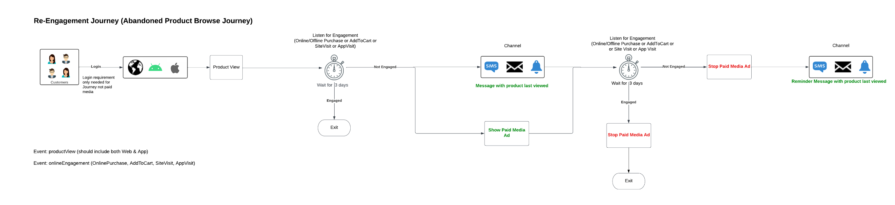
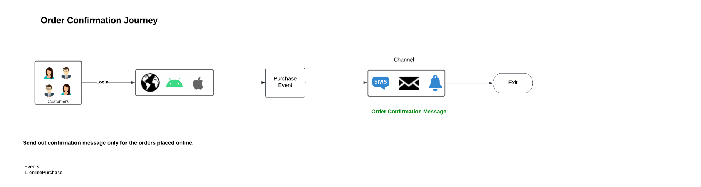

# Intelligently re-engage your customers to return

Intelligent re-engagement allows you to set up a tailored, cross-channel drip campaign to persuade clients to perform a particular action. The nudging campaign is intended to operate for a limited amount of time, which includes sending customers who showed intent emails, SMS, and serving paid ads. Once the customer has taken the appropriate action, the nudge campaign will end right away.

 

## Prerequisites and planning {#prerequisites-and-planning}

As you complete the steps to implement the use case, you will make use of the following Real-Time CDP functionality and UI elements (listed in the order in which you will use them). Make sure that you have the necessary attribute-based access control permissions for all these areas, or ask your system administrator to grant you the necessary permissions.

* [Adobe Real-Time Customer Data Platform (Real-Time CDP)](https://experienceleague.adobe.com/docs/platform-learn/tutorials/rtcdp/understanding-the-real-time-customer-data-platform.html) - Aggregates data across data sources to fuel the campaign. This data is then used to create the campaign audiences and surface personalized data elements used in the email and the web promo tiles (for example, name or account-related information). The CDP is also used to activate audiences across email and the web (via Adobe Target).
    * [Schemas](/help/xdm/home.md)
    * [Profiles](/help/profile/home.md)
    * [Datasets](/help/catalog/datasets/overview.md)
    * [Audiences](/help/segmentation/home.md)
    * [Adobe Journey Optimizer](https://experienceleague.adobe.com/docs/journey-optimizer/using/orchestrate-journeys/journey.html)
    * [Destinations](/help/destinations/home.md)
    * [Event or Audience Trigger](https://experienceleague.adobe.com/docs/journey-optimizer/using/offer-decisioning/collect-event-data/data-collection.html)
    * [Audiences/ Events](https://experienceleague.adobe.com/docs/journey-optimizer/using/audiences-profiles-identities/audiences/about-audiences.html)
    * [Journey Actions](https://experienceleague.adobe.com/docs/journey-optimizer/using/orchestrate-journeys/journey.html)

### How to achieve the use case: high-level overview {#achieve-the-use-case-high-level}

There are currently three different re-engagement journeys that have been developed.

>[!BEGINTABS]

>[!TAB Re-Engagement Journey]

The re-engagement journey targets abandoned product browsing on both the website and app. This journey is triggered when a product has been viewed but not purchased or added to the cart. Brand engagement is triggered after three days if there are no list additions within the last 24 hours.

 

1. Data is aggregated into Web SDK, Mobile SDK, or Edge Network API ingestion via Edge Network (the preferred method).
2. As a **customer**, you create datasets that are marked for [!UICONTROL Profile].
3. As a **customer**, you load profiles into Real-Time CDP and build governance policies to ensure responsible use.
4. As a **customer**, you build focused audiences from the list of profiles to check if a **user** has made a brand engagement in the last three days.
5. As a **customer**, you will create a re-engagement journey in Adobe Journey Optimizer.
6. If needed, work with the **data partner** for the activation of audiences to desired paid-media destinations.
7. Adobe Journey Optimizer checks for consent and sends out the various actions configured.

>[!TAB Abandoned Cart Journey]

The abandoned cart journey targets products that have been placed in the cart but have not yet been purchased on both the website and app. Additionally, Paid Media campaigns are started and stopped using this method.

 

1. Data is aggregated into Web SDK, Mobile SDK, or Edge Network API ingestion via Edge Network (the preferred method).
2. As a **customer**, you create datasets that are marked for [!UICONTROL Profile].
3. As a **customer**, you load profiles into Real-Time CDP and build governance policies to ensure responsible use.
4. As a **customer**, you build focused audiences from the list of profiles to check if a **user** has placed an item in their cart but has not completed the purchase. The **[!UICONTROL Add to cart]** event kicks off a timer that waits for 30 minutes, then checks for purchase. If no purchase has been made, then the **user** is added to the **[!UICONTROL Abandon Cart]** audiences.
5. As a **customer**, you will create an abandoned cart journey in Adobe Journey Optimizer
6. If needed, work with the **data partner** for the activation of audiences to desired paid-media destinations.
7. Adobe Journey Optimizer checks for consent and sends out the various actions configured.

>[!TAB Order Confirmation Journey]

The order confirmation journey focuses on product purchases made through the website and mobile app.

 

1. Data is aggregated into Web SDK, Mobile SDK, or Edge Network API ingestion via Edge Network (the preferred method).
2. As a **customer**, you create datasets that are marked for [!UICONTROL Profile].
3. As a **customer**, you load profiles into Real-Time CDP and build governance policies to ensure responsible use.
4. As a **customer**, you build focused audiences from the list of profiles to check if a **user** has made a purchase.
5. As a **customer**, you will create a confirmation journey in Adobe Journey Optimizer.
6. Adobe Journey Optimizer sends out an order confirmation message using the preferred channel.

>[!ENDTABS]

## How to achieve the use case: Step-by-step instructions {#step-by-step-instructions}

To complete each of the steps in the high-level overviews above, read through the sections below, which offer links to more information and more detailed instructions.

### UI functionality and elements that you will use {#ui-functionality-and-elements}

As you complete the steps to implement the use case, you will make use of the Real-Time CDP functionality and UI elements listed at the beginning of this document. Make sure that you have the necessary attribute-based access control permissions for all these areas, or ask your system administrator to grant you the necessary permissions. 

### Create a schema design and specify field groups

Experience Data Model (XDM) resources are managed in the [!UICONTROL Schemas] workspace in Adobe Experience Platform. You can view and explore core resources provided by Adobe and create custom resources and schemas for your organization.

<!--
To create a schema, complete the steps below:

1. Navigate to **[!UICONTROL Data Management]** > **[!UICONTROL Schemas]** and select **[!UICONTROL Create schema]**.
2. Select **[!UICONTROL XDM Individual Profile]/[!UICONTROL XDM ExperienceEvent]**.
3. Navigate to **[!UICONTROL Field groups]** and select **[!UICONTROL Add]**.
4. Use the search box to find and select the field group, then select **[!UICONTROL Add field groups]**.
5. Give your schema a name and optionally a description.
6. Select **[!UICONTROL Save]**.

 
-->

For more information about creating schemas, read the [create schema tutorial.](/help/xdm/tutorials/create-schema-ui.md) 

There are four schema designs that are used for the re-engagement journey. Each schema requires specific fields to be set up, as well as some fields that are strongly suggested.

#### Customer attributes schema

The customer attributes schema is represented by a [!UICONTROL XDM Individual Profile] class, which includes the following field groups:

+++Personal Contact Details (Field Group)

[Personal Contact Details](/help/xdm/field-groups/profile/personal-contact-details.md) is a standard schema field group for the XDM Individual Profile class which describes the contact information for an individual person.

| Fields | Requirement | Description |
| --- | --- | --- |
| mobilePhone.number | Required | The person's mobile phone number, which will be used for SMS. |
| personalEmail.address | Required | The person's email address. |

+++

+++Demographic Details (Field Group)

[Demographic Details](/help/xdm/field-groups/profile/demographic-details.md) is a standard schema field group for the XDM Individual Profile class. The field group provides a root-level person object, whose sub-fields describe information about an individual person.

| Fields | Requirement |
| --- | --- |
| person.name.firstName| Suggested | 
| person.name.lastName | Suggested |

+++

+++External Source System Audit Details (Field Group)

[External Source System Audit Attributes](/help/xdm/data-types/external-source-system-audit-attributes.md) is a standard Experience Data Model (XDM) data type that captures audit details about an external source system.

+++

+++Consent and Preference Field Groups (Field Group)

[The Consents and Preferences](/help/xdm/field-groups//profile/consents.md) field group provides a single object-type field, consents, to capture consent and preference information.

| Fields | Requirement |
| --- | --- |
| consents.marketing.email.val | Required |
| consents.marketing.preferred | Required |
| consents.marketing.push.val | Required |
| consents.marketing.sms.val | Required |
| consents.personalize.content.val | Required |
| consents.share.val | Required |

+++

+++Profile Test Details (Field Group)

This field group is used for best practice.

+++

<!--
 
-->

#### Customer digital transactions schema

The customer digital transactions schema is represented by a [!UICONTROL XDM ExperienceEvent] class, which includes the following field groups:

+++Adobe Experience Platform Web SDK ExperienceEvent (Field Group)

| Fields | Requirement |
| --- | --- |
| device.model | Suggested |
| environment.browserDetails.userAgent | Suggested |

+++

+++Web Details (Field Group)

Web Details is a standard schema field group for the XDM ExperienceEvent class, used to describe information regarding web details events such as interaction, page details, and referrer.

| Fields | Requirement | Description |
| --- | --- | --- |
| web.webInteraction.linkClicks.id | Suggested | The id for the web link or URL that corresponds to the interaction. |
| web.webInteraction.linkClicks.value | Suggested | The number of clicks for the web link or URL that corresponds to the interaction. |
| web.webInteraction.name | Suggested | The name of the web page. |
| web.webInteraction.URL | Suggested | The URL for the web page. |
| web.webPageDetails.name | Suggested | The name of the web page where the web interaction occurred. |
| web.webPageDetails.URL | Suggested | The URL of the web page where the web interaction occurred. |
| web.webReferrer.URL | Suggested | Describes the referrer of a web interaction, which is the URL a visitor came from immediately before the current web interaction was recorded. |

+++

+++Consumer Experience Event (Field Group)

| Fields | Requirement |
| --- | --- |
| commerce.cart.cartID | Suggested |
| commerce.cart.cartSource | Suggested |
| commerce.cartAbandons.id | Suggested |
| commerce.cartAbandons.value | Suggested |
| commerce.order.orderType | Suggested |
| commerce.order.payments.paymentAmount | Suggested |
| commerce.order.payments.paymentType | Suggested |
| commerce.order.payments.transactionID | Suggested |
| commerce.order.priceTotal | Suggested |
| commerce.order.purchaseID | Suggested |
| commerce.productListAdds.id | Suggested |
| commerce.productListAdds.value | Suggested |
| commerce.productListOpens.id | Suggested |
| commerce.productListOpens.value | Suggested |
| commerce.productListRemoval.id | Suggested |
| commerce.productListRemoval.value | Suggested |
| commerce.productListViews.id | Suggested |
| commerce.productListViews.value | Suggested |
| commerce.productViews.id | Suggested |
| commerce.productViews.value | Suggested |
| commerce.purchases.id | Suggested |
| commerce.purchases.value | Suggested |
| marketing.campaignGroup | Suggested |
| marketing.campaignName | Suggested |
| marketing.trackingCode | Suggested |
| productListItems.name | Suggested |
| productListItems.priceTotal | Suggested |
| productListItems.product | Suggested |
| productListItems.quantity | Suggested |

+++

+++End User ID Details (Field Group)

| Fields | Requirement | Description |
| --- | --- | --- |
| endUserIDs._experience.emailid.authenticatedState | Required | End user email address ID authenticated state. |
| endUserIDs._experience.emailid.id | Required | End user email address ID. |
| endUserIDs._experience.emailid.namespace.code | Required | End user email address ID namespace code. |
| endUserIDs._experience.mcid.authenticatedState | Required | Adobe Marketing Cloud ID (MCID) authenticated state. The MCID is now known as the Experience Cloud ID (ECID). |
| endUserIDs._experience.mcid.id | Required | Adobe Marketing Cloud ID (MCID). The MCID is now known as the Experience Cloud ID (ECID). |
| endUserIDs._experience.mcid.namespace.code | Required | Adobe Marketing Cloud ID (MCID) namespace code. |

+++

+++Class Value (Field Group)

| Fields | Requirement |
| --- | --- |
| eventType | Required |
| timestamp | Required |

+++

+++External Source System Audit Details (Field Group)

External Source System Audit Attributes is a standard Experience Data Model (XDM) data type that captures audit details about an external source system.

+++

<!--
 
-->

#### Customer offline transactions schema

The customer offline transactions schema is represented by a [!UICONTROL XDM ExperienceEvent] class, which includes the following field groups:

+++Commerce Details (Field Group)

| Fields | Requirement | Description |
| --- | --- | --- |
| commerce.cart.cartID | Required | An ID for the shopping cart. |
| commerce.order.orderType | Required | An object that describes product order type. |
| commerce.order.payments.paymentAmount | Required | An object that describes product order payment amount. |
| commerce.order.payments.paymentType | Required | An object that describes product order payment type. |
| commerce.order.payments.transactionID | Required | An object product order transaction ID. |
| commerce.order.purchaseID | Required | An object product order purchase ID. |
| productListItems.name | Required | A list of item names representing the product(s) selected by a customer. |
| productListItems.priceTotal | Required | The total price of list of items representing the product(s) selected by a customer. |
| productListItems.product | Required | The product(s) selected. |
| productListItems.quantity | Required | The quantity of list of items representing the product(s) selected by a customer. |

+++

+++Personal Contact Details (Field Group)

| Fields | Requirement | Description |
| --- | --- | --- |
| mobilePhone.number | Required | The person's mobile phone number, which will be used for SMS. |
| personalEmail.address | Required | The person's email address. |

+++

+++Class Value (Field Group)

| Fields | Requirement |
| --- | --- |
| eventType | Required |
| timestamp | Required |

+++

+++External Source System Audit Details (Field Group) 

External Source System Audit Attributes is a standard Experience Data Model (XDM) data type that captures audit details about an external source system.

+++

<!--
 
-->

#### Adobe web connector schema

The Adobe web connector schema is represented by a [!UICONTROL XDM ExperienceEvent] class, which includes the following field groups:

+++Adobe Analytics ExperienceEvent Template (Field Group)

| Fields | Requirement | Description |
| --- | --- | --- |
| web.webInteraction.linkClicks.id | Suggested | The id for the web link or URL that corresponds to the interaction. |
| web.webInteraction.linkClicks.value | Suggested | The number of clicks for the web link or URL that corresponds to the interaction. |
| web.webInteraction.name | Suggested | The name of the web page. |
| web.webInteraction.URL | Suggested | The URL for the web page. |
| web.webPageDetails.name | Suggested | The name of the web page where the web interaction occurred. |
| web.webPageDetails.URL | Suggested | The URL of the web page where the web interaction occurred. |
| web.webReferrer.URL | Suggested | Describes the referrer of a web interaction, which is the URL a visitor came from immediately before the current web interaction was recorded. |
| commerce.cart.cartID | Suggested | |
| commerce.cart.cartSource | Suggested | |
| commerce.cartAbandons.id | Suggested | |
| commerce.cartAbandons.value | Suggested | |
| commerce.order.orderType | Suggested | |
| commerce.order.payments.paymentAmount | Suggested | |
| commerce.order.payments.paymentType | Suggested | |
| commerce.order.payments.transactionID | Suggested | |
| commerce.order.priceTotal | Suggested | |
| commerce.order.purchaseID | Suggested | |
| commerce.productListAdds.id | Suggested | |
| commerce.productListAdds.value | Suggested | |
| commerce.productListOpens.id | Suggested | |
| commerce.productListOpens.value | Suggested | |
| commerce.productListRemoval.id | Suggested | |
| commerce.productListRemoval.value | Suggested | |
| commerce.productListViews.id | Suggested | |
| commerce.productListViews.value | Suggested | |
| commerce.productViews.id | Suggested | |
| commerce.productViews.value | Suggested | |
| commerce.purchases.id | Suggested | |
| commerce.purchases.value | Suggested | |
| marketing.campaignGroup | Suggested | |
| marketing.campaignName | Suggested | |
| marketing.trackingCode | Suggested | |
| productListItems.name | Suggested | |
| productListItems.priceTotal | Suggested | |
| productListItems.product | Suggested | |
| productListItems.quantity | Suggested | |
| endUserIDs._experience.emailid.authenticatedState | Required | End user email address ID authenticated state. |
| endUserIDs._experience.emailid.id | Required | End user email address ID. |
| endUserIDs._experience.emailid.namespace.code | Required | End user email address ID namespace code. |
| endUserIDs._experience.mcid.authenticatedState | Required | Adobe Marketing Cloud ID (MCID) authenticated state. The MCID is now known as the Experience Cloud ID (ECID). |
| endUserIDs._experience.mcid.id | Required | Adobe Marketing Cloud ID (MCID). The MCID is now known as the Experience Cloud ID (ECID). |
| endUserIDs._experience.mcid.namespace.code | Required | Adobe Marketing Cloud ID (MCID) namespace code. |

+++

+++Class Value (Field Group)

| Fields | Requirement |
| --- | --- |
| eventType | Required |
| timestamp | Required |

+++

+++External Source System Audit Details (Field Group)

External Source System Audit Attributes is a standard Experience Data Model (XDM) data type that captures audit details about an external source system.

+++

<!--
 
-->

### Create a dataset from a schema

A dataset is a storage and management structure for a group of data, often a table with fields (rows) and a schema (columns). Every schema for intelligent re-engagement journeys will have a single dataset. 

For more information on how to create a dataset from a schema, read the [Datasets UI guide](/help/catalog/datasets/user-guide.md).
<!-- 
To create a dataset from a schema, complete the steps below:

1. Navigate to **[!UICONTROL Data Management]** > **[!UICONTROL Datasets]** and select **[!UICONTROL Create dataset]**.
2. Select **[!UICONTROL Create dataset from schema]**.
3. Select the relevant re-engagement schema you created.
4. Give your dataset a name and optionally a description.
5. Select **[!UICONTROL Finish]**.

-->

>[!NOTE] 
>
>Similar to the step to create a schema, you need to enable the dataset to be included in the Real-Time Customer Profile. For more information about enabling the dataset for use in Real-Time Customer Profile, read the [create schema tutorial.](/help/xdm/tutorials/create-schema-ui.md#profile).

<!-- 

-->

### Privacy, consent and data governance

#### Consent policies

>[!IMPORTANT]
>
>Providing customers with the capability to unsubscribe from receiving communications from a brand is a legal requirement, as well as ensuring this choice is honored. Learn more about the applicable legislation in the [Experience Platform documentation](https://experienceleague.adobe.com/docs/experience-platform/privacy/regulations/overview.html).

When creating a re-engagement path, the following consent policies must be considered and used:

* If consents.marketing.email.val = "Y" then Can Email
* If consents.marketing.sms.val = "Y" then Can SMS
* If consents.marketing.push.val = "Y" then Can Push
* If consents.share.val = "Y" then Can Advertise
* Need defined by Customer Implementation

#### DULE label and enforcement

Personal email addresses are utilized as direct identifiable data that is used for identifying or getting in touch with a specific individual rather than a device.

* personalEmail.address = I1

#### Marketing policies

There are no additional marketing policies required for the re-engagement journeys however, the following should be considered as desired:

* Restrict Sensitive Data
* Restrict Onsite Advertising
* Restrict Email Targeting
* Restrict cross site Targeting
* Restrict combining directly identifiable data with anonymous data

### Create an audience

<!--
To create an audience, complete the steps below:

1. Navigate to **[!UICONTROL Customer]** > **[!UICONTROL Audiences]** and select **[!UICONTROL Create audience]**.
2. Select **[!UICONTROL Build rule]** and select **[!UICONTROL Create]**.
3. Navigate to **[!UICONTROL Field]** and select **[!UICONTROL Events]** tab.
4. Navigate or use the search box to find the event type, then drag this to the builder. Finally add event rules by dragging event types.
5. Give your schema a name and optionally a description.
6. Select **[!UICONTROL Save]**.

-->

#### Audience creation for brand re-engagement journeys

The re-engagement journeys use audiences to define specific attributes or behaviors shared by a subset of profiles from your profile store to distinguish a marketable group of people from your customer base. Audiences can be created in two different ways on Adobe Experience Platform - either directly composed as audiences or through Platform-derived segment definitions.

For more information on how to directly compose audiences, read the [Audience Composition UI guide](/help/segmentation/ui/audience-composition.md).

For more information on how to build audiences through Platform-derived segment definitions, read the [Audience Builder UI guide](/help/segmentation/ui/segment-builder.md).

>[!BEGINTABS]

>[!TAB Re-Engagement Journey]

The following events are used for the re-engagement journey where users viewed products online, and did not add to cart in the next 24 hours, followed by no brand engagement in the 3 days following.

Include audience who have at least 1 EventType = ProductViews event THEN have at least 1 Any event where (EventType does not equal commerce.productListAdds) and occurs in last 24 hour(s) then after 3 days do not have any Any event where (EventType = application.launch or web.webpagedetails.pageViews or commerce.purchases) and occurs in last 2 day(s).

<!--
 
-->

>[!TAB Abandoned Cart Journey]

The following events are used for profiles that added a product to their cart, but did not complete the purchase or clear their cart in the last 24 hours.

Include EventType = commerce.productListAdds between 30 min and 1440 minutes before now.
exclude EventType = commerce.purchases 30 minutes before now OR EventType = commerce.productListRemovals AND Cart ID equals Product List Adds1 Cart ID (the inclusion event).

<!--
 
-->

>[!ENDTABS]

### Journey setup in Adobe Journey Optimizer

>[!NOTE]
>
>Adobe Journey Optimizer does not encompass everything shown in the diagrams at the top of this page. All paid media ads are created in [!UICONTROL Destinations].

Adobe Journey Optimizer helps you deliver connected, contextual, and personalized experiences to your customers. The customer journey is the entire process of a customer's interactions with the brand. Each use case can have a variety of different journeys, each requiring specific information. Listed below is the precise data needed for each Journey branch.

>[!BEGINTABS]

>[!TAB Re-Engagement Journey]

<!--
 
-->

+++Events

* Product Views
    * Schema: Customer Digital Transactions
    * Fields:
        * EventType
    * Condition: 
        * EventType = commerce.productViews
        * Fields:
            * Commerce.productViews.id
            * Commerce.productViews.value
            * eventType
            * identityMap.authenticatedState
            * identityMap.id
            * identityMap.primary
            * productListItems.SKU
            * productListItems.currencyCode
            * productListItems.name
            * productListItems.priceTotal
            * productListItems.product
            * productListItems.productImageUrl
            * productListItems.quantity
            * timestamp
            * endUserIDs._experience.emailid.authenticatedState
            * endUserIDs._experience.emailid.id
            * endUserIDs._experience.emailid.namespace.code
            * _id

* Add to Cart
    * Schema: Customer Digital Transactions
    * Fields:
        * Event Type
    * Condition:
        * Event Type = commerce.productListAdds
        * Fields:
            * Commerce.productListAdds.id
            * Commerce.productListAdds.value
            * eventType
            * identityMap.authenticatedState
            * identityMap.id
            * identityMap.primary
            * productListItems.SKU
            * productListItems.currencyCode
            * productListItems.name
            * productListItems.priceTotal
            * productListItems.product
            * productListItems.productImageUrl
            * productListItems.quantity
            * timestamp
            * commerce.cart.cartID
            * endUserIDs._experience.emailid.authenticatedState
            * endUserIDs._experience.emailid.id
            * endUserIDs._experience.emailid.namespace.code
            * _id

* Brand Engagement
    * Schema: Customer Digital Transactions
    * Fields:
        * EventType
    * Condition: 
        * EventType in application.launch, commerce.purchases, web.webpagedetails.pageViews
        * Fields:
            * eventType
            * identityMap.authenticatedState
            * identityMap.id
            * identityMap.primary
            * productListItems.SKU
            * productListItems.currencyCode
            * productListItems.name
            * productListItems.priceTotal
            * productListItems.product
            * productListItems.productImageUrl
            * productListItems.quantity
            * timestamp
            * web.webpagedetails.URL
            * web.webpagedetails.isHomePage
            * web.webpagedetails.name
            * endUserIDs._experience.emailid.authenticatedState
            * endUserIDs._experience.emailid.id
            * endUserIDs._experience.emailid.namespace.code
            * _id
            * Commerce.purchases.id
            * Commerce.purchases.value
            * shipping.address.city
            * shipping.address.countryCode
            * shipping.address.postalCode
            * shipping.address.state
            * shipping.address.street1
            * shipping.address.street2
            * shipping.shipDate
            * shipping.trackingNumber
            * shipping.trackingURL

+++

+++Key Journey logic

* Journey Entry Logic
    * Product View Event

* Conditions 
    * Check for at least one online or offline purchase event since the product was last viewed.
        * Schema: Customer Digital Transactions
        * eventType = commerce.purchases 
        * timestamp > timestamp of product last viewed
    
    * Check for at least one offline purchase since product last viewed: 
        * Schema: Customer Offline Transactions v.1
        * eventType = commerce.purchases 
        * timestamp > timestamp of product last viewed

    * Conditions - Select the Target channel
        * Email
            * consents.marketing.email.val = y 
        * Push 
            * consents.marketing.push.val=y
        * SMS
            * consents.marketing.sms.val = y

    * Channel Personalization
        * Personalized channel content based on product view.

+++

>[!TAB Abandoned Cart Journey]

<!--
 
-->

+++Events

* Add to Cart
    * Schema: Customer Digital Transactions
    * Fields:
        * Event Type
    * Condition:
        * Event Type = commerce.productListAdds
        * Fields:
            * Commerce.productListAdds.id
            * Commerce.productListAdds.value
            * eventType
            * identityMap.authenticatedState
            * identityMap.id
            * identityMap.primary
            * productListItems.SKU
            * productListItems.currencyCode
            * productListItems.name
            * productListItems.priceTotal
            * productListItems.product
            * productListItems.productImageUrl
            * productListItems.quantity
            * timestamp
            * commerce.cart.cartID
            * endUserIDs._experience.emailid.authenticatedState
            * endUserIDs._experience.emailid.id
            * endUserIDs._experience.emailid.namespace.code
            * _id

* Online Purchases
    * Schema: Customer Digital Transactions
    * Fields:
        * Event Type
    * Condition:
        * Event Type = commerce.purchases
        * Fields: 
            * Commerce.purchases.id
            * Commerce.purchases.value
            * eventType
            * identityMap.authenticatedState
            * identityMap.id
            * identityMap.primary
            * productListItems.SKU
            * productListItems.currencyCode
            * productListItems.name
            * productListItems.priceTotal
            * productListItems.product
            * productListItems.productImageUrl
            * productListItems.quantity
            * timestamp
            * endUserIDs._experience.emailid.authenticatedState
            * endUserIDs._experience.emailid.id
            * endUserIDs._experience.emailid.namespace.code
            * _id

* Brand Engagement
    * Schema: Customer Digital Transactions
    * Fields:
        * EventType
    * Condition:
        * EventType in application.launch, commerce.purchases, web.webpagedetails.pageViews
        * Fields:
            * eventType
            * identityMap.authenticatedState
            * identityMap.id
            * identityMap.primary
            * productListItems.SKU
            * productListItems.currencyCode
            * productListItems.name
            * productListItems.priceTotal
            * productListItems.product
            * productListItems.productImageUrl
            * productListItems.quantity
            * timestamp
            * web.webpagedetails.URL
            * web.webpagedetails.isHomePage
            * web.webpagedetails.name
            * endUserIDs._experience.emailid.authenticatedState
            * endUserIDs._experience.emailid.id
            * endUserIDs._experience.emailid.namespace.code
            * _id
            * Commerce.purchases.id
            * Commerce.purchases.value
            * shipping.address.city
            * shipping.address.countryCode
            * shipping.address.postalCode
            * shipping.address.state
            * shipping.address.street1
            * shipping.address.street2
            * shipping.shipDate
            * shipping.trackingNumber
            * shipping.trackingURL

+++

+++Key Journey Logic 

* Journey Entry Logic
    * AddToCart Event

* AuthenticatedState in authenticated

* Condition: Offline purchases since the cart was last abandoned: 
    * Schema: Customer Offline Transactions v.1
    * eventType = commerce.purchases 
    * timestamp > timestamp of cart was last abandoned

* Condition: Cart cleared since the cart was last abandoned:
    * Schema: Customer Digital Transactions v.1
    * eventType = commerce.cartCleared
    * cartID (ID of the cart)
    * timestamp > timestamp of cart was last abandoned

* Select Target Channel (Select one or multiple channels for wider reach)
    * Email
        * consents.marketing.email.val = y
    * Push
        * consents.marketing.push.val = y
    * SMS
        * consents.marketing.sms.val = y
    * Channel Personalization
        * Display cart detail information and can display multiple products in a table format.

+++

>[!TAB Order Confirmation Journey]

<!--
 
-->

+++Events

* Online Purchases
    * Schema: Customer Digital Transactions
    * Fields:
        * EventType
    * Condition: 
        * Event Type = commerce.purchases
        * Fields: 
            * Commerce.purchases.id
            * Commerce.purchases.value
            * eventType
            * identityMap.authenticatedState
            * identityMap.id
            * identityMap.primary
            * productListItems.SKU
            * productListItems.currencyCode
            * productListItems.name
            * productListItems.priceTotal
            * productListItems.product
            * productListItems.productImageUrl
            * productListItems.quantity
            * timestamp
            * endUserIDs._experience.emailid.authenticatedState
            * endUserIDs._experience.emailid.id
            * endUserIDs._experience.emailid.namespace.code
            * _id

+++

+++Key Journey logic

* Journey Entry Logic
    * Order Event

* Conditions 
    * Select Target Channel (Select one, or multiple channels for wider reach).
        * Order confirmation is considered serving in nature, so consent checking is usually unnecessary.
        * Email
        * Push
        * SMS

    * Channel Content Personalization
        * Display order details information and can display a list of products using a table format. 

+++

>[!ENDTABS]

For more information about creating journeys in [Adobe Journey Optimizer], read the [Get started with journeys guide](https://experienceleague.adobe.com/docs/journey-optimizer/using/orchestrate-journeys/journey.html).

### Setting up paid media ads in Destinations

The destinations framework is used for paid media ads. Once consent has been checked it will send out to the various destinations configured. For example direct mail, email, and so on.

#### Data required for destinations

Streaming segment export destinations (such as Facebook, Google Customer Match, Google DV360) support various identities from customer data: 

* `personalEmail.address`
* `ECID`
* `mobilePhone.number`

The Abandon Cart Segment is streaming and therefore can be used by the Destination framework for this use case.

* Stream/Triggered
    * [Advertising](/help/destinations/catalog/advertising/overview.md)/[Paid Media & Social](/help/destinations/catalog/social/overview.md)
    * [Mobile](/help/destinations/catalog/mobile-engagement/overview.md)
    * [Streaming Destination](/help/destinations/catalog/streaming/http-destination.md)
    * [Custom Destination SDK](/help/destinations/destination-sdk/overview.md)

* File/Scheduled every three hours
    * [Email Marketing](/help/destinations/catalog/email-marketing/overview.md)
