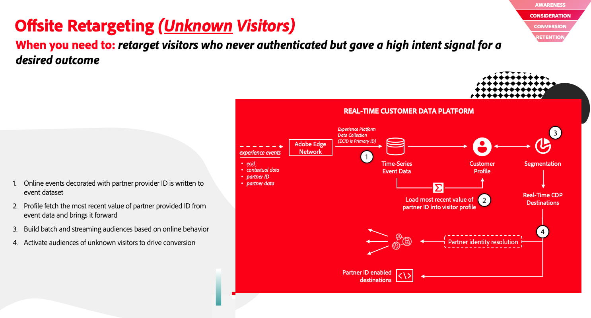

# Sample use cases in Real-Time CDP

View sample cross-service use cases to make the most of your Real-Time CDP implementation. This page captures some use cases made possible by using various Adobe Experience Platform services.

>[!IMPORTANT]
>
>The use cases presented on this page are a subset of the enterprise use cases that you can accomplish with Real-Time CDP. We are working on adding documentation for more sample use cases. In the mean time, reach out to your Adobe representative to explore more use cases in addition to the ones currently documented on the page.

## Partner data support {#partner-data-support}

With third-party cookies set to disappear within the next few years, partner data support can fill the void left by third-party cookie deprecation.

Adobe Real-Time CDP provides extensive support for partner identifiers, allowing you to create audiences of prospects, enrich known audiences with attributes from partners, and much more.

The sample use cases can be grouped into customer acquisition and profile enrichment cases. Visit the documentation links below for extensive implementation information. 

### Customer acquisition {#customer-acquisition}

<table style="margin-top: 0 !important">
<tr>
  <td>
    
    

      <a href="../partner-data/prospecting.md">
    <strong>New customer acquisition</strong>
    </a>
    

    

    <em>Engage and acquire new customers without dependency on third-party cookies</em>
    

  </td>
  <td>
    
    

      <a href="../partner-data/onsite-personalization.md">
    <strong>Onsite personalization</strong>
    </a>
    

    

    <em>Personalize onsite experiences for unknown visitors using partner-aided visitor recognition</em>
    

  </td>
  <td>
    
    

      <a href="../partner-data/offsite-retargeting.md">
    <strong>Offsite Retargeting of Unauthenticated Visitors</strong>
    </a>
    

    

    <em>Learn how to build an audience of unauthenticated visitors and retarget them using partner provided durable IDs.</em>
    

  </td>
  </tr>
  </table>

### Profile enrichment {#profile-enrichment}

<table style="margin-top: 0 !important">
<tr>
  <td>
    
    

      <a href="../partner-data/supplement-first-party-profiles.md">
    <strong>Supplement first-party profiles with partner-provided attributes</strong>
    </a>
    

    

    <em>Supplement first-party profiles with attributes from trusted data partners to improve your data foundation, gain new insights into your customer base, and better audience optimization.</em>
    

  </td>
  </tr>
  </table>

## Personalization, insights, engagement {#personalization-insights-engagement}

<table style="margin-top: 0 !important">
<tr>
  <td>
    
    

      <a href="../partner-data/prospecting.md">
    <strong>Intelligent re-engagement</strong>
    </a>
    

    

    <em>Re-engage customers who have abandoned a conversion in an intelligent and responsible way. Engage lapsed customers with experiences to increase conversion and increase the client lifetime value.</em>
    

  </td>
  </tr>
  </table>
