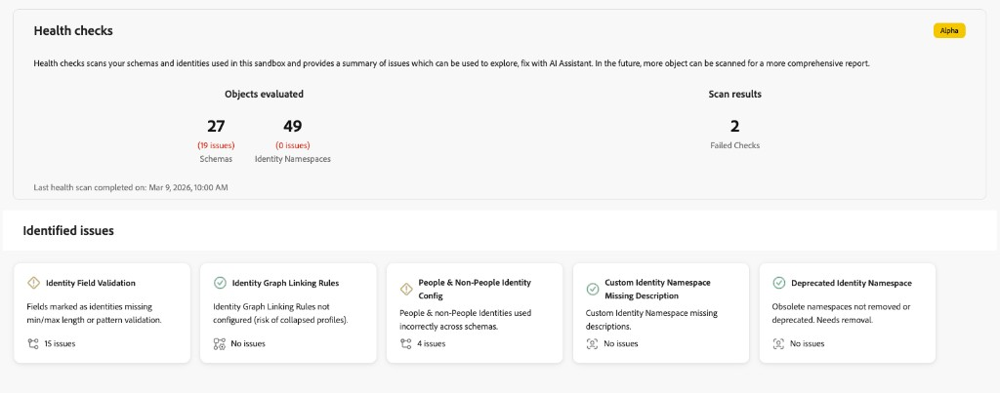
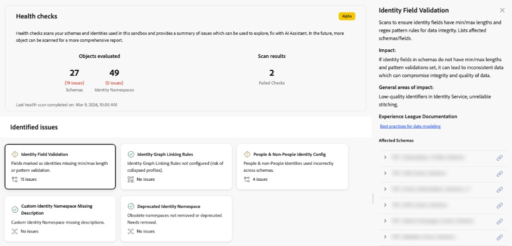
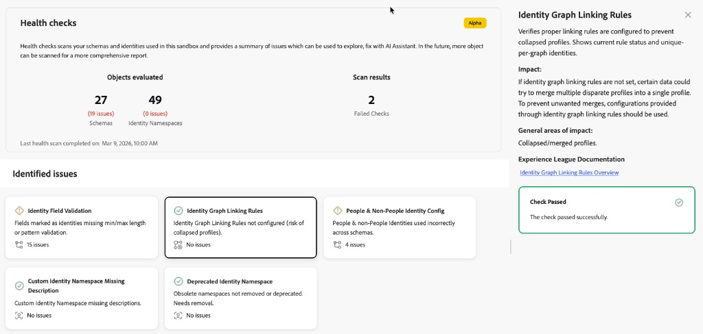
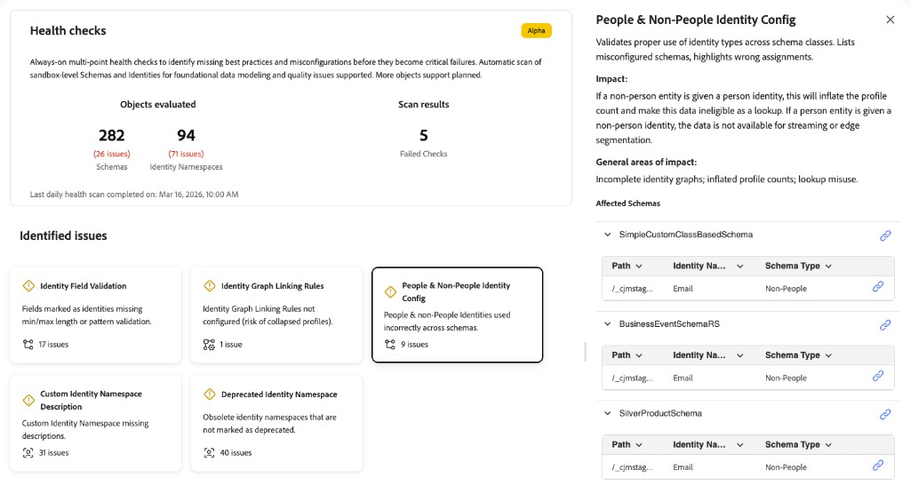
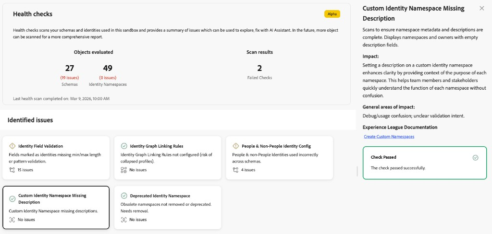
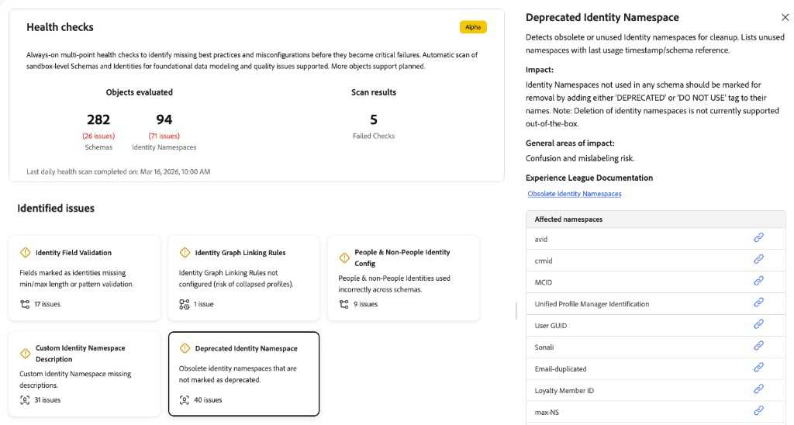
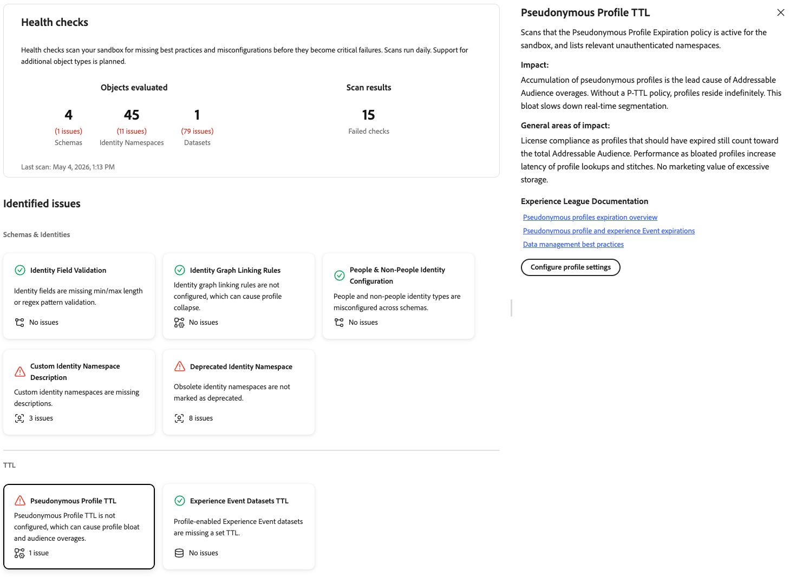
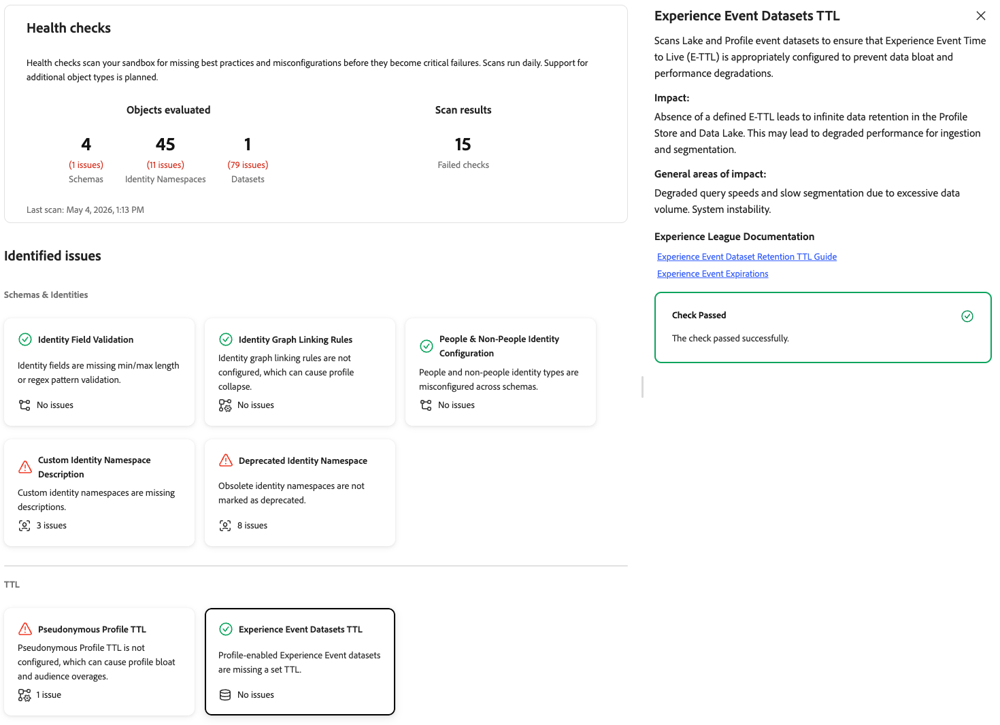

# Health Checks

Health checks scan your schemas, identities, and datasets in your sandbox and provide a summary of issues that you can explore and troubleshoot with AI Assistant.

Poor schema and identity configurations lead to significant downstream issues, including incorrect profile creation, failed segment qualification, and inaccurate activation. These issues are difficult to detect and often require specialized expertise to diagnose. Health checks shift your approach from reactive troubleshooting to proactive, preventative maintenance.

With health checks, you can:

* **Detect configuration issues early**: Identify missing best practices, misconfigurations, and patterns that lead to inefficiencies in personalization, activation, and more.
* **Receive guided remediation**: Get clear guidance on what each issue is and what to do about it.
* **Monitor continuously**: Currently, health checks run daily automatic scans so that you can catch problems before they become critical failures. The schedule may change in future releases.

## Prerequisites {#prerequisites}

To access health checks, you need the **[!UICONTROL View Health Checks]** [access control permission](/help/access-control/home.md#permissions). Contact your system administrator to ensure you have the appropriate permissions.

## Access health checks {#access-health-checks}

To access health checks from the [!UICONTROL Experience Platform] UI:

1. Select **[!UICONTROL Run and Operate]** from the left navigation.
1. Select **[!UICONTROL Health Checks]**.

The health checks dashboard displays a summary of your most recent scan results.

## Understanding the dashboard {#understanding-dashboard}

The health checks dashboard provides three areas of information to help you assess the state of your implementation.

### Objects evaluated {#objects-evaluated}

The **[!UICONTROL Objects evaluated]** section shows the total number of schemas, identity namespaces, and datasets scanned, along with how many issues were found for each category. This gives you a quick view of the scope and severity of configuration problems in your sandbox.

### Scan results {#scan-results}

The **[!UICONTROL Scan results]** section displays the number of failed checks. A failed check indicates that one or more of the health checks detected configuration issues that require attention. The **Last daily health scan completed on** timestamp shows when the most recent scan ran.

### Identified issues {#identified-issues}

The **[!UICONTROL Identified issues]** section shows a card for each health check. Each card displays:

* The health check name and a brief description of the issue.
* The number of issues found, or a confirmation that no issues exist.
* A status indicator showing whether the check passed or requires attention.

Select any card to explore the details of that health check.

## Available health checks {#available-health-checks}

Health checks currently evaluate seven areas across schema, identity, and dataset configuration. The following table lists all available checks.

| Check | Object type |
| --- | --- |
| [Identity field validation](#identity-field-validation) | Schema |
| [Identity graph linking rules](#identity-graph-linking-rules) | Identity |
| [People and non-people identity configuration](#people-non-people-identity) | Schema, identity |
| [Custom identity namespace description](#namespace-missing-description) | Identity |
| [Deprecated identity namespace](#deprecated-namespace) | Identity |
| [Pseudonymous profile TTL](#pseudonymous-profile-ttl) | Profile |
| [Experience Event datasets TTL](#experience-event-datasets-ttl) | Dataset |

These checks target the most impactful data modeling and data lifecycle issues across the platform.

### Identity field validation {#identity-field-validation}

Scans to ensure identity fields have minimum and maximum length constraints and regex pattern rules for data integrity.

| Detail | Description |
| --- | --- |
| **Issue** | Fields marked as identities are missing minimum/maximum length or pattern validation. |
| **Impact** | Without validation, garbage values can enter [!DNL Identity Service]. Values such as "0", "Guest", or mismatched casing (for example, "xyz123" versus "XYZ123") compromise the integrity of the profile that is assembled during segmentation and activation. |
| **Remediation** | Set minimum/maximum length and pattern constraints on custom fields marked as identities. Use regular expressions to enforce rules such as digits only, uppercase or lowercase, or specific character combinations. |

When you select the **[!UICONTROL Identity Field Validation]** card, a detail panel opens on the right. The panel shows:

* **[!UICONTROL Description]**: Scans to ensure identity fields have min/max lengths and regex pattern rules for data integrity. Lists affected schemas and fields.
* **[!UICONTROL Impact]**: If identity fields in schemas do not have min/max lengths and pattern validations set, it can lead to inconsistent data, which can compromise integrity and quality of data.
* **[!UICONTROL General areas of impact]**: Low-quality identifiers in [!DNL Identity Service]; unreliable stitching.
* **[!UICONTROL Experience League Documentation]**: A link to best practices for data modeling.
* **[!UICONTROL Affected Schemas]**: A list of affected schemas, each with an expander to view more details and a link to open the schema.

For more information, see the [data integrity tips](/help/xdm/schema/best-practices.md#data-integrity-tips) in the schema best practices documentation.

### Identity graph linking rules {#identity-graph-linking-rules}

Verifies that identity graph linking rules are configured for a sandbox to prevent collapsed profiles.

| Detail | Description |
| --- | --- |
| **Issue** | Identity graph linking rules are not configured for this sandbox. |
| **Impact** | Without linking rules, multiple disparate profiles can merge into a single profile (graph collapse). Certain data from shared devices or non-unique identities can trigger unwanted merges, which leads to inaccurate personalization. |
| **Remediation** | Navigate to the **[!UICONTROL Identities]** menu, select **[!UICONTROL Settings]**, and select at least one unique-per-graph identity. This enables identity graph linking rules and prevents profile collapse. |

When you select the **[!UICONTROL Identity Graph Linking Rules]** card, a detail panel opens on the right. The panel shows:

* **[!UICONTROL Description]**: Verifies that proper linking rules are configured to prevent collapsed profiles. It shows current rule status and unique-per-graph identities.
* **[!UICONTROL Impact]**: If identity graph linking rules are not set, certain data could try to merge multiple disparate profiles into a single profile. To prevent unwanted merges, configurations provided through identity graph linking rules should be used.
* **[!UICONTROL General areas of impact]**: Collapsed or merged profiles.
* **[!UICONTROL Experience League Documentation]**: A link to the Identity Graph Linking Rules overview for more information.
* **[!UICONTROL Configure linking rules]**: When the check fails, a button appears so you can configure linking rules directly from the panel.

For more information, see the [identity graph linking rules overview](/help/identity-service/identity-graph-linking-rules/overview.md) and the [implementation guide](/help/identity-service/identity-graph-linking-rules/implementation-guide.md).

### People and non-people identity configuration {#people-non-people-identity}

Validates the correct use of people and non-people identity types across schema classes.

| Detail | Description |
| --- | --- |
| **Issue** | Non-people identifiers are used on Individual Profile or Experience Event class schemas, or people identifiers are used on lookup schemas. |
| **Impact** | Non-people identifiers on profile schemas do not participate in the identity graph, which leads to incomplete identity resolution. People identifiers on lookup schemas inflate the profile count and make the data ineligible for lookup use cases. Both cases risk future product enhancements breaking your implementation. |
| **Remediation** | Review flagged schemas and correct the identity type assignments. Remove non-people identifiers from Individual Profile schemas when possible. For schemas already in use by datasets, refer to the [schema evolution rules](/help/xdm/schema/composition.md#evolution). |

When you select the **[!UICONTROL People & Non-People Identity Config]** card, a detail panel opens on the right. The panel shows:

* **[!UICONTROL Description]**: Validates proper use of identity types across schema classes. Lists misconfigured schemas and highlights wrong assignments.
* **[!UICONTROL Impact]**: If a non-people entity is given a person identity, this will inflate the profile count and make this data ineligible as a lookup. If a person entity is given a non-people identity, the data is not available for streaming or edge segmentation.
* **[!UICONTROL General areas of impact]**: Incomplete identity graphs; inflated profile counts; lookup misuse.
* **[!UICONTROL Affected Schemas]**: A list of schemas with issues. Expand a schema row to see the path, identity name, and schema type for each misconfiguration. Use the link icon to open the schema.

For more information, see the [identity type documentation](/help/identity-service/features/namespaces.md#identity-type) and the [schema best practices](/help/xdm/schema/best-practices.md).

### Custom identity namespace description {#namespace-missing-description}

Scans to ensure that custom identity namespace metadata and descriptions are complete.

| Detail | Description |
| --- | --- |
| **Issue** | Custom identity namespaces are missing their description field. |
| **Impact** | Missing descriptions can lead to confusion during usage and debugging. |
| **Remediation** | Document each custom namespace by filling in the description field. Include validation criteria (minimum/maximum length, pattern) and lifecycle information that identifies which external source system creates these identities. |

When you select the **[!UICONTROL Custom Identity Namespace Description]** card, a detail panel opens on the right. The panel shows:

* **[!UICONTROL Description]**: Scans to ensure namespace metadata and descriptions are complete. Displays namespaces and owners with empty description fields.
* **[!UICONTROL Impact]**: Setting a description on a custom identity namespace enhances clarity by providing context of the purpose of each namespace. This helps team members and stakeholders quickly understand the function of each namespace without confusion.
* **[!UICONTROL General areas of impact]**: Debug or usage confusion; unclear validation intent.
* **[!UICONTROL Experience League Documentation]**: A link to Create Custom Namespaces for further information.
* **[!UICONTROL Affected namespaces]**: A list of custom identity namespaces that are missing descriptions. Use the link icon next to each namespace to view or edit it.

For more information, see the documentation on [creating custom namespaces](/help/identity-service/features/namespaces.md#create-namespaces).

### Deprecated identity namespace {#deprecated-namespace}

Detects obsolete or unused identity namespaces that should be marked for cleanup.

| Detail | Description |
| --- | --- |
| **Issue** | Obsolete identity namespaces are not marked as deprecated. |
| **Impact** | Unused or obsolete namespaces create confusion about what is actively in use and increase the risk of mislabeling identity fields. |
| **Remediation** | Rename unused namespaces to include a "Do not use" prefix (for example, "Do not use - [original name]"). Adobe Experience Platform does not currently support namespace deletion, so renaming is the recommended approach. |

When you select the **[!UICONTROL Deprecated Identity Namespace]** card, a detail panel opens on the right. The panel shows:

* **[!UICONTROL Description]**: Detects obsolete or unused identity namespaces for cleanup. Lists unused namespaces with last usage timestamp or schema reference.
* **[!UICONTROL Impact]**: Identity namespaces not used in any schema should be marked for removal by adding a "DEPRECATED" or "DO NOT USE" tag to their names. Deletion of identity namespaces is not currently supported.
* **[!UICONTROL General areas of impact]**: Confusion and mislabeling risk.
* **[!UICONTROL Experience League Documentation]**: A link to Obsolete Identity Namespaces for further documentation.
* **[!UICONTROL Affected namespaces]**: A list of obsolete or unused identity namespaces. Use the link icon next to each namespace to view or manage it.

For more information, see the [Experience Cloud knowledge base article on obsolete namespaces](https://experienceleague.adobe.com/en/docs/experience-cloud-kcs/kbarticles/ka-18155){target="_blank"}.

### Pseudonymous profile TTL {#pseudonymous-profile-ttl}

Scans that the Pseudonymous Profile Expiration policy is active for the sandbox and lists relevant unauthenticated namespaces.

| Detail | Description |
| --- | --- |
| **Issue** | The Pseudonymous Profile Expiration policy is not active for this sandbox. |
| **Impact** | Without an expiration policy, pseudonymous profiles accumulate indefinitely. This is the leading cause of Addressable Audience overages and slows real-time segmentation. |
| **Remediation** | Activate the Pseudonymous Profile Expiration policy for your sandbox and set an expiration window appropriate for your use case. |

When you select the **[!UICONTROL Pseudonymous Profile TTL]** card, a detail panel opens on the right. The panel shows:

* **[!UICONTROL Description]**: Scans that the Pseudonymous Profile Expiration policy is active for the sandbox and lists relevant unauthenticated namespaces.
* **[!UICONTROL Impact]**: Accumulation of pseudonymous profiles is the lead cause of Addressable Audience overages. Without a P-TTL policy, profiles reside indefinitely. This bloat slows real-time segmentation.
* **[!UICONTROL General areas of impact]**: License compliance, as profiles that should have expired still count toward the total Addressable Audience. Performance, as bloated profiles increase the latency of profile lookups. No marketing value of excessive storage.
* **[!UICONTROL Experience League Documentation]**: Links to pseudonymous profile expiration documentation and data management best practices.
* **[!UICONTROL Configure profile settings]**: A button to navigate to profile settings and activate the expiration policy.

For more information, see the documentation on [pseudonymous profile expiration](/help/profile/pseudonymous-profiles.md) and [data management best practices](/help/landing/license-usage-and-guardrails/data-management-best-practices.md).

### Experience Event datasets TTL {#experience-event-datasets-ttl}

Scans Lake and Profile event datasets to ensure that data expiration is appropriately configured.

| Detail | Description |
| --- | --- |
| **Issue** | Profile-enabled Experience Event datasets are missing a configured data expiration. |
| **Impact** | Without a defined expiration policy, data is retained indefinitely in the Profile Store and Data Lake. This leads to degraded performance for ingestion and segmentation, and can impact [!DNL Adobe Journey Optimizer] performance, including audience qualification and journey execution. |
| **Remediation** | Set a data expiration on your Experience Event datasets. Align the expiration window with your segmentation lookback windows and follow standard retention best practices for your use case. |

When you select the **[!UICONTROL Experience Event Datasets TTL]** card, a detail panel opens on the right. The panel shows:

* **[!UICONTROL Description]**: Scans Lake and Profile event datasets to ensure that Experience Event Time to Live (E-TTL) is appropriately configured to prevent data bloat and performance degradations.
* **[!UICONTROL Impact]**: Absence of a defined E-TTL leads to infinite data retention in the Profile Store and Data Lake. This may lead to degraded performance for ingestion and segmentation, and can impact [!DNL Adobe Journey Optimizer] performance, including audience qualification and journey execution.
* **[!UICONTROL General areas of impact]**: Degraded query speeds and slow segmentation due to excessive data volume. System instability.
* **[!UICONTROL Experience League Documentation]**: A link to Experience Event dataset retention documentation.
* **[!UICONTROL Affected datasets]**: A list of Lake and Profile event datasets without a configured data expiration. Select a dataset to open it. When no issues are detected, the panel shows a **[!UICONTROL Check Passed]** confirmation instead.

For more information, see the documentation on [Experience Event dataset retention](/help/catalog/datasets/experience-event-dataset-retention-ttl-guide.md) and [Experience Event expirations](/help/profile/event-expirations.md).

## Next steps {#next-steps}

After reviewing your health check results, explore the following resources to deepen your understanding:

* Learn about [schema best practices](/help/xdm/schema/best-practices.md) for designing reliable data models.
* Understand [identity graph linking rules](/help/identity-service/identity-graph-linking-rules/overview.md) to prevent profile collapse.
* Review [identity namespace documentation](/help/identity-service/features/namespaces.md) for namespace management best practices.
* Configure [pseudonymous profile expiration](/help/profile/pseudonymous-profiles.md) to manage data retention and reduce Addressable Audience overages.
* Set up [Experience Event dataset retention](/help/catalog/datasets/experience-event-dataset-retention-ttl-guide.md) to prevent data bloat and performance degradation.
* Explore other [Run and Operate tools](/help/run-and-operate/overview.md) including [[!UICONTROL Job Schedules]](/help/run-and-operate/job-schedules.md) for batch operation visibility.
