# Health Checks

Health checks scan your schemas, identities, and datasets in your sandbox and provide a summary of issues that you can explore and troubleshoot with AI Assistant.

Poor schema and identity configurations lead to significant downstream issues, including incorrect profile creation, failed audience qualification, and inaccurate activation. These issues are difficult to detect and often require specialized expertise to diagnose. Health checks shift your approach from reactive troubleshooting to proactive, preventative maintenance.

With health checks, you can:

* **Detect configuration issues early**: Identify missing best practices, misconfigurations, and patterns that lead to inefficiencies in personalization, activation, and more.
* **Receive guided remediation**: Get clear guidance on what each issue is and what to do about it.
* **Monitor continuously**: Currently, health checks run daily automatic scans so that you can catch problems before they become critical failures. The schedule may change in future releases.

## Prerequisites {#prerequisites}

To access health checks, you need the **[!UICONTROL View Health Checks]** [access control permission](/help/access-control/home.md#permissions). Contact your system administrator to ensure you have the appropriate permissions.

## Access health checks {#access-health-checks}

To access health checks from the [!UICONTROL Experience Platform] UI:

1. Select **[!UICONTROL Run and Operate]** from the left navigation.
1. Select **[!UICONTROL Health Checks]**.

The health checks dashboard displays a summary of your most recent scan results.

## Understanding the dashboard {#understanding-dashboard}

The health checks dashboard provides three areas of information to help you assess the state of your implementation.

### Objects evaluated {#objects-evaluated}

The **[!UICONTROL Objects evaluated]** section shows the total number of schemas, identity namespaces, and datasets scanned, along with how many issues were found for each category. This gives you a quick view of the scope and severity of configuration problems in your sandbox.

### Scan results {#scan-results}

The **[!UICONTROL Scan results]** section displays the number of failed checks. A failed check indicates that one or more of the health checks detected configuration issues that require attention. The **Last daily health scan completed on** timestamp shows when the most recent scan ran.

### Identified issues {#identified-issues}

The **[!UICONTROL Identified issues]** section shows a card for each health check. Each card displays:

* The health check name and a brief description of the issue.
* The number of issues found, or a confirmation that no issues exist.
* A status indicator showing whether the check passed or requires attention.

Select any card to explore the details of that health check.

## Available health checks {#available-health-checks}

Health checks currently evaluate checks across eight categories: schemas and identities, TTL, segmentation, ingestion, datasets, destinations, merge policies, and query service. The following table lists all available checks.

| Check | Category | Object type |
| --- | --- | --- |
| [Identity field validation](#identity-field-validation) | Schemas and identities | Schema |
| [Identity graph linking rules](#identity-graph-linking-rules) | Schemas and identities | Identity |
| [People and non-people identity configuration](#people-non-people-identity) | Schemas and identities | Schema, identity |
| [Custom identity namespace description](#namespace-missing-description) | Schemas and identities | Identity |
| [Deprecated identity namespace](#deprecated-namespace) | Schemas and identities | Identity |
| [Non-person identity on relationship field](#non-person-identity-relationship-field) | Schemas and identities | Schema |
| [Multi-entity relationship count](#multi-entity-relationship-count) | Schemas and identities | Schema |
| [Missing audit field group](#missing-audit-field-group) | Schemas and identities | Schema |
| [Pseudonymous profile TTL](#pseudonymous-profile-ttl) | TTL | Profile |
| [Experience Event datasets TTL](#experience-event-datasets-ttl) | TTL | Dataset |
| [Segment lookback window required](#segment-lookback-window-required) | TTL | Segment |
| [Segment lookback vs. dataset TTL](#segment-lookback-vs-dataset-ttl) | TTL | Segment |
| [Audience sandbox limit](#audience-sandbox-limit) | Segmentation | Segment |
| [Streaming audiences](#streaming-audiences) | Segmentation | Segment |
| [Edge audiences](#edge-audiences) | Segmentation | Segment |
| [Batches per day (profile)](#batches-per-day-profile) | Ingestion | Dataset |
| [Profile dataset count](#profile-dataset-count) | Datasets | Dataset |
| [Stale destination schedules](#stale-destination-schedules) | Destinations | Destination |
| [Default merge policy naming](#default-merge-policy-naming) | Merge policies | Sandbox |
| [Duplicate merge policy definitions](#duplicate-merge-policy-definitions) | Merge policies | Sandbox |
| [Duplicate merge policy names](#duplicate-merge-policy-names) | Merge policies | Sandbox |
| [Scheduled queries failing](#scheduled-queries-failing) | Query Service | Dataset |
| [Scheduled queries slowing](#scheduled-queries-slowing) | Query Service | Dataset |

These checks target the most impactful data modeling, data lifecycle, segmentation, ingestion, and activation issues across the platform.

### Identity field validation {#identity-field-validation}

Scans to ensure identity fields have minimum and maximum length constraints and regex pattern rules for data integrity.

| Detail | Description |
| --- | --- |
| **Issue** | Fields marked as identities are missing minimum/maximum length or pattern validation. |
| **Impact** | Without validation, garbage values can enter [!DNL Identity Service]. Values such as "0", "Guest", or mismatched casing (for example, "xyz123" versus "XYZ123") compromise the integrity of the profile that is assembled during segmentation and activation. |
| **Remediation** | Set minimum/maximum length and pattern constraints on custom fields marked as identities. Use regular expressions to enforce rules such as digits only, uppercase or lowercase, or specific character combinations. |

When you select the **[!UICONTROL Identity Field Validation]** card, a detail panel opens on the right. The panel shows:

* **[!UICONTROL Description]**: Scans to ensure identity fields have min/max lengths and regex pattern rules for data integrity. Lists affected schemas and fields.
* **[!UICONTROL Impact]**: If identity fields in schemas do not have min/max lengths and pattern validations set, it can lead to inconsistent data, which can compromise integrity and quality of data.
* **[!UICONTROL General areas of impact]**: Low-quality identifiers in [!DNL Identity Service]; unreliable stitching.
* **[!UICONTROL Experience League Documentation]**: A link to best practices for data modeling.
* **[!UICONTROL Affected Schemas]**: A list of affected schemas, each with an expander to view more details and a link to open the schema.

For more information, see the [data integrity tips](/help/xdm/schema/best-practices.md#data-integrity-tips) in the schema best practices documentation.

### Identity graph linking rules {#identity-graph-linking-rules}

Verifies that identity graph linking rules are configured for a sandbox to prevent collapsed profiles.

| Detail | Description |
| --- | --- |
| **Issue** | Identity graph linking rules are not configured for this sandbox. |
| **Impact** | Without linking rules, multiple disparate profiles can merge into a single profile (graph collapse). Certain data from shared devices or non-unique identities can trigger unwanted merges, which leads to inaccurate personalization. |
| **Remediation** | Navigate to the **[!UICONTROL Identities]** menu, select **[!UICONTROL Settings]**, and select at least one unique-per-graph identity. This enables identity graph linking rules and prevents profile collapse. |

When you select the **[!UICONTROL Identity Graph Linking Rules]** card, a detail panel opens on the right. The panel shows:

* **[!UICONTROL Description]**: Verifies that proper linking rules are configured to prevent collapsed profiles. It shows current rule status and unique-per-graph identities.
* **[!UICONTROL Impact]**: If identity graph linking rules are not set, certain data could try to merge multiple disparate profiles into a single profile. To prevent unwanted merges, configurations provided through identity graph linking rules should be used.
* **[!UICONTROL General areas of impact]**: Collapsed or merged profiles.
* **[!UICONTROL Experience League Documentation]**: A link to the Identity Graph Linking Rules overview for more information.
* **[!UICONTROL Configure linking rules]**: When the check fails, a button appears so you can configure linking rules directly from the panel.

For more information, see the [identity graph linking rules overview](/help/identity-service/identity-graph-linking-rules/overview.md) and the [implementation guide](/help/identity-service/identity-graph-linking-rules/implementation-guide.md).

### People and non-people identity configuration {#people-non-people-identity}

Validates the correct use of people and non-people identity types across schema classes.

| Detail | Description |
| --- | --- |
| **Issue** | Non-people identifiers are used on Individual Profile or Experience Event class schemas, or people identifiers are used on lookup schemas. |
| **Impact** | Non-people identifiers on profile schemas do not participate in the identity graph, which leads to incomplete identity resolution. People identifiers on lookup schemas inflate the profile count and make the data ineligible for lookup use cases. Both cases risk future product enhancements breaking your implementation. |
| **Remediation** | Review flagged schemas and correct the identity type assignments. Remove non-people identifiers from Individual Profile schemas when possible. For schemas already in use by datasets, refer to the [schema evolution rules](/help/xdm/schema/composition.md#evolution). |

When you select the **[!UICONTROL People & Non-People Identity Config]** card, a detail panel opens on the right. The panel shows:

* **[!UICONTROL Description]**: Validates proper use of identity types across schema classes. Lists misconfigured schemas and highlights wrong assignments.
* **[!UICONTROL Impact]**: If a non-people entity is given a person identity, this will inflate the profile count and make this data ineligible as a lookup. If a person entity is given a non-people identity, the data is not available for streaming or edge segmentation.
* **[!UICONTROL General areas of impact]**: Incomplete identity graphs; inflated profile counts; lookup misuse.
* **[!UICONTROL Affected Schemas]**: A list of schemas with issues. Expand a schema row to see the path, identity name, and schema type for each misconfiguration. Use the link icon to open the schema.

For more information, see the [identity type documentation](/help/identity-service/features/namespaces.md#identity-type) and the [schema best practices](/help/xdm/schema/best-practices.md).

### Custom identity namespace description {#namespace-missing-description}

Scans to ensure that custom identity namespace metadata and descriptions are complete.

| Detail | Description |
| --- | --- |
| **Issue** | Custom identity namespaces are missing their description field. |
| **Impact** | Missing descriptions can lead to confusion during usage and debugging. |
| **Remediation** | Document each custom namespace by filling in the description field. Include validation criteria (minimum/maximum length, pattern) and lifecycle information that identifies which external source system creates these identities. |

When you select the **[!UICONTROL Custom Identity Namespace Description]** card, a detail panel opens on the right. The panel shows:

* **[!UICONTROL Description]**: Scans to ensure namespace metadata and descriptions are complete. Displays namespaces and owners with empty description fields.
* **[!UICONTROL Impact]**: Setting a description on a custom identity namespace enhances clarity by providing context of the purpose of each namespace. This helps team members and stakeholders quickly understand the function of each namespace without confusion.
* **[!UICONTROL General areas of impact]**: Debug or usage confusion; unclear validation intent.
* **[!UICONTROL Experience League Documentation]**: A link to Create Custom Namespaces for further information.
* **[!UICONTROL Affected namespaces]**: A list of custom identity namespaces that are missing descriptions. Use the link icon next to each namespace to view or edit it.

For more information, see the documentation on [creating custom namespaces](/help/identity-service/features/namespaces.md#create-namespaces).

### Deprecated identity namespace {#deprecated-namespace}

Detects obsolete or unused identity namespaces that should be marked for cleanup.

| Detail | Description |
| --- | --- |
| **Issue** | Obsolete identity namespaces are not marked as deprecated. |
| **Impact** | Unused or obsolete namespaces create confusion about what is actively in use and increase the risk of mislabeling identity fields. |
| **Remediation** | Rename unused namespaces to include a "Do not use" prefix (for example, "Do not use - [original name]"). Adobe Experience Platform does not currently support namespace deletion, so renaming is the recommended approach. |

When you select the **[!UICONTROL Deprecated Identity Namespace]** card, a detail panel opens on the right. The panel shows:

* **[!UICONTROL Description]**: Detects obsolete or unused identity namespaces for cleanup. Lists unused namespaces with last usage timestamp or schema reference.
* **[!UICONTROL Impact]**: Identity namespaces not used in any schema should be marked for removal by adding a "DEPRECATED" or "DO NOT USE" tag to their names. Deletion of identity namespaces is not currently supported.
* **[!UICONTROL General areas of impact]**: Confusion and mislabeling risk.
* **[!UICONTROL Experience League Documentation]**: A link to Obsolete Identity Namespaces for further documentation.
* **[!UICONTROL Affected namespaces]**: A list of obsolete or unused identity namespaces. Use the link icon next to each namespace to view or manage it.

For more information, see the [Experience Cloud knowledge base article on obsolete namespaces](https://experienceleague.adobe.com/en/docs/experience-cloud-kcs/kbarticles/ka-18155){target="_blank"}.

### Non-person identity on relationship field {#non-person-identity-relationship-field}

Flags schema fields that carry both an identity descriptor and a relationship descriptor at the same time.

| Detail | Description |
| --- | --- |
| **Issue** | A schema field has both an identity descriptor and a relationship descriptor applied, and these descriptors are mutually exclusive. |
| **Impact** | Including both descriptors on the same field is a data modeling error. Results may include incorrect segmentation and audience activations. |
| **Remediation** | Review the flagged field and remove either the identity descriptor or the relationship descriptor, depending on how the field should function. |

When you select the **[!UICONTROL Non-Person Identity on Relationship Field]** card, a detail panel opens on the right. The panel shows:

* **[!UICONTROL Description]**: Explains that putting a relationship descriptor on a schema field establishes a direct, dynamic join between two separate schemas. It tells the [!DNL Real-Time Customer Profile] store and [!UICONTROL Segment Builder] that a field in the primary or source schema acts as a foreign key pointing to a lookup or dimension record in the target schema. This check inspects for schema fields that carry both an identity descriptor and a relationship descriptor for the same field.
* **[!UICONTROL Impact]**: These descriptors are mutually exclusive, and including both on the same field is a data modeling error. The results may include incorrect segmentation and audience activations.
* **[!UICONTROL General areas of impact]**: Audience quality.
* **[!UICONTROL Experience League Documentation]**: A link to XDM schema composition for identity.
* **[!UICONTROL Affected schemas]**: A list of schemas with fields that have conflicting descriptors, when applicable. When no issues are detected, the panel shows a **[!UICONTROL Check Passed]** confirmation instead.

For more information, see the [schema composition documentation](/help/xdm/schema/composition.md).

### Multi-entity relationship count {#multi-entity-relationship-count}

Monitors the number of multi-entity relationships defined in a sandbox as they approach the platform limit.

>[!IMPORTANT]
>
>The product UI is currently inconsistent about this limit: the check card states 4, while the detail panel description states 5. Confirm the correct value with the Health Checks product team before publishing, then remove this note.

| Detail | Description |
| --- | --- |
| **Issue** | The number of multi-entity relationships defined in the sandbox is approaching the limit of {X}. |
| **Impact** | High cardinality and excessive schema joins increase computational complexity across the [!DNL Real-Time Customer Profile] store. Exceeding the limit may degrade Segmentation Service performance and increase audience evaluation latency. |
| **Remediation** | Review existing multi-entity relationships and remove any that are no longer needed before creating new ones. |

When you select the **[!UICONTROL Multi-Entity Relationship Count]** card, a detail panel opens on the right. The panel shows:

* **[!UICONTROL Description]**: Explains that multi-entity relationships link primary entities, such as [!DNL Real-Time Customer Profiles] or [!DNL ExperienceEvents], to secondary dimension entities, such as product catalogs, store locations, or business accounts. This check inspects whether the limit of {X} multi-entity relationships defined in the sandbox is exceeded.
* **[!UICONTROL Impact]**: High cardinality and excessive schema joins increase computational complexity across the [!DNL Real-Time Customer Profile] store. Exceeding the limit may degrade Segmentation Service performance and increase audience evaluation latency.
* **[!UICONTROL General areas of impact]**: Batch segmentation.
* **[!UICONTROL Experience League Documentation]**: A link to best practices for data modeling.

For more information, see the [data modeling best practices](/help/xdm/schema/best-practices.md) and the [multi-entity segmentation tutorial](/help/segmentation/tutorials/multi-entity-segmentation.md).

### Missing audit field group {#missing-audit-field-group}

Verifies that XDM Individual Profile schemas include the External Source System Audit Details field group.

| Detail | Description |
| --- | --- |
| **Issue** | One or more XDM Individual Profile schemas are missing the External Source System Audit Details field group. |
| **Impact** | Without audit fields, you have no record-level visibility into when data was ingested, making it difficult to troubleshoot stale or duplicate records. |
| **Remediation** | Add the External Source System Audit Details field group to schemas that are missing it. |

When you select the **[!UICONTROL Missing Audit Field Group]** card, a detail panel opens on the right. The panel shows:

* **[!UICONTROL Description]**: Verifies that XDM Individual Profile schemas include the External Source System Audit Details field group, which is required for tracking record provenance and update timestamps.
* **[!UICONTROL Impact]**: Without audit fields, there is no record-level visibility into when data was ingested into [!DNL Experience Platform], which makes it difficult to troubleshoot stale or duplicate records.
* **[!UICONTROL General areas of impact]**: Inability to audit external data changes.
* **[!UICONTROL Experience League Documentation]**: A link to the External Source System Audit Details field group.
* **[!UICONTROL Recommendation]**: Where missing, add the External Source System Audit Details field group.
* **[!UICONTROL Affected schemas]**: A list of schemas that are missing the field group. Use the link icon next to each schema to open it.

For more information, see the [External Source System Audit Details field group documentation](/help/xdm/field-groups/shared/external-source-system-audit-details.md).

### Pseudonymous profile TTL {#pseudonymous-profile-ttl}

Scans that the Pseudonymous Profile Expiration policy is active for the sandbox and lists relevant unauthenticated namespaces.

| Detail | Description |
| --- | --- |
| **Issue** | The Pseudonymous Profile Expiration policy is not active for this sandbox. |
| **Impact** | Without an expiration policy, pseudonymous profiles accumulate indefinitely. This is the leading cause of Addressable Audience overages and slows real-time segmentation. |
| **Remediation** | Activate the Pseudonymous Profile Expiration policy for your sandbox and set an expiration window appropriate for your use case. |

When you select the **[!UICONTROL Pseudonymous Profile TTL]** card, a detail panel opens on the right. The panel shows:

* **[!UICONTROL Description]**: Scans that the Pseudonymous Profile Expiration policy is active for the sandbox and lists relevant unauthenticated namespaces.
* **[!UICONTROL Impact]**: Accumulation of pseudonymous profiles is the lead cause of Addressable Audience overages. Without a P-TTL policy, profiles reside indefinitely. This bloat slows real-time segmentation.
* **[!UICONTROL General areas of impact]**: License compliance, as profiles that should have expired still count toward the total Addressable Audience. Performance, as bloated profiles increase the latency of profile lookups. No marketing value of excessive storage.
* **[!UICONTROL Experience League Documentation]**: Links to pseudonymous profile expiration documentation and data management best practices.
* **[!UICONTROL Configure profile settings]**: A button to navigate to profile settings and activate the expiration policy.

For more information, see the documentation on [pseudonymous profile expiration](/help/profile/pseudonymous-profiles.md) and [data management best practices](/help/landing/license-usage-and-guardrails/data-management-best-practices.md).

### Experience Event datasets TTL {#experience-event-datasets-ttl}

Scans Lake and Profile event datasets to ensure that data expiration is appropriately configured.

| Detail | Description |
| --- | --- |
| **Issue** | Profile-enabled Experience Event datasets are missing a configured data expiration. |
| **Impact** | Without a defined expiration policy, data is retained indefinitely in the Profile Store and Data Lake. This leads to degraded performance for ingestion and segmentation, and can impact [!DNL Adobe Journey Optimizer] performance, including audience qualification and journey execution. |
| **Remediation** | Set a data expiration on your Experience Event datasets. Align the expiration window with your segmentation lookback windows and follow standard retention best practices for your use case. |

When you select the **[!UICONTROL Experience Event Datasets TTL]** card, a detail panel opens on the right. The panel shows:

* **[!UICONTROL Description]**: Scans Lake and Profile event datasets to ensure that Experience Event Time to Live (E-TTL) is appropriately configured to prevent data bloat and performance degradations.
* **[!UICONTROL Impact]**: Absence of a defined E-TTL leads to infinite data retention in the Profile Store and Data Lake. This may lead to degraded performance for ingestion and segmentation, and can impact [!DNL Adobe Journey Optimizer] performance, including audience qualification and journey execution.
* **[!UICONTROL General areas of impact]**: Degraded query speeds and slow segmentation due to excessive data volume. System instability.
* **[!UICONTROL Experience League Documentation]**: A link to Experience Event dataset retention documentation.
* **[!UICONTROL Affected datasets]**: A list of Lake and Profile event datasets without a configured data expiration. Select a dataset to open it. When no issues are detected, the panel shows a **[!UICONTROL Check Passed]** confirmation instead.

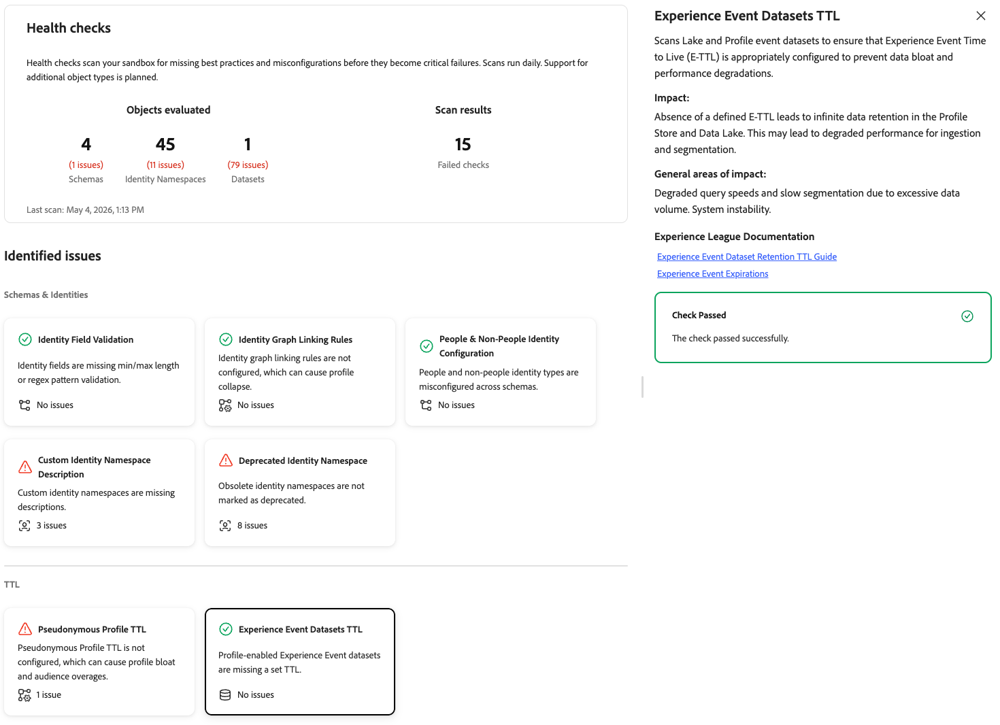

For more information, see the documentation on [Experience Event dataset retention](/help/catalog/datasets/experience-event-dataset-retention-ttl-guide.md) and [Experience Event expirations](/help/profile/event-expirations.md).

### Segment lookback window required {#segment-lookback-window-required}

Detects segment definitions that reference Experience Event data without a temporal lookback constraint.

| Detail | Description |
| --- | --- |
| **Issue** | A segment definition references Experience Event data without a temporal constraint, such as `inLastDays()`, `inLastHours()`, or `inLastMonths()`. |
| **Impact** | Without a defined lookback window, results can include slower audience evaluation, because the Segmentation Service must scan months or years of accumulated events per profile instead of a bounded recent window. Results can also include incorrect qualification, where profiles qualify or fail to qualify based on behavioral signals that do not reflect the actual intent of the audience definition. |
| **Remediation** | In Segment Builder, add a temporal constraint, such as `inLastDays()`, to the Experience Event block. Align the lookback window with your Experience Event dataset TTL to avoid querying data that has already expired. |

When you select the **[!UICONTROL Segment Lookback Window Required]** card, a detail panel opens on the right. The panel shows:

* **[!UICONTROL Description]**: Explains that a segment lookback window defines the rolling time boundary, such as 24 hours, 7 days, or 30 days, applied to Experience Events in a segment rule. This check detects audiences that reference Experience Event data without a temporal constraint such as `inLastDays()`, `inLastHours()`, or `inLastMonths()`.
* **[!UICONTROL Impact]**: Requiring a defined lookback window on event-based criteria ensures query determinism, performance optimization, and correct evaluation method assignment. If not defined correctly, results may include slower audience evaluation, since the Segmentation Service must scan months or years of accumulated events per profile instead of a bounded recent window, and incorrect qualification, where profiles may qualify based on behavioral signals that do not reflect the actual intent of the audience definition.
* **[!UICONTROL General areas of impact]**: Segmentation, audience evaluation, and quality.
* **[!UICONTROL Experience League Documentation]**: A link to segment lookback window best practices.
* **[!UICONTROL Affected segments]**: A list of segment definitions that reference Experience Event data without a lookback constraint. Select a segment to open it. When no issues are detected, the panel shows a **[!UICONTROL Check Passed]** confirmation instead.

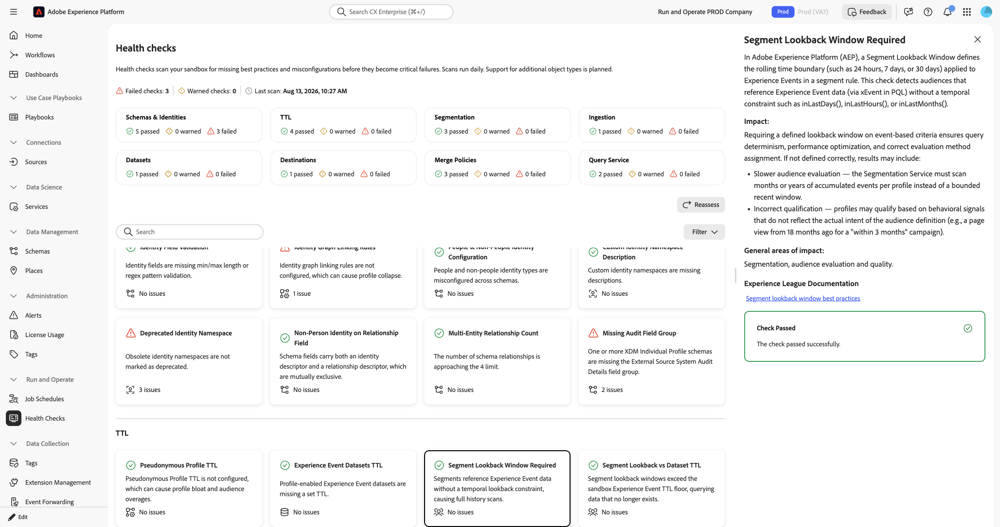

For more information, see the [PQL overview](/help/segmentation/pql/overview.md) and the [Experience Event dataset retention documentation](/help/catalog/datasets/experience-event-dataset-retention-ttl-guide.md).

### Segment lookback vs. dataset TTL {#segment-lookback-vs-dataset-ttl}

Compares segment lookback windows against the TTL configured on the Experience Event datasets they reference.

| Detail | Description |
| --- | --- |
| **Issue** | A segment lookback window exceeds the TTL configured on the Experience Event dataset it references. |
| **Impact** | Profiles may be incorrectly disqualified because the behavioral data the segment expects has already been removed by the dataset TTL. The opposite can also occur, where profiles incorrectly qualify based on data that should have expired. |
| **Remediation** | Align the segment lookback window with the Experience Event dataset TTL, or adjust the dataset TTL to cover the lookback window your segments require. |

When you select the **[!UICONTROL Segment Lookback vs Dataset TTL]** card, a detail panel opens on the right. The panel shows:

* **[!UICONTROL Description]**: Explains that audience definitions that include tests on events should be defined with lookback windows that consider the Profile TTL for those event datasets. This check compares audience lookback windows against the Profile event dataset TTL.
* **[!UICONTROL Impact]**: Incorrect disqualification can occur, where profiles may not qualify based on behavioral signals because the required data has already been removed based on the dataset TTL setting. The opposite can also occur, where missing event data leads to incorrect qualification of profiles for the audience.
* **[!UICONTROL General areas of impact]**: Audience qualification and activation.
* **[!UICONTROL Experience League Documentation]**: A link to Experience Event expirations.
* **[!UICONTROL Affected segments]**: A list of segments whose lookback window exceeds the referenced dataset TTL, when applicable. When no issues are detected, the panel shows a **[!UICONTROL Check Passed]** confirmation instead.

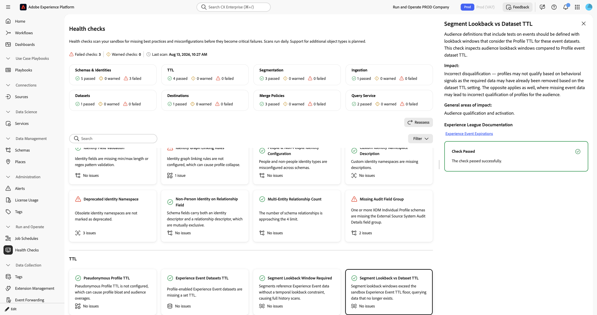

For more information, see the [Experience Event dataset retention documentation](/help/catalog/datasets/experience-event-dataset-retention-ttl-guide.md) and the [Experience Event expirations documentation](/help/profile/event-expirations.md).

### Audience sandbox limit {#audience-sandbox-limit}

Scans the total number of active audience definitions in a sandbox against the platform limit.

| Detail | Description |
| --- | --- |
| **Issue** | The total number of active audience definitions in the sandbox is approaching the limit of 4,000. |
| **Impact** | Every active audience is re-evaluated in each scheduled batch segmentation job. Approaching the limit increases the latency of every batch segmentation job. |
| **Remediation** | Review your active audiences and deactivate or delete any that are no longer needed. |

When you select the **[!UICONTROL Audience Sandbox Limit]** card, a detail panel opens on the right. The panel shows:

* **[!UICONTROL Description]**: Scans whether the total number of audiences defined in the sandbox exceeds the limit of 4,000. Every defined audience, whether batch, streaming, or edge, is re-evaluated in every scheduled batch segmentation job.
* **[!UICONTROL Impact]**: Exceeding 4,000 audiences increases the latency of every batch segmentation job.
* **[!UICONTROL General areas of impact]**: Batch segmentation and activation.
* **[!UICONTROL Experience League Documentation]**: A link to guardrails for [!DNL Real-Time Customer Profile].

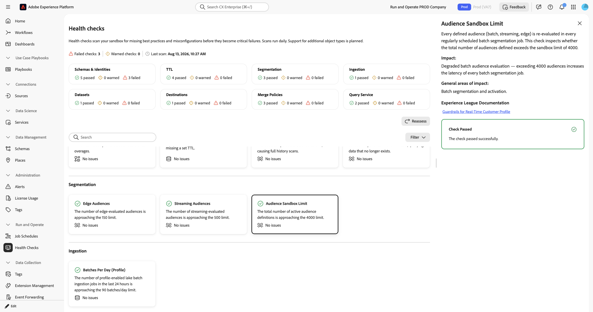

For more information, see the [guardrails for Real-Time Customer Profile data and segmentation](/help/profile/guardrails.md).

### Streaming audiences {#streaming-audiences}

Scans the number of streaming-evaluated audiences in a sandbox against the platform limit.

| Detail | Description |
| --- | --- |
| **Issue** | The number of streaming-evaluated audiences in the sandbox is approaching the limit of 500. |
| **Impact** | Streaming audiences consume significant compute resources. Approaching the limit causes performance degradation across all streaming audiences in the sandbox, increasing evaluation latency. |
| **Remediation** | Review your streaming audiences and consolidate or remove any that are no longer needed. |

When you select the **[!UICONTROL Streaming Audiences]** card, a detail panel opens on the right. The panel shows:

* **[!UICONTROL Description]**: Scans whether the number of streaming-evaluated audiences in the sandbox exceeds the guardrail of 500.
* **[!UICONTROL Impact]**: Exceeding the guardrail causes performance degradation across all streaming audiences in the sandbox, increasing evaluation latency.
* **[!UICONTROL General areas of impact]**: Real-time audience evaluation and activation.
* **[!UICONTROL Experience League Documentation]**: A link to guardrails for [!DNL Real-Time Customer Profile].

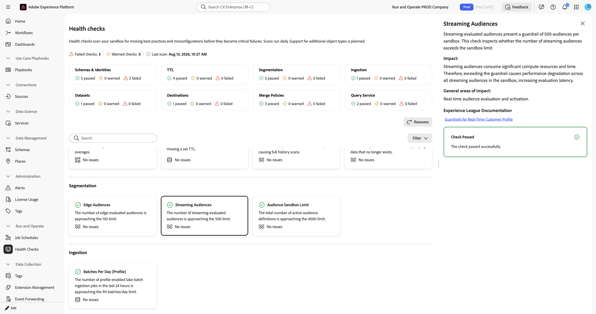

For more information, see the [guardrails for Real-Time Customer Profile data and segmentation](/help/profile/guardrails.md) and the [streaming segmentation documentation](/help/segmentation/methods/streaming-segmentation.md).

### Edge audiences {#edge-audiences}

Scans the number of edge-evaluated audiences in a sandbox against the platform limit.

| Detail | Description |
| --- | --- |
| **Issue** | The number of edge-evaluated audiences in the sandbox is approaching the limit of 150. |
| **Impact** | Exceeding the limit causes performance degradation across all edge audiences in the sandbox, increasing evaluation latency and risking timeouts for real-time decisioning. |
| **Remediation** | Consolidate overlapping edge audiences where possible. Audit existing edge audiences to identify candidates that can move to streaming evaluation. Only audiences that require sub-second qualification at page load need edge evaluation. |

When you select the **[!UICONTROL Edge Audiences]** card, a detail panel opens on the right. The panel shows:

* **[!UICONTROL Description]**: Scans whether the number of edge-evaluated audiences in the sandbox exceeds the guardrail of 150.
* **[!UICONTROL Impact]**: Exceeding 150 edge audiences causes performance degradation across all edge audiences in the sandbox, increasing evaluation latency and risking timeouts for real-time decisioning.
* **[!UICONTROL General areas of impact]**: Edge-based real-time audience evaluation and personalization.
* **[!UICONTROL Experience League Documentation]**: A link to guardrails for [!DNL Real-Time Customer Profile].
* **[!UICONTROL Recommendation]**: Consolidate overlapping edge audiences where possible to reduce the total count. Audit existing edge audiences to identify candidates that can move to streaming evaluation.
* **[!UICONTROL Edge Audiences]**: The current count of edge audiences against the sandbox limit.

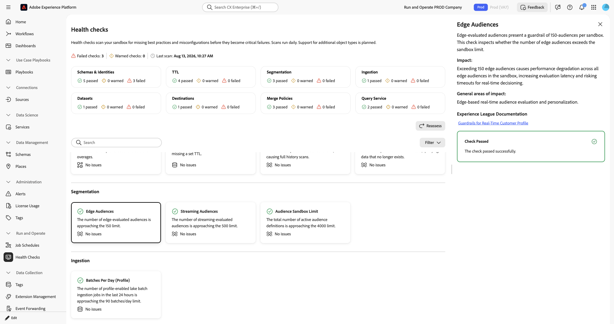

For more information, see the [guardrails for Real-Time Customer Profile data and segmentation](/help/profile/guardrails.md) and the [edge segmentation documentation](/help/segmentation/methods/edge-segmentation.md).

### Batches per day (profile) {#batches-per-day-profile}

Scans the combined daily count of Profile and Experience Event batches ingested into a sandbox against the platform guardrail.

| Detail | Description |
| --- | --- |
| **Issue** | The combined count of Profile and Experience Event batches ingested into the sandbox in the last 24 hours is approaching the limit of 90 batches per day. |
| **Impact** | Exceeding the limit increases processing queue depth in the [!DNL Profile] store, which delays profile updates. Scheduled segmentation runs on its regular schedule regardless of whether all batches finished ingesting, which can lead to incorrect audience results from stale profile data. |
| **Remediation** | Consolidate ingestion to no more than one batch per dataset per 24 hours. Refer to the [!UICONTROL Job Schedules] dashboard to identify which datasets need batch count reduction. |

When you select the **[!UICONTROL Batches Per Day (Profile)]** card, a detail panel opens on the right. The panel shows:

* **[!UICONTROL Description]**: Explains that the per sandbox, per day limit for profile batch ingestion is 90 batches per day. This check inspects the combined daily count of Profile and Experience Event batches ingested into the sandbox for Profile-enabled datasets against the platform guardrail.
* **[!UICONTROL Impact]**: Exceeding 90 Profile or Experience Event batches per day increases processing queue depth in the [!DNL Profile] store, delaying profile updates. Scheduled segmentation starts on schedule regardless of whether all batches have finished ingesting, which can lead to incorrect audience results from stale profile data.
* **[!UICONTROL General areas of impact]**: Segmentation and activation results.
* **[!UICONTROL Experience League Documentation]**: A link to guardrails for data ingestion.
* **[!UICONTROL Recommendation]**: Consolidate ingestion to no more than one batch per dataset per 24 hours. Refer to the [!UICONTROL Job Schedules] dashboard to identify which datasets need batch count reduction.

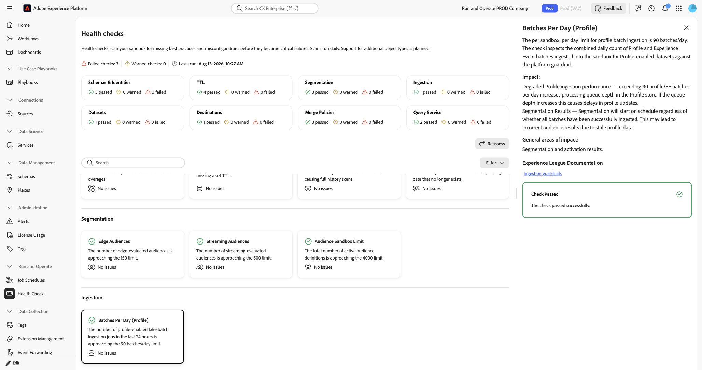

For more information, see the [guardrails for data ingestion](/help/ingestion/guardrails.md).

### Profile dataset count {#profile-dataset-count}

Scans the number of profile-enabled datasets against the platform limit for each schema class.

| Detail | Description |
| --- | --- |
| **Issue** | The number of profile-enabled datasets based on the XDM Individual Profile class, or the number based on the XDM ExperienceEvent class, is approaching the limit of 20. |
| **Impact** | An excessive number of profile-enabled datasets impacts the performance and throughput of both batch and streaming segmentation. |
| **Remediation** | Disable [!UICONTROL Profile] on datasets that no longer feed active journeys, segments, or destinations. Aim for one profile-enabled dataset per schema class. Consolidating to a single dataset per class reduces the number of fragments [!DNL Real-Time Customer Profile] must merge on every evaluation. |

When you select the **[!UICONTROL Profile Dataset Count]** card, a detail panel opens on the right. The panel shows:

* **[!UICONTROL Description]**: Explains that [!DNL Experience Platform] limits the number of datasets that can be enabled for profile to no more than 20 datasets based on the XDM Individual Profile class, and no more than 20 datasets based on the XDM ExperienceEvent class, per sandbox. This check inspects whether either guardrail has been exceeded.
* **[!UICONTROL Impact]**: An excessive number of profile-enabled datasets impacts the performance and throughput of both batch and streaming segmentation.
* **[!UICONTROL General areas of impact]**: Batch and streaming segmentation.
* **[!UICONTROL Experience League Documentation]**: Links to default guardrails for [!DNL Real-Time Customer Profile] data and the dataset user guide.
* **[!UICONTROL Recommendation]**: Disable [!UICONTROL Profile] on datasets that no longer feed active journeys, segments, or destinations by going to **[!UICONTROL Data Management]** > **[!UICONTROL Datasets]** and turning off the **[!UICONTROL Profile]** toggle. Aim for one profile-enabled dataset per schema class. Platform-managed datasets count against the limit but cannot be disabled, so focus remediation on your own datasets.
* **[!UICONTROL Profile Dataset Count]**: The current count of profile-enabled datasets for the schema class against the limit.

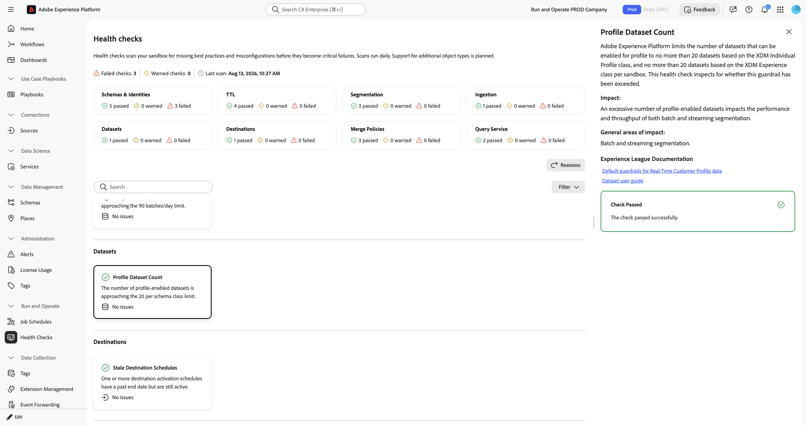

For more information, see the [default guardrails for Real-Time Customer Profile data](/help/profile/guardrails.md) and the [datasets user guide](/help/catalog/datasets/user-guide.md).

### Stale destination schedules {#stale-destination-schedules}

Identifies destination activation schedules that are considered stale because their configured end date is in the past while activation status remains active.

| Detail | Description |
| --- | --- |
| **Issue** | One or more destination activation schedules have a past end date but activation status remains set to active. |
| **Impact** | Stale destination schedules create clutter within your activation schedules and reflect improper sandbox management. |
| **Remediation** | Delete unnecessary expired schedules. |

When you select the **[!UICONTROL Stale Destination Schedules]** card, a detail panel opens on the right. The panel shows:

* **[!UICONTROL Description]**: Explains that destination schedules are considered stale when the configured end date is in the past but activation status remains set to active. This check inspects existing destination schedules for this condition.
* **[!UICONTROL Impact]**: Clutter within the destination schedules, and improper sandbox management.
* **[!UICONTROL General areas of impact]**: Destination schedules.
* **[!UICONTROL Experience League Documentation]**: A link to guardrails for data activation.
* **[!UICONTROL Recommendation]**: Delete unnecessary expired schedules.
* **[!UICONTROL Affected flows]**: A list of activation flows with a past end date that remain active, including the associated audience and expired end date. Use the link icon to open the flow.

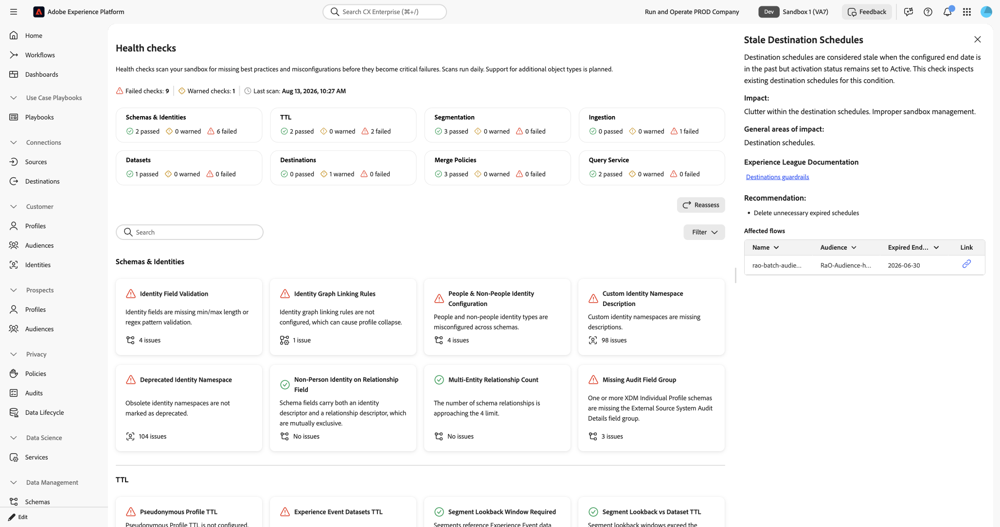

For more information, see the [default guardrails for data activation](/help/destinations/guardrails.md).

### Default merge policy naming {#default-merge-policy-naming}

Scans for merge policies that still contain "default" in their name after they are no longer designated as the default policy.

| Detail | Description |
| --- | --- |
| **Issue** | A non-default merge policy has the word "default" in its name. |
| **Impact** | When a new merge policy is promoted to default, the previous default policy is demoted, but its name is not automatically updated. If the old policy still contains "default" in its name, two policies appear to be the default in dropdown menus, which causes confusion. |
| **Remediation** | Rename the affected merge policy to remove "default" from its name and reflect its current purpose. |

When you select the **[!UICONTROL Default Merge Policy Naming]** card, a detail panel opens on the right. The panel shows:

* **[!UICONTROL Description]**: Scans whether any non-default merge policies have the word "default" in their name.
* **[!UICONTROL Impact]**: Non-default merge policies with "default" in their name cause confusion. You might apply the wrong policy to a segment or activation.
* **[!UICONTROL General areas of impact]**: Segmentation, profile retrieval, and activation correctness.
* **[!UICONTROL Experience League Documentation]**: A link to guardrails for merge policies.

For more information, see the [merge policies overview](/help/profile/merge-policies/overview.md) and [guardrails for merge policies](/help/profile/guardrails.md).

### Duplicate merge policy definitions {#duplicate-merge-policy-definitions}

Detects XDM Individual Profile merge policies that share an identical definition, which wastes a limited merge policy slot.

>[!IMPORTANT]
>
>The live product UI states a limit of 3 merge policies per sandbox, while an earlier internal source referenced a limit of 5. Confirm the correct value with the Health Checks product team before publishing.

| Detail | Description |
| --- | --- |
| **Issue** | Two or more XDM Individual Profile merge policies share an identical definition. |
| **Impact** | Duplicate merge policies subtract from the allowed limit of {X} merge policies per sandbox. Every merge policy requires separate processing during batch segmentation, increasing the total elapsed time for both segmentation and profile export. |
| **Remediation** | Review the affected merge policies and delete the duplicate, keeping the one that is referenced by existing segments and activations. |

When you select the **[!UICONTROL Duplicate Merge Policy Definitions]** card, a detail panel opens on the right. The panel shows:

* **[!UICONTROL Description]**: Explains that [!DNL Experience Platform] allows for no more than {X} merge policies per sandbox. When multiple merge policies are configured with identical definitions, they are functionally redundant. This check inspects for instances of duplicate merge policy definitions.
* **[!UICONTROL Impact]**: Duplicate merge policies subtract from the allowed limit of {X} merge policies. Every merge policy requires separate processing during batch segmentation, increasing the total elapsed time for both segmentation and profile export.
* **[!UICONTROL General areas of impact]**: Batch segmentation and subsequent activation.
* **[!UICONTROL Experience League Documentation]**: A link to guardrails for merge policies.

For more information, see the [merge policies overview](/help/profile/merge-policies/overview.md) and [guardrails for merge policies](/help/profile/guardrails.md).

### Duplicate merge policy names {#duplicate-merge-policy-names}

Scans for merge policies within the same schema that share the same display name.

| Detail | Description |
| --- | --- |
| **Issue** | Two or more merge policies for the same schema share the same display name. |
| **Impact** | Merge policy names are the only identifier visible in [!UICONTROL Segment Builder] and destination activation dropdown menus. When two policies share a name, you cannot tell them apart, which can lead to selecting the wrong policy and applying unintended attribute merge or identity graph settings. |
| **Remediation** | Rename one or both of the affected merge policies so that each name is unique within the schema. |

When you select the **[!UICONTROL Duplicate Merge Policy Names]** card, a detail panel opens on the right. The panel shows:

* **[!UICONTROL Description]**: Verifies that there are no duplicate merge policy names for the same schema.
* **[!UICONTROL Impact]**: When two [!DNL XDM Individual Profile] policies share a name, you cannot tell them apart when building audiences, which can lead to selecting the wrong policy.
* **[!UICONTROL General areas of impact]**: Segmentation, profile lookup, and activation.
* **[!UICONTROL Experience League Documentation]**: A link to the merge policies overview.

For more information, see the [merge policies overview](/help/profile/merge-policies/overview.md).

### Scheduled queries failing {#scheduled-queries-failing}

Checks each scheduled query for its most recent run and flags any that failed or errored.

| Detail | Description |
| --- | --- |
| **Issue** | One or more scheduled queries failed or errored on their most recent run. |
| **Impact** | Without monitoring or alerting, scheduled queries can fail silently and repeatedly. This consumes compute resources without producing output and leaves target datasets stale, which is especially problematic for profile-enabled datasets. |
| **Remediation** | Inspect each failing scheduled query to find the root cause, then modify the query as needed to resolve the issue. |

When you select the **[!UICONTROL Scheduled Queries Failing]** card, a detail panel opens on the right. The panel shows:

* **[!UICONTROL Description]**: For each scheduled query, checks whether the most recent run has a status of failed or errored.
* **[!UICONTROL Impact]**: Without monitoring or alerting configured, scheduled queries can fail silently and repeatedly, consuming compute resources without producing query output and leaving target datasets stale. This is particularly problematic for profile-enabled datasets.
* **[!UICONTROL General areas of impact]**: Dataset contents and segmentation results.
* **[!UICONTROL Experience League Documentation]**: A link to guardrails for [!DNL Query Service].
* **[!UICONTROL Recommendation]**: Inspect each failing scheduled query to find the root cause. Modify the query as needed to resolve the issue.
* **[!UICONTROL Affected scheduled queries]**: A list of failing scheduled queries with their run ID and status. Use the link icon to open the query.

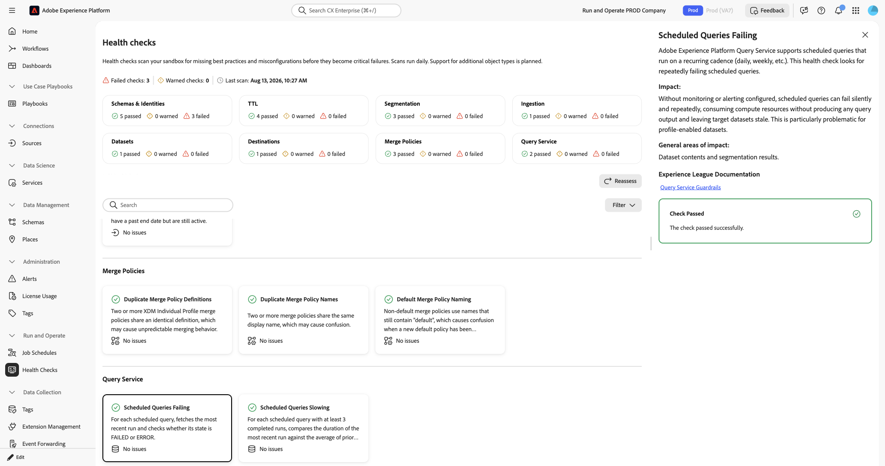

For more information, see the [guardrails for Query Service](/help/query-service/guardrails.md).

### Scheduled queries slowing {#scheduled-queries-slowing}

Compares the duration of each scheduled query's most recent run against the average of its prior runs.

| Detail | Description |
| --- | --- |
| **Issue** | A scheduled query with at least three completed runs has a most recent run duration that is 50 percent or more slower than its historical average. |
| **Impact** | Queries continue to succeed but take progressively longer, which risks exceeding timeout thresholds and can overlap with scheduled batch segmentation. If the query writes to a profile-enabled dataset, this also affects segmentation results. |
| **Remediation** | Configure a data expiration on the Experience Event datasets that the query reads from, since datasets that grow indefinitely lead to continued increases in query duration. Also review the start times of your scheduled queries to reduce overlap. |

When you select the **[!UICONTROL Scheduled Queries Slowing]** card, a detail panel opens on the right. The panel shows:

* **[!UICONTROL Description]**: For each scheduled query with at least three completed runs, compares the duration of the most recent run against the average of prior runs and flags queries whose latest run is 50 percent or more slower than the historical average.
* **[!UICONTROL Impact]**: Queries continue to succeed but take progressively longer, risking exceeding timeout thresholds and overlap with scheduled batch segmentation.
* **[!UICONTROL General areas of impact]**: Segmentation results, when the query writes to a profile-enabled dataset.
* **[!UICONTROL Experience League Documentation]**: A link to guardrails for [!DNL Query Service].
* **[!UICONTROL Recommendation]**: Set a data expiration on every Experience Event dataset your scheduled queries read from, since datasets that grow indefinitely cause continued increases in query duration. Review the start times of your scheduled queries to reduce overlap.
* **[!UICONTROL Affected scheduled queries]**: A list of slowing scheduled queries with their latest duration, average duration, and percentage slowdown. Use the link icon to open the query.

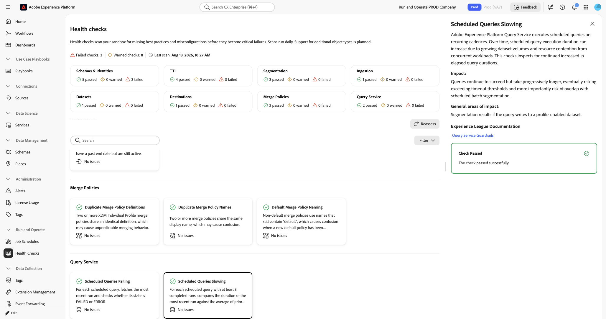

For more information, see the [guardrails for Query Service](/help/query-service/guardrails.md) and the [Experience Event dataset retention documentation](/help/catalog/datasets/experience-event-dataset-retention-ttl-guide.md).

## Next steps {#next-steps}

After reviewing your health check results, explore the following resources to deepen your understanding:

* Learn about [schema best practices](/help/xdm/schema/best-practices.md) for designing reliable data models.
* Understand [identity graph linking rules](/help/identity-service/identity-graph-linking-rules/overview.md) to prevent profile collapse.
* Review [identity namespace documentation](/help/identity-service/features/namespaces.md) for namespace management best practices.
* Configure [pseudonymous profile expiration](/help/profile/pseudonymous-profiles.md) to manage data retention and reduce Addressable Audience overages.
* Set up [Experience Event dataset retention](/help/catalog/datasets/experience-event-dataset-retention-ttl-guide.md) to prevent data bloat and performance degradation.
* Explore other [Run and Operate tools](/help/run-and-operate/overview.md) including [[!UICONTROL Job Schedules]](/help/run-and-operate/job-schedules.md) for batch operation visibility.
