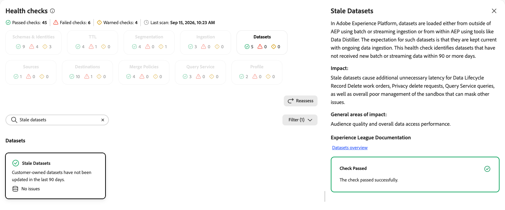
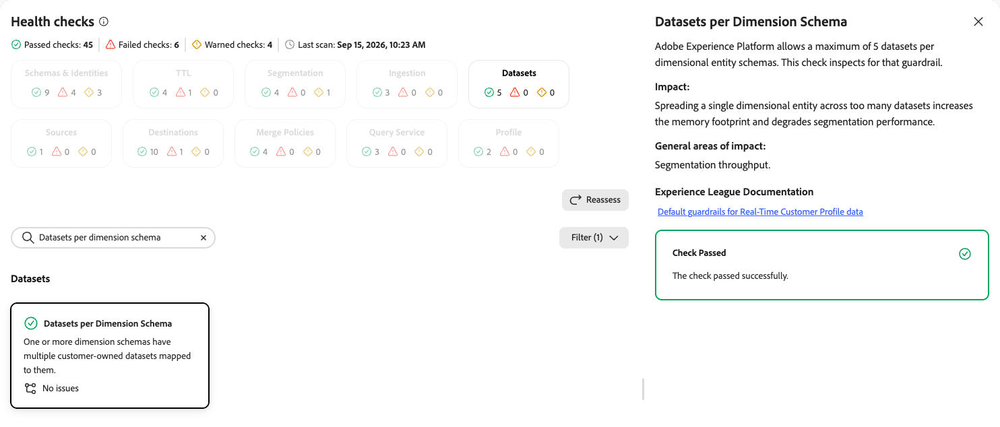
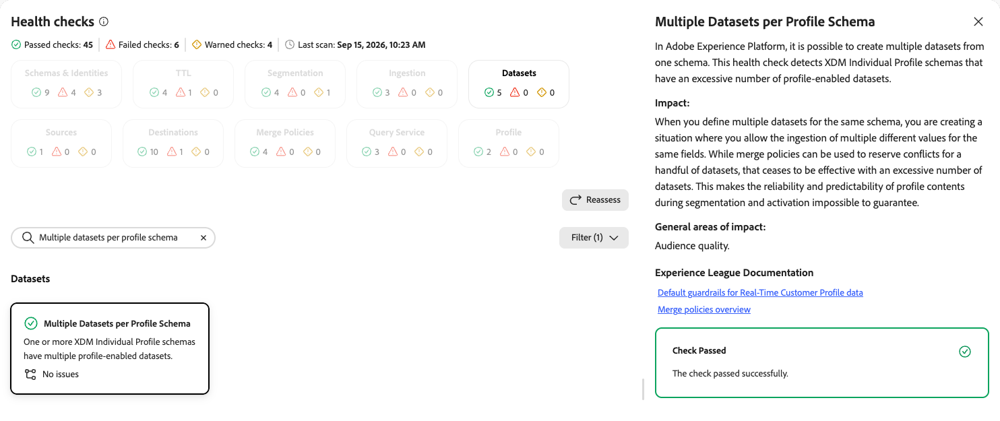
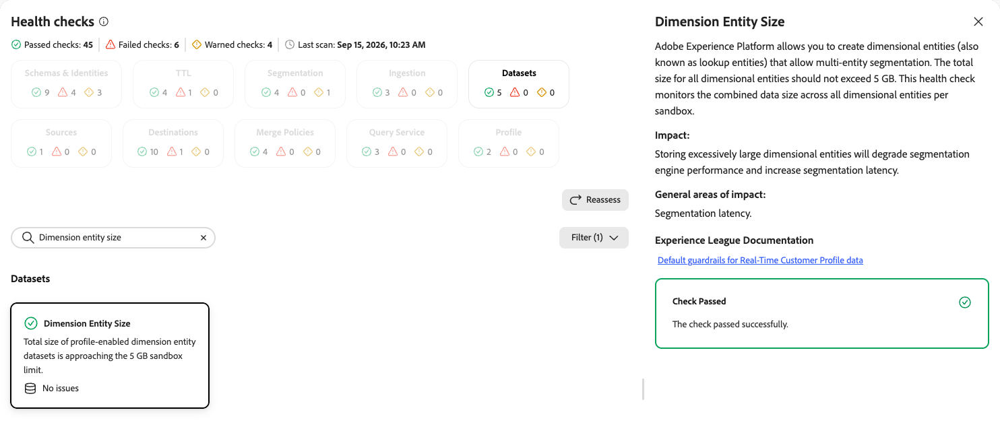

# Datasets health checks

The datasets health check scans your sandbox for profile-enabled dataset counts approaching the platform limit for each schema class.

| Check | Object type |
| --- | --- |
| [Profile dataset count](#profile-dataset-count) | Dataset |
| [Stale datasets](#stale-datasets) | Dataset |
| [Datasets per dimension schema](#datasets-per-dimension-schema) | Dataset |
| [Multiple datasets per profile schema](#multiple-datasets-per-profile-schema) | Dataset |
| [Dimension entity size](#dimension-entity-size) | Dataset |

## Profile dataset count {#profile-dataset-count}

Scans the number of profile-enabled datasets against the platform limit for each schema class.

| Detail | Description |
| --- | --- |
| **Issue** | The number of profile-enabled datasets based on the XDM Individual Profile class, or the number based on the XDM ExperienceEvent class, is approaching the limit of 20. |
| **Impact** | An excessive number of profile-enabled datasets impacts the performance and throughput of both batch and streaming segmentation. |
| **Remediation** | Disable [!UICONTROL Profile] on datasets that no longer feed active journeys, segments, or destinations. Aim for one profile-enabled dataset per schema class. Consolidating to a single dataset per class reduces the number of fragments [!DNL Real-Time Customer Profile] must merge on every evaluation. |

When you select the **[!UICONTROL Profile Dataset Count]** card, a detail panel opens on the right. The panel shows:

* **[!UICONTROL Description]**: Explains that [!DNL Experience Platform] limits profile-enabled datasets to no more than 20 based on the XDM Individual Profile class, and no more than 20 based on the XDM ExperienceEvent class, per sandbox. This check inspects whether either guardrail has been exceeded.
* **[!UICONTROL Impact]**: An excessive number of profile-enabled datasets impacts the performance and throughput of both batch and streaming segmentation.
* **[!UICONTROL General areas of impact]**: Batch and streaming segmentation.
* **[!UICONTROL Experience League Documentation]**: Links to default guardrails for [!DNL Real-Time Customer Profile] data and the dataset user guide.
* **[!UICONTROL Recommendation]**: Disable [!UICONTROL Profile] on datasets that no longer feed active journeys, segments, or destinations by going to **[!UICONTROL Data Management]** > **[!UICONTROL Datasets]** and turning off the **[!UICONTROL Profile]** toggle. Aim for one profile-enabled dataset per schema class. Platform-managed datasets count against the limit but cannot be disabled, so focus remediation on your own datasets.
* **[!UICONTROL Profile Dataset Count]**: The current count of profile-enabled datasets for the schema class against the limit.

{zoomable="yes"}

For more information, see the [default guardrails for Real-Time Customer Profile data](/help/profile/guardrails.md) and the [datasets user guide](/help/catalog/datasets/user-guide.md).

## Stale datasets {#stale-datasets}

Identifies datasets that have not received new batch or streaming data recently.

| Detail | Description |
| --- | --- |
| **Issue** | Customer-owned datasets have not been updated in the last 90 days. |
| **Impact** | Stale datasets cause additional unnecessary latency for Data Lifecycle record delete work orders, privacy delete requests, and [!DNL Query Service] queries, and lead to overall poor management of the sandbox that can mask other issues. |
| **Remediation** | Review flagged datasets and either resume ingestion or delete datasets that are no longer needed. |

When you select the **[!UICONTROL Stale Datasets]** card, a detail panel opens on the right. The panel shows:

* **[!UICONTROL Description]**: Explains that datasets are loaded either from outside [!DNL Experience Platform] using batch or streaming ingestion, or from within [!DNL Experience Platform] using tools like [!DNL Data Distiller]. The expectation for such datasets is that they are kept current with ongoing data ingestion. This check identifies datasets that have not received new batch or streaming data within 90 or more days.
* **[!UICONTROL Impact]**: Stale datasets cause additional unnecessary latency for Data Lifecycle record delete work orders, privacy delete requests, Query Service queries, and overall poor management of the sandbox that can mask other issues.
* **[!UICONTROL General areas of impact]**: Audience quality and overall data access performance.
* **[!UICONTROL Experience League Documentation]**: A link to the datasets overview.

{zoomable="yes"}

For more information, see the [datasets overview](/help/catalog/datasets/overview.md).

## Datasets per dimension schema {#datasets-per-dimension-schema}

Inspects whether the number of datasets mapped to a dimensional entity schema has exceeded the platform guardrail.

| Detail | Description |
| --- | --- |
| **Issue** | One or more dimension schemas have multiple customer-owned datasets mapped to them. |
| **Impact** | Spreading a single dimensional entity across too many datasets increases the memory footprint and degrades segmentation performance. |
| **Remediation** | Consolidate the affected dimensional entity to five or fewer datasets. |

When you select the **[!UICONTROL Datasets per Dimension Schema]** card, a detail panel opens on the right. The panel shows:

* **[!UICONTROL Description]**: Explains that [!DNL Experience Platform] allows a maximum of 5 datasets per dimensional entity schema. This check inspects for that guardrail.
* **[!UICONTROL Impact]**: Spreading a single dimensional entity across too many datasets increases the memory footprint and degrades segmentation performance.
* **[!UICONTROL General areas of impact]**: Segmentation throughput.
* **[!UICONTROL Experience League Documentation]**: A link to the default guardrails for [!DNL Real-Time Customer Profile] data.

{zoomable="yes"}

For more information, see the [default guardrails for Real-Time Customer Profile data](/help/profile/guardrails.md).

## Multiple datasets per profile schema {#multiple-datasets-per-profile-schema}

Detects XDM Individual Profile schemas that have an excessive number of profile-enabled datasets.

| Detail | Description |
| --- | --- |
| **Issue** | One or more XDM Individual Profile schemas have multiple profile-enabled datasets. |
| **Impact** | Defining multiple datasets for the same schema allows the ingestion of multiple different values for the same fields. Merge policies can reserve conflicts for a handful of datasets, but an excessive number of datasets makes profile content during segmentation and activation impossible to guarantee. |
| **Remediation** | Consolidate to a single profile-enabled dataset per schema class where possible, and use merge policies to resolve any remaining conflicts. |

When you select the **[!UICONTROL Multiple Datasets per Profile Schema]** card, a detail panel opens on the right. The panel shows:

* **[!UICONTROL Description]**: Explains that [!DNL Experience Platform] allows the creation of multiple datasets from one schema. This check detects XDM Individual Profile schemas that have an excessive number of profile-enabled datasets.
* **[!UICONTROL Impact]**: Defining multiple datasets for the same schema allows the ingestion of multiple different values for the same fields. Merge policies can reserve conflicts for a handful of datasets, but an excessive number of datasets makes reliable profile content impossible to guarantee.
* **[!UICONTROL General areas of impact]**: Audience quality.
* **[!UICONTROL Experience League Documentation]**: Links to the default guardrails for [!DNL Real-Time Customer Profile] data and the merge policies overview.

{zoomable="yes"}

For more information, see the [default guardrails for Real-Time Customer Profile data](/help/profile/guardrails.md) and the [merge policies overview](/help/profile/merge-policies/overview.md).

## Dimension entity size {#dimension-entity-size}

Monitors the combined data size across all dimensional entities in a sandbox against the platform limit.

| Detail | Description |
| --- | --- |
| **Issue** | Total size of profile-enabled dimension entity datasets is approaching the 5 GB sandbox limit. |
| **Impact** | Storing excessively large dimensional entities degrades segmentation engine performance and increases segmentation latency. |
| **Remediation** | Reduce the size of the affected dimensional entities, for example by removing unused fields or archiving historical records. |

When you select the **[!UICONTROL Dimension Entity Size]** card, a detail panel opens on the right. The panel shows:

* **[!UICONTROL Description]**: Explains that [!DNL Experience Platform] allows you to create dimensional entities, also known as lookup entities, that enable multi-entity segmentation. The total size for all dimensional entities should not exceed 5 GB. This check monitors the combined data size across all dimensional entities per sandbox.
* **[!UICONTROL Impact]**: Storing excessively large dimensional entities degrades segmentation engine performance and increases segmentation latency.
* **[!UICONTROL General areas of impact]**: Segmentation latency.
* **[!UICONTROL Experience League Documentation]**: A link to the default guardrails for [!DNL Real-Time Customer Profile] data.

{zoomable="yes"}

For more information, see the [default guardrails for Real-Time Customer Profile data](/help/profile/guardrails.md).

## Next steps {#next-steps}

* Return to the [health checks overview](/help/run-and-operate/health-checks/overview.md) to explore other check categories.
* Review the [datasets user guide](/help/catalog/datasets/user-guide.md) to manage your profile-enabled datasets.
