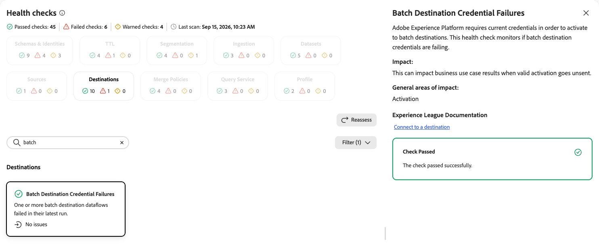
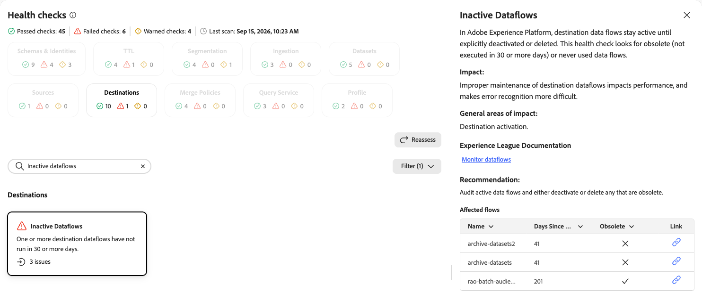
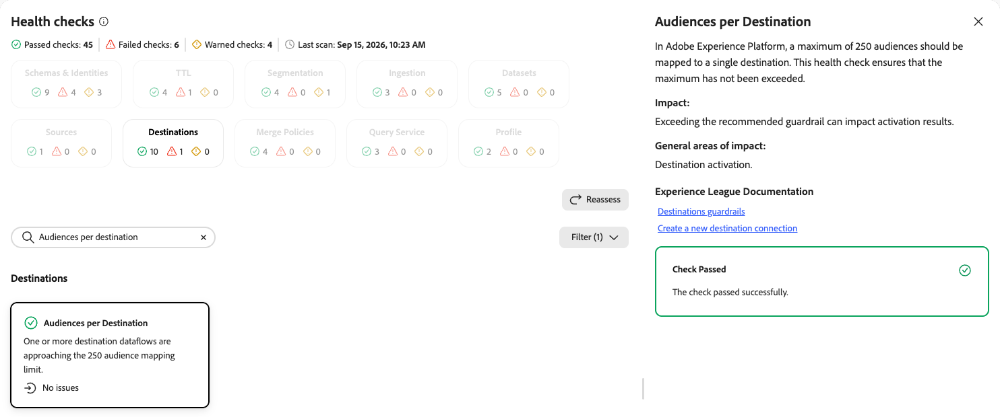
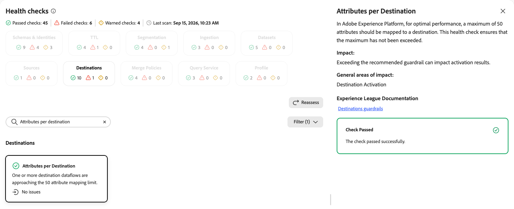
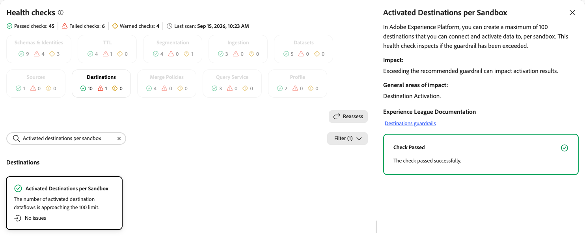
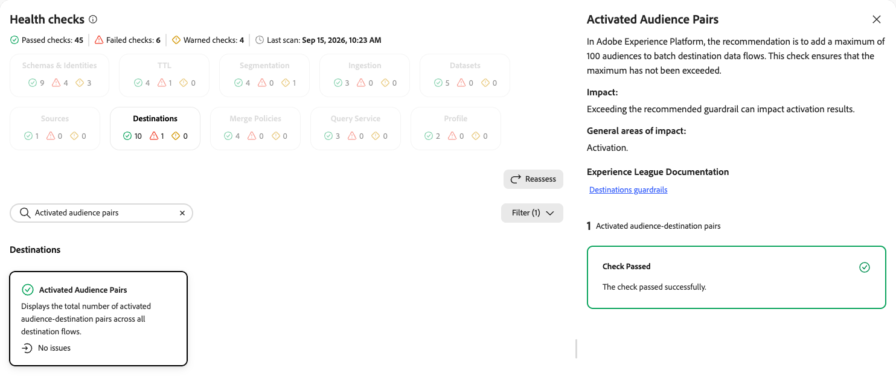
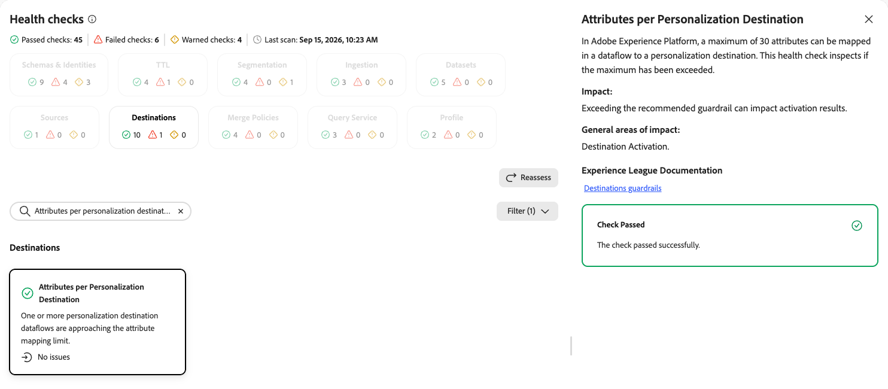
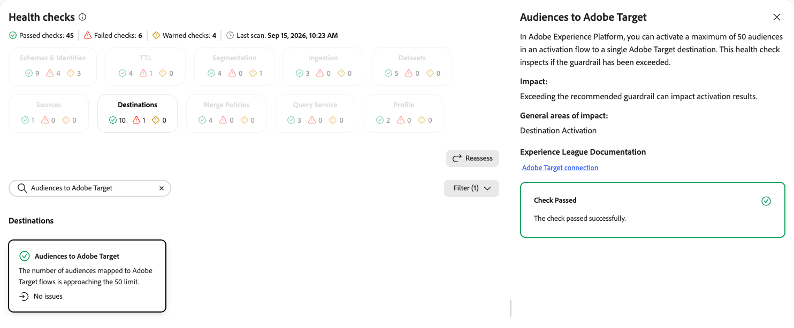
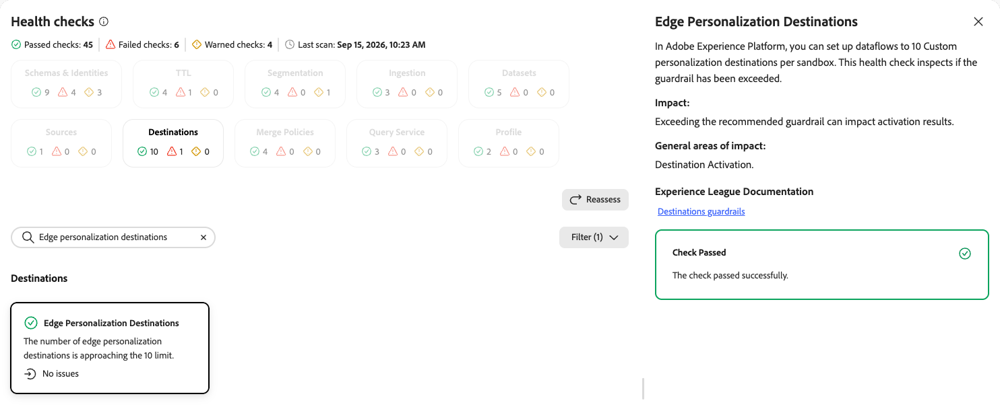
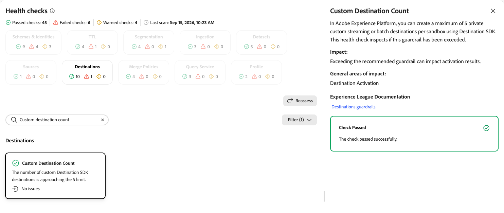

# Destinations health checks

The destinations health checks scan your sandbox for expired activation schedules, dataflow failures, and destination dataflows approaching platform guardrails.

| Check | Object type |
| --- | --- |
| [Expired activation schedules](#expired-activation-schedules) | Destination |
| [Batch destination failures](#batch-destination-failures) | Destination |
| [Inactive dataflows](#inactive-dataflows) | Destination |
| [Audiences per destination](#audiences-per-destination) | Destination |
| [Attributes per destination](#attributes-per-destination) | Destination |
| [Activated destinations per sandbox](#activated-destinations-per-sandbox) | Destination |
| [Activated audience pairs](#activated-audience-pairs) | Destination |
| [Attributes per personalization destination](#attributes-per-personalization-destination) | Destination |
| [Audiences to Adobe Target](#audiences-to-adobe-target) | Destination |
| [Edge personalization destinations](#edge-personalization-destinations) | Destination |
| [Custom destination count](#custom-destination-count) | Destination |

## Expired activation schedules {#expired-activation-schedules}

Identifies destination activation schedules that have an expired end date while the dataflow remains active. This check was previously documented as "Stale destination schedules."

| Detail | Description |
| --- | --- |
| **Issue** | One or more destination activation schedules have a past end date but the dataflow remains active. |
| **Impact** | The dataflow stops exporting data, and you might wonder why your campaign stopped receiving data. |
| **Remediation** | Extend the expired end date, create a new dataflow, or remove the dataflow. |

When you select the **[!UICONTROL Expired Activation Schedules]** card, a detail panel opens on the right. The panel shows:

* **[!UICONTROL Description]**: Explains that the configured activation end date is in the past while the dataflow is still active. This check inspects existing destination activation schedules for this condition.
* **[!UICONTROL Impact]**: The dataflow stops exporting data, and you might wonder why your campaign stopped receiving data.
* **[!UICONTROL General areas of impact]**: Destination activation schedules.
* **[!UICONTROL Experience League documentation]**: Links to schedule audience exports for [streaming](/help/destinations/ui/activate-segment-streaming-destinations.md#scheduling) and [batch](/help/destinations/ui/activate-batch-profile-destinations.md#scheduling) destinations.
* **[!UICONTROL Recommendation]**: Extend the expired end date, create a new dataflow, or remove the dataflow.
* **[!UICONTROL Affected flows]**: A list of active dataflows with audiences that have a past activation end date, including the associated audience and expired end date. Use the link icon to open the flow.

{zoomable="yes"}

For more information, see how to schedule audience exports for [streaming](/help/destinations/ui/activate-segment-streaming-destinations.md#scheduling) and [batch](/help/destinations/ui/activate-batch-profile-destinations.md#scheduling) destinations.

## Batch destination failures {#batch-destination-failures}

Monitors whether batch destination credentials are current and destination dataflows are activating successfully.

| Detail | Description |
| --- | --- |
| **Issue** | One or more batch destination dataflows failed in their latest run. |
| **Impact** | Failures can impact business use case results when valid activation goes unsent. |
| **Remediation** | Review the affected dataflows and refresh or reconfigure credentials as needed. |

When you select the **[!UICONTROL Batch Destination Credential Failures]** card, a detail panel opens on the right. The panel shows:

* **[!UICONTROL Description]**: Explains that [!DNL Experience Platform] requires current credentials to activate batch destinations. This check monitors whether batch destination credentials are failing.
* **[!UICONTROL Impact]**: This can impact business use case results when valid activation goes unsent.
* **[!UICONTROL General areas of impact]**: Activation.
* **[!UICONTROL Experience League Documentation]**: A link to connecting to a destination.

{zoomable="yes"}

For more information, see [Connect to a destination](/help/destinations/ui/connect-destination.md).

## Inactive dataflows {#inactive-dataflows}

Detects destination dataflows that are obsolete or have never run.

| Detail | Description |
| --- | --- |
| **Issue** | One or more destination dataflows have not run in 30 or more days. |
| **Impact** | Improper maintenance of destination dataflows impacts performance and makes error recognition more difficult. |
| **Remediation** | Audit active dataflows and either deactivate or delete any that are obsolete. |

When you select the **[!UICONTROL Inactive Dataflows]** card, a detail panel opens on the right. The panel shows:

* **[!UICONTROL Description]**: Explains that destination dataflows stay active until explicitly deactivated or deleted. This check looks for obsolete dataflows that have not run in 30 or more days, or that have never run.
* **[!UICONTROL Impact]**: Improper maintenance of destination dataflows impacts performance and makes error recognition more difficult.
* **[!UICONTROL General areas of impact]**: Destination activation.
* **[!UICONTROL Experience League Documentation]**: A link to monitoring dataflows.
* **[!UICONTROL Recommendation]**: Audit active dataflows and either deactivate or delete any that are obsolete.
* **[!UICONTROL Affected flows]**: A list of affected dataflows with the number of days since the last run and whether the flow is obsolete. Use the link icon to open the flow.

{zoomable="yes"}

For more information, see [Monitor dataflows](/help/dataflows/ui/monitor-destinations.md).

## Audiences per destination {#audiences-per-destination}

Ensures that the number of audiences mapped to a single destination has not exceeded the platform maximum.

| Detail | Description |
| --- | --- |
| **Issue** | One or more destination dataflows are approaching the 250 audience mapping limit. |
| **Impact** | Exceeding the recommended guardrail can impact activation results. |
| **Remediation** | Consolidate or remove audience mappings on the affected destination dataflow. |

When you select the **[!UICONTROL Audiences per Destination]** card, a detail panel opens on the right. The panel shows:

* **[!UICONTROL Description]**: Explains that a maximum of 250 audiences should be mapped to a single destination. This check ensures that the maximum has not been exceeded.
* **[!UICONTROL Impact]**: Exceeding the recommended guardrail can impact activation results.
* **[!UICONTROL General areas of impact]**: Destination activation.
* **[!UICONTROL Experience League Documentation]**: Links to destinations guardrails and creating a new destination connection.

{zoomable="yes"}

For more information, see the [destinations guardrails](/help/destinations/guardrails.md).

## Attributes per destination {#attributes-per-destination}

Ensures that the number of attributes mapped to a destination has not exceeded the platform maximum.

| Detail | Description |
| --- | --- |
| **Issue** | One or more destination dataflows are approaching the 50 attribute mapping limit. |
| **Impact** | Exceeding the recommended guardrail can impact activation results. |
| **Remediation** | Consolidate or remove attribute mappings on the affected destination dataflow. |

When you select the **[!UICONTROL Attributes per Destination]** card, a detail panel opens on the right. The panel shows:

* **[!UICONTROL Description]**: Explains that for optimal performance, a maximum of 50 attributes should be mapped to a destination. This check ensures that the maximum has not been exceeded.
* **[!UICONTROL Impact]**: Exceeding the recommended guardrail can impact activation results.
* **[!UICONTROL General areas of impact]**: Destination activation.
* **[!UICONTROL Experience League Documentation]**: A link to destinations guardrails.

{zoomable="yes"}

For more information, see the [destinations guardrails](/help/destinations/guardrails.md).

## Activated destinations per sandbox {#activated-destinations-per-sandbox}

Inspects whether the number of destinations connected and activated per sandbox has exceeded the platform guardrail.

| Detail | Description |
| --- | --- |
| **Issue** | The number of activated destination dataflows is approaching the 100 limit. |
| **Impact** | Exceeding the recommended guardrail can impact activation results. |
| **Remediation** | Review activated destinations and remove or consolidate any that are no longer needed. |

When you select the **[!UICONTROL Activated Destinations per Sandbox]** card, a detail panel opens on the right. The panel shows:

* **[!UICONTROL Description]**: Explains that you can create a maximum of 100 destinations that you can connect and activate data to, per sandbox. This check inspects whether the guardrail has been exceeded.
* **[!UICONTROL Impact]**: Exceeding the recommended guardrail can impact activation results.
* **[!UICONTROL General areas of impact]**: Destination activation.
* **[!UICONTROL Experience League Documentation]**: A link to destinations guardrails.

{zoomable="yes"}

For more information, see the [destinations guardrails](/help/destinations/guardrails.md).

## Activated audience pairs {#activated-audience-pairs}

Ensures that the number of audiences added to batch destination dataflows has not exceeded the recommended maximum.

| Detail | Description |
| --- | --- |
| **Issue** | Displays the total number of activated audience and destination pairs across all destination flows. |
| **Impact** | Exceeding the recommended guardrail can impact activation results. |
| **Remediation** | Review batch destination dataflows and reduce the number of audiences added where the guardrail is approached. |

When you select the **[!UICONTROL Activated Audience Pairs]** card, a detail panel opens on the right. The panel shows:

* **[!UICONTROL Description]**: Explains that the recommendation is to add a maximum of 100 audiences to batch destination dataflows. This check ensures that the maximum has not been exceeded.
* **[!UICONTROL Impact]**: Exceeding the recommended guardrail can impact activation results.
* **[!UICONTROL General areas of impact]**: Activation.
* **[!UICONTROL Experience League Documentation]**: A link to destinations guardrails.

{zoomable="yes"}

For more information, see the [destinations guardrails](/help/destinations/guardrails.md).

## Attributes per personalization destination {#attributes-per-personalization-destination}

Inspects whether the number of attributes mapped to a personalization destination has exceeded the platform maximum.

| Detail | Description |
| --- | --- |
| **Issue** | One or more personalization destination dataflows are approaching the 30 attribute mapping limit. |
| **Impact** | Exceeding the recommended guardrail can impact activation results. |
| **Remediation** | Consolidate or remove attribute mappings on the affected personalization destination dataflow. |

When you select the **[!UICONTROL Attributes per Personalization Destination]** card, a detail panel opens on the right. The panel shows:

* **[!UICONTROL Description]**: Explains that a maximum of 30 attributes can be mapped in a dataflow to a personalization destination. This check inspects whether the maximum has been exceeded.
* **[!UICONTROL Impact]**: Exceeding the recommended guardrail can impact activation results.
* **[!UICONTROL General areas of impact]**: Destination activation.
* **[!UICONTROL Experience League Documentation]**: A link to destinations guardrails.

{zoomable="yes"}

For more information, see the [destinations guardrails](/help/destinations/guardrails.md).

## Audiences to Adobe Target {#audiences-to-adobe-target}

Inspects whether the number of audiences activated to a single [!DNL Adobe Target] destination has exceeded the platform guardrail.

| Detail | Description |
| --- | --- |
| **Issue** | The number of audiences mapped to [!DNL Adobe Target] flows is approaching the 50 limit. |
| **Impact** | Exceeding the recommended guardrail can impact activation results. |
| **Remediation** | Consolidate or remove audience mappings on the affected [!DNL Adobe Target] destination dataflow. |

When you select the **[!UICONTROL Audiences to Adobe Target]** card, a detail panel opens on the right. The panel shows:

* **[!UICONTROL Description]**: Explains that you can activate a maximum of 50 audiences in an activation flow to a single [!DNL Adobe Target] destination. This check inspects whether the guardrail has been exceeded.
* **[!UICONTROL Impact]**: Exceeding the recommended guardrail can impact activation results.
* **[!UICONTROL General areas of impact]**: Destination activation.
* **[!UICONTROL Experience League Documentation]**: A link to the [!DNL Adobe Target] connection.

{zoomable="yes"}

For more information, see the [[!DNL Adobe Target] connection documentation](/help/destinations/catalog/personalization/adobe-target-connection.md).

## Edge personalization destinations {#edge-personalization-destinations}

Inspects whether the number of edge personalization destinations per sandbox has exceeded the platform guardrail.

| Detail | Description |
| --- | --- |
| **Issue** | The number of edge personalization destinations is approaching the 10 limit. |
| **Impact** | Exceeding the recommended guardrail can impact activation results. |
| **Remediation** | Review edge personalization destinations and remove any that are no longer needed. |

When you select the **[!UICONTROL Edge Personalization Destinations]** card, a detail panel opens on the right. The panel shows:

* **[!UICONTROL Description]**: Explains that you can set up dataflows to 10 custom personalization destinations per sandbox. This check inspects whether the guardrail has been exceeded.
* **[!UICONTROL Impact]**: Exceeding the recommended guardrail can impact activation results.
* **[!UICONTROL General areas of impact]**: Destination activation.
* **[!UICONTROL Experience League Documentation]**: A link to destinations guardrails.

{zoomable="yes"}

For more information, see the [destinations guardrails](/help/destinations/guardrails.md).

## Custom destination count {#custom-destination-count}

Inspects whether the number of private custom destinations per sandbox has exceeded the platform guardrail.

| Detail | Description |
| --- | --- |
| **Issue** | The number of custom Destination SDK destinations is approaching the 5 limit. |
| **Impact** | Exceeding the recommended guardrail can impact activation results. |
| **Remediation** | Review custom Destination SDK destinations and remove any that are no longer needed. |

When you select the **[!UICONTROL Custom Destination Count]** card, a detail panel opens on the right. The panel shows:

* **[!UICONTROL Description]**: Explains that you can create a maximum of 5 private custom streaming or batch destinations per sandbox using Destination SDK. This check inspects whether the guardrail has been exceeded.
* **[!UICONTROL Impact]**: Exceeding the recommended guardrail can impact activation results.
* **[!UICONTROL General areas of impact]**: Destination activation.
* **[!UICONTROL Experience League Documentation]**: A link to destinations guardrails.

{zoomable="yes"}

For more information, see the [destinations guardrails](/help/destinations/guardrails.md).

## Next steps {#next-steps}

* Return to the [health checks overview](/help/run-and-operate/health-checks/overview.md) to explore other check categories.
* Review the scheduling documentation for [streaming](/help/destinations/ui/activate-segment-streaming-destinations.md#scheduling) and [batch](/help/destinations/ui/activate-batch-profile-destinations.md#scheduling) destinations to manage your destination dataflow schedules.
