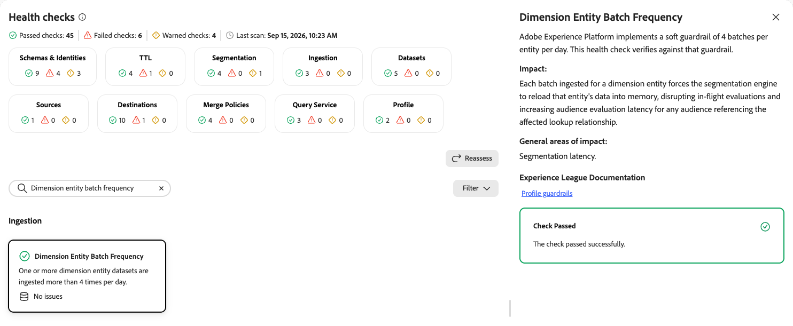
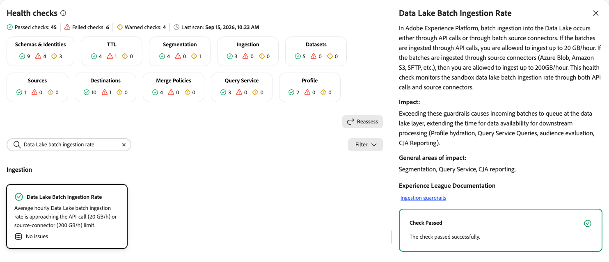

# Ingestion health checks

The ingestion health check scans your sandbox for batch ingestion volume approaching the platform guardrail for Profile-enabled datasets.

| Check | Object type |
| --- | --- |
| [Batches per day (profile)](#batches-per-day-profile) | Dataset |
| [Dimension entity batch frequency](#dimension-entity-batch-frequency) | Dataset |
| [Data Lake batch ingestion rate](#data-lake-batch-ingestion-rate) | Dataset |

## Batches per day (profile) {#batches-per-day-profile}

Scans the combined daily count of Profile and Experience Event batches ingested into a sandbox against the platform guardrail.

| Detail | Description |
| --- | --- |
| **Issue** | The combined count of Profile and Experience Event batches ingested into the sandbox in the last 24 hours is approaching the limit of 90 batches per day. |
| **Impact** | Exceeding the limit increases processing queue depth in the [!DNL Profile] store, which delays profile updates. Scheduled segmentation runs on its regular schedule regardless of whether all batches finished ingesting, which can lead to incorrect audience results from stale profile data. |
| **Remediation** | Consolidate ingestion to no more than one batch per dataset per 24 hours. Refer to the [!UICONTROL Job Schedules] dashboard to identify which datasets need batch count reduction. |

When you select the **[!UICONTROL Batches Per Day (Profile)]** card, a detail panel opens on the right. The panel shows:

* **[!UICONTROL Description]**: Explains that the per sandbox, per day limit for profile batch ingestion is 90 batches per day. This check inspects the combined daily count of Profile and Experience Event batches ingested into the sandbox for Profile-enabled datasets against the platform guardrail.
* **[!UICONTROL Impact]**: Exceeding 90 Profile or Experience Event batches per day increases processing queue depth in the [!DNL Profile] store, delaying profile updates. Scheduled segmentation starts on schedule regardless of whether all batches have finished ingesting, which can lead to incorrect audience results from stale profile data.
* **[!UICONTROL General areas of impact]**: Segmentation and activation results.
* **[!UICONTROL Experience League Documentation]**: A link to guardrails for data ingestion.
* **[!UICONTROL Recommendation]**: Consolidate ingestion to no more than one batch per dataset per 24 hours. Refer to the [!UICONTROL Job Schedules] dashboard to identify which datasets need batch count reduction.

{zoomable="yes"}

For more information, see the [guardrails for data ingestion](/help/ingestion/guardrails.md).

## Dimension entity batch frequency {#dimension-entity-batch-frequency}

Verifies that dimension entity datasets are not ingested more often than the platform guardrail.

| Detail | Description |
| --- | --- |
| **Issue** | One or more dimension entity datasets are ingested more than four times per day. |
| **Impact** | Each batch ingested for a dimension entity forces the segmentation engine to reload that entity's data into memory, disrupting in-flight evaluations and increasing audience evaluation latency for any audience referencing the affected lookup relationship. |
| **Remediation** | Consolidate ingestion of the affected dimension entity to four or fewer batches per day. |

When you select the **[!UICONTROL Dimension Entity Batch Frequency]** card, a detail panel opens on the right. The panel shows:

* **[!UICONTROL Description]**: Explains that [!DNL Experience Platform] implements a soft guardrail of four batches per entity per day. This check verifies against that guardrail.
* **[!UICONTROL Impact]**: Each batch ingested for a dimension entity forces the segmentation engine to reload that entity's data into memory, disrupting in-flight evaluations and increasing audience evaluation latency for any audience referencing the affected lookup relationship.
* **[!UICONTROL General areas of impact]**: Segmentation latency.
* **[!UICONTROL Experience League Documentation]**: A link to profile guardrails.

{zoomable="yes"}

For more information, see the [profile guardrails](/help/profile/guardrails.md).

## Data Lake batch ingestion rate {#data-lake-batch-ingestion-rate}

Monitors the sandbox Data Lake batch ingestion rate through both API calls and source connectors.

| Detail | Description |
| --- | --- |
| **Issue** | Average hourly Data Lake batch ingestion rate is approaching the 20 GB/h limit for API calls or the 200 GB/h limit for source connectors. |
| **Impact** | Exceeding these guardrails causes incoming batches to queue at the Data Lake layer, extending the time for data availability for downstream processing. This includes profile hydration, [!DNL Query Service] queries, audience evaluation, and [!DNL Customer Journey Analytics] reporting. |
| **Remediation** | Spread ingestion across a wider time window, or consolidate batches from multiple source connectors to stay within the guardrail. |

When you select the **[!UICONTROL Data Lake Batch Ingestion Rate]** card, a detail panel opens on the right. The panel shows:

* **[!UICONTROL Description]**: Explains that batch ingestion into the Data Lake occurs either through API calls or through batch source connectors. If the batches are ingested through API calls, you are allowed to ingest up to 20 GB/hour. If the batches are ingested through source connectors, such as Azure Blob, Amazon S3, or SFTP, you are allowed to ingest up to 200 GB/hour. This check monitors the sandbox Data Lake batch ingestion rate through both API calls and source connectors.
* **[!UICONTROL Impact]**: Exceeding these guardrails causes incoming batches to queue at the Data Lake layer, extending the time for data availability for downstream processing. This includes profile hydration, [!DNL Query Service] queries, audience evaluation, and [!DNL Customer Journey Analytics] reporting.
* **[!UICONTROL General areas of impact]**: Segmentation, [!DNL Query Service], and [!DNL Customer Journey Analytics] reporting.
* **[!UICONTROL Experience League Documentation]**: A link to ingestion guardrails.

{zoomable="yes"}

For more information, see the [guardrails for data ingestion](/help/ingestion/guardrails.md).

## Next steps {#next-steps}

* Return to the [health checks overview](/help/run-and-operate/health-checks/overview.md) to explore other check categories.
* Review [job schedules](/help/run-and-operate/job-schedules.md) to identify which datasets need batch count reduction.
