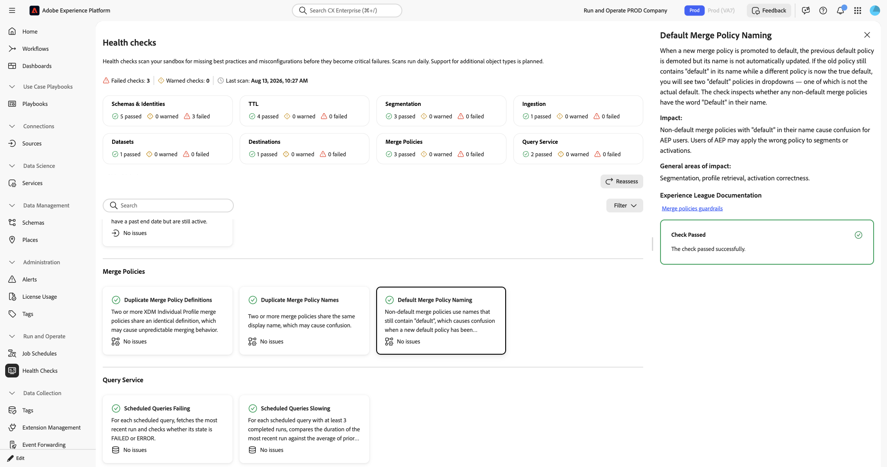
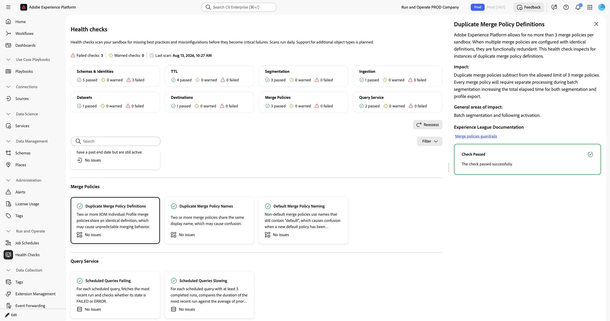
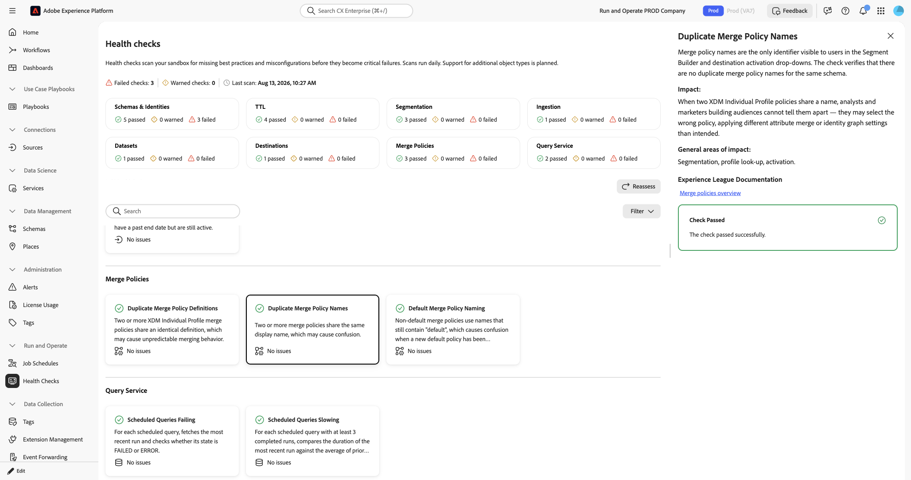

# Merge policies health checks

The merge policies health checks scan your sandbox for merge policy naming and definition issues that cause confusion during segmentation and activation.

| Check | Object type |
| --- | --- |
| [Default merge policy naming](#default-merge-policy-naming) | Sandbox |
| [Duplicate merge policy definitions](#duplicate-merge-policy-definitions) | Sandbox |
| [Duplicate merge policy names](#duplicate-merge-policy-names) | Sandbox |

## Default merge policy naming {#default-merge-policy-naming}

Scans for merge policies that still contain "default" in their name after they are no longer designated as the default policy.

| Detail | Description |
| --- | --- |
| **Issue** | A non-default merge policy has the word "default" in its name. |
| **Impact** | When a new merge policy is promoted to default, the previous default policy is demoted, but its name is not automatically updated. If the old policy still contains "default" in its name, two policies appear to be the default in dropdown menus, which causes confusion. |
| **Remediation** | Rename the affected merge policy to remove "default" from its name and reflect its current purpose. |

When you select the **[!UICONTROL Default Merge Policy Naming]** card, a detail panel opens on the right. The panel shows:

* **[!UICONTROL Description]**: Scans whether any non-default merge policies have the word "default" in their name.
* **[!UICONTROL Impact]**: Non-default merge policies with "default" in their name cause confusion. You might apply the wrong policy to a segment or activation.
* **[!UICONTROL General areas of impact]**: Segmentation, profile retrieval, and activation correctness.
* **[!UICONTROL Experience League Documentation]**: A link to guardrails for merge policies.

{zoomable="yes"}

For more information, see the [merge policies overview](/help/profile/merge-policies/overview.md) and [guardrails for merge policies](/help/profile/guardrails.md).

## Duplicate merge policy definitions {#duplicate-merge-policy-definitions}

Detects XDM Individual Profile merge policies that share an identical definition, which wastes a limited merge policy slot.

| Detail | Description |
| --- | --- |
| **Issue** | Two or more XDM Individual Profile merge policies share an identical definition. |
| **Impact** | Duplicate merge policies subtract from the allowed limit of 3 merge policies per sandbox. Every merge policy requires separate processing during batch segmentation, increasing the total elapsed time for both segmentation and profile export. |
| **Remediation** | Review the affected merge policies and delete the duplicate, keeping the one that is referenced by existing segments and activations. |

When you select the **[!UICONTROL Duplicate Merge Policy Definitions]** card, a detail panel opens on the right. The panel shows:

* **[!UICONTROL Description]**: Explains that [!DNL Experience Platform] allows for no more than 3 merge policies per sandbox. When multiple merge policies are configured with identical definitions, they are functionally redundant. This check inspects for instances of duplicate merge policy definitions.
* **[!UICONTROL Impact]**: Duplicate merge policies subtract from the allowed limit of 3 merge policies. Every merge policy requires separate processing during batch segmentation, increasing the total elapsed time for both segmentation and profile export.
* **[!UICONTROL General areas of impact]**: Batch segmentation and subsequent activation.
* **[!UICONTROL Experience League Documentation]**: A link to guardrails for merge policies.

{zoomable="yes"}

For more information, see the [merge policies overview](/help/profile/merge-policies/overview.md) and [guardrails for merge policies](/help/profile/guardrails.md).

## Duplicate merge policy names {#duplicate-merge-policy-names}

Scans for merge policies within the same schema that share the same display name.

| Detail | Description |
| --- | --- |
| **Issue** | Two or more merge policies for the same schema share the same display name. |
| **Impact** | Merge policy names are the only identifier visible in [!UICONTROL Segment Builder] and destination activation dropdown menus. When two policies share a name, you cannot tell them apart, which can lead to selecting the wrong policy and applying unintended attribute merge or identity graph settings. |
| **Remediation** | Rename one or both of the affected merge policies so that each name is unique within the schema. |

When you select the **[!UICONTROL Duplicate Merge Policy Names]** card, a detail panel opens on the right. The panel shows:

* **[!UICONTROL Description]**: Verifies that there are no duplicate merge policy names for the same schema.
* **[!UICONTROL Impact]**: When two [!DNL XDM Individual Profile] policies share a name, you cannot tell them apart when building audiences, which can lead to selecting the wrong policy.
* **[!UICONTROL General areas of impact]**: Segmentation, profile lookup, and activation.
* **[!UICONTROL Experience League Documentation]**: A link to the merge policies overview.

{zoomable="yes"}

For more information, see the [merge policies overview](/help/profile/merge-policies/overview.md).

## Next steps {#next-steps}

* Return to the [health checks overview](/help/run-and-operate/health-checks/overview.md) to explore other check categories.
* Review the [merge policies overview](/help/profile/merge-policies/overview.md) to manage your merge policies.
