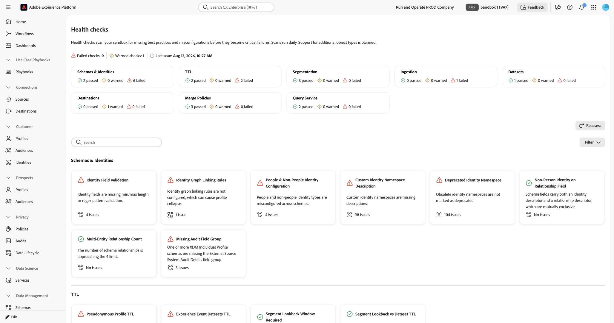

# Health Checks

Health checks scan your schemas, identities, and datasets in your sandbox and provide a summary of issues that you can explore and troubleshoot with AI Assistant.

Poor schema and identity configurations lead to significant downstream issues, including incorrect profile creation, failed audience qualification, and inaccurate activation. These issues are difficult to detect and often require specialized expertise to diagnose. Health checks shift your approach from reactive troubleshooting to proactive, preventative maintenance.

With health checks, you can:

* **Detect configuration issues early**: Identify missing best practices, misconfigurations, and patterns that lead to inefficiencies in personalization, activation, and more.
* **Receive guided remediation**: Get clear guidance on what each issue is and what to do about it.
* **Monitor continuously**: Currently, health checks run daily automatic scans so that you can catch problems before they become critical failures. The schedule may change in future releases.

## Prerequisites {#prerequisites}

To access health checks, you need the **[!UICONTROL View Health Checks]** [access control permission](/help/access-control/home.md#permissions). Contact your system administrator to ensure you have the appropriate permissions.

## Access health checks {#access-health-checks}

To access health checks from the [!UICONTROL Experience Platform] UI:

1. Select **[!UICONTROL Run and Operate]** from the left navigation.
1. Select **[!UICONTROL Health Checks]**.

The health checks dashboard displays a summary of your most recent scan results.

## Understanding the dashboard {#understanding-dashboard}

The health checks dashboard provides three areas of information to help you assess the state of your implementation.

### Objects evaluated {#objects-evaluated}

The **[!UICONTROL Objects evaluated]** section shows the total number of schemas, identity namespaces, and datasets scanned, along with how many issues were found for each category. This gives you a quick view of the scope and severity of configuration problems in your sandbox.

### Scan results {#scan-results}

The **[!UICONTROL Scan results]** section displays the number of failed checks. A failed check indicates that one or more of the health checks detected configuration issues that require attention. The **Last daily health scan completed on** timestamp shows when the most recent scan ran.

### Identified issues {#identified-issues}

The **[!UICONTROL Identified issues]** section shows a card for each health check. Each card displays:

* The health check name and a brief description of the issue.
* The number of issues found, or a confirmation that no issues exist.
* A status indicator showing whether the check passed or requires attention.

Select any card to explore the details of that health check.

## Available health checks {#available-health-checks}

Health checks currently evaluate checks across eight categories. Select a category to view its checks in detail.

| Category | Description | Checks |
| --- | --- | --- |
| [Schemas and identities](schemas-and-identities.md) | Data modeling and identity configuration issues across schemas and identity namespaces. | 8 |
| [TTL](ttl.md) | Data expiration and lookback window configuration for profiles, datasets, and segments. | 4 |
| [Segmentation](segmentation.md) | Audience counts and evaluation methods approaching sandbox limits. | 3 |
| [Ingestion](ingestion.md) | Batch ingestion volume approaching platform guardrails. | 1 |
| [Datasets](datasets.md) | Profile-enabled dataset counts approaching platform limits. | 1 |
| [Destinations](destinations.md) | Destination activation schedule configuration issues. | 1 |
| [Merge policies](merge-policies.md) | Merge policy naming and definition issues that affect segmentation and activation. | 3 |
| [Query Service](query-service.md) | Scheduled query failures and performance degradation. | 2 |

These checks target the most impactful data modeling, data lifecycle, segmentation, ingestion, and activation issues across the platform.

## Next steps {#next-steps}

After reviewing your health check results, explore the following resources to deepen your understanding:

* Learn about [schema best practices](/help/xdm/schema/best-practices.md) for designing reliable data models.
* Understand [identity graph linking rules](/help/identity-service/identity-graph-linking-rules/overview.md) to prevent profile collapse.
* Review [identity namespace documentation](/help/identity-service/features/namespaces.md) for namespace management best practices.
* Configure [pseudonymous profile expiration](/help/profile/pseudonymous-profiles.md) to manage data retention and reduce Addressable Audience overages.
* Set up [Experience Event dataset retention](/help/catalog/datasets/experience-event-dataset-retention-ttl-guide.md) to prevent data bloat and performance degradation.
* Explore other [Run and Operate tools](/help/run-and-operate/overview.md) including [[!UICONTROL Job Schedules]](/help/run-and-operate/job-schedules.md) for batch operation visibility.
* To summarize your latest health check assessment results, ask an MCP-compatible AI client connected through [Adobe CX Coworker Gateway](https://experienceleague.adobe.com/en/docs/cx-enterprise-ai/experience-cloud-ai/mcp/overview){target="_blank"}. See [Experience Platform tools in Adobe CX Coworker Gateway](https://experienceleague.adobe.com/en/docs/cx-enterprise-ai/experience-cloud-ai/mcp/mcp-product-tools/aep-mcp){target="_blank"}.
