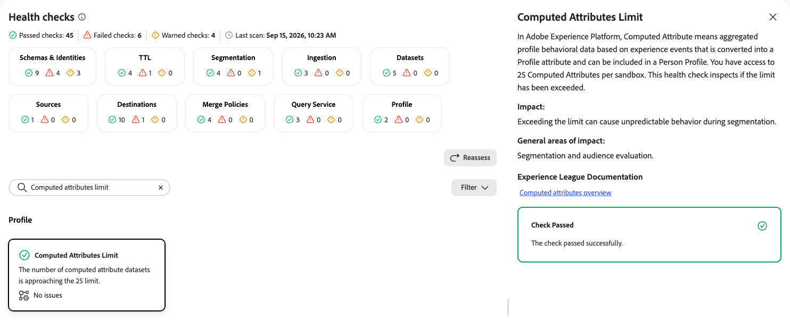
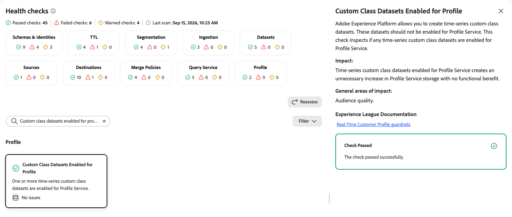

# Profile health checks

The profile health checks scan your sandbox for computed attribute datasets approaching platform limits and time-series custom class datasets that are enabled for Profile Service.

| Check | Object type |
| --- | --- |
| [Computed attributes limit](#computed-attributes-limit) | Dataset |
| [Custom class datasets enabled for profile](#custom-class-datasets-enabled-for-profile) | Dataset |

## Computed attributes limit {#computed-attributes-limit}

Inspects whether the number of computed attributes per sandbox has exceeded the platform limit.

| Detail | Description |
| --- | --- |
| **Issue** | The number of computed attribute datasets is approaching the 25 limit. |
| **Impact** | Exceeding the limit can cause unpredictable behavior during segmentation. |
| **Remediation** | Review existing computed attributes and remove any that are no longer needed before creating new ones. |

When you select the **[!UICONTROL Computed Attributes Limit]** card, a detail panel opens on the right. The panel shows:

* **[!UICONTROL Description]**: Explains that a computed attribute is aggregated profile behavioral data based on experience events that is converted into a profile attribute and can be included in a person profile. You have access to 25 computed attributes per sandbox. This check inspects whether the limit has been exceeded.
* **[!UICONTROL Impact]**: Exceeding the limit can cause unpredictable behavior during segmentation.
* **[!UICONTROL General areas of impact]**: Segmentation and audience evaluation.
* **[!UICONTROL Experience League Documentation]**: A link to the computed attributes overview.

{zoomable="yes"}

For more information, see the [computed attributes overview](/help/profile/computed-attributes/overview.md).

## Custom class datasets enabled for profile {#custom-class-datasets-enabled-for-profile}

Detects time-series custom class datasets that are enabled for Profile Service.

| Detail | Description |
| --- | --- |
| **Issue** | One or more time-series custom class datasets are enabled for Profile Service. |
| **Impact** | Time-series custom class datasets enabled for Profile Service create an unnecessary increase in Profile Service storage with no functional benefit. |
| **Remediation** | Disable Profile on the affected time-series custom class datasets. |

When you select the **[!UICONTROL Custom Class Datasets Enabled for Profile]** card, a detail panel opens on the right. The panel shows:

* **[!UICONTROL Description]**: Explains that [!DNL Experience Platform] allows you to create time-series custom class datasets. These datasets should not be enabled for Profile Service. This check inspects whether any time-series custom class datasets are enabled for Profile Service.
* **[!UICONTROL Impact]**: Time-series custom class datasets enabled for Profile Service create an unnecessary increase in Profile Service storage with no functional benefit.
* **[!UICONTROL General areas of impact]**: Audience quality.
* **[!UICONTROL Experience League Documentation]**: A link to [!DNL Real-Time Customer Profile] guardrails.

{zoomable="yes"}

For more information, see the [default guardrails for Real-Time Customer Profile data](/help/profile/guardrails.md).

## Next steps {#next-steps}

* Return to the [health checks overview](/help/run-and-operate/health-checks/overview.md) to explore other check categories.
