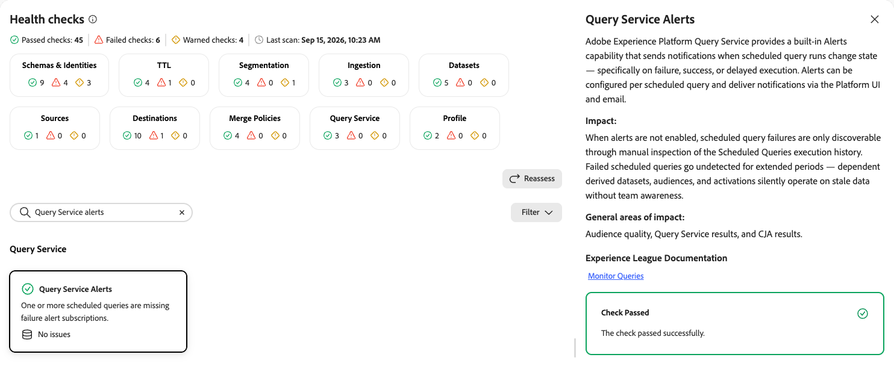

# Query Service health checks

The [!DNL Query Service] health checks scan your sandbox for scheduled queries that are failing or slowing down over time.

| Check | Object type |
| --- | --- |
| [Scheduled queries failing](#scheduled-queries-failing) | Dataset |
| [Scheduled queries slowing](#scheduled-queries-slowing) | Dataset |
| [Query Service alerts](#query-service-alerts) | Dataset |

## Scheduled queries failing {#scheduled-queries-failing}

Checks each scheduled query for its most recent run and flags any that failed or errored.

| Detail | Description |
| --- | --- |
| **Issue** | One or more scheduled queries failed or errored on their most recent run. |
| **Impact** | Without monitoring or alerting, scheduled queries can fail silently and repeatedly. This consumes compute resources without producing output and leaves target datasets stale, which is especially problematic for profile-enabled datasets. |
| **Remediation** | Inspect each failing scheduled query to find the root cause, then modify the query as needed to resolve the issue. |

When you select the **[!UICONTROL Scheduled Queries Failing]** card, a detail panel opens on the right. The panel shows:

* **[!UICONTROL Description]**: For each scheduled query, checks whether the most recent run has a status of failed or errored.
* **[!UICONTROL Impact]**: Without monitoring or alerting configured, scheduled queries can fail silently and repeatedly, consuming compute resources without producing query output and leaving target datasets stale. This is particularly problematic for profile-enabled datasets.
* **[!UICONTROL General areas of impact]**: Dataset contents and segmentation results.
* **[!UICONTROL Experience League Documentation]**: A link to guardrails for [!DNL Query Service].
* **[!UICONTROL Recommendation]**: Inspect each failing scheduled query to find the root cause. Modify the query as needed to resolve the issue.
* **[!UICONTROL Affected scheduled queries]**: A list of failing scheduled queries with their run ID and status. Use the link icon to open the query.

{zoomable="yes"}

For more information, see the [guardrails for Query Service](/help/query-service/guardrails.md).

## Scheduled queries slowing {#scheduled-queries-slowing}

Compares the duration of each scheduled query's most recent run against the average of its prior runs.

| Detail | Description |
| --- | --- |
| **Issue** | A scheduled query with at least three completed runs has a most recent run duration that is 50 percent or more slower than its historical average. |
| **Impact** | Queries continue to succeed but take progressively longer, which risks exceeding timeout thresholds and can overlap with scheduled batch segmentation. If the query writes to a profile-enabled dataset, this also affects segmentation results. |
| **Remediation** | Configure a data expiration on the Experience Event datasets that the query reads from, since datasets that grow indefinitely lead to continued increases in query duration. Also review the start times of your scheduled queries to reduce overlap. |

When you select the **[!UICONTROL Scheduled Queries Slowing]** card, a detail panel opens on the right. The panel shows:

* **[!UICONTROL Description]**: For each scheduled query with at least three completed runs, compares the most recent run duration against the average of prior runs. Flags queries whose latest run is 50 percent or more slower than the historical average.
* **[!UICONTROL Impact]**: Queries continue to succeed but take progressively longer, risking exceeding timeout thresholds and overlap with scheduled batch segmentation.
* **[!UICONTROL General areas of impact]**: Segmentation results, when the query writes to a profile-enabled dataset.
* **[!UICONTROL Experience League Documentation]**: A link to guardrails for [!DNL Query Service].
* **[!UICONTROL Recommendation]**: Set a data expiration on every Experience Event dataset your scheduled queries read from, since datasets that grow indefinitely cause continued increases in query duration. Review the start times of your scheduled queries to reduce overlap.
* **[!UICONTROL Affected scheduled queries]**: A list of slowing scheduled queries with their latest duration, average duration, and percentage slowdown. Use the link icon to open the query.

{zoomable="yes"}

For more information, see the [guardrails for Query Service](/help/query-service/guardrails.md) and the [Experience Event dataset retention documentation](/help/catalog/datasets/experience-event-dataset-retention-ttl-guide.md).

## Query Service alerts {#query-service-alerts}

Detects scheduled queries that are missing failure alert subscriptions.

| Detail | Description |
| --- | --- |
| **Issue** | One or more scheduled queries are missing failure alert subscriptions. |
| **Impact** | When alerts are not enabled, scheduled query failures are only discoverable through manual inspection of the scheduled queries execution history. Failed scheduled queries can go undetected for extended periods, and dependent derived datasets, audiences, and activations silently operate on stale data without team awareness. |
| **Remediation** | Configure an alert subscription for each scheduled query so that failure, success, or delayed execution notifications are delivered through the Platform UI and email. |

When you select the **[!UICONTROL Query Service Alerts]** card, a detail panel opens on the right. The panel shows:

* **[!UICONTROL Description]**: Explains that [!DNL Query Service] provides a built-in alerts capability that sends notifications when scheduled query runs change state, specifically on failure, success, or delayed execution. Alerts can be configured per scheduled query and deliver notifications through the Platform UI and email.
* **[!UICONTROL Impact]**: When alerts are not enabled, scheduled query failures are only discoverable through manual inspection of the scheduled queries execution history. Failed scheduled queries can go undetected for extended periods, and dependent derived datasets, audiences, and activations silently operate on stale data without team awareness.
* **[!UICONTROL General areas of impact]**: Audience quality, Query Service results, and [!DNL Customer Journey Analytics] results.
* **[!UICONTROL Experience League Documentation]**: A link to monitoring queries.

{zoomable="yes"}

For more information, see [Monitor queries](/help/query-service/ui/monitor-queries.md).

## Next steps {#next-steps}

* Return to the [health checks overview](/help/run-and-operate/health-checks/overview.md) to explore other check categories.
* Review the [guardrails for Query Service](/help/query-service/guardrails.md) to manage your scheduled queries.
