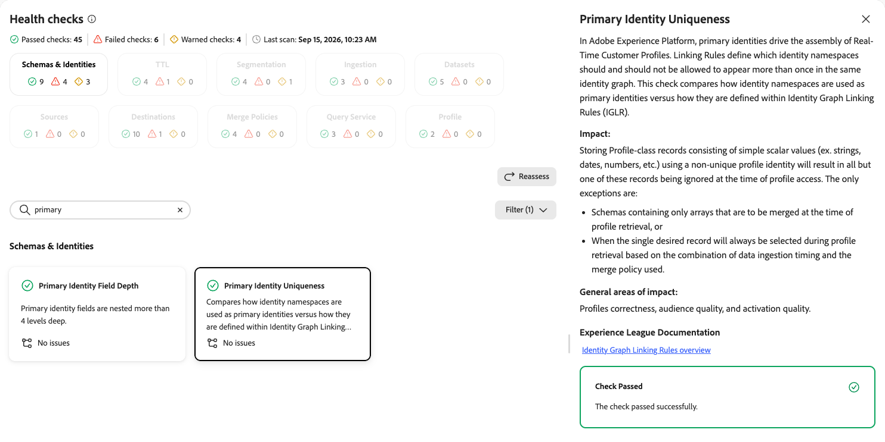
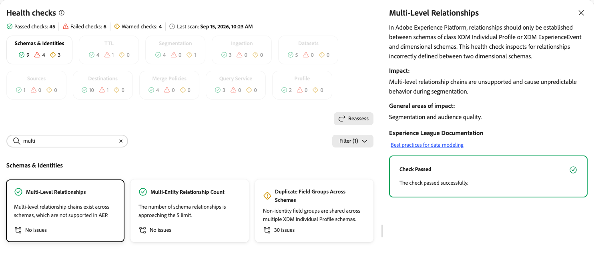
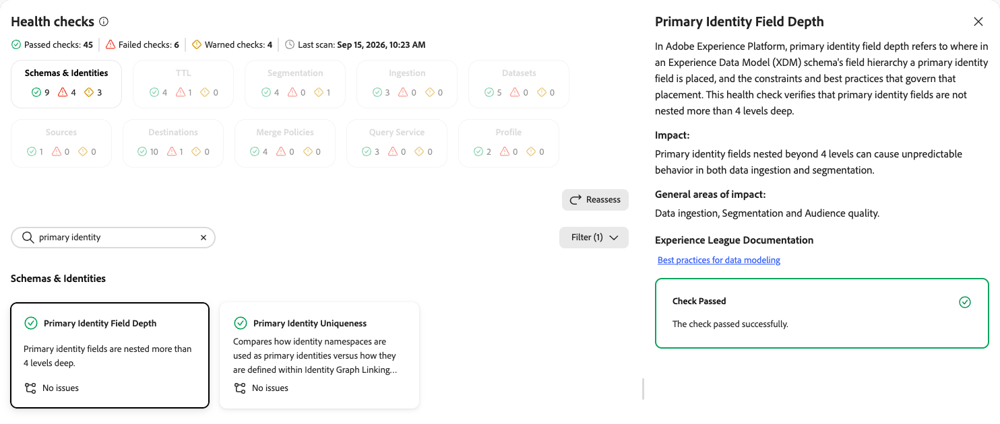
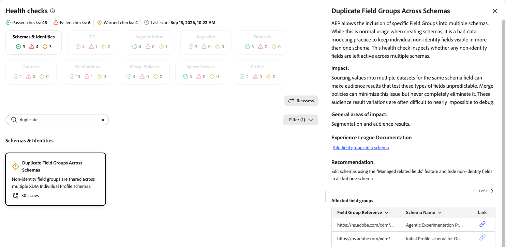
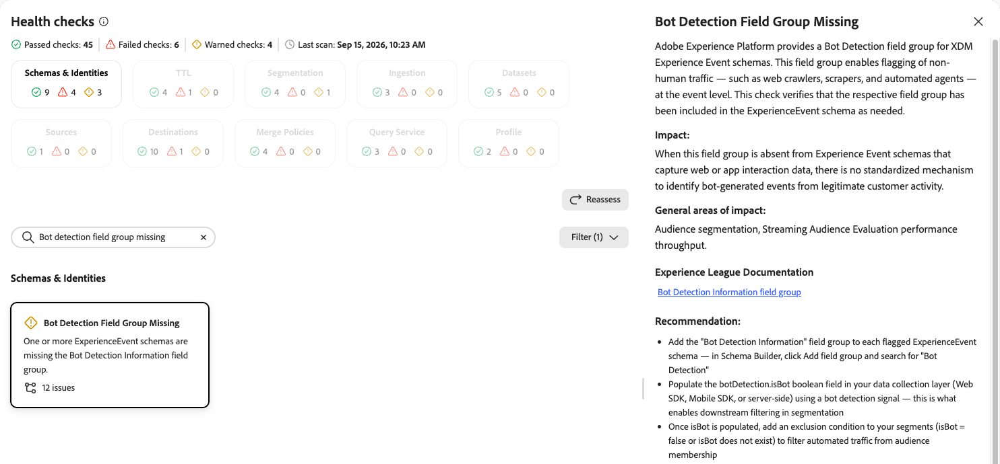
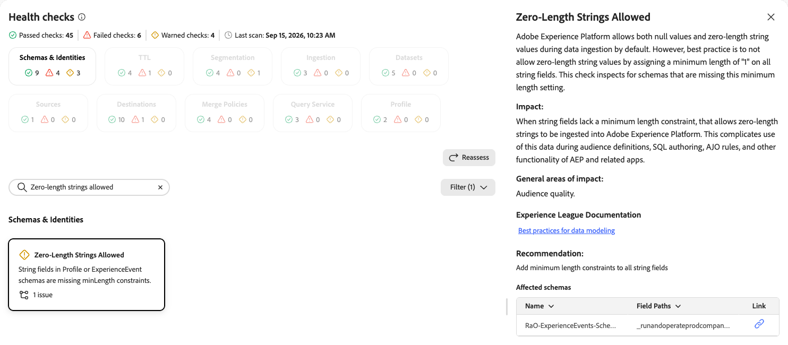
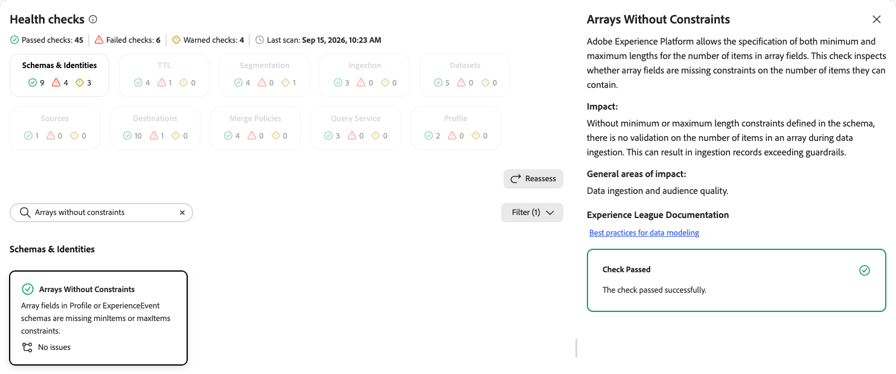
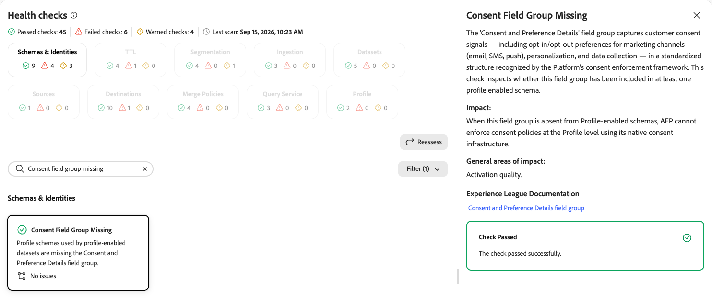

# Schemas and identities health checks

The schemas and identities health checks scan your schemas and identity namespaces for missing best practices and misconfigurations that lead to incomplete identity resolution, inflated profile counts, and inaccurate activation.

| Check | Object type |
| --- | --- |
| [Identity field validation](#identity-field-validation) | Schema |
| [Identity graph linking rules](#identity-graph-linking-rules) | Identity |
| [People and non-people identity configuration](#people-non-people-identity) | Schema, identity |
| [Custom identity namespace description](#namespace-missing-description) | Identity |
| [Identity namespace not in use](#namespace-not-in-use) | Identity |
| [Non-person identity on relationship field](#non-person-identity-relationship-field) | Schema |
| [Multi-entity relationship count](#multi-entity-relationship-count) | Schema |
| [Missing audit field group](#missing-audit-field-group) | Schema |
| [Primary identity uniqueness](#primary-identity-uniqueness) | Schema |
| [Multi-level relationships](#multi-level-relationships) | Schema |
| [Primary identity field depth](#primary-identity-field-depth) | Schema |
| [Duplicate field groups across schemas](#duplicate-field-groups-across-schemas) | Schema |
| [Bot detection field group missing](#bot-detection-field-group-missing) | Schema |
| [Zero-length strings allowed](#zero-length-strings-allowed) | Schema |
| [Arrays without constraints](#arrays-without-constraints) | Schema |
| [Consent field group missing](#consent-field-group-missing) | Schema |

## Identity field validation {#identity-field-validation}

Scans to ensure identity fields have minimum and maximum length constraints and regex pattern rules for data integrity.

| Detail | Description |
| --- | --- |
| **Issue** | Fields marked as identities are missing minimum/maximum length or pattern validation. |
| **Impact** | Without validation, garbage values can enter [!DNL Identity Service]. Values such as "0", "Guest", or mismatched casing (for example, "xyz123" versus "XYZ123") compromise the integrity of the profile that is assembled during segmentation and activation. |
| **Remediation** | Set minimum/maximum length and pattern constraints on custom fields marked as identities. Use regular expressions to enforce rules such as digits only, uppercase or lowercase, or specific character combinations. |

When you select the **[!UICONTROL Identity Field Validation]** card, a detail panel opens on the right. The panel shows:

* **[!UICONTROL Description]**: Scans to ensure identity fields have min/max lengths and regex pattern rules for data integrity. Lists affected schemas and fields.
* **[!UICONTROL Impact]**: If identity fields in schemas do not have min/max lengths and pattern validations set, it can lead to inconsistent data, which can compromise integrity and quality of data.
* **[!UICONTROL General areas of impact]**: Low-quality identifiers in [!DNL Identity Service]; unreliable stitching.
* **[!UICONTROL Experience League Documentation]**: A link to best practices for data modeling.
* **[!UICONTROL Affected Schemas]**: A list of affected schemas, each with an expander to view more details and a link to open the schema.

{zoomable="yes"}

For more information, see the [data integrity tips](/help/xdm/schema/best-practices.md#data-integrity-tips) in the schema best practices documentation.

## Identity graph linking rules {#identity-graph-linking-rules}

Verifies that identity graph linking rules are configured for a sandbox to prevent collapsed profiles.

| Detail | Description |
| --- | --- |
| **Issue** | Identity graph linking rules are not configured for this sandbox. |
| **Impact** | Without linking rules, multiple disparate profiles can merge into a single profile (graph collapse). Certain data from shared devices or non-unique identities can trigger unwanted merges, which leads to inaccurate personalization. |
| **Remediation** | Navigate to the **[!UICONTROL Identities]** menu, select **[!UICONTROL Settings]**, and select at least one unique-per-graph identity. This enables identity graph linking rules and prevents profile collapse. |

When you select the **[!UICONTROL Identity Graph Linking Rules]** card, a detail panel opens on the right. The panel shows:

* **[!UICONTROL Description]**: Verifies that proper linking rules are configured to prevent collapsed profiles. It shows current rule status and unique-per-graph identities.
* **[!UICONTROL Impact]**: If identity graph linking rules are not set, certain data could try to merge multiple disparate profiles into a single profile. To prevent unwanted merges, configurations provided through identity graph linking rules should be used.
* **[!UICONTROL General areas of impact]**: Collapsed or merged profiles.
* **[!UICONTROL Experience League Documentation]**: A link to the Identity Graph Linking Rules overview for more information.
* **[!UICONTROL Configure linking rules]**: When the check fails, a button appears so you can configure linking rules directly from the panel.

{zoomable="yes"}

For more information, see the [identity graph linking rules overview](/help/identity-service/identity-graph-linking-rules/overview.md) and the [implementation guide](/help/identity-service/identity-graph-linking-rules/implementation-guide.md).

## People and non-people identity configuration {#people-non-people-identity}

Validates the correct use of people and non-people identity types across schema classes.

| Detail | Description |
| --- | --- |
| **Issue** | Non-people identifiers are used on Individual Profile or Experience Event class schemas, or people identifiers are used on lookup schemas. |
| **Impact** | Non-people identifiers on profile schemas do not participate in the identity graph, which leads to incomplete identity resolution. People identifiers on lookup schemas inflate the profile count and make the data ineligible for lookup use cases. Both cases risk future product enhancements breaking your implementation. |
| **Remediation** | Review flagged schemas and correct the identity type assignments. Remove non-people identifiers from Individual Profile schemas when possible. For schemas already in use by datasets, refer to the [schema evolution rules](/help/xdm/schema/composition.md#evolution). |

When you select the **[!UICONTROL People & Non-People Identity Config]** card, a detail panel opens on the right. The panel shows:

* **[!UICONTROL Description]**: Validates proper use of identity types across schema classes. Lists misconfigured schemas and highlights wrong assignments.
* **[!UICONTROL Impact]**: If a non-people entity is given a person identity, this will inflate the profile count and make this data ineligible as a lookup. If a person entity is given a non-people identity, the data is not available for streaming or edge segmentation.
* **[!UICONTROL General areas of impact]**: Incomplete identity graphs; inflated profile counts; lookup misuse.
* **[!UICONTROL Affected Schemas]**: A list of schemas with issues. Expand a schema row to see the path, identity name, and schema type for each misconfiguration. Use the link icon to open the schema.

{zoomable="yes"}

For more information, see the [identity type documentation](/help/identity-service/features/namespaces.md#identity-type) and the [schema best practices](/help/xdm/schema/best-practices.md).

## Custom identity namespace description {#namespace-missing-description}

Scans to ensure that custom identity namespace metadata and descriptions are complete.

| Detail | Description |
| --- | --- |
| **Issue** | Custom identity namespaces are missing their description field. |
| **Impact** | Missing descriptions can lead to confusion during usage and debugging. |
| **Remediation** | Document each custom namespace by filling in the description field. Include validation criteria (minimum/maximum length, pattern) and lifecycle information that identifies which external source system creates these identities. |

When you select the **[!UICONTROL Custom Identity Namespace Description]** card, a detail panel opens on the right. The panel shows:

* **[!UICONTROL Description]**: Scans to ensure namespace metadata and descriptions are complete. Displays namespaces and owners with empty description fields.
* **[!UICONTROL Impact]**: Setting a description on a custom identity namespace enhances clarity by providing context of the purpose of each namespace. This helps team members and stakeholders quickly understand the function of each namespace without confusion.
* **[!UICONTROL General areas of impact]**: Debug or usage confusion; unclear validation intent.
* **[!UICONTROL Experience League Documentation]**: A link to Create Custom Namespaces for further information.
* **[!UICONTROL Affected namespaces]**: A list of custom identity namespaces that are missing descriptions. Use the link icon next to each namespace to view or edit it.

{zoomable="yes"}

For more information, see the documentation on [creating custom namespaces](/help/identity-service/features/namespaces.md#create-namespaces).

## Identity namespace not in use {#namespace-not-in-use}

Detects obsolete or unused identity namespaces that should be marked for cleanup. This check was previously documented as "Deprecated identity namespace."

| Detail | Description |
| --- | --- |
| **Issue** | Obsolete identity namespaces are not marked as deprecated. |
| **Impact** | Unused or obsolete namespaces create confusion about what is actively in use and increase the risk of mislabeling identity fields. |
| **Remediation** | Rename unused namespaces to include a "Do not use" prefix (for example, "Do not use - [original name]"). Adobe Experience Platform does not currently support namespace deletion, so renaming is the recommended approach. |

When you select the **[!UICONTROL Identity Namespace Not in Use]** card, a detail panel opens on the right. The panel shows:

* **[!UICONTROL Description]**: Detects obsolete or unused identity namespaces for cleanup. Lists unused namespaces with last usage timestamp or schema reference.
* **[!UICONTROL Impact]**: Identity namespaces not used in any schema should be marked for removal by adding a "DEPRECATED" or "DO NOT USE" tag to their names. Deletion of identity namespaces is not currently supported.
* **[!UICONTROL General areas of impact]**: Confusion and mislabeling risk.
* **[!UICONTROL Experience League Documentation]**: A link to Obsolete Identity Namespaces for further documentation.
* **[!UICONTROL Affected namespaces]**: A list of obsolete or unused identity namespaces. Use the link icon next to each namespace to view or manage it.

{zoomable="yes"}

For more information, see the [Experience Cloud knowledge base article on obsolete namespaces](https://experienceleague.adobe.com/en/docs/experience-cloud-kcs/kbarticles/ka-18155){target="_blank"}.

## Non-person identity on relationship field {#non-person-identity-relationship-field}

Flags schema fields that carry both an identity descriptor and a relationship descriptor at the same time.

| Detail | Description |
| --- | --- |
| **Issue** | A schema field has both an identity descriptor and a relationship descriptor applied, and these descriptors are mutually exclusive. |
| **Impact** | Including both descriptors on the same field is a data modeling error. Results may include incorrect segmentation and audience activations. |
| **Remediation** | Review the flagged field and remove either the identity descriptor or the relationship descriptor, depending on how the field should function. |

When you select the **[!UICONTROL Non-Person Identity on Relationship Field]** card, a detail panel opens on the right. The panel shows:

* **[!UICONTROL Description]**: Explains that putting a relationship descriptor on a schema field establishes a direct, dynamic join between two separate schemas. It tells the [!DNL Real-Time Customer Profile] store and [!UICONTROL Audience Builder] that a field in the primary or source schema acts as a foreign key pointing to a lookup or dimension record in the target schema. This check inspects for schema fields that carry both an identity descriptor and a relationship descriptor for the same field.
* **[!UICONTROL Impact]**: These descriptors are mutually exclusive, and including both on the same field is a data modeling error. The results may include incorrect segmentation and audience activations.
* **[!UICONTROL General areas of impact]**: Audience quality.
* **[!UICONTROL Experience League Documentation]**: A link to XDM schema composition for identity.
* **[!UICONTROL Affected schemas]**: A list of schemas with fields that have conflicting descriptors, when applicable. When no issues are detected, the panel shows a **[!UICONTROL Check Passed]** confirmation instead.

{zoomable="yes"}

For more information, see the [schema composition documentation](/help/xdm/schema/composition.md).

## Multi-entity relationship count {#multi-entity-relationship-count}

Monitors the number of multi-entity relationships defined in a sandbox as they approach the platform limit.

| Detail | Description |
| --- | --- |
| **Issue** | The number of multi-entity relationships defined in the sandbox is approaching the limit of 5. |
| **Impact** | High cardinality and excessive schema joins increase computational complexity across the [!DNL Real-Time Customer Profile] store. Exceeding the limit may degrade Segmentation Service performance and increase audience evaluation latency. |
| **Remediation** | Review existing multi-entity relationships and remove any that are no longer needed before creating new ones. |

When you select the **[!UICONTROL Multi-Entity Relationship Count]** card, a detail panel opens on the right. The panel shows:

* **[!UICONTROL Description]**: Explains that multi-entity relationships link primary entities, such as [!DNL Real-Time Customer Profiles] or [!DNL ExperienceEvents], to secondary dimension entities, such as product catalogs, store locations, or business accounts. This check inspects whether the limit of 5 multi-entity relationships defined in the sandbox is exceeded.
* **[!UICONTROL Impact]**: High cardinality and excessive schema joins increase computational complexity across the [!DNL Real-Time Customer Profile] store. Exceeding the limit may degrade Segmentation Service performance and increase audience evaluation latency.
* **[!UICONTROL General areas of impact]**: Batch segmentation.
* **[!UICONTROL Experience League Documentation]**: A link to best practices for data modeling.

{zoomable="yes"}

For more information, see the [data modeling best practices](/help/xdm/schema/best-practices.md) and the [multi-entity segmentation tutorial](/help/segmentation/tutorials/multi-entity-segmentation.md).

## Missing audit field group {#missing-audit-field-group}

Verifies that XDM Individual Profile schemas include the External Source System Audit Details field group.

| Detail | Description |
| --- | --- |
| **Issue** | One or more XDM Individual Profile schemas are missing the External Source System Audit Details field group. |
| **Impact** | Without audit fields, you have no record-level visibility into when data was ingested, making it difficult to troubleshoot stale or duplicate records. |
| **Remediation** | Add the External Source System Audit Details field group to schemas that are missing it. |

When you select the **[!UICONTROL Missing Audit Field Group]** card, a detail panel opens on the right. The panel shows:

* **[!UICONTROL Description]**: Verifies that XDM Individual Profile schemas include the External Source System Audit Details field group, which is required for tracking record provenance and update timestamps.
* **[!UICONTROL Impact]**: Without audit fields, there is no record-level visibility into when data was ingested into [!DNL Experience Platform], which makes it difficult to troubleshoot stale or duplicate records.
* **[!UICONTROL General areas of impact]**: Inability to audit external data changes.
* **[!UICONTROL Experience League Documentation]**: A link to the External Source System Audit Details field group.
* **[!UICONTROL Recommendation]**: Where missing, add the External Source System Audit Details field group.
* **[!UICONTROL Affected schemas]**: A list of schemas that are missing the field group. Use the link icon next to each schema to open it.

{zoomable="yes"}

For more information, see the [External Source System Audit Details field group documentation](/help/xdm/field-groups/shared/external-source-system-audit-details.md).

## Primary identity uniqueness {#primary-identity-uniqueness}

Compares how identity namespaces are used as primary identities against how they are defined in identity graph linking rules.

| Detail | Description |
| --- | --- |
| **Issue** | XDM Individual Profile schemas use a CROSS_DEVICE namespace as the primary identity without identity graph linking rules configured. |
| **Impact** | Storing Profile class records that consist of simple scalar values, such as strings, dates, and numbers, using a non-unique profile identity results in all but one of these records being ignored at profile access. Two exceptions apply: schemas containing only arrays merged at profile retrieval, and cases where the desired record is always selected based on ingestion timing and merge policy. |
| **Remediation** | Configure identity graph linking rules so that the CROSS_DEVICE namespace used as a primary identity is unique per graph. |

When you select the **[!UICONTROL Primary Identity Uniqueness]** card, a detail panel opens on the right. The panel shows:

* **[!UICONTROL Description]**: Explains that primary identities drive the assembly of [!DNL Real-Time Customer Profiles]. Linking rules define which identity namespaces should and should not be allowed to appear more than once in the same identity graph. This check compares how identity namespaces are used as primary identities against how they are defined within identity graph linking rules.
* **[!UICONTROL Impact]**: Storing Profile class records with simple scalar values using a non-unique profile identity results in all but one record being ignored at profile access. Two exceptions apply: schemas containing only merged arrays, and cases where the desired record is always selected based on ingestion timing and merge policy.
* **[!UICONTROL General areas of impact]**: Profile correctness, audience quality, and activation quality.
* **[!UICONTROL Experience League Documentation]**: A link to the identity graph linking rules overview.

{zoomable="yes"}

For more information, see the [identity graph linking rules overview](/help/identity-service/identity-graph-linking-rules/overview.md).

## Multi-level relationships {#multi-level-relationships}

Detects relationships that are incorrectly defined between two dimensional schemas.

| Detail | Description |
| --- | --- |
| **Issue** | Multi-level relationship chains exist across schemas, which are not supported in [!DNL Experience Platform]. |
| **Impact** | Multi-level relationship chains are unsupported and cause unpredictable behavior during segmentation. |
| **Remediation** | Review flagged schemas and remove relationships incorrectly defined between two dimensional schemas. Relationships should only be established between schemas of class XDM Individual Profile or XDM ExperienceEvent and dimensional schemas. |

When you select the **[!UICONTROL Multi-Level Relationships]** card, a detail panel opens on the right. The panel shows:

* **[!UICONTROL Description]**: Explains that relationships should only be established between schemas of class XDM Individual Profile or XDM ExperienceEvent and dimensional schemas. This check inspects for relationships incorrectly defined between two dimensional schemas.
* **[!UICONTROL Impact]**: Multi-level relationship chains are unsupported and cause unpredictable behavior during segmentation.
* **[!UICONTROL General areas of impact]**: Segmentation and audience quality.
* **[!UICONTROL Experience League Documentation]**: A link to best practices for data modeling.

{zoomable="yes"}

For more information, see the [data modeling best practices](/help/xdm/schema/best-practices.md).

## Primary identity field depth {#primary-identity-field-depth}

Verifies that primary identity fields are not nested too deeply in the schema field hierarchy.

| Detail | Description |
| --- | --- |
| **Issue** | Primary identity fields are nested more than four levels deep. |
| **Impact** | Primary identity fields nested beyond four levels can cause unpredictable behavior in both data ingestion and segmentation. |
| **Remediation** | Review flagged schemas and move primary identity fields to a shallower position in the field hierarchy. |

When you select the **[!UICONTROL Primary Identity Field Depth]** card, a detail panel opens on the right. The panel shows:

* **[!UICONTROL Description]**: Explains that primary identity field depth refers to where in an XDM schema's field hierarchy a primary identity field is placed, and the constraints and best practices that govern that placement. This check verifies that primary identity fields are not nested more than four levels deep.
* **[!UICONTROL Impact]**: Primary identity fields nested beyond four levels can cause unpredictable behavior in both data ingestion and segmentation.
* **[!UICONTROL General areas of impact]**: Data ingestion, segmentation, and audience quality.
* **[!UICONTROL Experience League Documentation]**: A link to best practices for data modeling.

{zoomable="yes"}

For more information, see the [data modeling best practices](/help/xdm/schema/best-practices.md).

## Duplicate field groups across schemas {#duplicate-field-groups-across-schemas}

Detects non-identity field groups that remain active across more than one schema.

| Detail | Description |
| --- | --- |
| **Issue** | Non-identity field groups are shared across multiple XDM Individual Profile schemas. |
| **Impact** | Sourcing values into multiple datasets for the same schema field can make audience results that test these fields unpredictable. Merge policies can minimize this issue but never completely eliminate it, and the resulting audience result variations are often difficult to debug. |
| **Remediation** | Edit schemas using the managed related fields feature and hide non-identity fields in all but one schema. |

When you select the **[!UICONTROL Duplicate Field Groups Across Schemas]** card, a detail panel opens on the right. The panel shows:

* **[!UICONTROL Description]**: Explains that [!DNL Experience Platform] allows the inclusion of specific field groups into multiple schemas. While this is normal usage when creating schemas, it is a bad data modeling practice to keep individual non-identity fields visible in more than one schema. This check inspects whether any non-identity fields are left active across multiple schemas.
* **[!UICONTROL Impact]**: Sourcing values into multiple datasets for the same schema field can make audience results that test these fields unpredictable. Merge policies can minimize this issue but never completely eliminate it, and the resulting variations are often difficult to debug.
* **[!UICONTROL General areas of impact]**: Segmentation and audience results.
* **[!UICONTROL Experience League Documentation]**: A link to adding field groups to a schema.
* **[!UICONTROL Recommendation]**: Edit schemas using the managed related fields feature and hide non-identity fields in all but one schema.
* **[!UICONTROL Affected field groups]**: A list of field groups shared across schemas, with the field group reference and schema name. Use the link icon to open the schema.

{zoomable="yes"}

For more information, see [Add field groups to a schema](/help/xdm/schema/composition.md).

## Bot detection field group missing {#bot-detection-field-group-missing}

Verifies that ExperienceEvent schemas include the Bot Detection Information field group.

| Detail | Description |
| --- | --- |
| **Issue** | One or more ExperienceEvent schemas are missing the Bot Detection Information field group. |
| **Impact** | When this field group is absent from ExperienceEvent schemas that capture web or app interaction data, there is no standardized mechanism to identify bot-generated events from legitimate customer activity. |
| **Remediation** | Add the Bot Detection Information field group to each flagged ExperienceEvent schema. In Schema Builder, select **[!UICONTROL Add field group]** and search for "Bot Detection." Populate the `botDetection.isBot` boolean field using a bot detection signal, then exclude bots from your segments. |

When you select the **[!UICONTROL Bot Detection Field Group Missing]** card, a detail panel opens on the right. The panel shows:

* **[!UICONTROL Description]**: Explains that [!DNL Experience Platform] provides a Bot Detection field group for XDM ExperienceEvent schemas. This field group enables flagging of non-human traffic, such as web crawlers, scrapers, and automated agents, at the event level. This check verifies that the field group has been included in the ExperienceEvent schema as needed.
* **[!UICONTROL Impact]**: When this field group is absent from ExperienceEvent schemas that capture web or app interaction data, there is no standardized mechanism to identify bot-generated events from legitimate customer activity.
* **[!UICONTROL General areas of impact]**: Audience segmentation and streaming audience evaluation performance throughput.
* **[!UICONTROL Experience League Documentation]**: A link to the Bot Detection Information field group.
* **[!UICONTROL Recommendation]**: Add the Bot Detection Information field group to each flagged ExperienceEvent schema. Populate the `botDetection.isBot` field using a bot detection signal, then exclude bots from your segments.

{zoomable="yes"}

For more information, see the [Bot Detection Information field group documentation](/help/xdm/field-groups/event/bot-detection-information.md).

## Zero-length strings allowed {#zero-length-strings-allowed}

Verifies that string fields require a minimum length of one character.

| Detail | Description |
| --- | --- |
| **Issue** | String fields in Profile or ExperienceEvent schemas are missing minLength constraints. |
| **Impact** | When string fields lack a minimum length constraint, zero-length strings can be ingested into [!DNL Experience Platform]. This complicates the use of this data during audience definitions, SQL authoring, [!DNL Adobe Journey Optimizer] rules, and other Platform and related app functionality. |
| **Remediation** | Add a minimum length constraint of one to all string fields. |

When you select the **[!UICONTROL Zero-Length Strings Allowed]** card, a detail panel opens on the right. The panel shows:

* **[!UICONTROL Description]**: Explains that [!DNL Experience Platform] allows both null values and zero-length string values during data ingestion by default. Best practice is to disallow zero-length string values by assigning a minimum length of one on all string fields. This check inspects for schemas that are missing this minimum length setting.
* **[!UICONTROL Impact]**: When string fields lack a minimum length constraint, zero-length strings can be ingested, which complicates use of this data during audience definitions, SQL authoring, [!DNL Adobe Journey Optimizer] rules, and other functionality.
* **[!UICONTROL General areas of impact]**: Audience quality.
* **[!UICONTROL Experience League Documentation]**: A link to best practices for data modeling.
* **[!UICONTROL Recommendation]**: Add minimum length constraints to all string fields.
* **[!UICONTROL Affected schemas]**: A list of affected schemas and field paths. Use the link icon to open the schema.

{zoomable="yes"}

For more information, see the [data modeling best practices](/help/xdm/schema/best-practices.md).

## Arrays without constraints {#arrays-without-constraints}

Verifies that array fields define minimum and maximum item constraints.

| Detail | Description |
| --- | --- |
| **Issue** | Array fields in Profile or ExperienceEvent schemas are missing minItems or maxItems constraints. |
| **Impact** | Without minimum or maximum length constraints defined in the schema, there is no validation on the number of items in an array during data ingestion, which can result in ingestion records exceeding guardrails. |
| **Remediation** | Add minimum and maximum item count constraints to array fields that are missing them. |

When you select the **[!UICONTROL Arrays Without Constraints]** card, a detail panel opens on the right. The panel shows:

* **[!UICONTROL Description]**: Explains that [!DNL Experience Platform] allows the specification of both minimum and maximum lengths for the number of items in array fields. This check inspects whether array fields are missing constraints on the number of items they can contain.
* **[!UICONTROL Impact]**: Without minimum or maximum length constraints defined in the schema, there is no validation on the number of items in an array during data ingestion, which can result in ingestion records exceeding guardrails.
* **[!UICONTROL General areas of impact]**: Data ingestion and audience quality.
* **[!UICONTROL Experience League Documentation]**: A link to best practices for data modeling.

{zoomable="yes"}

For more information, see the [data modeling best practices](/help/xdm/schema/best-practices.md).

## Consent field group missing {#consent-field-group-missing}

Verifies that profile-enabled schemas include the Consent and Preference Details field group.

| Detail | Description |
| --- | --- |
| **Issue** | Profile schemas used by profile-enabled datasets are missing the Consent and Preference Details field group. |
| **Impact** | When this field group is absent from profile-enabled schemas, [!DNL Experience Platform] cannot enforce consent policies at the profile level using its native consent infrastructure. |
| **Remediation** | Add the Consent and Preference Details field group to at least one profile-enabled schema. |

When you select the **[!UICONTROL Consent Field Group Missing]** card, a detail panel opens on the right. The panel shows:

* **[!UICONTROL Description]**: Explains that the Consents and Preferences field group captures customer consent signals, such as opt-in and opt-out preferences for marketing channels, personalization, and data collection, in a standardized structure. This check inspects whether the field group is included in at least one profile-enabled schema.
* **[!UICONTROL Impact]**: When this field group is absent from profile-enabled schemas, [!DNL Experience Platform] cannot enforce consent policies at the profile level using its native consent infrastructure.
* **[!UICONTROL General areas of impact]**: Activation quality.
* **[!UICONTROL Experience League Documentation]**: A link to the Consents and Preferences field group.

{zoomable="yes"}

For more information, see the [Consents and Preferences field group documentation](/help/xdm/field-groups/profile/consents.md).

## Next steps {#next-steps}

* Return to the [health checks overview](/help/run-and-operate/health-checks/overview.md) to explore other check categories.
* Learn about [schema best practices](/help/xdm/schema/best-practices.md) for designing reliable data models.
* Understand [identity graph linking rules](/help/identity-service/identity-graph-linking-rules/overview.md) to prevent profile collapse.
* Review [identity namespace documentation](/help/identity-service/features/namespaces.md) for namespace management best practices.
