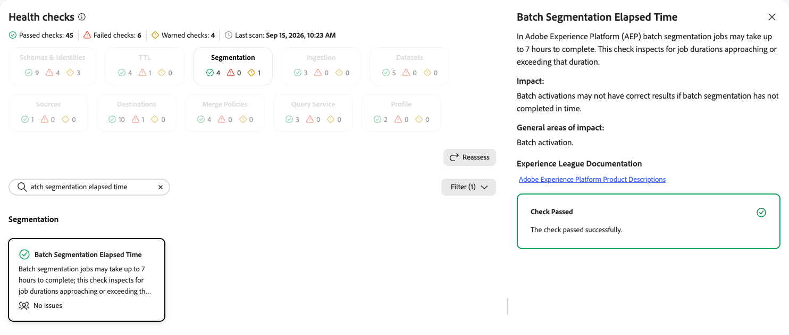
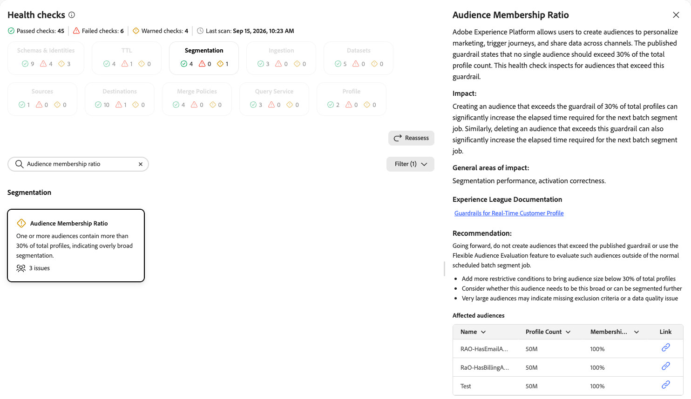

# Segmentation health checks

The segmentation health checks scan your sandbox for audience counts approaching platform limits across batch, streaming, and edge evaluation methods.

| Check | Object type |
| --- | --- |
| [Audience sandbox limit](#audience-sandbox-limit) | Segment |
| [Streaming audiences](#streaming-audiences) | Segment |
| [Edge audiences](#edge-audiences) | Segment |
| [Batch segmentation elapsed time](#batch-segmentation-elapsed-time) | Segment |
| [Audience membership ratio](#audience-membership-ratio) | Segment |

## Audience sandbox limit {#audience-sandbox-limit}

Scans the total number of active audience definitions in a sandbox against the platform limit.

| Detail | Description |
| --- | --- |
| **Issue** | The total number of active audience definitions in the sandbox is approaching the limit of 4,000. |
| **Impact** | Every active audience is re-evaluated in each scheduled batch segmentation job. Approaching the limit increases the latency of every batch segmentation job. |
| **Remediation** | Review your active audiences and deactivate or delete any that are no longer needed. |

When you select the **[!UICONTROL Audience Sandbox Limit]** card, a detail panel opens on the right. The panel shows:

* **[!UICONTROL Description]**: Scans whether the total number of audiences defined in the sandbox exceeds the limit of 4,000. Every defined audience, whether batch, streaming, or edge, is re-evaluated in every scheduled batch segmentation job.
* **[!UICONTROL Impact]**: Exceeding 4,000 audiences increases the latency of every batch segmentation job.
* **[!UICONTROL General areas of impact]**: Batch segmentation and activation.
* **[!UICONTROL Experience League Documentation]**: A link to guardrails for [!DNL Real-Time Customer Profile].

{zoomable="yes"}

For more information, see the [guardrails for Real-Time Customer Profile data and segmentation](/help/profile/guardrails.md).

## Streaming audiences {#streaming-audiences}

Scans the number of streaming-evaluated audiences in a sandbox against the platform limit.

| Detail | Description |
| --- | --- |
| **Issue** | The number of streaming-evaluated audiences in the sandbox is approaching the limit of 500. |
| **Impact** | Streaming audiences consume significant compute resources. Approaching the limit causes performance degradation across all streaming audiences in the sandbox, increasing evaluation latency. |
| **Remediation** | Review your streaming audiences and consolidate or remove any that are no longer needed. |

When you select the **[!UICONTROL Streaming Audiences]** card, a detail panel opens on the right. The panel shows:

* **[!UICONTROL Description]**: Scans whether the number of streaming-evaluated audiences in the sandbox exceeds the guardrail of 500.
* **[!UICONTROL Impact]**: Exceeding the guardrail causes performance degradation across all streaming audiences in the sandbox, increasing evaluation latency.
* **[!UICONTROL General areas of impact]**: Real-time audience evaluation and activation.
* **[!UICONTROL Experience League Documentation]**: A link to guardrails for [!DNL Real-Time Customer Profile].

{zoomable="yes"}

For more information, see the [guardrails for Real-Time Customer Profile data and segmentation](/help/profile/guardrails.md) and the [streaming segmentation documentation](/help/segmentation/methods/streaming-segmentation.md).

## Edge audiences {#edge-audiences}

Scans the number of edge-evaluated audiences in a sandbox against the platform limit.

| Detail | Description |
| --- | --- |
| **Issue** | The number of edge-evaluated audiences in the sandbox is approaching the limit of 150. |
| **Impact** | Exceeding the limit causes performance degradation across all edge audiences in the sandbox, increasing evaluation latency and risking timeouts for real-time decisioning. |
| **Remediation** | Consolidate overlapping edge audiences where possible. Audit existing edge audiences to identify candidates that can move to streaming evaluation. Only audiences that require sub-second qualification at page load need edge evaluation. |

When you select the **[!UICONTROL Edge Audiences]** card, a detail panel opens on the right. The panel shows:

* **[!UICONTROL Description]**: Scans whether the number of edge-evaluated audiences in the sandbox exceeds the guardrail of 150.
* **[!UICONTROL Impact]**: Exceeding 150 edge audiences causes performance degradation across all edge audiences in the sandbox, increasing evaluation latency and risking timeouts for real-time decisioning.
* **[!UICONTROL General areas of impact]**: Edge-based real-time audience evaluation and personalization.
* **[!UICONTROL Experience League Documentation]**: A link to guardrails for [!DNL Real-Time Customer Profile].
* **[!UICONTROL Recommendation]**: Consolidate overlapping edge audiences where possible to reduce the total count. Audit existing edge audiences to identify candidates that can move to streaming evaluation.
* **[!UICONTROL Edge Audiences]**: The current count of edge audiences against the sandbox limit.

{zoomable="yes"}

For more information, see the [guardrails for Real-Time Customer Profile data and segmentation](/help/profile/guardrails.md) and the [edge segmentation documentation](/help/segmentation/methods/edge-segmentation.md).

## Batch segmentation elapsed time {#batch-segmentation-elapsed-time}

Inspects for batch segmentation job durations approaching or exceeding the expected completion window.

| Detail | Description |
| --- | --- |
| **Issue** | Batch segmentation jobs may take up to seven hours to complete. This check inspects for job durations approaching or exceeding that duration. |
| **Impact** | Batch activations may not have correct results if batch segmentation has not completed in time. |
| **Remediation** | Review your audience definitions and segmentation schedule to reduce batch job duration, such as by reducing overlapping schedules or simplifying complex audience definitions. |

When you select the **[!UICONTROL Batch Segmentation Elapsed Time]** card, a detail panel opens on the right. The panel shows:

* **[!UICONTROL Description]**: Explains that batch segmentation jobs may take up to seven hours to complete. This check inspects for job durations approaching or exceeding that duration.
* **[!UICONTROL Impact]**: Batch activations may not have correct results if batch segmentation has not completed in time.
* **[!UICONTROL General areas of impact]**: Batch activation.
* **[!UICONTROL Experience League Documentation]**: A link to [!DNL Adobe Experience Platform] product descriptions.

{zoomable="yes"}

For more information, see the [Adobe Experience Platform product descriptions](https://helpx.adobe.com/legal/product-descriptions/adobe-experience-platform.html){target="_blank"}.

## Audience membership ratio {#audience-membership-ratio}

Inspects for audiences that exceed the published guardrail for total profile membership.

| Detail | Description |
| --- | --- |
| **Issue** | One or more audiences contain more than 30 percent of total profiles, indicating overly broad segmentation. |
| **Impact** | Creating an audience that exceeds the guardrail of 30 percent of total profiles can significantly increase the elapsed time required for the next batch segment job. Deleting an audience that exceeds this guardrail can also significantly increase the elapsed time required for the next batch segment job. |
| **Remediation** | Do not create audiences that exceed the published guardrail, or use the Flexible Audience Evaluation feature to evaluate them outside the normal scheduled batch segment job. Add more restrictive conditions to bring the audience size below 30 percent of total profiles, or consider whether it can be segmented further. |

When you select the **[!UICONTROL Audience Membership Ratio]** card, a detail panel opens on the right. The panel shows:

* **[!UICONTROL Description]**: Explains that [!DNL Experience Platform] allows you to create audiences to personalize marketing, trigger journeys, and share data across channels. The published guardrail states that no single audience should exceed 30 percent of the total profile count. This check inspects for audiences that exceed this guardrail.
* **[!UICONTROL Impact]**: Creating or deleting an audience that exceeds the guardrail of 30 percent of total profiles can significantly increase the elapsed time required for the next batch segment job.
* **[!UICONTROL General areas of impact]**: Segmentation performance and activation correctness.
* **[!UICONTROL Experience League Documentation]**: A link to guardrails for [!DNL Real-Time Customer Profile].
* **[!UICONTROL Recommendation]**: Going forward, do not create audiences that exceed the published guardrail, or use the Flexible Audience Evaluation feature to evaluate such audiences outside of the normal scheduled batch segment job. Add more restrictive conditions, consider whether the audience can be segmented further, and review whether the size indicates missing exclusion criteria or a data quality issue.
* **[!UICONTROL Affected audiences]**: A list of audiences that exceed the guardrail, with the profile count and membership percentage for each. Use the link icon to open the audience.

{zoomable="yes"}

For more information, see the [guardrails for Real-Time Customer Profile data and segmentation](/help/profile/guardrails.md).

## Next steps {#next-steps}

* Return to the [health checks overview](/help/run-and-operate/health-checks/overview.md) to explore other check categories.
* Learn about [streaming segmentation](/help/segmentation/methods/streaming-segmentation.md) and [edge segmentation](/help/segmentation/methods/edge-segmentation.md).
