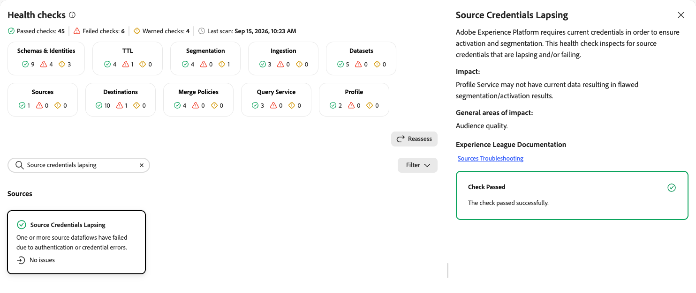

# Sources health checks

The sources health check scans your sandbox for source dataflows that have failed due to authentication or credential issues.

| Check | Object type |
| --- | --- |
| [Source credentials lapsing](#source-credentials-lapsing) | Source |

## Source credentials lapsing {#source-credentials-lapsing}

Inspects for source credentials that are lapsing or failing.

| Detail | Description |
| --- | --- |
| **Issue** | One or more source dataflows have failed due to authentication or credential errors. |
| **Impact** | Real-Time Customer Profile may not have current data, resulting in flawed segmentation or activation results. |
| **Remediation** | Refresh or reconfigure the affected source credentials to restore the dataflow. |

When you select the **[!UICONTROL Source Credentials Lapsing]** card, a detail panel opens on the right. The panel shows:

* **[!UICONTROL Description]**: Explains that [!DNL Experience Platform] requires current credentials to ensure activation and segmentation. This check inspects for source credentials that are lapsing or failing.
* **[!UICONTROL Impact]**: [!DNL Profile] Service may not have current data, resulting in flawed segmentation or activation results.
* **[!UICONTROL General areas of impact]**: Audience quality.
* **[!UICONTROL Experience League Documentation]**: A link to sources troubleshooting.

{zoomable="yes"}

For more information, see [Sources troubleshooting](/help/sources/troubleshooting.md).

## Next steps {#next-steps}

* Return to the [health checks overview](/help/run-and-operate/health-checks/overview.md) to explore other check categories.
