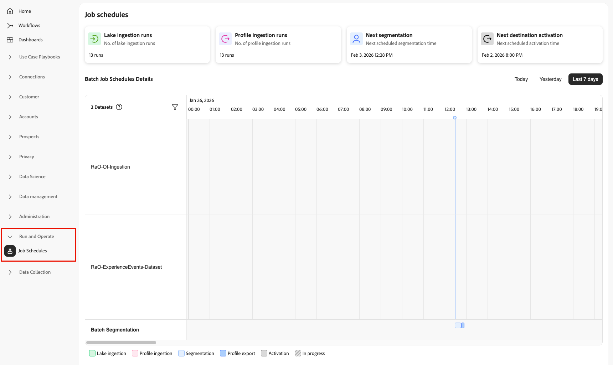
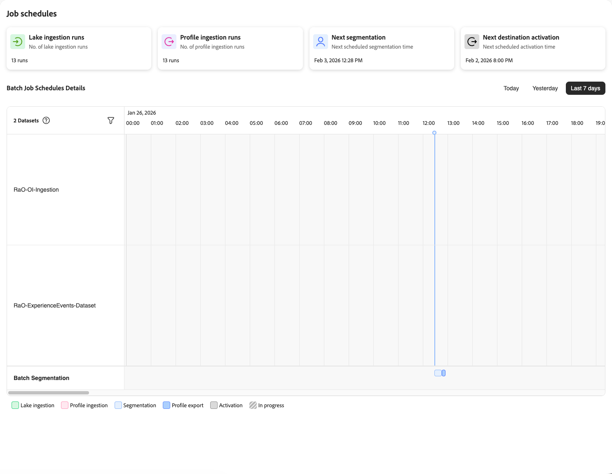

# Monitor job schedules

When scheduled batch jobs fail or run longer than expected, you need to quickly understand what went wrong. The issue could be in data lake ingestion, profile processing, segmentation, or destination activation. Without visibility into job execution and dependencies, troubleshooting these failures across multiple processing stages can take hours.

With [!UICONTROL Job Schedules], you can monitor all your scheduled batch processing jobs in one place. You can view execution status, identify patterns, diagnose configuration issues, and understand dependencies across your entire data pipeline—from ingestion through activation.

## Prerequisites {#prerequisites}

To gain access to Run and Operate capabilities, you need the **[!UICONTROL View Job Schedules]** [access control permissions](/help/access-control/home.md#permissions).

Contact your system administrator to ensure you have the appropriate permissions to view and use these tools.

## Getting started {#getting-started}

Before using [!UICONTROL Job Schedules], you should understand these Adobe Experience Platform concepts:

* **[Batch ingestion](../ingestion/batch-ingestion/overview.md)**: How data is loaded into the data lake and profile store on scheduled intervals.
* **[Segmentation](../segmentation/home.md)**: How audiences are evaluated and updated based on profile data and segment definitions.
* **[Real-Time Customer Profile](../profile/home.md)**: How profile data is unified and made available for segmentation and activation.
* **[Destinations](../destinations/home.md)**: Where and how data is activated to downstream systems and marketing platforms.

Understanding these components helps you interpret job execution patterns and diagnose issues when they occur.

## Understanding the Job Schedules interface {#understanding-interface}

To access [!UICONTROL Job Schedules]:

1. In the Experience Platform UI, select **[!UICONTROL Run and Operate]** from the left navigation.
2. Select **[!UICONTROL Job Schedules]**.

The [!UICONTROL Job Schedules] interface provides a comprehensive view of all your scheduled batch processing jobs.

### Summary cards {#summary-cards}

At the top of the page, you can see summary cards that provide quick insights into your batch processing jobs.

* **Lake ingestion runs**: The number of data lake ingestion jobs that have run.
* **Profile ingestion runs**: The number of profile ingestion jobs that have run.
* **Next segmentation**: When the next scheduled segmentation job will run.
* **Next destination activation**: When the next scheduled destination activation job will run.

These cards help you quickly understand the activity and upcoming schedules across your data pipeline.

### Time period selector {#time-period}

Use the time period selecors to choose how far back to look at scheduled jobs.

* **Today**: View jobs scheduled for today (default view).
* **Yesterday**: View jobs that ran yesterday.
* **Last 7 days**: View jobs from the past week.

### Batch Job Schedules Details {#job-schedules-details}

The main view shows you when your batch jobs are scheduled to run throughout the day. You can:

* **View jobs by dataset or entity**: The left column shows the names of datasets or processing jobs (for example, ingestion datasets or segmentation jobs).
* **See job timing**: The timeline shows when each job is scheduled to run, with visual indicators marking the scheduled time.
* **Filter jobs**: Use the filter icon to narrow down which datasets to include in the report.
* **Understand job types**: The color-coded legend at the bottom helps you identify different job types:
  * **Lake ingestion** (green): Data ingestion into the data lake
  * **Profile ingestion** (pink): Data ingestion into the profile store
  * **Segmentation** (light blue): Audience evaluation jobs
  * **Profile export** (blue): Export of profile data
  * **Activation** (dark gray): Destination activation jobs
  * **In progress** (striped): Jobs currently running

This timeline view helps you identify scheduling conflicts, understand dependencies between jobs, and optimize your batch processing schedules.

## Identifying configuration anti-patterns {#identifying-anti-patterns}

The Job Schedules timeline view helps you identify common configuration issues that can negatively impact your data pipeline performance and reliability. These anti-patterns often lead to job failures, data inconsistencies, or degraded system performance. By spotting these patterns early, you can reconfigure your jobs to avoid problems before they affect your business operations.

### Schedule overlap {#schedule-overlap-pattern}

**What to look for**: Multiple jobs scheduled to run at the same time or in close succession, particularly when resource-intensive jobs overlap.

In this example, you can see batch ingestion jobs running at the same time as a scheduled segmentation job. This creates resource contention because both operations require significant processing power and memory.

**Why this is problematic**:

* **Resource contention**: When multiple resource-intensive jobs run simultaneously, they compete for system resources (CPU, memory, I/O), causing all jobs to run slower.
* **Unpredictable performance**: Job duration becomes inconsistent, making it difficult to plan reliable schedules.
* **Cascading delays**: If jobs take longer than expected, they can delay downstream dependent jobs, creating a ripple effect throughout your pipeline.
* **Increased failure risk**: Resource exhaustion can cause jobs to timeout or fail completely.

**How to fix it**: Stagger your job schedules so that resource-intensive operations run sequentially rather than concurrently. Leave adequate buffer time between jobs to account for processing variations.

## Next steps {#next-steps}

After learning about [!UICONTROL Job Schedules], you may want to explore these related topics:

* [Batch ingestion](../ingestion/batch-ingestion/overview.md): Learn how to ingest data into Experience Platform using batch processing.
* [Segmentation](../segmentation/home.md): Understand how audiences are evaluated and updated on scheduled intervals.
* [Monitor dataflows for destinations](../dataflows/ui/monitor-destinations.md): Learn how to monitor destination activation dataflows.
* [Schedule audience exports](../destinations/ui/activate-batch-profile-destinations.md): Learn how to configure scheduled batch destination activations.
