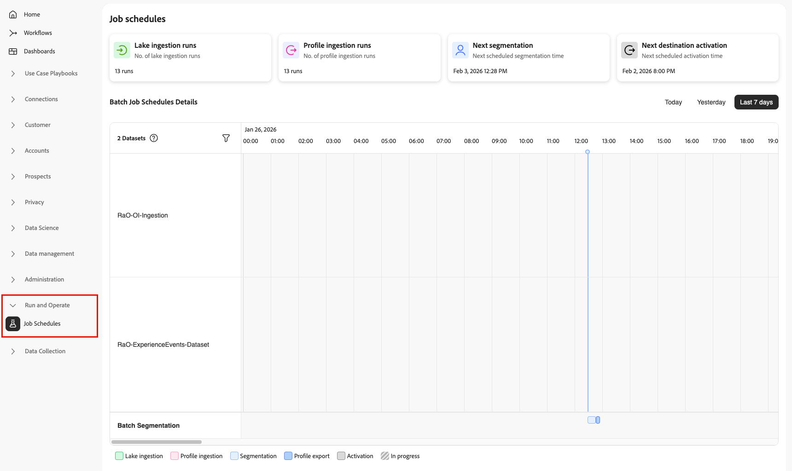
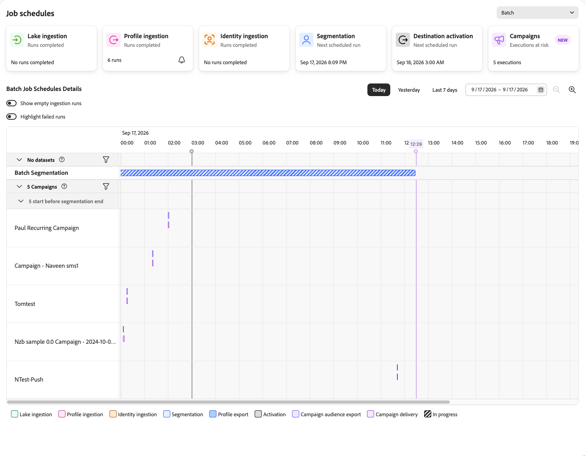
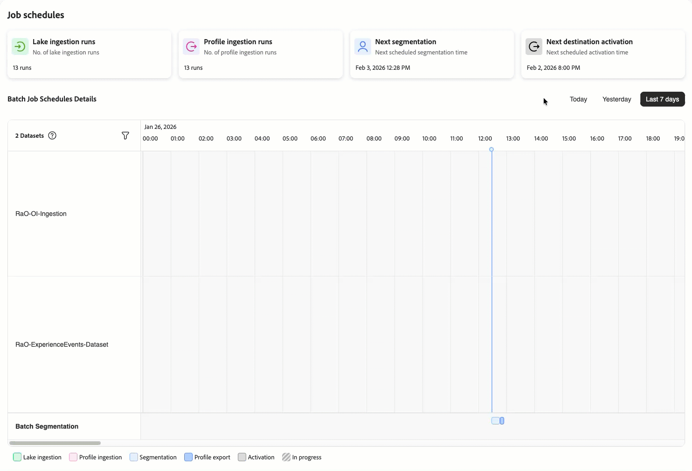
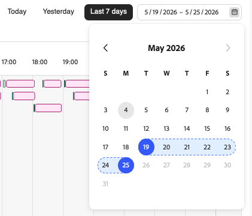
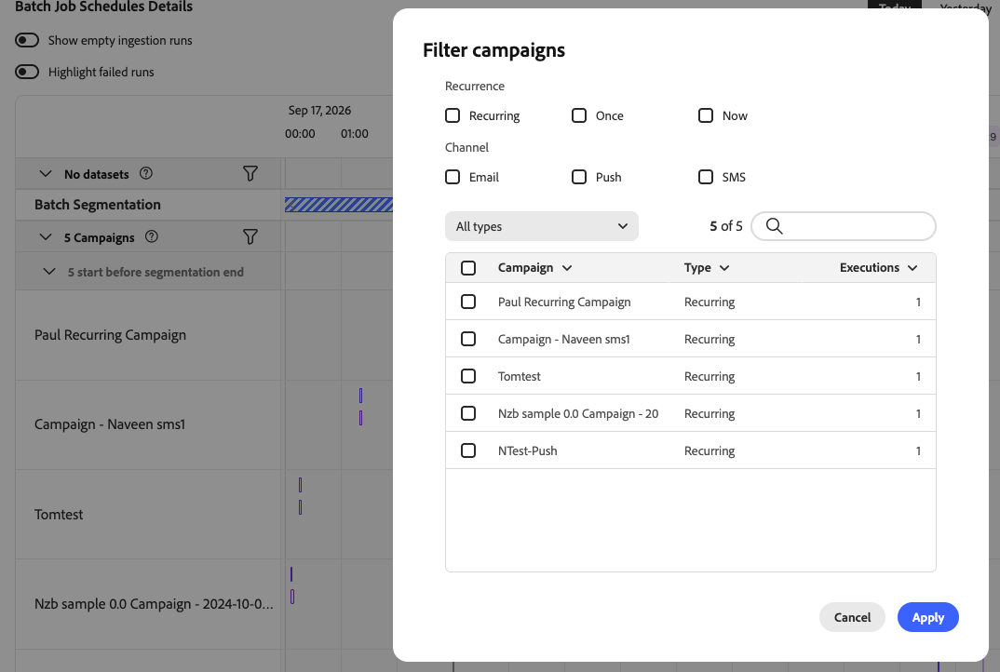

# Inspect job schedules

>[!IMPORTANT]
>
>[!UICONTROL Job schedules] are currently available only for the following jobs:
>
> * Batch data lake ingestion (Real-Time CDP)
> * Batch profile ingestion (Real-Time CDP)
> * Batch segmentation (Real-Time CDP)
> * Batch destination activation (Real-Time CDP)
> * Scheduled batch campaigns ([!DNL Adobe Journey Optimizer])

[!UICONTROL Job Schedules] provides a unified view of all scheduled batch processing jobs across your data pipeline, from ingestion through destination activation and scheduled [!DNL Adobe Journey Optimizer] campaign delivery. Inspect execution status, identify scheduling conflicts, and diagnose configuration issues before they impact your business operations.

Use Job Schedules to investigate failures, optimize job timing, and understand dependencies between data lake ingestion, profile processing, segmentation, destination activation, and scheduled campaign delivery. For guidance on resolving common configuration problems, see the documentation on [identifying job schedule anti-patterns](job-schedules-anti-patterns.md).

## Prerequisites {#prerequisites}

To access [!UICONTROL Job Schedules], you need the **[!UICONTROL View Job Schedules]** and **[!UICONTROL View Profile Management]** [access control permissions](/help/access-control/home.md#permissions).

Contact your system administrator to ensure you have the appropriate permissions.

## Getting started {#getting-started}

Before using [!UICONTROL Job Schedules], you should be familiar with the following Experience Platform concepts:

* **[Batch ingestion](../ingestion/batch-ingestion/overview.md)**: How data is loaded into the data lake and profile store on scheduled intervals.
* **[Segmentation](../segmentation/home.md)**: How audiences are evaluated and updated based on profile data and segment definitions.
* **[Real-Time Customer Profile](../profile/home.md)**: How profile data is unified and made available for segmentation and activation.
* **[Destinations](../destinations/home.md)**: Where and how data is activated to downstream systems and marketing platforms.
* **[!DNL Adobe Journey Optimizer] scheduled campaigns**: How batch campaigns depend on upstream data lake ingestion, profile ingestion, and segmentation to run on time.

Understanding these components helps you interpret job execution patterns and diagnose issues when they occur.

## Understanding the job schedules interface {#understanding-interface}

To access [!UICONTROL Job Schedules]:

1. In the Experience Platform UI, select **[!UICONTROL Run and Operate]** from the left navigation.
2. Select **[!UICONTROL Job Schedules]**.

The [!UICONTROL Job Schedules] page provides an overview of all your scheduled batch processing jobs.

{zoomable="yes"}

### Summary cards {#summary-cards}

At the top of the page, you can see summary cards that provide quick insights into your batch processing jobs.

{zoomable="yes"}

* **Lake ingestion runs**: The number of data lake ingestion jobs that have run.
* **Profile ingestion runs**: The number of profile ingestion jobs that have run.
* **Next segmentation**: When the next scheduled segmentation job will run.
* **Next destination activation**: When the next scheduled destination activation job will run.
* **[!UICONTROL Campaigns]**: The number of scheduled batch campaign executions in [!DNL Adobe Journey Optimizer] currently at risk of a timing conflict with segmentation.

{zoomable="yes"}

These cards help you understand the activity and upcoming schedules across your data pipeline. The values for **Lake ingestion runs** and **Profile ingestion runs** change based on the selected time interval (Today, Yesterday, or Last 7 days); the next-run cards (**Next segmentation** and **Next destination activation**) are not affected by the time selector.

### Time period selector {#time-period}

Use the time period selectors to choose how far back to look at scheduled jobs.

* **Today**: View jobs scheduled for today (default view).
* **Yesterday**: View jobs that ran yesterday.
* **Last 7 days**: View jobs from the past week.

When you select **[!UICONTROL Last 7 days]**, a calendar date picker becomes available. Select the calendar icon next to the displayed date range to open the picker and choose a specific 7-day window. Only 7-day ranges are supported.

{zoomable="yes"}

### Batch job schedules details {#job-schedules-details}

The main view shows you when your batch jobs are scheduled to run throughout the day. You can:

* **View jobs by dataset or entity**: The left column shows the names of datasets or processing jobs (for example, ingestion datasets or segmentation jobs).
* **See job timing**: The timeline shows when each job is scheduled to run, with visual indicators marking the scheduled time.
* **Filter jobs**: Use the filter icon to narrow down which datasets to include in the report.
* **Understand job types**: The color-coded legend at the bottom helps you identify different job types:
  * **Lake ingestion** (green): Data ingestion into the data lake
  * **Profile ingestion** (pink): Data ingestion into the profile store
  * **Segmentation** (light blue): Audience evaluation jobs
  * **Profile export** (blue): Export of profile data
  * **Activation** (dark gray): Destination activation jobs
  * **Campaign audience export**: Export of the audience a scheduled batch campaign in [!DNL Adobe Journey Optimizer] depends on
  * **Campaign delivery**: The send execution of a scheduled batch campaign in [!DNL Adobe Journey Optimizer]
  * **In progress** (striped): Jobs currently running or queued

This timeline view helps you identify scheduling conflicts, understand dependencies between jobs, and optimize your batch processing schedules.

### Scheduled campaign timing {#campaign-timing}

The timeline groups scheduled batch campaigns in [!DNL Adobe Journey Optimizer] under a **[!UICONTROL Campaigns]** row, next to the batch segmentation job they depend on. Campaigns with a start time before the projected segmentation completion time are grouped under a **[!UICONTROL start before segmentation end]** label, so you can identify at-risk executions at a glance.

The **[!UICONTROL Campaigns]** summary card shows the number of campaign executions currently at risk. Select a campaign in the timeline to see its [campaign details](job-schedules-details.md#campaign-details), including its audience, recurrence, channel, and audience export and delivery counts.

### Filter campaigns {#filter-campaigns}

Use the **[!UICONTROL Filter campaigns]** dialog to narrow down which scheduled batch campaigns appear in the timeline:

1. Select the filter icon next to the **[!UICONTROL Campaigns]** row in the timeline.
2. In the **[!UICONTROL Filter campaigns]** dialog, filter by **[!UICONTROL Recurrence]** (**[!UICONTROL Recurring]**, **[!UICONTROL Once]**, or **[!UICONTROL Now]**) or by **[!UICONTROL Channel]** (**[!UICONTROL Email]**, **[!UICONTROL Push]**, or **[!UICONTROL SMS]**).
3. Use the type dropdown or search field to narrow the campaign list further.
4. Select the checkbox next to one or more campaigns in the list.
5. Select **[!UICONTROL Apply]**.

{zoomable="yes"}

## Identifying configuration issues {#identifying-issues}

As you review your job schedules, you may notice patterns that indicate configuration problems. Common issues include:

* Jobs scheduled too close together, causing resource contention
* Too many batches running within the same time window
* Individual datasets with excessive daily batch jobs
* Ingestion jobs scheduled immediately before segmentation runs

These patterns can lead to job failures, incomplete data processing, and poor system performance. To learn how to identify and resolve these issues, see the documentation on [identifying job schedule anti-patterns](job-schedules-anti-patterns.md).

When you need to investigate specific datasets or job runs, you can drill down into detailed views to see execution history, error messages, performance metrics, and dependencies. For information on viewing this detailed data, see the documentation on [viewing job details](job-schedules-details.md).

## Next steps {#next-steps}

After learning about job schedules, you may want to explore these related topics:

* [View job details](job-schedules-details.md): Learn how to drill down into individual datasets and job runs for detailed investigation.
* [Identify job schedule anti-patterns](job-schedules-anti-patterns.md): Learn how to spot and resolve common configuration issues that impact pipeline performance.
* [Batch ingestion](../ingestion/batch-ingestion/overview.md): Learn how to ingest data into Experience Platform using batch processing.
* [Segmentation](../segmentation/home.md): Understand how audiences are evaluated and updated on scheduled intervals.
* [Monitor dataflows for destinations](../dataflows/ui/monitor-destinations.md): Learn how to monitor destination activation dataflows.
* [Schedule audience exports](../destinations/ui/activate-batch-profile-destinations.md): Learn how to configure scheduled batch destination activations.
