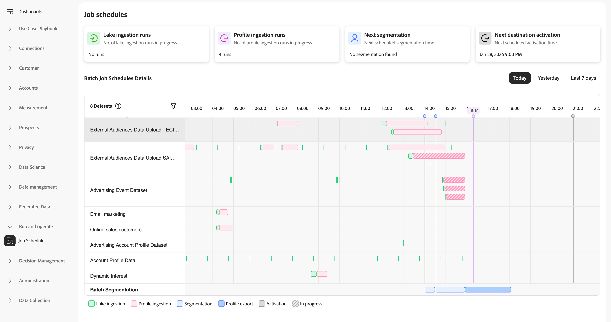

# Run and Operate overview

>[!AVAILABILITY]
>
>Run and Operate features are currently available as a limited release.

When batch jobs fail or deliver incomplete data, you need to quickly understand what caused the issue. The root cause could be data availability issues, incorrect timing, configuration problems, or system capacity constraints. Without clear visibility, you may spend hours investigating multiple systems before finding the answer.

With [!UICONTROL Run and Operate] tools, you can:

* **Inspect your data operations**: Get a complete view of job execution status and health across all your workflows.
* **Troubleshoot faster**: Access detailed diagnostic information and execution history to quickly identify root causes and reduce your mean time to resolution.
* **Prevent issues proactively**: Analyze job patterns, detect configuration problems before they cause failures, and optimize your data operations.

## Target audiences {#target-audiences}

[!UICONTROL Run and Operate] tools are designed to serve multiple audiences across your organization:

* **Data and IT teams**: System administrators and data engineers who maintain reliable data pipelines and troubleshoot technical issues.
* **Marketing operations**: Marketing technologists who inspect data delivery to marketing platforms and resolve activation issues.
* **Implementers**: Practitioners who validate implementation efficiency, reliability, and troubleshoot technical issues.

## Prerequisites {#prerequisites}

To access Run and Operate tools, you need the **[!UICONTROL View Job Schedules]** and **[!UICONTROL View Profile Management]** [access control permissions](/help/access-control/home.md#permissions).
The [!UICONTROL Job Schedules] page provides an overview of all your scheduled batch processing jobs.
Contact your system administrator to ensure you have the appropriate permissions.

## Getting started {#getting-started}

To access the Run and Operate tools from the Experience Platform UI:

1. Log in to your Experience Platform account and select **[!UICONTROL Run and Operate]** from the left navigation.
2. Select the tool that matches your inspection or troubleshooting needs.
    
    >[!NOTE]
    >
    >Currently, the only available capability is [Job Schedules](job-schedules.md).

## Available tools {#available-tools}

The following tools help you inspect and optimize your data operations.

### Job schedules {#job-schedules}

>[!IMPORTANT]
>
>[!UICONTROL Job schedules] are currently available only for the following Real-Time CDP jobs:
>
> * Batch data lake ingestion
> * Batch profile ingestion
> * Batch sgmentation
> * Batch destination activation.

With [Job Schedules](job-schedules.md), you can inspect all scheduled batch operations across your organization, per sandbox, including data lake ingestion, profile ingestion, segmentation, and destination activation. View job execution status, performance metrics, and execution history to identify patterns and diagnose configuration issues that affect reliability.

Job Schedules provides three levels of investigation:

* **[Inspect job schedules](job-schedules.md)**: View all datasets and their scheduled jobs in a timeline to identify patterns and scheduling conflicts across your entire pipeline.
* **[Identify anti-patterns](job-schedules-anti-patterns.md)**: Learn to spot and resolve common configuration issues like schedule overlap, dense batch stacking, and excessive batching that impact performance.
* **[View job details](job-schedules-details.md)**: Drill down into specific datasets and individual job runs to investigate failures, check timing, and verify records processed.

You can also understand dependencies between data processing stages, helping you ensure reliable data flow throughout your Experience Platform workflows.

## Next steps {#next-steps}

Now that you understand the purpose and capabilities of [!UICONTROL Run and Operate] tools, explore the following resources to deepen your knowledge:

* Learn about [batch ingestion](../ingestion/batch-ingestion/overview.md) to understand how data is ingested into Experience Platform
* Learn how to [inspect job schedules](job-schedules.md) for your batch ingestion and activations
* Understand how to [configure scheduled activations](../destinations/ui/activate-batch-profile-destinations.md) for batch destinations
* Explore [dataflow monitoring](../dataflows/ui/monitor-destinations.md) for destinations

