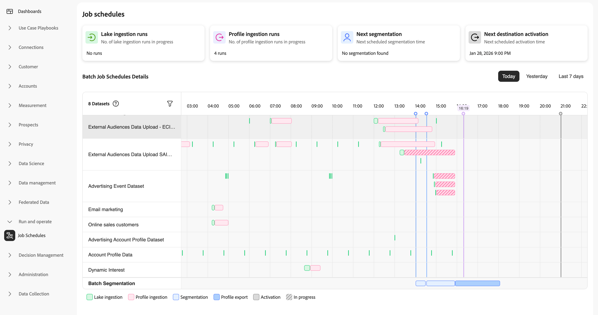

# Run and Operate overview

Use [!UICONTROL Run and Operate] tools to understand the health, execution, and usage of your Experience Platform implementation. These tools help you investigate operational issues, identify configuration problems, monitor scheduled processes, and understand how supported Adobe products and capabilities are being used across your organization.

With [!UICONTROL Run and Operate] tools, you can:

* **Inspect your data operations**: Get a complete view of job execution status and health across all your workflows.
* **Troubleshoot faster**: Access detailed diagnostic information and execution history to quickly identify root causes and reduce your mean time to resolution.
* **Prevent issues proactively**: Analyze job patterns, detect configuration problems before they cause failures, and optimize your data operations.
* **Understand product usage**: Review usage and adoption information for supported Real-Time CDP, Adobe Journey Optimizer, and Customer Journey Analytics capabilities.

## Target audiences {#target-audiences}

[!UICONTROL Run and Operate] tools are designed to serve multiple audiences across your organization:

* **Data and IT teams**: System administrators and data engineers who maintain reliable data pipelines and troubleshoot technical issues.
* **Marketing operations**: Marketing technologists who inspect data delivery to marketing platforms and resolve activation issues.
* **Implementers**: Practitioners who validate implementation efficiency and reliability, and who troubleshoot technical issues.

## Prerequisites {#prerequisites}

To access Run and Operate tools, you need the applicable [access control permissions](/help/access-control/home.md#permissions) for each tool: **[!UICONTROL View Job Schedules]** and **[!UICONTROL View Profile Management]** for Job Schedules and Health Checks, and **[!UICONTROL View Usage Insights]** for Usage Insights. Contact your system administrator to ensure you have the appropriate permissions.

## Getting started {#getting-started}

To access the Run and Operate tools from the Experience Platform UI:

1. Log in to your Experience Platform account and select **[!UICONTROL Run and Operate]** from the left navigation.
2. Select the tool that matches your goal, such as inspecting scheduled operations, reviewing configuration health, or understanding product usage.

{zoomable="yes"}

## Available tools {#available-tools}

The following tools help you inspect and optimize your data operations and understand product usage.

### Job schedules {#job-schedules}

>[!IMPORTANT]
>
>[!UICONTROL Job schedules] are currently available only for the following Real-Time CDP jobs:
>
> * Batch data lake ingestion
> * Batch profile ingestion
> * Batch segmentation
> * Batch destination activation

With [Job Schedules](job-schedules.md), you can inspect all scheduled batch operations across your organization, per sandbox, including data lake ingestion, profile ingestion, segmentation, and destination activation. View job execution status, performance metrics, and execution history to identify patterns and diagnose configuration issues that affect reliability.

{zoomable="yes"}

Job Schedules provides three levels of investigation:

* **[Inspect job schedules](job-schedules.md)**: View all datasets and their scheduled jobs in a timeline to identify patterns and scheduling conflicts across your entire pipeline.
* **[Identify anti-patterns](job-schedules-anti-patterns.md)**: Learn to spot and resolve common configuration issues like schedule overlap, dense batch stacking, and excessive batching that impact performance.
* **[View job details](job-schedules-details.md)**: Drill down into specific datasets and individual job runs to investigate failures, check timing, and verify records processed.

You can also understand dependencies between data processing stages, helping you ensure reliable data flow throughout your Experience Platform workflows.

### Health checks {#health-checks}

With [Health Checks](health-checks/overview.md), you can proactively detect configuration issues before they impact your business operations. Currently, health checks run daily automatic scans across your sandbox, surfacing missing best practices, misconfigurations, and patterns that lead to downstream failures.

Health checks currently evaluate eight categories:

* **[Schemas and identities](health-checks/schemas-and-identities.md)**: Verify identity field validation, identity graph linking rules, and schema configuration.
* **[TTL](health-checks/ttl.md)**: Confirm data expiration and lookback window configuration for profiles, datasets, and segments.
* **[Segmentation](health-checks/segmentation.md)**: Monitor audience counts approaching sandbox limits across batch, streaming, and edge evaluation.
* **[Ingestion](health-checks/ingestion.md)**: Track batch ingestion volume approaching platform guardrails.
* **[Datasets](health-checks/datasets.md)**: Monitor profile-enabled dataset counts approaching platform limits.
* **[Destinations](health-checks/destinations.md)**: Detect stale destination activation schedules.
* **[Merge policies](health-checks/merge-policies.md)**: Identify merge policy naming and definition issues.
* **[Query Service](health-checks/query-service.md)**: Detect scheduled query failures and performance degradation.

### Usage Insights {#usage-insights}

With [Usage Insights](usage-insights/overview.md), you can understand how your organization uses supported Real-Time CDP, [!DNL Adobe Journey Optimizer], and [!DNL Customer Journey Analytics] capabilities, including profile, audience, destination, channel, campaign, and journey usage.

## Next steps {#next-steps}

Now that you understand the purpose and capabilities of [!UICONTROL Run and Operate] tools, explore the following resources to deepen your knowledge:

* Learn how to use [health checks](health-checks/overview.md) to detect schema and identity configuration issues
* Learn how to [inspect job schedules](job-schedules.md) for your batch ingestion and activations
* Learn how to access and interpret [Usage Insights](usage-insights/overview.md) for your organization's product usage
* Learn about [batch ingestion](../ingestion/batch-ingestion/overview.md) to understand how data is ingested into Experience Platform
* Understand how to [configure scheduled activations](../destinations/ui/activate-batch-profile-destinations.md) for batch destinations
* Explore [dataflow monitoring](../dataflows/ui/monitor-destinations.md) for destinations
