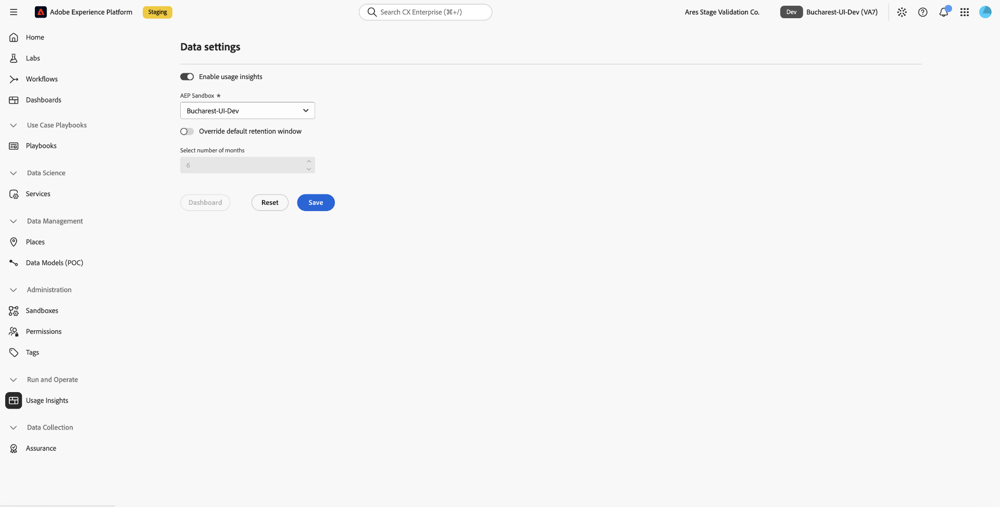

# Usage Insights

To understand how your organization is using its supported Adobe products, use **[!UICONTROL Usage Insights]**. [!UICONTROL Usage Insights] is a [!UICONTROL Run and Operate] capability that gives you visibility into product usage and adoption across Real-Time CDP, [!DNL Adobe Journey Optimizer], and [!DNL Customer Journey Analytics], including profile, audience, destination, channel, campaign, and journey activity.

[!UICONTROL Usage Insights] shows you how supported capabilities are being used. It does not calculate financial return on investment, revenue, or license consumption. For information about your organization's licensed amounts and consumption, see the [license usage dashboard](../landing/license-usage-and-guardrails/license-usage-dashboard.md).

<!-- TODO: A "Revenue (EUR)" metric was observed in the underlying Usage Insights data view during evidence-gathering, but it has not been confirmed as a curated, customer-facing metric. Do not surface it in this guide, and re-verify this framing if it later appears on a dashboard panel. -->

## Prerequisites {#prerequisites}

[!UICONTROL Usage Insights] is available to organizations with at least one of the following provisioned:

* [!DNL Real-Time CDP] Prime (B2C, B2B, or B2P)
* [!DNL Real-Time CDP] Ultimate (B2C, B2B, or B2P)
* [!DNL Adobe Journey Optimizer] B2C
* [!DNL Customer Journey Analytics] B2C

To view the [!UICONTROL Usage Insights] dashboard, you need the **[!UICONTROL View Usage Insights]** [access control permission](/help/access-control/home.md#permissions). Contact your system administrator to ensure you have the appropriate permissions.

<!-- TODO: The permission required to enable or reconfigure Usage Insights (as opposed to viewing it) has not been confirmed. Do not assume View Usage Insights is sufficient for setup until this is verified with engineering/PM. -->

## Enable and configure Usage Insights {#enable-and-configure}

Before your organization can view usage data, an administrator must enable [!UICONTROL Usage Insights] and select the sandbox where its data is collected.

To enable [!UICONTROL Usage Insights]:

1. Select **[!UICONTROL Run and Operate]** from the left navigation, then select **[!UICONTROL Usage Insights]**.
1. Turn on **[!UICONTROL Enable usage insights]**.
1. From the **[!UICONTROL AEP Sandbox]** dropdown, select the sandbox where you want [!UICONTROL Usage Insights] to collect data.
1. Optionally, turn on **[!UICONTROL Override default retention window]** and use **[!UICONTROL Select number of months]** to set a custom retention period. By default, [!UICONTROL Usage Insights] retains data for 6 months.
1. Select **[!UICONTROL Save]**.

{zoomable="yes"}

>[!IMPORTANT]
>
>Data collection begins when you enable [!UICONTROL Usage Insights], not before. Initial data typically becomes available within approximately 24 hours.

<!-- TODO: Confirm the maximum number of months supported by the retention override. Evidence from the discovery meeting suggests the current maximum shown in the UI may not be authoritative. -->

You can configure [!UICONTROL Usage Insights] independently for multiple sandboxes in your organization.

### Change the configured sandbox {#change-sandbox}

You can change the sandbox where [!UICONTROL Usage Insights] collects data at any time by selecting a different sandbox from the **[!UICONTROL AEP Sandbox]** dropdown and selecting **[!UICONTROL Save]**.

>[!IMPORTANT]
>
>Changing the sandbox may create an additional dataset, connection, and data view. Once saved, existing data remains in the previous dataset, and subsequent data is stored in the new dataset.

<!-- TODO: Screenshot of the sandbox-change confirmation dialog exists (sandbox-selector.png) but is not usable as captured — the example sandbox is named "Customer Value Framework: 02," which leaks internal project terminology. Re-shoot against a sandbox with a customer-appropriate name before publication. -->

## Access Usage Insights {#access}

To access [!UICONTROL Usage Insights] from the [!UICONTROL Experience Platform] UI:

1. Select **[!UICONTROL Run and Operate]** from the left navigation.
1. Select **[!UICONTROL Usage Insights]**.

See the left navigation in the screenshot in the [previous section](#enable-and-configure) for the location of **[!UICONTROL Usage Insights]** within **[!UICONTROL Run and Operate]**.

Because [!UICONTROL Usage Insights] can be configured for more than one sandbox, you must be working in a sandbox where [!UICONTROL Usage Insights] is configured, and you must have access to that sandbox, to view the dashboard. If your currently selected sandbox does not have [!UICONTROL Usage Insights] configured, you are stopped before the dashboard opens and prompted to switch to a sandbox where it is available.

Selecting **[!UICONTROL Usage Insights]** opens a [!DNL Customer Journey Analytics] Workspace project built specifically for [!UICONTROL Usage Insights] data.

## Navigate the Usage Insights dashboard {#navigate-dashboard}

The [!UICONTROL Usage Insights] dashboard organizes usage data into six analysis areas, presented as a series of panels: [!UICONTROL Profile analysis], [!UICONTROL Audience analysis], [!UICONTROL Destination analysis], [!UICONTROL Channel analysis], [!UICONTROL Campaign analysis], and [!UICONTROL Journey analysis].

Each analysis area includes:

* A **[!UICONTROL Segment]** filter that you can use to scope the data shown.
* A date range showing the period currently displayed.
* One or more metric cards and visualizations relevant to that area.

<!-- TODO: Screenshot of the six-panel dashboard overview exists (analysis-dashbaords.png) but is not usable as captured — each panel header displays the underlying data view name "Usage Insights (customer-value-fra...)," which leaks internal project terminology. Re-shoot before publication. -->

## Review usage data {#review-usage-data}

Each analysis area focuses on a different part of your Adobe product usage. The following sections describe what each area shows.

### Profile analysis {#profile-analysis}

[!UICONTROL Profile analysis] provides visibility into the scale, growth, and activation readiness of unified customer profiles, helping you assess how effectively profiles are being segmented and used across the platform. This area includes:

* **[!UICONTROL Total profiles]**: The total number of unified customer profiles in the platform.
* **[!UICONTROL Total profiles by day]**: The daily count of total profiles, highlighting changes in overall profile volume over time.
* **[!UICONTROL Profiles in all audiences]**: The daily count of profiles included in at least one audience.
* **[!UICONTROL Profile activation rate per day]**: The daily profile activation rate.

### Audience analysis {#audience-analysis}

[!UICONTROL Audience analysis] summarizes how audiences are created, activated, and evaluated across environments, highlighting audience adoption, effectiveness, and quality. This area includes:

* **[!UICONTROL Total audiences]**: The total number of audiences.
* **[!UICONTROL Published audiences]**: The total number of published audiences.
* **[!UICONTROL Activated audiences]**: The total number of activated audiences.
* **[!UICONTROL Profiles in activated audiences]**: The total number of profiles across all activated audiences.
* **[!UICONTROL Largest audiences]** and **[!UICONTROL Smallest audiences]**: The five largest and five smallest activated audiences by profile count.

### Destination analysis {#destination-analysis}

[!UICONTROL Destination analysis] shows how destinations are configured and used for activation, helping you measure the effectiveness, maturity, and reach of audience delivery across channels and sandboxes. This area includes:

* **[!UICONTROL Total destinations]**: The total number of destinations.
* **[!UICONTROL Enabled destinations]**: The total number of enabled destinations.
* **[!UICONTROL Activated destinations]**: The total number of activated destinations.
* **[!UICONTROL Destination count by sandbox]**: The five largest sandboxes by destination count.
* **[!UICONTROL Enabled destinations across sandboxes]**: Destinations categorized by audience coverage across sandboxes.

<!-- TODO: Screenshots for Profile analysis, Audience analysis, and Destination analysis exist (profile-analysis-draft.png, audience-analysis-draft.png, destination-analysis-draft.png) but are not usable as captured — the source sandbox had no data (all metrics show 0), the Destination analysis panel shows broken visualizations ("Unable to render visualization"), and all three display the internal data view name "Usage Insights (customer-value-fra...)." Re-shoot with a representative, properly named sandbox before publication. -->

### Channel, campaign, and journey analysis {#channel-campaign-journey-analysis}

[!UICONTROL Channel analysis], [!UICONTROL Campaign analysis], and [!UICONTROL Journey analysis] apply the same segment-filtering and date-range structure described above to [!DNL Adobe Journey Optimizer] channel, campaign, and journey usage, respectively.

<!-- TODO: Only panel titles are confirmed for these three areas (visible collapsed in analysis-dashbaords.png). No expanded screenshot or metric-level detail has been captured for Channel analysis, Campaign analysis, or Journey analysis. Do not add specific metric names here until detail screenshots exist. -->

## Inspect metrics and dimensions {#inspect-metrics-and-dimensions}

Every metric and visualization in [!UICONTROL Usage Insights] includes a description explaining what it shows. Select the **information** icon next to a panel or visualization title to view its description.

To inspect the data behind a visualization, expand its data source to view the underlying metrics and dimensions. If a metric is a calculated metric, its formula is also shown. For example, **[!UICONTROL Profile Activation Rate]** is calculated as **[!UICONTROL Activated Audience Profile Count]** divided by **[!UICONTROL Audience Profile Count]**.

<!-- TODO: Screenshots of the data-source and metric-detail views exist (data-source-metric-inventory.png, used-metrics-and-dimensions-info-dialog.png, metric-details.png) but are not usable as captured due to the internal data view name and placeholder data described above. Re-shoot before publication. -->

## Understand data freshness and retention {#data-freshness-and-retention}

[!UICONTROL Usage Insights] collects data through a nightly snapshot. The dashboard displays a rolling window of the most recent 7 days and updates automatically each day.

Initial data becomes available approximately 24 hours after you enable [!UICONTROL Usage Insights], because data collection begins at enablement. You can extend how long data is retained using the retention override described in [Enable and configure Usage Insights](#enable-and-configure).

## Next steps {#next-steps}

By reading this guide, you understand how to access, configure, and interpret [!UICONTROL Usage Insights]. See the following resources to learn more:

* [Run and Operate overview](overview.md)
* [Access control overview](/help/access-control/home.md)
