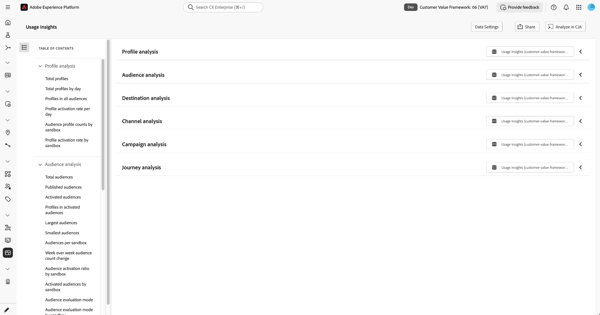

# Usage Insights

To understand how your organization uses supported Adobe products and capabilities, use **[!UICONTROL Usage Insights]**. [!UICONTROL Usage Insights] is a [!UICONTROL Run and Operate] capability that provides visibility into product usage and adoption across Real-Time CDP and Adobe Journey Optimizer.

[!UICONTROL Usage Insights] focuses on product usage and adoption. It does not calculate financial return on investment or report license consumption. For information about your organization's licensed amounts and consumption, see the [license usage dashboard](../../landing/license-usage-and-guardrails/license-usage-dashboard.md).

## Prerequisites {#prerequisites}

[!UICONTROL Usage Insights] is available to organizations with at least one of the following products provisioned:

* Real-Time CDP Prime (B2C, B2B, or B2P)
* Real-Time CDP Ultimate (B2C, B2B, or B2P)
* Adobe Journey Optimizer B2C

To view the [!UICONTROL Usage Insights] dashboard, you need the **[!UICONTROL View Usage Insights]** [access control permission](/help/access-control/home.md#permissions). Contact your system administrator to ensure that you have the appropriate permissions and access to the sandbox where Usage Insights data is stored.

## Enable and configure Usage Insights {#enable-and-configure}

Before your organization can view usage data, a system administrator must enable [!UICONTROL Usage Insights] and select a sandbox where Usage Insights data is stored.

To enable [!UICONTROL Usage Insights]:

1. Select **[!UICONTROL Run and Operate]** from the left navigation, then select **[!UICONTROL Usage Insights]**.
1. Turn on **[!UICONTROL Enable usage insights]**.
1. From the **[!UICONTROL AEP Sandbox]** dropdown, select the sandbox where you want [!UICONTROL Usage Insights] data to be stored.
1. Optionally, turn on **[!UICONTROL Override default retention window]** and use **[!UICONTROL Select number of months]** to set a custom retention period. By default, [!UICONTROL Usage Insights] retains data for six months. Select **[!UICONTROL Save]** to update your settings.
1. Select **[!UICONTROL Dashboard]**.

{zoomable="yes"}

>[!IMPORTANT]
>
>Data collection begins when you enable [!UICONTROL Usage Insights]. Initial data typically becomes available within approximately 24 hours.

[!UICONTROL Usage Insights] reports usage across your organization's sandboxes, while the Usage Insights data is stored in the selected sandbox.

### Change the data storage sandbox {#change-sandbox}

To change the sandbox where Usage Insights data is stored, select **[!UICONTROL Data Settings]** from the [!UICONTROL Usage Insights] dashboard. From the **[!UICONTROL AEP Sandbox]** dropdown, select the new storage sandbox, make any other required changes, and select **[!UICONTROL Save]**.

>[!IMPORTANT]
>
>Changing the sandbox may create an additional dataset, connection, and data view. Once saved, existing data remains in the previous dataset, and subsequent data is stored in the new dataset.

## Navigate the Usage Insights dashboard {#navigate-dashboard}

To open the [!UICONTROL Usage Insights] dashboard, select **[!UICONTROL Run and Operate]** from the Experience Platform left navigation, then select **[!UICONTROL Usage Insights]**.

You can access the [!UICONTROL Usage Insights] dashboard from any sandbox. To view Usage Insights data, you must have the **[!UICONTROL View Usage Insights]** permission and access to the sandbox where the Usage Insights data is stored.

The dashboard organizes usage data into six analysis areas: [!UICONTROL Profile analysis], [!UICONTROL Audience analysis], [!UICONTROL Destination analysis], [!UICONTROL Channel analysis], [!UICONTROL Campaign analysis], and [!UICONTROL Journey analysis].

Select the **[!UICONTROL Table of contents]** button to open a side panel that lists the analysis areas and the charts available in each area. Use the table of contents to identify available charts and navigate through the dashboard.

{zoomable="yes"}

Each analysis area contains one or more charts that present usage information for that area. Expand an analysis area to view its charts and available data.

For definitions and details about the charts available in each analysis area, see the [Usage analysis reference](usage-analysis.md).

## Understand data freshness and retention {#data-freshness-and-retention}

[!UICONTROL Usage Insights] collects usage data nightly. By default, the dashboard displays the most recent seven days of data and updates automatically each day. You can adjust the analysis period to view other dates within the available retention window.

Initial data typically becomes available approximately 24 hours after you enable [!UICONTROL Usage Insights]. You can change how long collected data is retained by using the retention settings described in [Enable and configure Usage Insights](#enable-and-configure).

## Next steps {#next-steps}

To learn about the charts available in each Usage Insights analysis area and how to interpret the data they provide, see the [Usage analysis reference](usage-analysis.md).

For related Experience Platform guidance, see:

* [Run and Operate overview](../overview.md)
* [Access control overview](/help/access-control/home.md)
