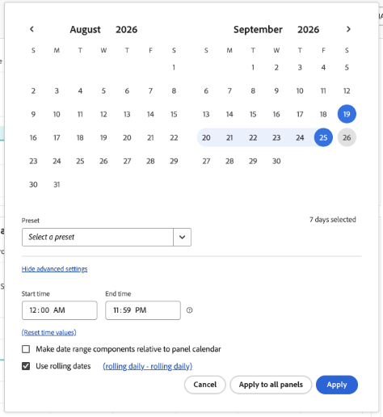
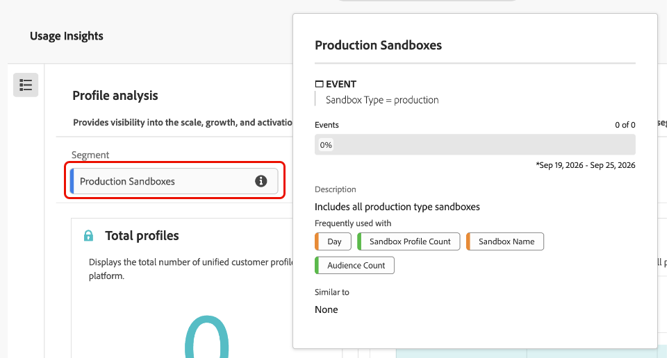

# Usage analysis reference

Use the [!UICONTROL Usage Insights] analysis areas to understand how supported Adobe products and capabilities are being used across your organization. Usage Insights organizes this information into six analysis areas: [!UICONTROL Profile analysis], [!UICONTROL Audience analysis], [!UICONTROL Destination analysis], [!UICONTROL Channel analysis], [!UICONTROL Campaign analysis], and [!UICONTROL Journey analysis].

This reference describes the charts available in each analysis area and the usage information they provide. Before reviewing individual charts, you can adjust the analysis period and inspect the sandbox segment used to scope the displayed data.

## Configure analysis settings {#configure-analysis-settings}

Use the following controls to adjust how Usage Insights data is displayed and to understand the segment applied to each analysis area.

### Configure the analysis period {#configure-analysis-period}

Use the date range control to change the period displayed in the Usage Insights charts. You can select a date range directly from the calendar or choose an available preset.

For more control over the date range, expand the advanced settings. You can configure the start and end times and use rolling dates so that the selected period moves forward automatically over time.

Select **[!UICONTROL Apply]** to update the current panel, or select **[!UICONTROL Apply to all panels]** to use the same date range across the Usage Insights analysis areas.

{zoomable="yes"}

### Understand the sandbox segment {#sandbox-segment}

Usage Insights uses a sandbox segment to scope the data shown in each analysis area. The **[!UICONTROL Production Sandboxes]** segment includes sandboxes where the sandbox type is `production`.

Select the information icon next to the segment to view its definition and related component information. The details panel shows the segment description and commonly associated dimensions and metrics, such as day, sandbox name, profile count, and audience count.

{zoomable="yes"}

The segment details are informational and do not change the sandbox configuration used by Usage Insights. To change where Usage Insights collects data, use **[!UICONTROL Data Settings]** from the Usage Insights dashboard.

## Profile analysis {#profile-analysis}

[!UICONTROL Profile analysis] provides visibility into the scale, growth, and activation readiness of unified customer profiles.

The following charts are available:

| Chart | What it shows |
| --- | --- |
| **[!UICONTROL Total profiles]** | The total number of unified customer profiles in the platform. |
| **[!UICONTROL Total profiles by day]** | The daily count of total profiles, highlighting changes in overall profile volume over time. |
| **[!UICONTROL Profiles in all audiences]** | Daily profile activation counts, showing total profiles alongside profiles activated to audiences. |
| **[!UICONTROL Profile activation rate per day]** | Daily profile activation rates over the displayed date range. |
| **[!UICONTROL Audience profile counts by sandbox]** | The top five sandboxes ranked by profile audience count. |
| **[!UICONTROL Profile activation rate by sandbox]** | The top five sandboxes ranked by profile activation rate, showing where profile activation is strongest across environments. |

## Audience analysis {#audience-analysis}

[!UICONTROL Audience analysis] summarizes how audiences are created, activated, and evaluated across environments, highlighting audience adoption, effectiveness, and quality.

The following charts are available:

| Chart | What it shows |
| --- | --- |
| **[!UICONTROL Total audiences]** | The total number of audiences. |
| **[!UICONTROL Published audiences]** | The total number of published audiences. |
| **[!UICONTROL Activated audiences]** | The total number of activated audiences. |
| **[!UICONTROL Profiles in activated audiences]** | The total number of profiles across all activated audiences. |
| **[!UICONTROL Largest audiences]** | The five largest activated audiences by profile count. |
| **[!UICONTROL Smallest audiences]** | The five smallest activated audiences by profile count. |
| **[!UICONTROL Audiences per sandbox]** | The five largest sandboxes based on audience count. |
| **[!UICONTROL Week over week audience count change]** | Weekly audience count trends compared with the previous seven-day period. |
| **[!UICONTROL Audience activation ratio by sandbox]** | The rate of activated audiences across the top five sandboxes. |
| **[!UICONTROL Activated audiences by sandbox]** | Audiences categorized by destination coverage across sandboxes. |
| **[!UICONTROL Audience evaluation mode]** | Audience counts grouped by evaluation mode. |
| **[!UICONTROL Audience evaluation mode by sandbox]** | Evaluation modes by audience count across sandboxes. |

## Destination analysis {#destination-analysis}

[!UICONTROL Destination analysis] shows how destinations are configured and used for activation, helping you understand the reach and maturity of audience delivery across sandboxes.

The following charts are available:

| Chart | What it shows |
| --- | --- |
| **[!UICONTROL Total destinations]** | The total number of destinations. |
| **[!UICONTROL Enabled destinations]** | The total number of enabled destinations. |
| **[!UICONTROL Activated destinations]** | The total number of activated destinations. |
| **[!UICONTROL Destination count by sandbox]** | The five largest sandboxes by destination count. |
| **[!UICONTROL Enabled destinations across sandboxes]** | Destinations categorized by audience coverage across sandboxes. |
| **[!UICONTROL Ratio of activated destinations by sandbox]** | The rate of activated destinations across the top five sandboxes. |
| **[!UICONTROL Destination export modes]** | The five largest export modes by destination count. |

## Channel analysis {#channel-analysis}

[!UICONTROL Channel analysis] provides an overview of outbound messaging activity across Adobe Journey Optimizer-managed channels, including delivery activity across email, SMS, in-app, push, and other supported channels.

The following charts are available:

| Chart | What it shows |
| --- | --- |
| **[!UICONTROL Messages delivered]** | The total number of messages delivered across all channels. |
| **[!UICONTROL Messages delivered by channel]** | A breakdown of delivered messages across different channels. |
| **[!UICONTROL Email delivery breakdown]** | How recipients respond to delivered email messages, including engagement actions and opt-outs. |
| **[!UICONTROL Non-email delivery breakdown]** | How recipients respond to delivered non-email messages. |
| **[!UICONTROL Email delivery breakdown by sandbox]** | The five largest sandboxes by email activity. |
| **[!UICONTROL Non-email delivery breakdown by sandbox]** | The five largest sandboxes by non-email activity. |

## Campaign analysis {#campaign-analysis}

[!UICONTROL Campaign analysis] measures campaign activity and engagement.

The following chart is available:

| Chart | What it shows |
| --- | --- |
| **[!UICONTROL Click through rate]** | The top ten campaigns based on click count. |

## Journey analysis {#journey-analysis}

[!UICONTROL Journey analysis] monitors how customers move through Adobe Journey Optimizer journeys, from entry to exit.

The following chart is available:

| Chart | What it shows |
| --- | --- |
| **[!UICONTROL Journey activity]** | Profile entry and exit counts across the top five journeys. |

## Next steps {#next-steps}

For information about accessing, enabling, and configuring Usage Insights, see the [Usage Insights overview](overview.md).
