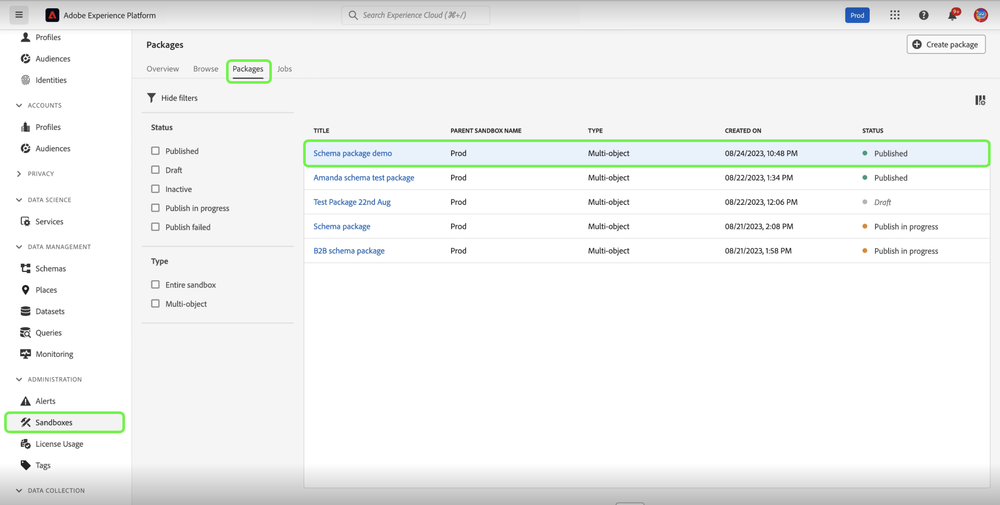
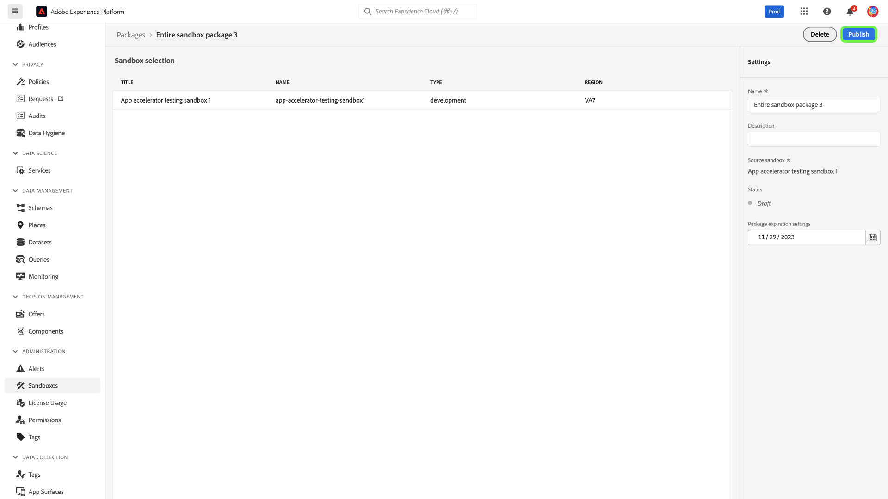

# Sandbox tooling

>[!NOTE]
>
>Sandbox tooling is a foundational capability that supports both [!DNL Real-Time Customer Data Platform] and [!DNL Journey Optimizer] to improve the development cycle efficiency and configuration accuracy.  You are required to have the following two role-based access control permissions to use the sandbox tooling feature: - `manage-sandbox` or `view-sandbox` - `manage-package`

Improve configuration accuracy across sandboxes and seamlessly export and import sandbox configurations between sandboxes with the sandbox tooling feature. Use sandbox tooling to reduce the time to value for the implementation process and move successful configurations across sandboxes.

You can use the sandbox tooling feature to select different objects and export them into a package. A package can consist of a single object or multiple objects. <!--or an entire sandbox.-->Any objects that are included in a package must be from the same sandbox.

## Objects supported for sandbox tooling {#supported-objects}

The sandbox tooling feature provides you with the ability to export [!DNL Adobe Real-Time Customer Data Platform] and [!DNL Adobe Journey Optimizer] objects into a package. 

### Real-time Customer Data Platform objects {#real-time-cdp-objects}

The table below lists [!DNL Adobe Real-Time Customer Data Platform] objects that are currently supported for sandbox tooling:

| Platform | Object | Details |
| --- | --- | --- |
| Customer Data Platform | Sources | The source account credentials are not replicated in the target sandbox for security reasons and will be required to be updated manually. The source dataflow is copied in a draft status by default. |
| Customer Data Platform | Audiences | Only the **[!UICONTROL Customer Audience]** type **[!UICONTROL Segmentation service]** is supported. Existing labels for consent and governance will be copied over in the same import job. System will auto select default Merge Policy in target sandbox with same XDM class when checking merge policy dependencies. |
| Customer Data Platform | Identities | The system will auto-deduplicate Adobe standard identity namespaces when creating in the target sandbox. Audiences can only be copied when all attributes in audience rules are enabled in the union schema. The necessary schemas must be moved and enabled for unified profile first. |
| Customer Data Platform | Schemas | Existing labels for consent and governance will be copied over in the same import job. User has the flexibility to import schemas without Unified Profile option enabled. The schema relationships edge case are not included in the package. |
| Customer Data Platform | Datasets | Datasets are copied with the unified profile setting disabled by default. |
| Customer Data Platform | Consent and Governance Policies | Add custom policies created by a user to a package and move them across sandboxes. |

The following objects are imported but are in a draft or disabled status:

| Feature | Object | Status |
| --- | --- | --- |
| Import status | Source dataflow | Draft |
| Import status |  Journey | Draft |
| Unified profile | Dataset | Unified profile disabled |
| Policies | Data governance policies | Disabled |

### Adobe Journey Optimizer objects {#abobe-journey-optimizer-objects}

The table below lists [!DNL Adobe Journey Optimizer] objects that are currently supported for sandbox tooling and limitations:

| Platform | Object | Details |
| --- | --- | --- |
| [!DNL Adobe Journey Optimizer] | Audience | An audience can be copied as a dependent object of the journey object. You can select create a new audience or reuse an existing one in the target sandbox. |
| [!DNL Adobe Journey Optimizer] | Schema | The schemas used in the journey can be copied as dependent objects. You can select create a new schema or reuse an existing one in the target sandbox. |
| [!DNL Adobe Journey Optimizer] | Merge policy | The merge policies used in the journey can be copied as dependent objects. In the target sandbox, you **cannot** create a new merge policy, you can only utilize an already existing one. |
| [!DNL Adobe Journey Optimizer] | Journey - canvas details | The representation of the journey on the canvas includes the objects in the journey, such as conditions, actions, events, read audiences, and so on, which are copied. The jump activity is excluded from the copy. |
| [!DNL Adobe Journey Optimizer] | Event | The events and event details used in the journey are copied. It will always create a new version in the target sandbox. |
| [!DNL Adobe Journey Optimizer] | Action | Email and push messages used in the journey can be copied as dependent objects. The channel action activities used in the journey fields, which are used for personalization in the message, are not checked for completeness. Content blocks are not copied.  The update profile action used in the journey can be copied. Custom actions and action details used in the journey are also copied. It will always create a new version in the target sandbox.|

Surfaces (for example, presets) are not copied over. The system automatically selects the closest possible match on the destination sandbox based on the message type and surface name. If there are no surfaces found on the target sandbox, then the surface copy will fail, causing the message copy to fail because a message requires a surface to be available for setup. In this case, at least one surface needs to be created for the right channel of the message in order for the copy to work.

Custom identity types are not supported as dependent objects when exporting a journey.

## Export objects into a package {#export-objects}

>[!NOTE]
>
>All export actions are recorded in the audit logs.

>[!CONTEXTUALHELP]
>id="platform_sandbox_tooling_remove_object"
>title="Remove an object"
>abstract="To remove an object from the package, select the row to be removed and then use the delete option, made available upon selection. Note that you cannot remove objects from published packages."

>[!CONTEXTUALHELP]
>id="platform_sandbox_package_expiry"
>title="Package expiry settings"
>abstract="Packages are set to expire after a period of inactivity in draft status. The default date is set for 90 days from today. This date continues to change until the package is published. If you visit the package in draft status tomorrow, the date moves by +1 day, unless you set this manually."

>[!CONTEXTUALHELP]
>id="platform_sandbox_tooling_package_status"
>title="Package status"
>abstract="By default, the status is set to draft. Once the package has been published, the status is changed to published. No changes can be made after the package has been published."

>[!NOTE]
>
>You can only import a package if you have permission to access the objects. 

This example documents the process of exporting a schema and adding it to a package. You can use the same process to export other objects, for example, datasets, journeys, and many more.

### Add object to a new package {#add-object-to-new-package}

Select **[!UICONTROL Schemas]** from the left navigation and then select the **[!UICONTROL Browse]** tab, which lists the schemas available. Next, select the ellipsis (`...`) next to the selected schema, and a dropdown displays controls. Select **[!UICONTROL Add to package]** from the dropdown.

![List of schemas showing the dropdown menu highlighting the [!UICONTROL Add to package] control.](../images/ui/sandbox-tooling/add-to-package.png)

From the **[!UICONTROL Add to package]** dialog, select the **[!UICONTROL Create new package]** option. Provide a [!UICONTROL Name] for your package and an optional [!UICONTROL Description], then select **[!UICONTROL Add]**.

![The [!UICONTROL Add to package] dialog with [!UICONTROL Create new package] selected and highlighting [!UICONTROL Add].](../images/ui/sandbox-tooling/create-new-package.png)

You are returned to the **[!UICONTROL Schemas]** environment. You can now add additional objects to the package you created by following the next steps listed below.

### Add an object to an existing package and publish {#add-object-to-existing-package}

To view a list of the available schemas, select **[!UICONTROL Schemas]** from the left navigation and then select the **[!UICONTROL Browse]** tab. Next, select the ellipsis (`...`) next to the selected schema to see control options in a dropdown menu. Select **[!UICONTROL Add to package]** from the dropdown.

![List of schemas showing the dropdown menu highlighting the [!UICONTROL Add to package] control.](../images/ui/sandbox-tooling/add-to-package.png)

The **[!UICONTROL Add to package]** dialog appears. Select the **[!UICONTROL Existing package]** option, then select the **[!UICONTROL Package name]** dropdown and select the package required. Finally, select **[!UICONTROL Add]** to confirm your choices.

![[!UICONTROL Add to package] dialog, showing a selected package from the dropdown.](../images/ui/sandbox-tooling/add-to-existing-package.png)

The list of objects added to the package is listed. To publish the package and make it available to be imported into sandboxes, select **[!UICONTROL Publish]**.

![A list of objects in the package, highlighting the [!UICONTROL Publish] option.](../images/ui/sandbox-tooling/publish-package.png)

Select **[!UICONTROL Publish]** to confirm to publication of the package.

![Publish package confirmation dialog, highlighting the [!UICONTROL Publish] option.](../images/ui/sandbox-tooling/publish-package-confirmation.png)

>[!NOTE]
>
>Once it has been published, the package's contents cannot be changed. To avoid compatibility problems, ensure that all necessary assets have been selected. If changes must be made, you are required to create a new package.

You are returned to the **[!UICONTROL Packages]** tab in the [!UICONTROL Sandboxes] environment, where you can see the new published package.

## Import a package to a target sandbox {#import-package-to-target-sandbox}

>[!NOTE]
>
>All import actions are recorded in the audit logs.

To import the package into a target sandbox, navigate to the Sandboxes **[!UICONTROL Browse]** tab and select the plus (+) option beside the sandbox name.

![The sandboxes **[!UICONTROL Browse]** tab highlighting the import package selection.](../images/ui/sandbox-tooling/browse-sandboxes.png)

Using the dropdown menu, select the **[!UICONTROL Package name]** you want to import to the targeted sandbox. Add an optional **[!UICONTROL Job name]**, which will be used for future monitoring. By default, unified profile will be disabled when the package's schemas are imported. Toggle **Enable schemas for profile** to enable this, then select **[!UICONTROL Next]**.

![The import details page showing the [!UICONTROL Package name] dropdown selection](../images/ui/sandbox-tooling/import-package-to-sandbox.png)

The [!UICONTROL Package object and dependencies] page provides a list of all assets included in this package. The system automatically detects dependent objects that are required for successfully importing selected parent objects. Any missing attributes are displayed at the top of the page. Select **[!UICONTROL View details]** for a more detailed breakdown.

![The [!UICONTROL Package object and dependencies] page shows missing attributes.](../images/ui/sandbox-tooling/missing-attributes.png)

>[!NOTE]
>
>Dependent objects can be replaced with existing ones in the target sandbox, which allows you to reuse existing objects rather than creating a new version. For example, when you import a package including schemas, you can reuse existing custom field group and identity namespaces in the target sandbox. Alternatively, when you import a package including Journeys, you can reuse existing segments in the target sandbox.

To use an existing object, select the pencil icon beside the dependent object.

![The [!UICONTROL Package object and dependencies] page shows a list of assets included in the package.](../images/ui/sandbox-tooling/package-objects-and-dependencies.png)

The options to create new or use existing are displayed. Select **[!UICONTROL Use existing]**.

![The [!UICONTROL Package object and dependencies] page showing dependent object options [!UICONTROL Create new] and [!UICONTROL Use existing].](../images/ui/sandbox-tooling/use-existing-object.png)

The **[!UICONTROL Field group]** dialog shows a list of field groups available for the object. Select the field groups required, then select **[!UICONTROL Save]**.

![A list of fields shown on the [!UICONTROL Field group] dialog, highlighting the [!UICONTROL Save] selection. ](../images/ui/sandbox-tooling/field-group-list.png)

You are returned to the [!UICONTROL Package object and dependencies] page. From here, select **[!UICONTROL Finish]** to complete the package import.

![The [!UICONTROL Package object and dependencies] page shows a list of assets included in the package, highlighting [!UICONTROL Finish].](../images/ui/sandbox-tooling/finish-object-dependencies.png)

<!--
## Export and import an entire sandbox 

>[!NOTE]
>
>All export and import actions are recorded in the audit logs.

### Export an entire sandbox {#export-entire-sandbox}

To export an entire sandbox, navigate to the [!UICONTROL Sandboxes] **[!UICONTROL Packages]** tab and select **[!UICONTROL Create package]**.

![The [!UICONTROL Sandboxes] **[!UICONTROL Packages]** tab highlighting [!UICONTROL Create package].](../images/ui/sandbox-tooling/create-sandbox-package.png)

Select **[!UICONTROL Entire sandbox]** for the Type of package in the [!UICONTROL Create package] dialog. Provide a [!UICONTROL Package name] for your package and select the **[!UICONTROL Sandbox]** from the dropdown. Finally, select **[!UICONTROL Create]** to confirm your entries.

![The [!UICONTROL Create package] dialog showing completed fields and highlighting [!UICONTROL Create].](../images/ui/sandbox-tooling/create-package-dialog.png)

The package is created successfully, select **[!UICONTROL Publish]** to publish the package.

You are returned to the **[!UICONTROL Packages]** tab in the [!UICONTROL Sandboxes] environment, where you can see the new published package.

### Import the entire sandbox package {#import-entire-sandbox-package}

To import the package into a target sandbox, navigate to the [!UICONTROL Sandboxes] **[!UICONTROL Browse]** tab and select the plus (+) option beside the sandbox name.

![The sandboxes **[!UICONTROL Browse]** tab highlighting the import package selection.](../images/ui/sandbox-tooling/browse-entire-package-sandboxes.png)

Using the dropdown menu, select the full sandbox using the **[!UICONTROL Package name]** dropdown. Add an optional **[!UICONTROL Job name]**, which will be used for future monitoring, then select **[!UICONTROL Next]**.

![The import details page showing the [!UICONTROL Package name] dropdown selection](../images/ui/sandbox-tooling/import-full-sandbox-package.png)

>[!NOTE]
>
>All objects are created as new from the package when importing an entire sandbox. The objects are not listed in the [!UICONTROL Package object and dependencies] page, as there can be multiples. An inline message is displayed, advising of object types that are not supported.

You are taken to the [!UICONTROL Package object and dependencies] page where you can see the number of objects and dependencies that are imported and excluded objects. From here, select **[!UICONTROL Import]** to complete the package import.

 ![The [!UICONTROL Package object and dependencies] page shows the inline message of object types not supported, highlighting [!UICONTROL Import].](../images/ui/sandbox-tooling/finish-dependencies-entire-sandbox.png)
-->

## Monitor import jobs and view import objects details 

To view the imported objects and imported details, navigate to the [!UICONTROL Sandboxes] **[!UICONTROL Imports]** tab and select the package from the list. Alternatively, use the search bar to search for the package.

![The sandboxes [!UICONTROL Imports] tab highlights the import package selection.](../images/ui/sandbox-tooling/imports-tab.png)

### View imported objects {#view-imported-objects}

On the **[!UICONTROL Imports]** tab in the [!UICONTROL Sandboxes] environment, select **[!UICONTROL View imported objects]** from the right details pane.

Select **[!UICONTROL View imported objects]** from the right details pane on the **[!UICONTROL Imports]** tab in the [!UICONTROL Sandboxes] environment.

![The sandboxes [!UICONTROL Imports] tab highlights the [!UICONTROL View imported objects] selection in the right pane.](../images/ui/sandbox-tooling/view-imported-objects.png)

Use the arrows to expand objects to view the full list of fields that have been imported into the package.

![The sandboxes [!UICONTROL Imported objects] showing a list of objects imported into the package.](../images/ui/sandbox-tooling/expand-imported-objects.png)

### View import details {#view-import-details}

Select **[!UICONTROL View import details]** from the right details pane in the **[!UICONTROL Imports]** tab in the Sandboxes environment.

![The sandboxes [!UICONTROL Imports] tab highlights the [!UICONTROL View import details] selection in the right pane.](../images/ui/sandbox-tooling/view-import-details.png)

The **[!UICONTROL Import details]** dialog shows a detailed breakdown of the imports.

![The [!UICONTROL Import details] dialog showing a detailed breakdown of the imports.](../images/ui/sandbox-tooling/import-details.png)

>[!NOTE]
>
>When an import is completed, you receive notifications in the Platform UI. You can access these notifications from the alerts icon. You can navigate to troubleshooting from here if a job is unsuccessful.

## Video tutorial

The following video is intended to support your understanding of sandbox tooling, and outlines how to create a new package, publish a package, and import a package.

>[!VIDEO](https://video.tv.adobe.com/v/3424763/?learn=on)

## Next steps

This document demonstrated how to use the sandbox tooling feature within the Experience Platform UI. For information on sandboxes, see the [sandbox user guide](../ui/user-guide.md).

For steps on performing different operations using the Sandbox API, see the [sandbox developer guide](../api/getting-started.md). For a high-level overview of sandboxes in Experience Platform, refer to the [overview documentation](../home.md).
