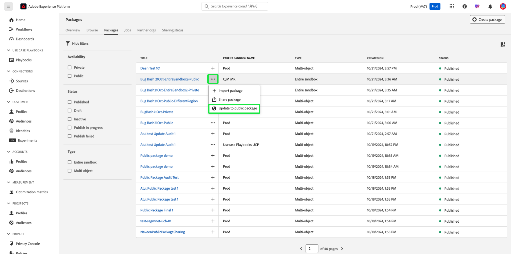
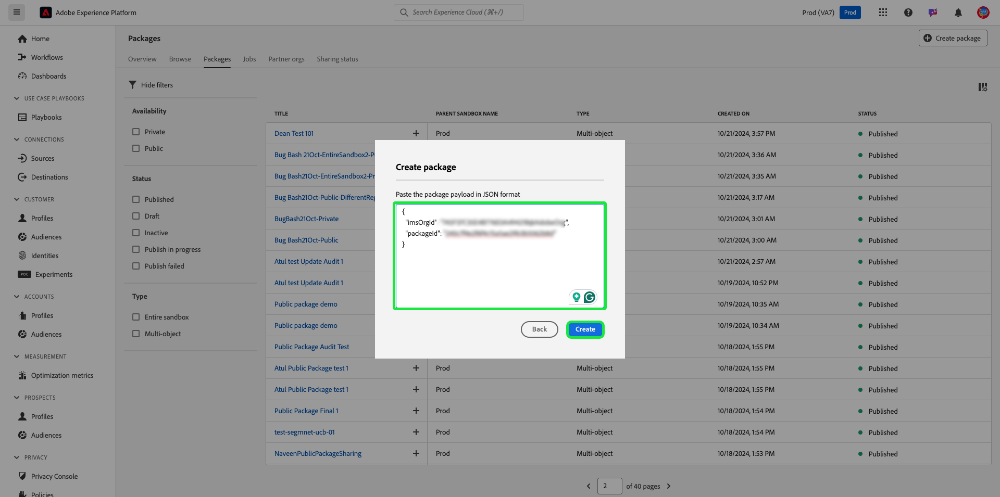

# Share packages across organizations using Sandbox Tooling

Improve configuration accuracy across sandboxes and seamlessly export and import sandbox configurations between sandboxes across different organizations with the sandbox tooling feature. This document covers how to use sandbox tooling in Adobe Experience Platform to share packages across different organizations. There are two types of shared packages:

- **Private package**

[Private packages](#private-packages) can only be shared with organizations that have approved the sharing request from the source organization.

- **Public package**

[Public packages](#public-packages) are available to import without any additional approval. These packages can be shared on a partner's website, blog, or platform. The package payload allows packages to be copied and pasted from these channels to the target organization.

## Private packages {#private-packages}

>[!NOTE]
>
>To initiate and approve a sharing request and share packages across organizations, you will need to have **package-share** role-based access control permission.

Use the Sandbox Tooling feature to create partnerships, track partnership request stats, manage existing partnerships, and share packages with partner organizations.

### Create an organization partnership request

To create an organization partnership request, navigate to the **[!UICONTROL Sandboxes]** **[!UICONTROL Partner orgs]** tab. Next, select **[!UICONTROL Manage partner orgs]**.

In the [!UICONTROL Package partner management] dialog, enter the organization ID into **[!UICONTROL Enter Org ID]** and press enter (Windows) or return (Mac). The organization ID is shown in the **[!UICONTROL Selected Org IDs]** section below. After adding the IDs, select **[!UICONTROL Confirm]**.

>[!TIP]
>
>Multiple organization IDs can be entered at a time using comma-separated lists or by entering each organization ID followed by enter.

The sharing request is successfully sent to the partner organization, and you are returned to the [!UICONTROL Sandboxes] **[!UICONTROL Partner orgs]** tab, which displays the **[!UICONTROL Outgoing request]**.

### Authorize a partnership request {#authorize-request}

To authorize an organization partnership request, navigate to the [!UICONTROL Sandboxes] **[!UICONTROL Partner orgs]** tab. Next, select **[!UICONTROL Incoming request]**.

The current **[!UICONTROL Status]** for the request, at this stage, is **Pending**. To approve the request, select the ellipsis (`...`) next to the selected request, then select **[!UICONTROL Approve]** from the dropdown.

The **[!UICONTROL Review partner org request]** dialog displays details about the organization partnership request. Enter a [!UICONTROL Reason] for approval, then select **[!UICONTROL Approve]**.

You are returned to the [!UICONTROL Incoming request] page, and the request's status has been updated to **[!UICONTROL Approved]**.

Use this workflow/process to share packages between your organization and the source organization.

### Share packages to partner organizations {#share-package}

>[!NOTE]
>
>Only packages with the status **Published** can be shared.

#### Share multi-object packages {#multi-object-packages}

To share a multi-object package to an approved partner organization, navigate to the [!UICONTROL Sandboxes] **[!UICONTROL Packages]** tab. Next, select the ellipsis (`...`) next to the package, and then select **[!UICONTROL Share package]** from the dropdown menu.

In the **[!UICONTROL Share package]** dialog, select the organizations to share the package with from the **[!UICONTROL Share settings]** dropdown, then select **[!UICONTROL Confirm]**.

>[!TIP]
>
>It is possible to select more than one organization. Selected organizations will show up beneath the [!UICONTROL Share settings] dropdown.

#### Share entire sandbox packages {#entire-sandbox-packages}

To share an entire sandbox package to an approved partner organization, navigate to the [!UICONTROL Sandboxes] **[!UICONTROL Packages]** tab. Next, select the ellipsis (`...`) next to the package, and then select **[!UICONTROL Share package]** from the dropdown menu.

In the **[!UICONTROL Share package]** dialog, select the organizations to share the package with from the **[!UICONTROL Share settings]** dropdown, then select **[!UICONTROL Confirm]**.

>[!TIP]
>
>It is possible to select more than one organization. Selected organizations will show up beneath the [!UICONTROL Share settings] dropdown.

## Public packages {#public-packages}

Use the Sandbox Tooling feature to create shareable public packages that don't require any additional approval and are easily imported with the use of the package's payload.

### Update package availability to public {#update-package}

To update a package's availability type, navigate to the [!UICONTROL Sandboxes] **[!UICONTROL Packages]** tab. Next, select the ellipsis (`...`) next to the package, and then select **[!UICONTROL Update to public package]** from the dropdown menu.

In the **[!UICONTROL Change package availability to public]** dialog, verify the package name is correct and select **[!UICONTROL Confirm]**. 

>[!IMPORTANT]
>
> Once a package has been made public, it cannot be changed back to private.

### Share packages using the package payload

To share the public package, select the ellipses (`...`) next to the package, and then select **[!UICONTROL Copy package payload]**.

The **[!UICONTROL Copy package payload]** dialog displays the package name and payload. Select **[!UICONTROL Copy package payload]** to copy the payload associated with the package.

### Create a new package using a package payload

To create a package using a package payload, navigate to the [!UICONTROL Sandboxes] **[!UICONTROL Packages]** tab. Next, select **[!UICONTROL Create package]**.

In the **[!UICONTROL Create package]** dialog, select the option to **[!UICONTROL Paste package payload]**, then select **[!UICONTROL Select]**.

Paste the copied package payload into the text field and select **[!UICONTROL Create]**. 

To view the current status of your share request, navigate to the **[!UICONTROL Sharing status]**. The current status of the request is shown in the **[!UICONTROL Sharing status]** column.

## Next steps {#next-steps}

This document demonstrated how to use the Sandbox tooling feature to share packages across different organizations. For additional information, refer to the [sandbox tooling guide](../ui/sandbox-tooling.md).

To learn how to perform different operations using the Sandbox API, see the [sandbox developer guide](../api/getting-started.md). For a high-level overview of sandboxes in Experience Platform, refer to the [overview documentation](../home.md).

## Sandboxes {#sandboxes}

Experience Platform is built to enrich digital experience applications on a global scale. Companies often run multiple digital experience applications in parallel and need to cater for the development, testing, and deployment of these applications while ensuring operational compliance.

**New or updated features**

| Feature | Description |
| --- | --- |
| Dependency object de-duplication in importing workflow | Sandbox tooling will now always reuse existing objects if objects with the same name are detected, to avoid object proliferation. This change applies to the following objects: <ul><li>Schema</li><li>Field group</li><li>Audience</li><li>`decisioning_ranking`</li><li>`decisioning_rules`</li></ul> For more information, read the [guide on objects supported for sandbox tooling](../../sandboxes/ui/sandbox-tooling.md#objects-supported-for-sandbox-tooling). |

| Entire sandbox support for across orgs package sharing | Sandbox tooling now supports **Entire sandbox** type in across org package sharing. You can now share both Entire sandbox and Multi-object packages across orgs. For more information, read the [guide on objects supported for sandbox tooling](../../sandboxes/ui/sharing-packages-across-orgs.md). |

For more information on sandboxes, read the [sandboxes overview](../../sandboxes/home.md).