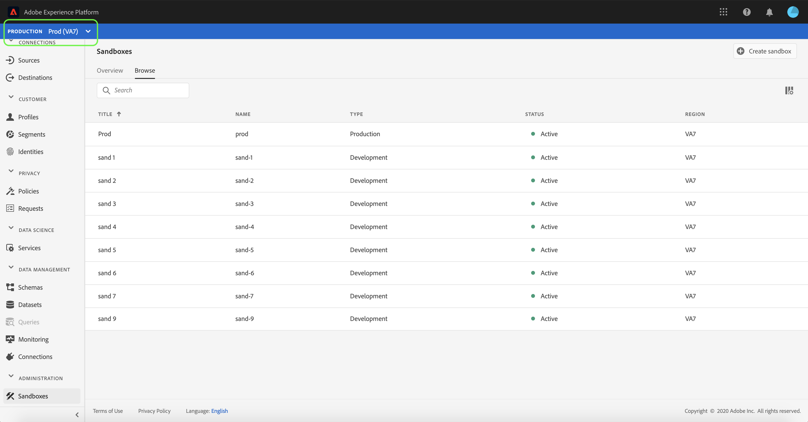
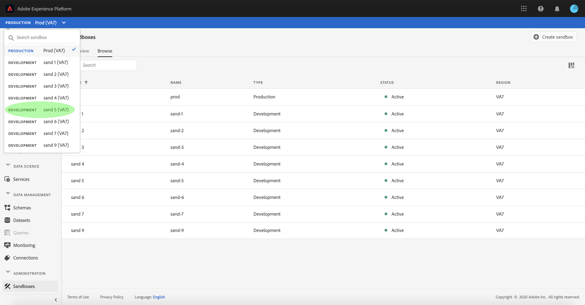
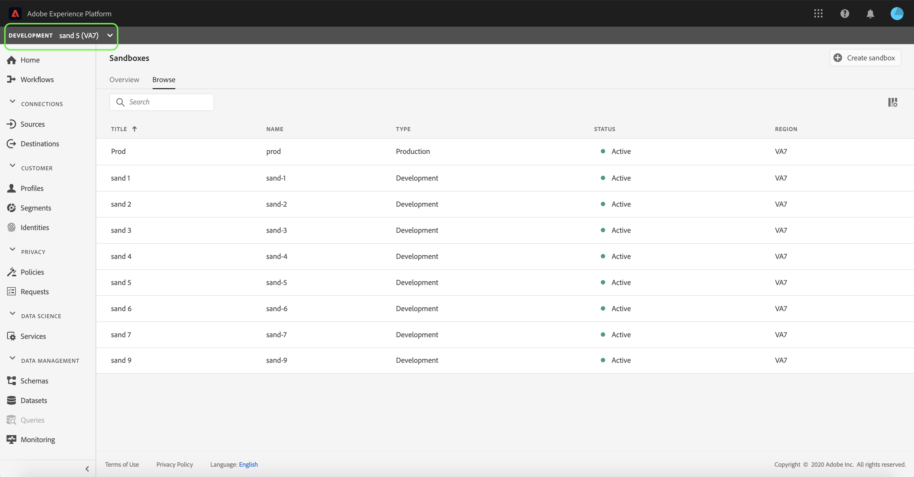
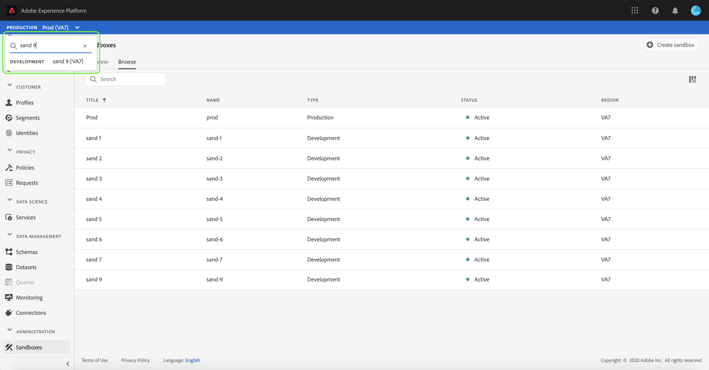
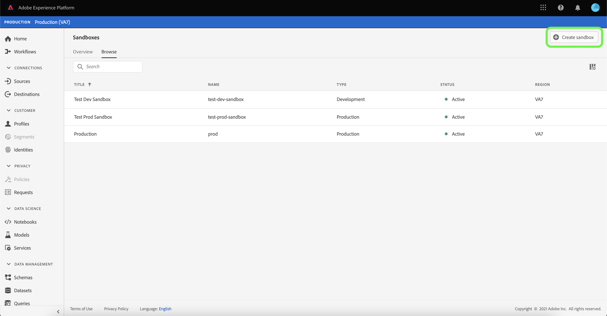
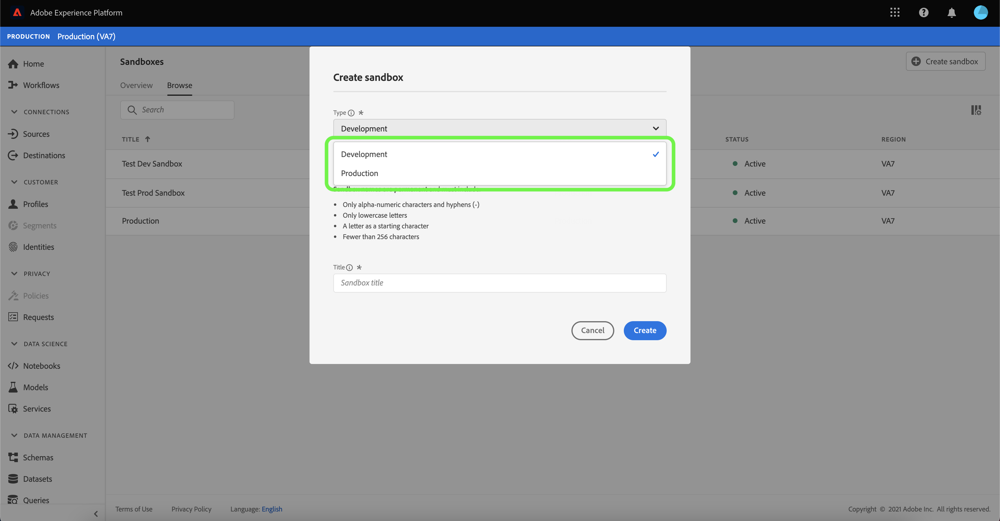
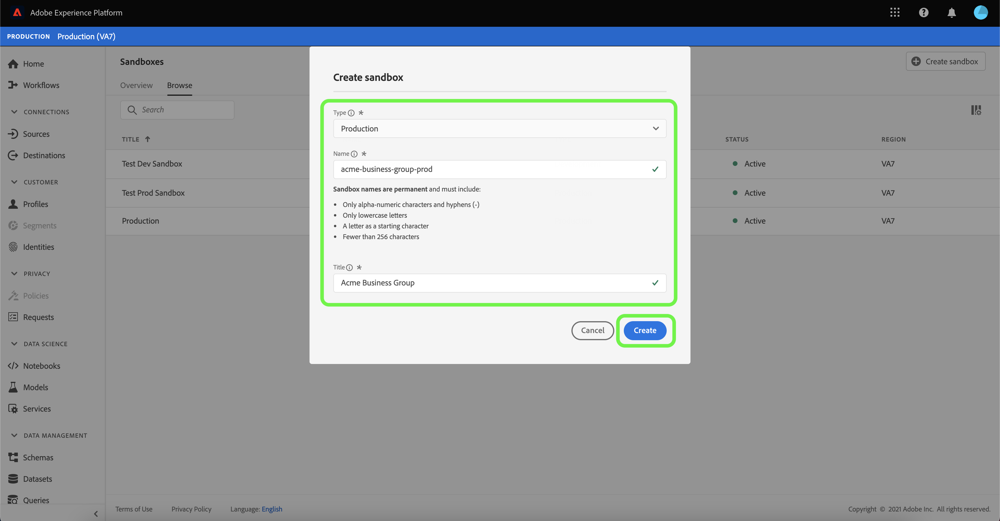

# Sandbox UI guide

This document provides steps on how to perform various operations related to sandboxes in the Adobe Experience Platform user interface.

## View sandboxes

In the Platform UI, select **[!UICONTROL Sandboxes]** in the left-navigation to open the **[!UICONTROL Sandboxes]** dashboard. The dashboard lists all available sandboxes for your organization, including the sandbox type (production or development) and state (active, creating, deleted, or failed).

## Switch between sandboxes

The **sandbox switcher** control at the top-left of the screen displays the currently active sandbox.

To switch between sandboxes, select the sandbox switcher and select the desired sandbox from the dropdown list.

Once a sandbox is selected, the screen refreshes with the selected sandbox now featured in the sandbox switcher.

## Search for a sandbox

You can navigate through the list of sandboxes available to you by using the search function from the sandbox switcher menu. Type in the name of the sandbox you would like to access to filter through all sandboxes available to your organization.

## Create a new sandbox

Use the following video for a quick overview on how to use Sandboxes in Experience Platform.

>[!VIDEO](https://video.tv.adobe.com/v/29838/?quality=12&learn=on)

To create a new sandbox, select **[!UICONTROL Create sandbox]** on the top right corner of the screen.

The **[!UICONTROL Create sandbox]** dialog box appears. If you are creating a development sandbox, select **[!UICONTROL Development]** in the dropdown panel. To create a new production sandbox, select **[!UICONTROL Production]**.

After you select the type of sandbox you are creating, provide your sandbox with a name and a title. The title is meant to be human-readable and should be descriptive enough to be easily identifiable. The sandbox name is an all-lowercase identifier for use in API calls and should therefore be unique and concise. The sandbox name must consist only of alphanumeric characters and hyphens (`-`), it must begin with a letter, and has a maximum of 256 characters.

When finished, select **[!UICONTROL Create]**.

Once you have finished creating the sandbox, refresh the page and the new sandbox appears in the **[!UICONTROL Sandboxes]** dashboard with a status of "[!UICONTROL Creating]". New sandboxes take approximately 30 seconds to be provisioned by the system, after which their status changes to "[!UICONTROL Active]".

## Reset a sandbox

>[!NOTE]
>
>You can reset any production or development sandboxes in your organization, except the default production sandbox that contains Adobe Audience Manager and Adobe Analytics data.

Resetting a production or development sandbox deletes all resources associated with that sandbox (schemas, datasets, and so on), while maintaining the sandbox's name and associated permissions. This "clean" sandbox continues to be available under the same name for users that have access to it.

Select the sandbox you want to reset from the list of sandboxes. In the right-navigation panel that appears, select **[!UICONTROL Sandbox reset]**.

A dialog box appears prompting you to confirm your choice. Select **[!UICONTROL Continue]** to proceed.

In the final confirmation window, enter the name of the sandbox in the dialog box and select **[!UICONTROL Reset]**

## Delete a sandbox

>[!NOTE]
>
>You can delete any production or development sandboxes in your organization, except the default production sandbox.

Deleting a production or development sandbox permanently removes all resources associated with that sandbox, including permissions.

Select the sandbox you want to delete from the list of sandboxes. In the right-navigation panel that appears, select **[!UICONTROL Delete]**.

A dialog box appears prompting you to confirm your choice. Select **[!UICONTROL Continue]** to proceed.

In the final confirmation window, enter the name of the sandbox in the dialog box and select  **[!UICONTROL Continue]**

## Next steps

This document demonstrated how to manage sandboxes within the Experience Platform UI. For information on how to manage sandboxes using the Sandbox API, see the [sandbox developer guide](../api/getting-started.md).
