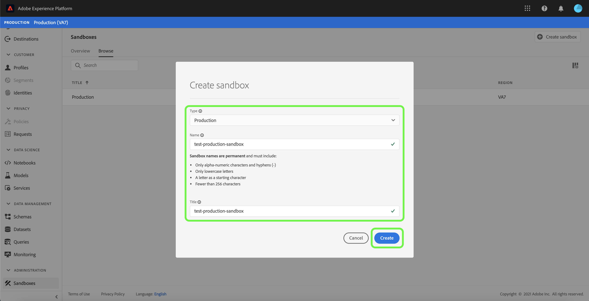
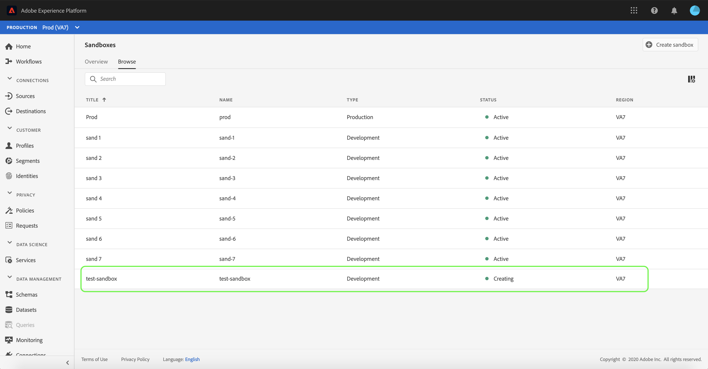
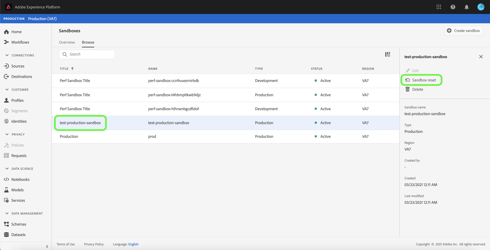
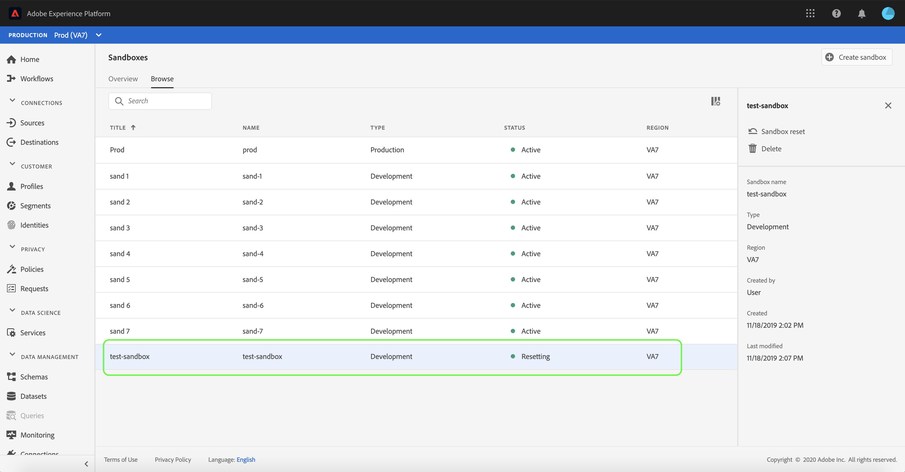
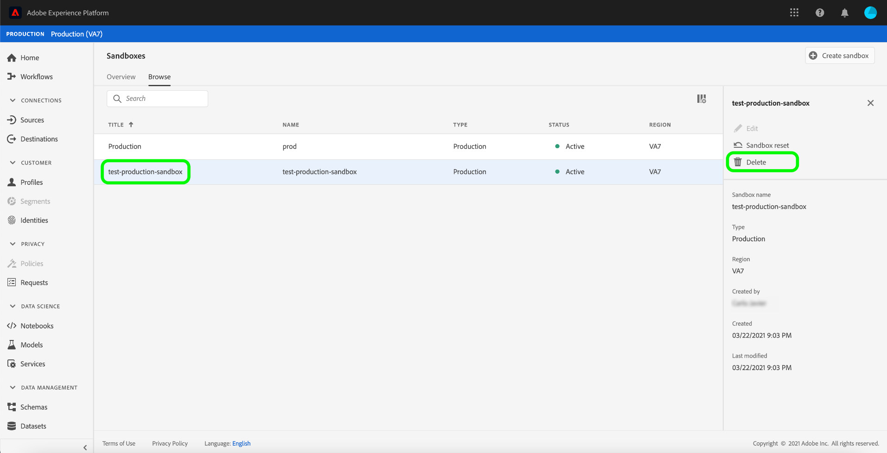

# Sandbox UI guide

This document provides steps on how to perform various operations related to sandboxes in the Adobe Experience Platform user interface.

## View sandboxes

In the Experience Platform UI, select **[!UICONTROL Sandboxes]** in the left-navigation to open the **[!UICONTROL Sandboxes]** dashboard. The dashboard lists all available sandboxes for your organization, including the sandbox type (production or development) and state (active, creating, deleted, or failed).

## Switch between sandboxes

The **sandbox switcher** control at the top-left of the screen displays the currently active sandbox.

To switch between sandboxes, select the sandbox switcher and select the desired sandbox from the dropdown list.

Once a sandbox is selected, the screen refreshes with the selected sandbox now featured in the sandbox switcher.

## Sesrch for a sandbox

You can navigate through the list of sandboxes available to you by using the search function from the sandbox switcher menu. Type in the name of the sandbox you would like to access to filter through all sandboxes available to your organization.

## Create a new sandbox

Use the following video for a quick overview on how to use Sandboxes in Experience Platform.

>[!VIDEO](https://video.tv.adobe.com/v/29838/?quality=12&learn=on)

To create a new sandbox in the UI, select the **[!UICONTROL Create Sandbox]** button on the top right side of the screen.

The **[!UICONTROL Create Sandbox]** dialog appears, prompting you to provide a display title and name for the sandbox. The **display title** is meant to be human-readable and should be descriptive enough to be easily identifiable. The sandbox **[!UICONTROL Name]** is an all-lowercase identifier for use in API calls, and should therefore be unique and concise. The sandbox **[!UICONTROL Name]** must consist only of alphanumeric characters and hyphens **(-)**, it must begin with a letter, and has a maximum of 256 characters.

When finished, select **[!UICONTROL Create]**.

>[!NOTE]
>
>Since you are restricted to creating non-production sandbox types only, the **[!UICONTROL type]** option is locked at "Non-Production" and cannot be manipulated.

Once you have finished creating the sandbox, refresh the page and the new sandbox appears in the **[!UICONTROL Sandboxes]** dashboard with a status of "[!UICONTROL Creating]". New sandboxes take approximately 15 minutes to be provisioned by the system, after which their status changes to "[!UICONTROL Active]".

## Reset a sandbox

>[!NOTE]
>
>This functionality is only available for non-production sandboxes. Production sandboxes cannot be reset.

Resetting a non-production sandbox deletes all resources associated with that sandbox (schemas, datasets, and so on), while maintaining the sandbox's name and associated permissions. This "clean" sandbox continues to be available under the same name for users that have access to it.

To reset a sandbox in the UI, select **[!UICONTROL Sandboxes]** in the left-nav, then select the sandbox you want to reset. In the dialog that appears on the right-hand side of the screen, select **[!UICONTROL Reset Sandbox]**.

A dialog appears prompting you to confirm your choice. Select **[!UICONTROL Reset]** to continue.

A confirmation message appears and the sandbox's state changes to "**[!UICONTROL Resetting]"**. Once it has been provisioned by the system, its state will update to **"[!UICONTROL Active]"** or **"[!UICONTROL Failed]"**.

## Delete a sandbox

>[!NOTE]
>
>This functionality is only available for non-production sandboxes. Production sandboxes cannot be deleted.

Deleting a non-production sandbox permanently removes all resources associated with that sandbox, including permissions.

 To delete a sandbox in the UI, select **[!UICONTROL Sandboxes]** in the left-nav, then select the sandbox you want to delete. In the dialog that appears on the right-hand side of the screen, select **[!UICONTROL Delete Sandbox]**.

A dialog appears prompting you to confirm your choice. Select **[!UICONTROL Delete]** to continue.

A confirmation message appears and the sandbox is removed from the **[!UICONTROL Sandboxes]** workspace.

## Next steps

This document demonstrated how to manage sandboxes within the Experience Platform UI. For information on how to manage sandboxes using the Sandbox API, see the [sandbox developer guide](../api/getting-started.md).
