# Sandbox UI guide

This document provides steps on how to perform various operations related to sandboxes in the Adobe Experience Platform user interface.

## View sandboxes

In the Platform UI, select **[!UICONTROL Sandboxes]** in the left navigation and then select **[!UICONTROL Browse]** to open the [!UICONTROL Sandboxes] dashboard. The dashboard lists all available sandboxes for your organization, including their respective types (production or development).

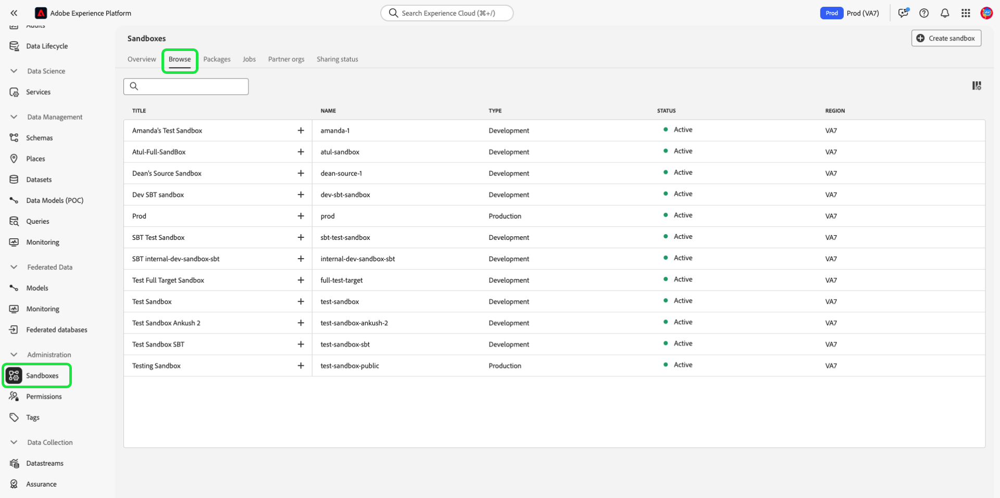

## Switch between sandboxes

The sandbox indicator is located in the top header of the Platform UI and displays the title of the sandbox that you are currently in, its region, and its type.

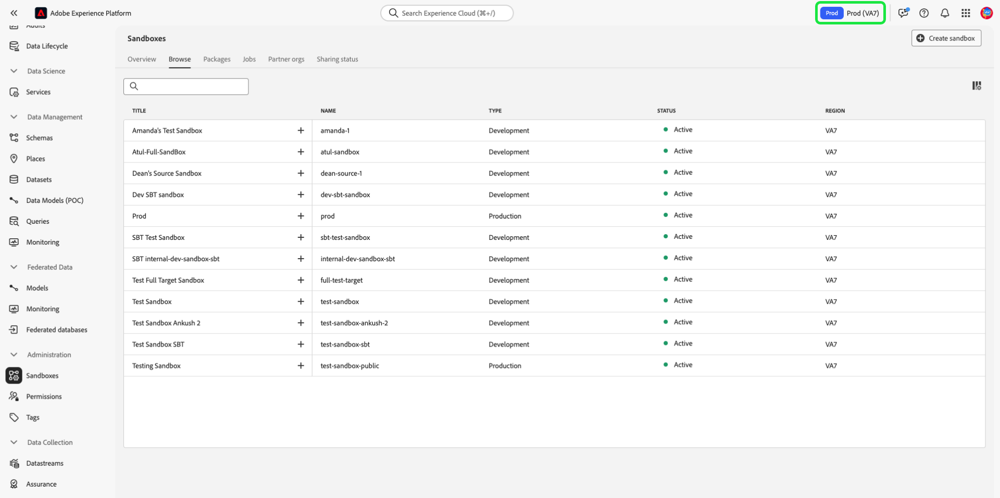

To switch between sandboxes, select the sandbox indicator and select the desired sandbox from the dropdown list.

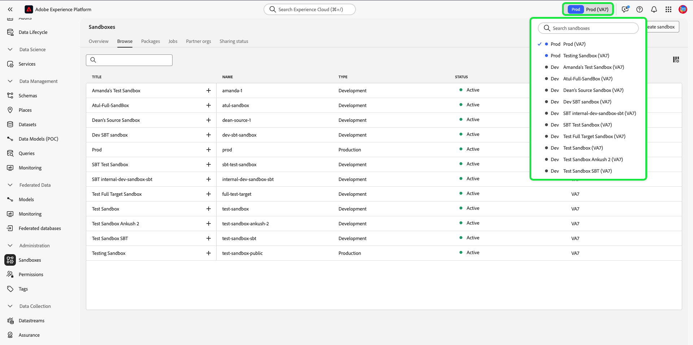

Once a sandbox is selected, the screen refreshes and updates to the sandbox you selected.

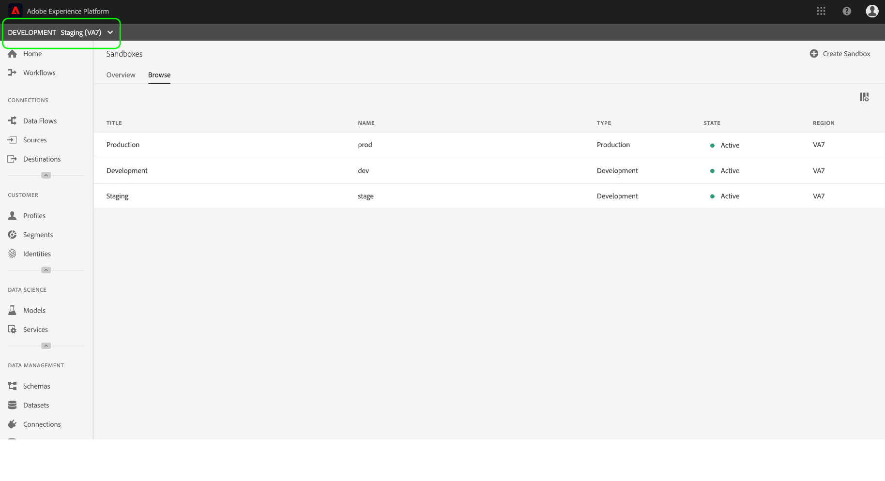

## Create a new sandbox {#create}

>[!CONTEXTUALHELP]
>id="platform_sandboxes_sandboxname"
>title="Sandbox Name"
>abstract="The sandbox name is the text that is used on the back end to create a unique ID for this sandbox."

>[!CONTEXTUALHELP]
>id="platform_sandboxes_sandboxtitle"
>title="Sandbox Title"
>abstract="The sandbox title is the display name that will represent the sandbox in menus and dropdowns throughout the Experience Platform UI."

>[!NOTE]
>
>When a new sandbox is created, you must first add that new sandbox to your product profile in [Adobe Admin Console](https://adminconsole.adobe.com/) before you can start using the new sandbox. See the documentation on [managing permissions for a product profile](../../access-control/ui/permissions.md) for information on how to provision a sandbox to a product profile.

Use the following video for a quick overview on how to use Sandboxes in Experience Platform.

>[!VIDEO](https://video.tv.adobe.com/v/29838/?quality=12&learn=on)

To create a new sandbox, select **[!UICONTROL Create sandbox]** on the top-right corner of the screen.

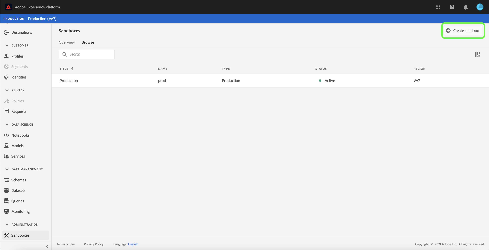

The **[!UICONTROL Create sandbox]** dialog box appears. If you are creating a development sandbox, select **[!UICONTROL Development]** in the dropdown panel. To create a new production sandbox, select **[!UICONTROL Production]**.

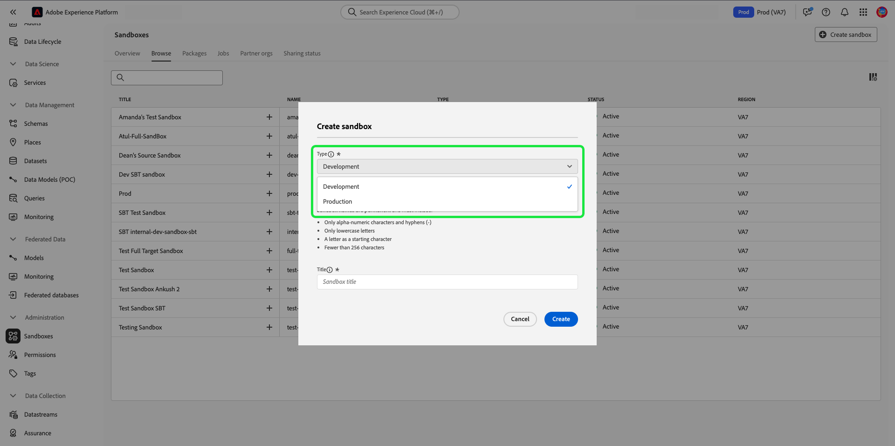

After selecting the type, provide your sandbox with a name and a title. The title is meant to be human-readable and should be descriptive enough to be easily identifiable. The sandbox name is an all-lowercase identifier for use in API calls and should therefore be unique and concise. The sandbox name must begin with a letter, have a maximum of 256 characters, and consist only of alphanumeric characters and hyphens (-).

When finished, select **[!UICONTROL Create]**.

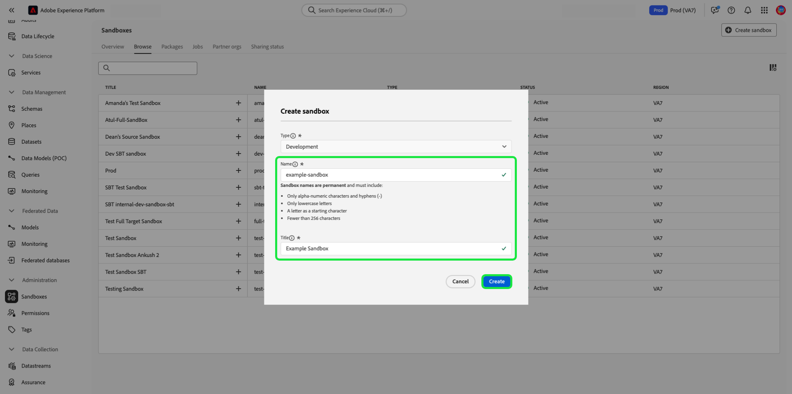

Once you have finished creating the sandbox, refresh the page and the new sandbox appears in the **[!UICONTROL Sandboxes]** dashboard with a status of "[!UICONTROL Creating]". New sandboxes take approximately 30 seconds to be provisioned by the system, after which their status changes to "[!UICONTROL Active]".

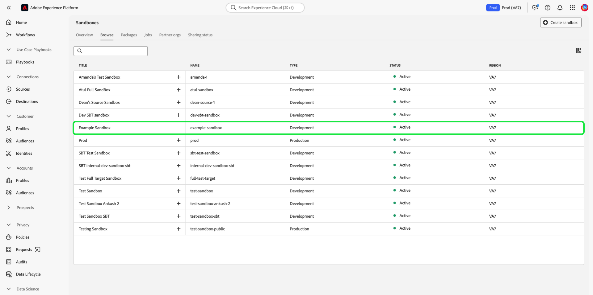

## Reset a sandbox

>[!WARNING]
>
>The following is a list of exceptions that can prevent you from resetting the default production sandbox or a user-created production sandbox: <ul><li>The default production sandbox cannot be reset if the identity graph hosted in the sandbox is also being used by Adobe Analytics for the [Cross Device Analytics (CDA)](https://experienceleague.adobe.com/docs/analytics/components/cda/overview.html) feature.</li><li>The default production sandbox cannot be reset if the identity graph hosted in the sandbox is also being used by Adobe Audience Manager for the [People Based Destinations (PBD)](https://experienceleague.adobe.com/docs/audience-manager/user-guide/features/destinations/people-based/people-based-destinations-overview.html).</li><li>The default production sandbox cannot be reset if it contains data for both CDA and PBD features.</li><li>A user-created production sandbox that is used for bi-directional segment sharing with Adobe Audience Manager or Audience Core Service can be reset after a warning message.</li><li>Before initiating a sandbox reset, you will be required to delete your compositions manually to ensure that the associated audience data is cleaned up properly.</li></ul>

### Delete audience compositions

Audience composition is currently not integrated with the sandbox reset capability, so audiences will need to be deleted manually prior to performing the sandbox reset.

Select **[!UICONTROL Audiences]** from the left navigation, followed by the **[!UICONTROL Composition]** tab.

![The [!UICONTROL Composition] tab in the [!UICONTROL Audiences] workspace.](../images/ui/audiences.png)

Next, select the ellipsis (`...`) menu next to the first audience, then select **[UICONTROL Delete]**. 

![The audience menu highlighting the [!UICONTROL Delete] option.](../images/ui/delete.png)

You will see a confirmation toast message.

Repeat the above steps with all your compositions. This will delete all audiences from the audience inventory. Once complete, you can continue to reset the sandbox.

### Resetting a sandbox

Resetting a production or development sandbox deletes all resources associated with that sandbox (schemas, datasets, and so on), while maintaining the sandbox's name and associated permissions. This "clean" sandbox continues to be available under the same name for users that have access to it.

Select the sandbox you want to reset from the list of sandboxes. In the right-navigation panel that appears, select **[!UICONTROL Sandbox reset]**.

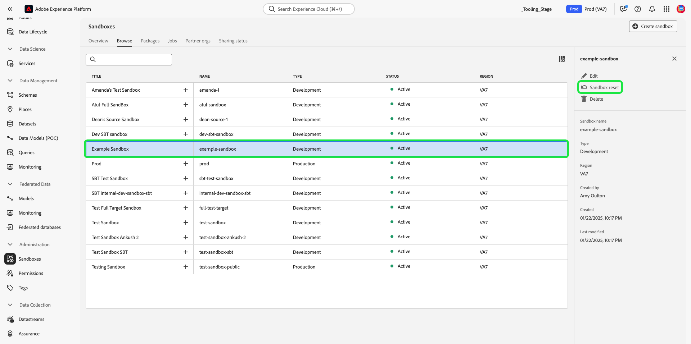

A dialog box appears prompting you to confirm your choice. Select **[!UICONTROL Continue]** to proceed.

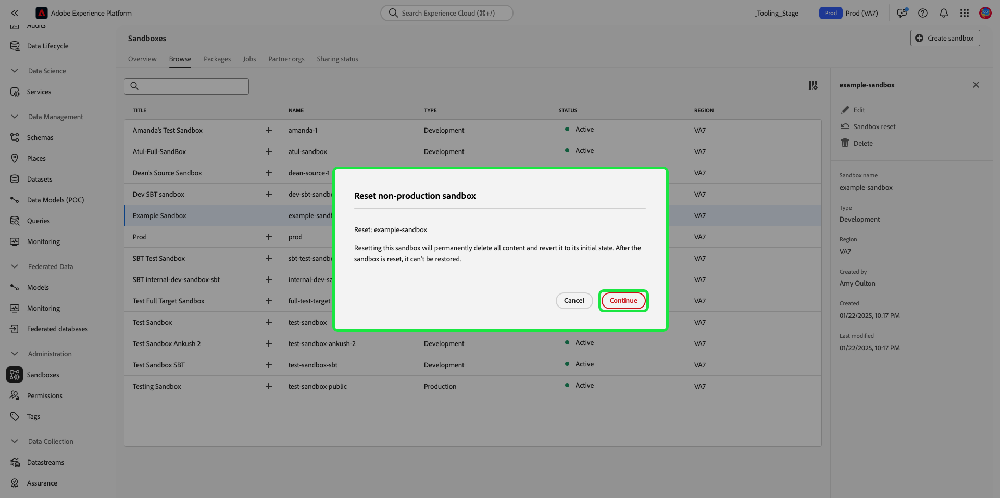

In the final confirmation window, enter the name of the sandbox in the dialog box and select **[!UICONTROL Reset]**.

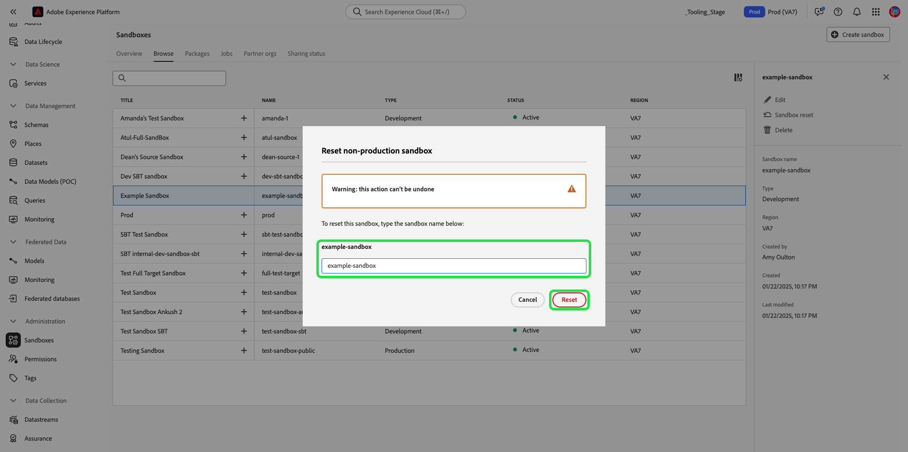

## Delete a sandbox

>[!WARNING]
>
>You cannot delete the default production sandbox. However, any user-created production sandbox that is used for bi-directional segment sharing with [!DNL Audience Manager] or [!DNL Audience Core Service] can be deleted after a warning message.

Deleting a production or development sandbox permanently removes all resources associated with that sandbox, including permissions.

Select the sandbox you want to delete from the list of sandboxes. In the right-navigation panel that appears, select **[!UICONTROL Delete]**.

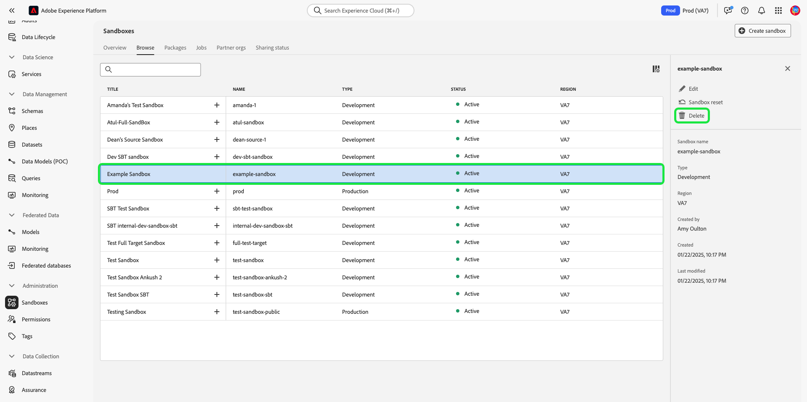

A dialog box appears prompting you to confirm your choice. Select **[!UICONTROL Continue]** to proceed.

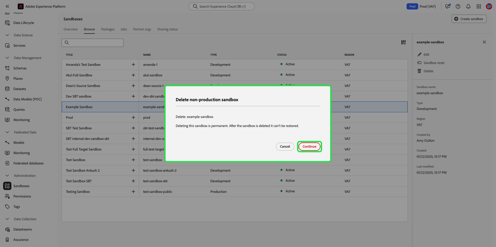

In the final confirmation window, enter the name of the sandbox in the dialog box and select  **[!UICONTROL Continue]**.

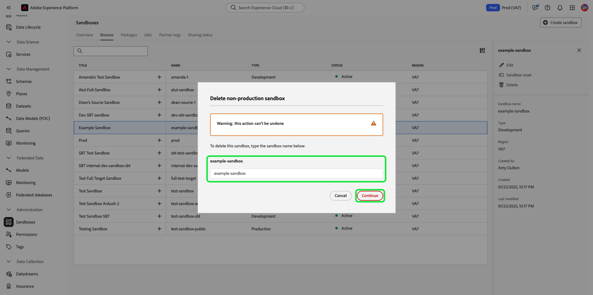

## Next steps

This document demonstrated how to manage sandboxes within the Experience Platform UI. For information on how to manage sandboxes using the Sandbox API, see the [sandbox developer guide](../api/getting-started.md).
