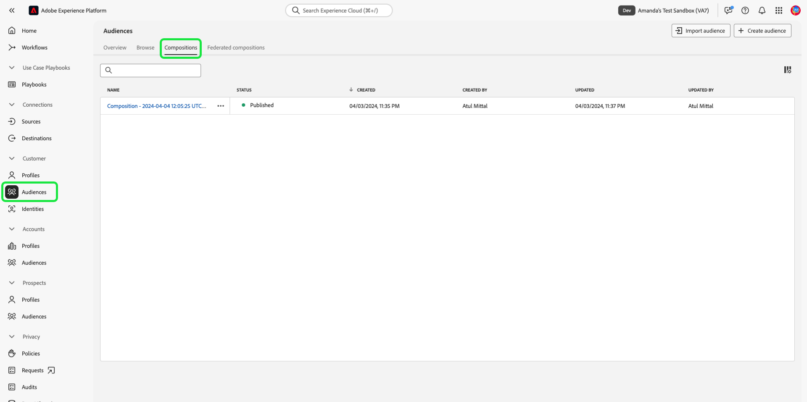

# Sandbox UI guide

This document provides steps on how to perform various operations related to sandboxes in the Adobe Experience Platform user interface.

## View sandboxes

In the Experience Platform UI, select **[!UICONTROL Sandboxes]** in the left navigation and then select the **[!UICONTROL Browse]** tab to open the [!UICONTROL Sandboxes] dashboard. The dashboard lists all available sandboxes for your organization, including their respective types (production or development).

## Switch between sandboxes

The sandbox indicator is located in the top header of the Platform UI and displays the title of the sandbox that you are currently in, its region, and its type.

To switch between sandboxes, select the sandbox indicator and then select the desired sandbox from the dropdown list. Alternatively, you can search for your desired sandbox using the search feature within the dropdown menu.

Once a sandbox is selected, the screen refreshes and updates to the sandbox you selected.

## Create a new sandbox {#create}

>[!CONTEXTUALHELP]
>id="platform_sandboxes_sandboxname"
>title="Sandbox Name"
>abstract="The sandbox name is the text that is used on the back end to create a unique ID for this sandbox."

>[!CONTEXTUALHELP]
>id="platform_sandboxes_sandboxtitle"
>title="Sandbox Title"
>abstract="The sandbox title is the display name that will represent the sandbox in menus and dropdowns throughout the Experience Platform UI."

>[!WARNING]
>
>The creation of a new sandbox requires you to add it to a role in [[!UICONTROL Permissions]](../../access-control/abac/ui/permissions.md) before you can begin using it. To learn how to provision a sandbox for a role, refer to the [managing sandboxes for a role](../../access-control/abac/ui/permissions.md#managing-sandboxes-for-role) documentation.

Use the following video for a quick overview on how to use Sandboxes in Experience Platform.

>[!VIDEO](https://video.tv.adobe.com/v/29838/?quality=12&learn=on)

To create a new sandbox, select **[!UICONTROL Create sandbox]** on the top-right corner of the screen.

The **[!UICONTROL Create sandbox]** dialog box appears. Select the **[!UICONTROL Type]** dropdown and choose either the [!UICONTROL Development] or [!UICONTROL Production] sandbox type. 

After selecting the type, provide a name for your sandbox in the **[!UICONTROL Name]** field. The sandbox name is an all-lowercase identifier for use in API calls and should therefore be unique and concise. The sandbox name must begin with a letter, have a maximum of 256 characters, and consist only of alphanumeric characters and hyphens (-). Next, provide a title for your sandbox in the **[!UICONTROL Title]** field. The title is meant to be human-readable and should be descriptive enough to be easily identifiable. 

When finished, select **[!UICONTROL Create]**.

Once you have finished creating the sandbox, refresh the page and the new sandbox appears in the **[!UICONTROL Sandboxes]** dashboard with a status of "[!UICONTROL Creating]". New sandboxes take approximately 30 seconds to be provisioned by the system, after which their status changes to "[!UICONTROL Active]".

## Reset a sandbox

>[!WARNING]
>
>The following is a list of exceptions that can prevent you from resetting the default production sandbox or a user-created production sandbox: 
>
>* A user-created production sandbox that is used for bi-directional segment sharing with Adobe Audience Manager or Audience Core Service can be reset after a warning message.
>* Before initiating a sandbox reset, you will be required to delete your compositions manually to ensure that the associated audience data is cleaned up properly.
>* The sandbox ID will change after the reset is complete.
>* For Journey Optimizer B2B Edition, sandbox reset is **not currently supported**. Resetting or deleting a sandbox that is mapped to Journey Optimizer B2B Edition may result in permanent loss of data in Journey Optimizer B2B Edition and could require provisioning of a new Journey Optimizer B2B Edition instance.

### Delete audience compositions

Audience composition is currently not integrated with the sandbox reset capability, so audiences will need to be deleted manually prior to performing the sandbox reset.

Select **[!UICONTROL Audiences]** from the **[!UICONTROL Customers]** section in the left navigation and then select the **[!UICONTROL Compositions]** tab.

Next, select the ellipsis (`...`) next to the first audience, then select **[!UICONTROL Delete]**. 

![The audience menu highlighting the [!UICONTROL Delete] option.](../images/ui/delete-composition.png)

A confirmation of successful deletion is displayed and you are returned to the **[!UICONTROL Compositions]** tab.

Repeat the above steps with all your compositions. This will delete all audiences from the audience inventory. Once all audiences have been removed, you can continue to reset the sandbox.

### Resetting a sandbox

Resetting a production or development sandbox deletes all resources associated with that sandbox (schemas, datasets, and so on), while maintaining the sandbox's name and associated permissions. This "clean" sandbox continues to be available under the same name for users that have access to it.

Select the sandbox you want to reset from the list of sandboxes. In the right-navigation panel that appears, select **[!UICONTROL Sandbox reset]**.

A dialog box appears prompting you to confirm your choice. Select **[!UICONTROL Continue]** to proceed.

In the final confirmation window, enter the name of the sandbox in the dialog box and select **[!UICONTROL Reset]**.

## Delete a sandbox

>[!WARNING]
>
>You cannot delete the default production sandbox. However, any user-created production sandbox that is used for bi-directional segment sharing with [!DNL Audience Manager] or [!DNL Audience Core Service] can be deleted after a warning message.

Deleting a production or development sandbox permanently removes all resources associated with that sandbox, including permissions.

Select the sandbox you want to delete from the list of sandboxes. In the right-navigation panel that appears, select **[!UICONTROL Delete]**.

A dialog box appears prompting you to confirm your choice. Select **[!UICONTROL Continue]** to proceed.

In the final confirmation window, enter the name of the sandbox in the dialog box and select  **[!UICONTROL Continue]**.

## Next steps

This document demonstrated how to manage sandboxes within the Experience Platform UI. Now that you know how to manage sandboxes, learn how to improve configuration accuracy across sandboxes and seamlessly export and import sandbox configurations between sandboxes with the [sandbox tooling feature](./sandbox-tooling.md) guide.

For information on how to manage sandboxes using the Sandbox API, see the [sandbox developer guide](../api/getting-started.md).
