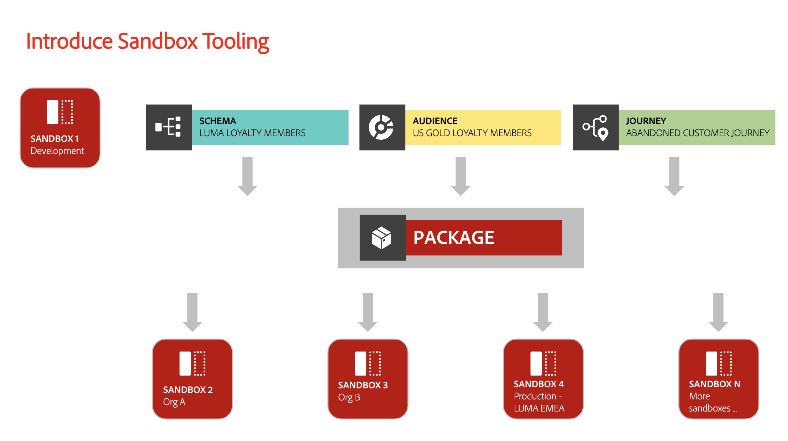
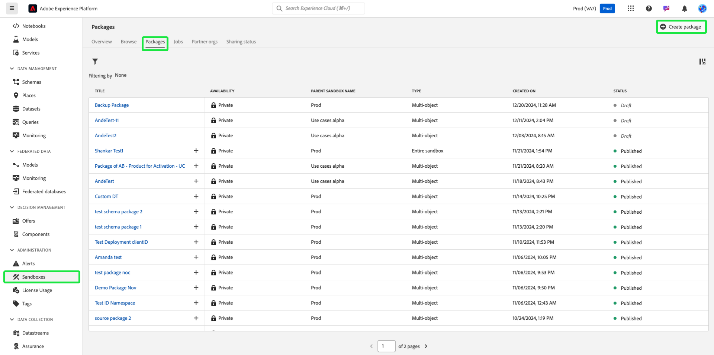
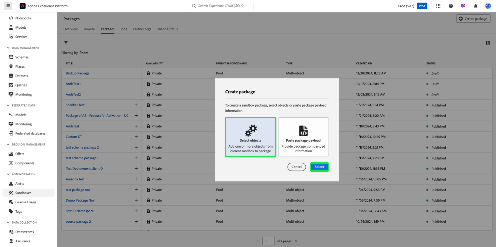
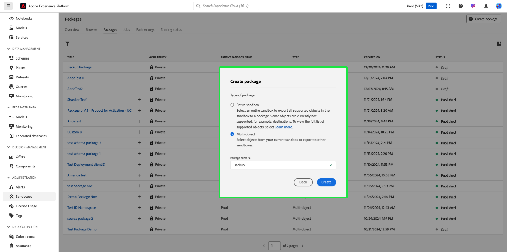
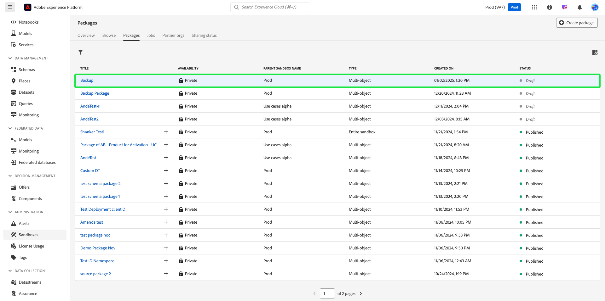

# Back up object configurations using sandbox tooling

To safely reset sandboxes and add versioning support, back up object configurations (or metadata) using sandbox tooling packages. Backup packages prevent the loss of critical configurations such as schemas, datasets, and audiences, especially during development iterations.

{zoomable="yes"}

## Why consider this use case {#why-this-use-case}

Creating a backup package using sandbox tooling ensures your object configurations are stored and secured. Development sandboxes can fill quickly as you experiment and build, while building a sandbox from scratch after resetting it can be time-consuming and leave room for errors. With the power of sandbox tooling, you can import a backup package into a freshly reset sandbox to immediately return your ideal configurations so you can continue developing. 

Backup packages also allow you to support versioning throughout your development process. As your sandbox changes, create additional backup packages alongside your previous packages so you can easily restore your sandbox to any of your configurations. 

## Prerequisites and planning {#prerequisites-and-planning}

When planning to create your own backup package within your organization, consider the following prerequisites in your planning process:

- Evaluate the current usages of the sandboxes within your organization. Are any non-production sandboxes approaching or exceeding their license entitlement?
- What is the scope of the metadata you wish to back up? You may consider backing up either a complete or partial sandbox, depending on your use case.
- Depending on the scope metadata you wish to back up, ensure you understand how to manually [add objects to a package](../ui/sandbox-tooling.md#add-object-to-a-new-package) or how to [export an entire sandbox](../ui/sandbox-tooling.md#export-an-entire-sandbox).
- Ensure you have access to sandbox tooling in your organization with the correct permissions.

### UI functionality, Platform components, and Experience Cloud products that you will use {#ui-functionality-and-elements}

To successfully implement this use case, you must use multiple areas of Adobe Experience Platform. Ensure you have the necessary [attribute-based access control permissions](../../access-control/abac/overview.md) for all these areas, or ask your system administrator to grant you the necessary permissions.

- [Sandbox tooling](../ui/sandbox-tooling.md)
- [Sandbox management](../ui/user-guide.md)
- [License usage dashboard](../../landing/license-usage-and-guardrails/license-usage-dashboard.md)
- [Datasets](../../catalog/datasets/overview.md)
- [Schemas](../../xdm//home.md)
- [Audiences](../../segmentation/home.md)
- [Journeys from Adobe Journey Optimizer](https://experienceleague.adobe.com/en/docs/journey-optimizer/using/orchestrate-journeys/journey)

## How to achieve the use case: high-level overview {#achieve-the-use-case-high-level}

1. Define the scope of the metadata you wish to backup.
2. Use the sandbox tooling user interface to export your desired objects into a backup package.
3. Regularly create new versions of the backup package to ensure sandboxes remain aligned with your current configurations.
4. Check your current usage in the license usage dashboard against your entitlements for non-production sandboxes.
5. Reset non-production sandboxes to comply with entitlements or to free up unnecessary resources and data storage.
6. Import the backup package into your sandbox after resetting it to restore object configurations.

## How to achieve the use case: Step-by-step instructions {#step-by-step-instructions}

Read through the sections below, which include links to further documentation, to complete each of the steps in the high-level overview above.

### Define the metadata scope

Before you begin creating your backup package you should consider the package's use case. Depending on your needs, you may wish to back up a complete sandbox or select specific objects to add to your package, as mentioned in the [prerequsites](#prerequisites-and-planning). 

>[!NOTE]
>
> If you're considering backing up your sandbox to reset it, be aware of the [limitations](../ui/user-guide.md#reset-a-sandbox) surrounding resetting sandboxes.

### Export your chosen metadata into a package

At this point, you're ready to back up your sandbox using the sandbox tooling user interface. This step covers both backing up an entire sandbox and backing up specific objects.

>[!NOTE]
>
> Not all objects are supported for sandbox tooling. Refer to the [objects supported for sandbox tooling](../ui/sandbox-tooling.md#objects-supported-for-sandbox-tooling) guide for a comprehensive list of allowable objects.

#### Export a complete sandbox

To back up your sandbox in entirety, follow the [sandbox tooling guide](../ui/sandbox-tooling.md#export-an-entire-sandbox) to create and publish a new package containing the configurations of your entire sandbox.

#### Export individual objects

You may back up individual objects into a package any of the following ways. While these guides focus on adding a schema into the package, the same steps apply for other objects, such as datasets, audiences or journeys.

- Add an individual object to a new package, following sandbox tooling's [adding objects guide](../ui/sandbox-tooling.md#add-object-to-a-new-package). 
- Add an individual object to an existing backup package, following the [sandbox tooling guide](../ui/sandbox-tooling.md#add-an-object-to-an-existing-package-and-publish), making sure you publish your changes.
- Create an empty multi-object package to add objects to, following the guide below.

##### Creating a multi-object package

In Experience Platform, select **[!UICONTROL Sandboxes]** in the left navigation and then select **[!UICONTROL Packages]**. To begin creating a new package, select **[!UICONTROL Create package]** from the top-right corner.

The **[!UICONTROL Create package]** dialog box appears. Choose **[!UICONTROL Select objects]** and then select **[!UICONTROL Select]**.

Select the **[!UICONTROL Multi-object]** option. Now, you need to provide a name for your new package. Enter your desired name into the **[!UICONTROL Package name]** text field. Once finished, select **[!UICONTROL Create]**.

Your new multi-object package is created and available in the [!UICONTROL Packages] dashboard. Select the package from the list.

The package's information and contents appear. Currently, there are no objects in our new package. To begin adding objects, follow the guide on [adding objects to an existing package](../ui/sandbox-tooling.md#add-object-to-a-new-package).

### Create new versions of the backup package as needed

Now that you've created the first backup package for your sandbox, you'll want to create new versions of your backup package as your sandbox configurations change. 

While it's possible to add new objects to your existing backup package, you are encouraged to create new packages to support versioning in your sandbox. This ensures you can easily reset and import any previous version of your sandboxes as you continue developing.

### Check your current usages against your license entitlements

Now that your backup package is ready, you can reset your sandbox to reset your usage. You should regularly monitor your usage so you can adjust your license entitlements or reset your sandbox as needed. You can refer to the [license usage guide](../../dashboards/guides/license-usage.md) to learn more about the license usage dashboard. 

### Reset your sandbox

At this point, you can safely reset your sandbox, assuming your sandbox meets the necessary parameters. Follow the [reset a sandbox guide](../ui/user-guide.md#reset-a-sandbox) to begin resetting your sandbox, being sure to read the warning listing cases that may prevent you from resetting your sandbox.

### Import the newly created backup package into your reset sandbox

Now that you've reset your sandbox, you can make use of the backup package you created. Follow the [sandbox tooling guide](../ui/sandbox-tooling.md#import-a-package-to-a-target-sandbox) for a step-by-step process on importing a package into your target sandbox.

## Other use cases acheived through sandbox toolings: {#other-use-cases}

Explore further use cases endabled through sandbox tooling:

- [Enable a center of excellence using sandbox tooling](./center-of-excellence.md)
