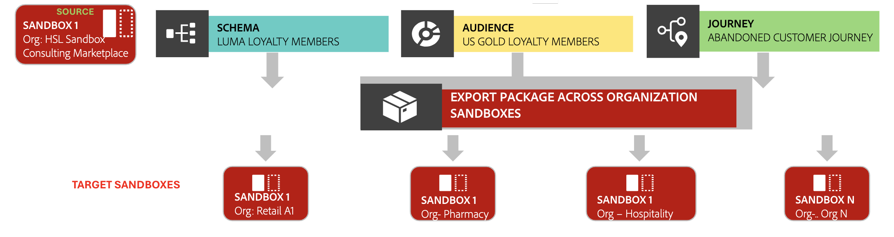

# Enable a center of excellence using sandbox tooling

Enable a center of excellence using sandbox tooling by creating a "golden sandbox" package to standardize best practices across multiple sandboxes.

{zoomable="yes"}

## Why consider this use case {#why-this-use-case}

Many large companies or enterprises make use of multiple sandboxes for different organizations, teams, regions, or development environments. With the power of [sandbox tooling](../ui/sandbox-tooling.md), you can create a golden sandbox package to ensure consistency, compliance, and alignment of your organization's standards across multiple sandboxes. 

This golden sandbox package creates a center of excellence to efficently share key configurations. Using sandbox tooling, you can easily import your package across multiple sandboxes. You can also share your package to additional organizations to ensure widespread consistency.

Follow the steps described in this use case to create a golden sandbox package of your own.

## Industry example {#industry-example}

As an example, consider a bank that operates across different regions, such as North America, Europe, and Africa. Each market or region has its own Adobe Experience Platform instance. This bank wants to maintain a centralized data model managed by a global team of architects where a single version of the data model can be pushed out across all markets.

This bank chooses to levarage sandbox tooling to create and maintain a golden sandbox package. This helps with development efficieny, allows for consistent data models, and ensures consistency across all regions.

## Prerequisites and planning {#prerequisites-and-planning}

When planning to create your own center of excellence within your organization, consider the following prerequisites in your planning process:

- Identify the best practices and configurations to include in your package.
- Create a sandbox with all relevant and validated configurations to be set as the golden sandbox.
- If required, gain stakeholder input and agreement on your baseline standards.

### UI functionality, Experience Platform components, and Experience Cloud products that you will use {#ui-functionality-and-elements}

To successfully implement this use case, you must use multiple areas of Adobe Experience Platform. Ensure you have the necessary [attribute-based access control permissions](../../access-control/abac/overview.md) for all these areas, or ask your system administrator to grant you the necessary permissions.

- [Sandbox tooling](../ui/sandbox-tooling.md)
- [Sandbox management](../ui/user-guide.md)
- [Datasets](../../catalog/datasets/overview.md)
- [Schemas](../../xdm//home.md)
- [Audiences](../../segmentation/home.md)
- [Journeys from Adobe Journey Optimizer](https://experienceleague.adobe.com/en/docs/journey-optimizer/using/orchestrate-journeys/journey)

## How to achieve the use case: high-level overview {#achieve-the-use-case-high-level}

1. Create the baseline configuration that represents your best practices in a golden sandbox. This may include objects such as datasets, schemas, audiences, or journeys.
2. Using sandbox tooling, export the configuration into a package.
3. Import this package into all relevant sandboxes.
4. If you have multiple organizations, share this package across your organizations.
5. Monitor imports and exports and track changes through audit logs.
6. Regularly update your golden sandbox as standards evolve to ensure all sandboxes remain aligned with the best practices.

## How to achieve the use case: Step-by-step instructions {#step-by-step-instructions}

Read through the sections below which include links to further documentation, to complete each of the steps in the high-level overview above.

### Create your golden sandbox

The first step in enabling your center of excellence is to create your golden sandbox. This sandbox should contain the baseline configurations that represent your best practices. To create this golden sandbox, follow the guide on [creating a new sandbox](../ui/user-guide.md#create-a-new-sandbox) in Experience Platform.

Once your sandbox has been created, begin creating your baseline object configurations, such as [schemas](../../xdm/ui/resources/schemas.md#create-a-new-schema), [datasets](../../catalog/datasets/user-guide.md#create-a-dataset), or [audiences](../../segmentation/ui/segment-builder.md). Be sure to review your configurations before continuing.

### Export your sandbox into a package

Now that your sandbox contains your baseline object configurations, it's ready to be exported into a package using sandbox tooling. Follow the guide on [exporting an entire sandbox](../ui/sandbox-tooling.md#export-an-entire-sandbox) to create your golden sandbox package. 

### Import your package into relevant sandboxes

Now that your package has been created, you can import this package into your relevant sandboxes. The best practice is to import a package containing an entire sandbox into an empty sandbox. Using sandbox tooling, you can easily [import an entire sandbox package](../../sandboxes/ui/sandbox-tooling.md#import-the-entire-sandbox-package) into a sandbox directly within Experience Platform. 

### Share package across organizations

Sandbox tooling allows you to share packages you've created across different organizations. Follow the [package sharing guide](../../sandboxes/ui/sharing-packages-across-orgs.md) to share your golden sandbox package.

### Monitor imports and exports through audit logs

As you're importing or exporting your package, you can monitor the status of the jobs using the **[!UICONTROL Jobs]** dashboard in Experience Platform. To learn more about monitoring jobs, read the guide on [monitoring import details](../../sandboxes/ui/sandbox-tooling.md#monitor-import-details).

### Regularly update the golden sandbox

Now that your golden sandbox package is done, you've established a standardized center of excellence you can continue to import into sandboxes or share across organizations. As your best practices change and develop, it's important to regularly update the baseline object configurations in your golden sandbox. As you make updates to the sandbox, you can create new iterations of your golden sandbox package following this same process.

>[!NOTE]
>
> The steps above follow the process in Experience Platform's user interface. It's possible to follow the same steps using the API through various endpoints. Refer to the `sandboxes` [endpoint guide](https://experienceleague.adobe.com/en/docs/experience-platform/sandbox/api/sandboxes#create) and the `packages` [endpoint guide](https://experienceleague.adobe.com/en/docs/experience-platform/sandbox/sandbox-tooling-api/packages) for information on making each request through the API.

## Other use cases achieved through partner data support {#other-use-cases}

Explore further use cases enabled through sandbox tooling:

- [Backup object configurations using sandbox tooling](./backup-object-configuration.md)
