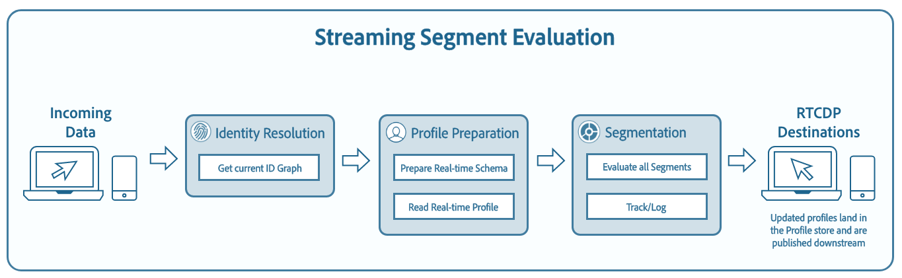

# Evaluate events in near real-time with streaming segmentation 

>[!NOTE]
>
>The following document states how to use streaming segmentation using the API. For information on using streaming segmentation using the UI, please read the [streaming segmentation UI guide](../ui/streaming-segmentation.md).

Streaming segmentation on [!DNL Adobe Experience Platform] allows customers to do segmentation in near real-time while focusing on data richness. With streaming segmentation, segment qualification now happens as streaming data lands into [!DNL Platform], alleviating the need to schedule and run segmentation jobs. With this capability, most segment rules can now be evaluated as the data is passed into [!DNL Platform], meaning segment membership will be kept up-to-date without running scheduled segmentation jobs.



>[!NOTE]
>
>Streaming segmentation works on all data that was ingested using a streaming source. Segments ingested using a batch-based source will be evaluated nightly, even if it qualifies for streaming segmentation.
>
>Additionally, segment definitions evaluated with streaming segmentation may drift between ideal and actual membership if the segment definition is based off of another segment definition that is evaluated using batch segmentation. For example, if Segment A is based off of Segment B, and Segment B is evaluated using batch segmentation, since Segment B only updates every 24 hours, Segment A will move further away from the actual data until it re-syncs with the Segment B update.

## Getting started

This developer guide requires a working understanding of the various [!DNL Adobe Experience Platform] services involved with streaming segmentation. Before beginning this tutorial, please review the documentation for the following services:

- [[!DNL Real-Time Customer Profile]](../../profile/home.md): Provides a unified consumer profile in real time, based on aggregated data from multiple sources.
- [[!DNL Segmentation]](../home.md): Provides the ability to create audiences using segment definitions and other external sources from your [!DNL Real-Time Customer Profile] data.
- [[!DNL Experience Data Model (XDM)]](../../xdm/home.md): The standardized framework by which [!DNL Platform] organizes customer experience data.

The following sections provide additional information that you will need to know in order to successfully make calls to [!DNL Platform] APIs.

### Reading sample API calls

This developer guide provides example API calls to demonstrate how to format your requests. These include paths, required headers, and properly formatted request payloads. Sample JSON returned in API responses is also provided. For information on the conventions used in documentation for sample API calls, see the section on [how to read example API calls](../../landing/troubleshooting.md#how-do-i-format-an-api-request) in the [!DNL Experience Platform] troubleshooting guide.

### Gather values for required headers

In order to make calls to [!DNL Platform] APIs, you must first complete the [authentication tutorial](https://www.adobe.com/go/platform-api-authentication-en). Completing the authentication tutorial provides the values for each of the required headers in all [!DNL Experience Platform] API calls, as shown below:

- Authorization: Bearer `{ACCESS_TOKEN}`
- x-api-key: `{API_KEY}`
- x-gw-ims-org-id: `{ORG_ID}`

All resources in [!DNL Experience Platform] are isolated to specific virtual sandboxes. All requests to [!DNL Platform] APIs require a header that specifies the name of the sandbox the operation will take place in:

- x-sandbox-name: `{SANDBOX_NAME}`

>[!NOTE]
>
>For more information on sandboxes in [!DNL Platform], see the [sandbox overview documentation](../../sandboxes/home.md). 

All requests that contain a payload (POST, PUT, PATCH) require an additional header:

- Content-Type: application/json

Additional headers may be required to complete specific requests. The correct headers are shown in each of the examples within this document. Please pay special attention to the sample requests in order to ensure that all required headers are included.

### Streaming segmentation enabled query types {#query-types}

>[!NOTE]
>
>You will need to enable scheduled segmentation for the organization in order for streaming segmentation to work. Information about enabling scheduled segmentation can be found in the [enable scheduled segmentation section](#enable-scheduled-segmentation)

In order for a segment definition to be evaluated using streaming segmentation, the query must conform to the following guidelines.

| Query type | Details |
| ---------- | ------- |
| Single event | Any segment definition that refers to a single incoming event with no time restriction. |
| Single event within a relative time window | Any segment definition that refers to a single incoming event. |
| Single event with a time window | Any segment definition that refers to a single incoming event with a time window. |
| Profile only | Any segment definition that refers to only a profile attribute. |
| Single event with a profile attribute within a relative time window of less than 24 hours | Any segment definition that refers to a single incoming event, with one or more profile attributes, and occurs within a relative time window of less than 24 hours. |
| Segment of segments | Any segment definition that contains one or more batch or streaming segments. **Note:** If a segment of segments is used, profile disqualification will happen **every 24 hours**. |
| Multiple events with a profile attribute | Any segment definition that refers to multiple events **within the last 24 hours** and (optionally) has one or more profile attributes. |

A segment definition will **not** be enabled for streaming segmentation in the following scenarios:

- The segment definition includes Adobe Audience Manager (AAM) segments or traits.
- The segment definition includes multiple entities (multi-entity queries).
- The segment definition includes a combination of a single event and an `inSegment` event.
  - However, if the segment contained in the `inSegment` event is profile only, the segment definition **will** be enabled for streaming segmentation.

Please note the following guidelines apply when doing streaming segmentation:

| Query type | Guideline |
| ---------- | -------- |
| Single event query | There are no limits to the lookback window. |
| Query with event history | <ul><li>The lookback window is limited to **one day**.</li><li>A strict time-ordering condition **must** exist between the events.</li><li>Queries with at least one negated event are supported. However, the entire event **cannot** be a negation.</li></ul>|

If a segment definition is modified so it no longer meets the criteria for streaming segmentation, the segment definition will automatically switch from "Streaming" to "Batch".

Additionally, segment unqualification, similarly to segment qualification, happens in real-time. As a result, if a profile no longer qualifies for a segment definition, it will be immediately unqualified. For example, if the segment definition asks for "All users who bought red shoes in the last three hours", after three hours, all the profiles that initially qualified for the segment definition will be unqualified.

## Retrieve all segment definitions enabled for streaming segmentation

You can retrieve a list of all your segment definitions that are enabled for streaming segmentation within your organization by making a GET request to the `/segment/definitions` endpoint.

**API format**

To retrieve streaming-enabled segment definitions, you must include the query parameter `evaluationInfo.continuous.enabled=true` in the request path.

```http
GET /segment/definitions?evaluationInfo.continuous.enabled=true
```

**Request**

```shell
curl -X GET \
  'https://platform.adobe.io/data/core/ups/segment/definitions?evaluationInfo.continuous.enabled=true' \
  -H 'Authorization: Bearer {ACCESS_TOKEN}' \
  -H 'Content-Type: application/json' \
  -H 'x-api-key: {API_KEY}' \
  -H 'x-gw-ims-org-id: {ORG_ID}' \
  -H 'x-sandbox-name: {SANDBOX_NAME}'
```

**Response**

A successful response returns an array of segment definitions in your organization that are enabled for streaming segmentation.

```json
{
    "segments": [
        {
            "id": "15063cb-2da8-4851-a2e2-bf59ddd2f004",
            "schema": {
                "name": "_xdm.context.profile"
            },
            "ttlInDays": 30,
            "imsOrgId": "{ORG_ID}",
            "sandbox": {
                "sandboxId": "",
                "sandboxName": "",
                "type": "production",
                "default": true
            },
            "name": " People who are NOT on their homepage ",
            "expression": {
                "type": "PQL",
                "format": "pql/text",
                "value": "select var1 from xEvent where var1._experience.analytics.endUser.firstWeb.webPageDetails.isHomePage = false"
            },
            "evaluationInfo": {
                "batch": {
                    "enabled": false
                },
                "continuous": {
                    "enabled": true
                },
                "synchronous": {
                    "enabled": false
                }
            },
            "creationTime": 1572029711000,
            "updateEpoch": 1572029712000,
            "updateTime": 1572029712000
        },
        {
            "id": "f15063cb-2da8-4851-a2e2-bf59ddd2f004",
            "schema": {
                "name": "_xdm.context.profile"
            },
            "ttlInDays": 30,
            "imsOrgId": "{ORG_ID}",
            "sandbox": {
                "sandboxId": "",
                "sandboxName": "",
                "type": "production",
                "default": true
            },
            "name": "Homepage_continuous",
            "description": "People who are on their homepage - continuous",
            "expression": {
                "type": "PQL",
                "format": "pql/text",
                "value": "select var1 from xEvent where var1._experience.analytics.endUser.firstWeb.webPageDetails.isHomePage = true"
            },
            "evaluationInfo": {
                "batch": {
                    "enabled": true
                },
                "continuous": {
                    "enabled": true
                },
                "synchronous": {
                    "enabled": false
                }
            },
            "creationTime": 1572021085000,
            "updateEpoch": 1572021086000,
            "updateTime": 1572021086000
        }
    ],
    "page": {
        "totalCount": 2,
        "totalPages": 1,
        "sortField": "creationTime",
        "sort": "desc",
        "pageSize": 2,
        "limit": 100
    },
    "link": {}
}
```

## Create a streaming-enabled segment definition

A segment definition will automatically be streaming-enabled if it matches one of the [streaming segmentation types listed above](#query-types).

**API format**

```http
POST /segment/definitions
```

**Request**

```shell
curl -X POST \
  https://platform.adobe.io/data/core/ups/segment/definitions \
  -H 'Authorization: Bearer {ACCESS_TOKEN}'  \
  -H 'Content-Type: application/json' \
  -H 'x-api-key: {API_KEY}' \
  -H 'x-gw-ims-org-id: {ORG_ID}' \
  -H 'x-sandbox-name: {SANDBOX_NAME}' \
  -d '{
    "schema": {
        "name": "_xdm.context.profile"
    },
    "ttlInDays": 30,
    "name": "Homepage_continuous",
    "description": "People who are on their homepage - continuous",
    "expression": {
        "type": "PQL",
        "format": "pql/text",
        "value": "select var1 from xEvent where var1._experience.analytics.endUser.firstWeb.webPageDetails.isHomePage = true"
    },
    "evaluationInfo": {
        "batch": {
            "enabled": false
        },
        "continuous": {
            "enabled": true
        },
        "synchronous": {
            "enabled": false
        }
    }
}'
```

>[!NOTE]
>
>This is a standard "create a segment definition" request. For more information about creating a segment definition, please read the tutorial on [creating a segment definition](../tutorials/create-a-segment.md).

**Response**

A successful response returns the details of the newly created streaming-enabled segment definition.

```json
{
    "id": "f15063cb-2da8-4851-a2e2-bf59ddd2f004",
    "schema": {
        "name": "_xdm.context.profile"
    },
    "ttlInDays": 30,
    "imsOrgId": "{ORG_ID}",
    "sandbox": {
        "sandboxId": "{SANDBOX_ID}",
        "sandboxName": "{SANDBOX_NAME}",
        "type": "production",
        "default": true
    },
    "name": "Homepage_continuous",
    "description": "People who are on their homepage - continuous",
    "expression": {
        "type": "PQL",
        "format": "pql/text",
        "value": "select var1 from xEvent where var1._experience.analytics.endUser.firstWeb.webPageDetails.isHomePage = true"
    },
    "evaluationInfo": {
        "batch": {
            "enabled": false
        },
        "continuous": {
            "enabled": true,
                   },
        "synchronous": {
            "enabled": false
        }
    },
    "creationTime": 1572021085000,
    "updateEpoch": 1572021086000,
    "updateTime": 1572021086000
}
```

## Enable scheduled evaluation {#enable-scheduled-segmentation}

Once streaming evaluation has been enabled, a baseline must be created (after which the segment definition will always be up-to-date). Scheduled evaluation (also known as scheduled segmentation) must first be enabled in order for the system to automatically perform baselining. With scheduled segmentation, your organization can adhere to a recurring schedule to automatically run export jobs to evaluate segment definitions.

>[!NOTE]
>
>Scheduled evaluation can be enabled for sandboxes with a maximum of five (5) merge policies for [!DNL XDM Individual Profile]. If your organization has more than five merge policies for [!DNL XDM Individual Profile] within a single sandbox environment, you will not be able to use scheduled evaluation.

### Create a schedule

By making a POST request to the `/config/schedules` endpoint, you can create a schedule and include the specific time when the schedule should be triggered.

**API format**

```http
POST /config/schedules
```

**Request**

The following request creates a new schedule based on the specifications provided in the payload.

```shell
curl -X POST \
  https://platform.adobe.io/data/core/ups/config/schedules \
  -H 'Content-Type: application/json' \
  -H 'Authorization: Bearer {ACCESS_TOKEN}' \
  -H 'x-api-key: {API_KEY}' \
  -H 'x-gw-ims-org-id: {ORG_ID}' \
  -H 'x-sandbox-name: {SANDBOX_NAME}' \
  -d '{
        "name": "{SCHEDULE_NAME}",
        "type": "batch_segmentation",
        "properties": {
            "segments": ["*"]
        },
        "schedule": "0 0 1 * * ?",
        "state": "inactive"
        }'
```

| Property | Description |
| -------- | ----------- |
| `name` | **(Required)** The name of schedule. Must be a string. |
| `type` | **(Required)** The job type in string format. The supported types are `batch_segmentation` and `export`. |
| `properties` | **(Required)** An object containing additional properties related to the schedule. |
| `properties.segments` | **(Required when `type` equals `batch_segmentation`)** Using `["*"]` ensures all segment definitions are included. |
| `schedule` | **(Required)** A string containing the job schedule. Jobs can only be scheduled to run once a day, meaning you cannot schedule a job to run more than once during a 24 hour period. The example shown (`0 0 1 * * ?`) means the job is triggered every day at 1:00:00 UTC. For more information, please review the appendix on the [cron expression format](./schedules.md#appendix) within the documentation on schedules within segmentation. |
| `state` | *(Optional)* String containing the schedule state. Available values: `active` and `inactive`. Default value is `inactive`. An organization can only create one schedule. Steps for updating the schedule are available later in this tutorial. |

**Response**

A successful response returns the details of the newly created schedule.

```json
{
    "id": "cd585edf-962d-420d-94ad-3be03e619ac2",
    "imsOrgId": "{ORG_ID}",
    "sandbox": {
        "sandboxId": "e7e17720-c5bb-11e9-aafb-87c71c35cac8",
        "sandboxName": "prod",
        "type": "production",
        "default": true
    },
    "name": "{SCHEDULE_NAME}",
    "state": "inactive",
    "type": "batch_segmentation",
    "schedule": "0 0 1 * * ?",
    "properties": {
        "segments": [
            "*"
        ]
    },
    "createEpoch": 1568267948,
    "updateEpoch": 1568267948
}
```

### Enable a schedule

By default, a schedule is inactive when created unless the `state` property is set to `active` in the create (POST) request body. You can enable a schedule (set the `state` to `active`) by making a PATCH request to the `/config/schedules` endpoint and including the ID of the schedule in the path.

**API format**

```http
POST /config/schedules/{SCHEDULE_ID}
```

**Request**

The following request uses [JSON Patch formatting](https://datatracker.ietf.org/doc/html/rfc6902) in order to update the `state` of the schedule to `active`.

```shell
curl -X POST \
  https://platform.adobe.io/data/core/ups/config/schedules/cd585edf-962d-420d-94ad-3be03e619ac2 \
  -H 'Content-Type: application/json' \
  -H 'Authorization: Bearer {ACCESS_TOKEN}' \
  -H 'x-api-key: {API_KEY}' \
  -H 'x-gw-ims-org-id: {ORG_ID}' \
  -H 'x-sandbox-name: {SANDBOX_NAME}' \
  -d '[
        {
          "op": "add",
          "path": "/state",
          "value": "active"
        }
      ]'
```

**Response**

A successful update returns an empty response body and HTTP Status 204 (No Content).

The same operation can be used to disable a schedule by replacing the "value" in the previous request with "inactive".

## Next steps

Now that you have enabled both new and existing segment definitions for streaming segmentation, and enabled scheduled segmentation to develop a baseline and perform recurring evaluations, you can begin to create streaming-enabled segment definitions for your organization. 

To learn how to perform similar actions and work with segment definitions using the Adobe Experience Platform user interface, please visit the [Segment Builder user guide](../ui/segment-builder.md).

## Appendix

The following section lists frequently asked questions regarding streaming segmentation:

### Does streaming segmentation "unqualification" also happen in real time?

For most instances, streaming segmentation unqualification happens in real-time. However, streaming segment definitions that use segments of segments do **not** unqualify in real-time, instead unqualifying after 24 hours.

### What data does streaming segmentation work on?

Streaming segmentation works on all data that was ingested using a streaming source. Segments ingested using a batch-based source will be evaluated nightly, even if it qualifies for streaming segmentation. Events streamed into the system with a timestamp older than 24 hours will be processed in the subsequent batch job.

### How are segment definitions defined as batch or streaming segmentation?

A segment definition is defined as either batch or streaming segmentation based on a combination of query type and event history duration. A list of which segment definitions will be evaluated as a streaming segment can be found in the [streaming segmentation query types section](#query-types).

Please note that if a segment contains **both** an `inSegment` expression and a direct single-event chain, it cannot qualify for streaming segmentation. If you want to have this segment definition qualify for streaming segmentation, you should make the direct single-event chain its own segment definition.

### Why does the number of "total qualified" segment definitions keep increasing while the number under "Last X days" remains at zero within the segment definition details section?

The number of total qualified segment definitions is drawn from the daily segmentation job, which includes audiences that qualify for both batch and streaming segment definitions. This value is shown for both batch and streaming segment definitions.

The number under the "Last X days" **only** includes audiences that are qualified in streaming segmentation, and **only** increases if you have streamed data into the system and it counts toward that streaming definition. This value is **only** shown for streaming segment definitions. As a result, this value **may** display as 0 for batch segment definitions.

As a result, if you see that the number under "Last X days" is zero, and the line graph is also reporting zero, you have **not** streamed any profiles into the system that would qualify for that segment definition.

### How long does it take for a segment definition to be available?

It takes up to one hour for a segment definition to be available.

### Are there any limitations to the data being streamed in?

In order for streamed data to be used in streaming segmentation, there **must** be spacing between the events streamed in. If too many events are streamed in within the same second, Platform will treat these events as bot-generated data, and they will be discarded. As best practice, you should have **at least** five seconds between event data in order to ensure the data is properly used.
