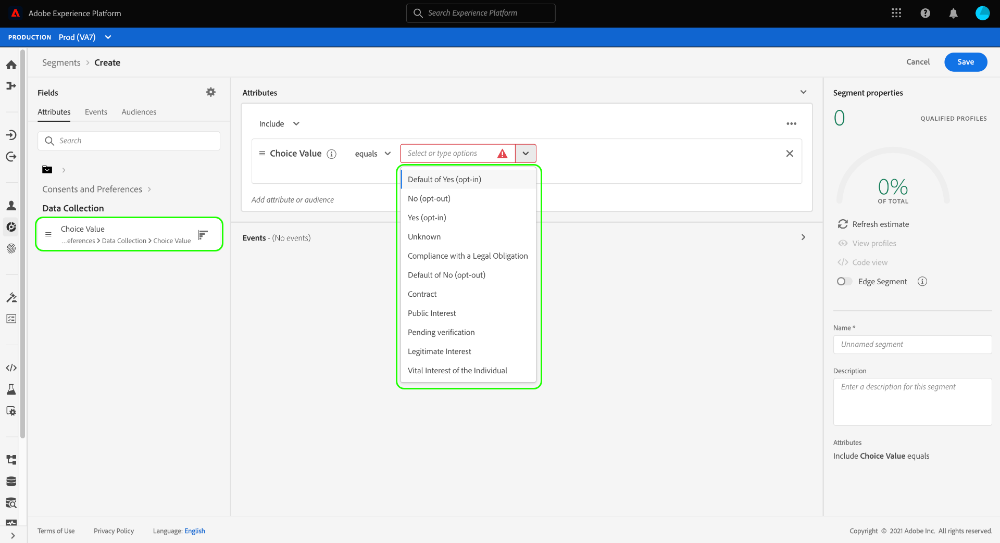

# Honoring consent in segments

Legal privacy regulations such as the [!DNL California Consumer Privacy Act] (CCPA) provide consumers the right to opt out of having their personal data collected or shared with third parties. Adobe Experience Platform provides standard Experience Data Model (XDM) components that are intended to capture these customer consent preferences in Real-Time Customer Profile data.

If a customer has withdrawn or withheld consent for having their personal data shared, it is important that your organization honors that preference when generating audiences for marketing activities. This document describes how to integrate customer consent values in your segment definitions using the Experience Platform user interface.

## Getting started

Honoring customer consent values requires an understanding of the various [!DNL Adobe Experience Platform] services involved. Before starting this tutorial, ensure that you are familiar with the following services:

* [[!DNL Experience Data Model (XDM)]](../xdm/home.md): The standardized framework by which Platform organizes customer experience data.
* [[!DNL Real-Time Customer Profile]](../profile/home.md): Provides a unified, customer profile in real time based on aggregated data from multiple sources.
* [[!DNL Adobe Experience Platform Segmentation Service]](./home.md): Allows you to build audience segments from [!DNL Real-Time Customer Profile] data.

## Consent schema fields

In order to honor customer consents and preferences, one of the schemas that is a part of your [!UICONTROL XDM Individual Profile] union schema must contain the standard field group **[!UICONTROL Consents and Preferences]**.

For details on the structure and intended use case of each of the attributes provided by the field group, see the [consents and preferences reference guide](../xdm/field-groups/profile/consents.md). For step-by-step instructions on how to add a field group to a schema, refer to the [XDM UI guide](../xdm/ui/resources/schemas.md#add-field-groups).

Once the field group has been added to a [Profile-enabled schema](../xdm/ui/resources/schemas.md#profile) and its fields have been used to ingest consent data from your experience application, you can use the collected consent attributes in your segment rules.

## Handling consent in segmentation 

In order to ensure that opted-out profiles are not included in segments, special fields must be added to existing segments and included when creating any new segments.

The steps below demonstrate how to add the appropriate fields for two types of opt-out flags:

1. [!UICONTROL Data Collection]
1. [!UICONTROL Share Data]

>[!NOTE]
>
>While this guide focuses on the two opt-out flags above, you can configure your segments to incorporate additional consent signals as well. The [consents and preferences reference guide](../xdm/field-groups/profile/consents.md) provides more information on each of these options and their intended use cases.

When building a segment in the UI, under **[!UICONTROL Attributes]**, navigate to **[!UICONTROL XDM Individual Profile]**, then select **[!UICONTROL Consents and Preferences]**. From here, you can see the options for **[!UICONTROL Data Collection]** and **[!UICONTROL Share Data]**.

Start by selecting the **[!UICONTROL Data Collection]** category, then drag **[!UICONTROL Choice Value]** into the segment builder. When adding the attribute to the segment, you can specify the [consent values](../xdm/field-groups/profile/consents.md#choice-values) that must be included or excluded.

One approach is to exclude any customers who have opted out of having their data collected. To do this, set the operator to **[!UICONTROL does not equal]**, and choose the following values:

* **[!UICONTROL No (opt-out)]**
* **[!UICONTROL Default of No (opt-out)]**
* **[!UICONTROL Unknown]** (if consent is assumed to be withheld if otherwise unknown)

Under **[!UICONTROL Attributes]** in the left rail, navigate back to the **[!UICONTROL Consents and Preferences]** section, then select **[!UICONTROL Share Data]**. Drag its corresponding **[!UICONTROL Choice Value]** into the canvas, and select the same values as those for the [!UICONTROL Data Collection] choice value. Ensure that an **[!UICONTROL Or]** relationship is established between the two attributes.

With both the **[!UICONTROL Data Collection]** and **[!UICONTROL Share Data]** consent values added to the segment, any customers that have opted out of having their data used will be excluded from the resulting audience. From here, you can continue customizing the segment definition before selecting **[!UICONTROL Save]** to finish the process.

## Next steps

By following this tutorial, you should now have a better understanding of how to honor customer consents and preferences when building segments in Experience Platform.

For more information on managing consent in Platform, refer to the following documentation:

* [Consent processing using the Adobe standard](../landing/governance-privacy-security/consent/adobe/overview.md)
* [Consent processing using the IAB TCF 2.0 standard](../landing/governance-privacy-security/consent/iab/overview.md)