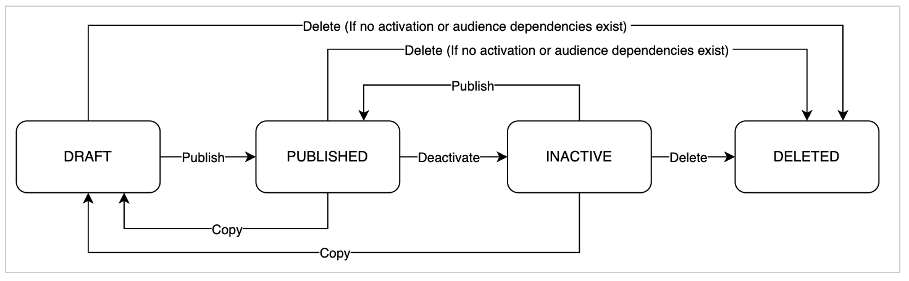

# Frequently asked questions

Adobe Experience Platform [!DNL Segmentation Service] provides a user interface and RESTful API that allows you to create audiences through segment definitions or other sources from your [!DNL Real-Time Customer Profile] data. These audiences are centrally configured and maintained on Experience Platform, and are readily accessible by any Adobe solution. The following is a list of frequently asked questions regarding audiences and segmentation.

## Audience Portal

The following section lists questions related to Audience Portal.

### Do I have access to Audience Portal and Audience Composition?

Audience Portal and Audience Composition are available to all Real-Time CDP Prime and Ultimate customers (B2C, B2B, and B2P Editions) and Journey Optimizer Select, Prime, Ultimate Starter, and Ultimate customers.

At this point in time, only profile-based audiences are supported. Support for account-based audiences will be added in a later release.

### Are externally generated pre-built audiences supported with Audience Portal?

Yes, externally generated pre-built audiences are supported with Audience Portal. At this point in time, you can import an externally generated audience through a CSV file. In the future, you'll be able to add audiences through batch or streaming-based source connectors.

### What permissions do I need to have in order to upload externally generated audiences?

In order to upload externally generated audiences, you need to have the "View segments", "Manage segments", and "Import audiences" permissions. There are no specific role-based controls required to upload externally generated audiences.

### What happens when I upload an externally generated audience? 

When you upload an externally generated audience, a dataset will be created and be visible within the dataset inventory. The name of the dataset will be the **same** as the name of the externally generated audience you uploaded.

### What is an externally generated audience comprised of, and what happens to this data when it's imported to Experience Platform?

During the import external audience workflow, you must specify which column in the CSV file corresponds with the **Primary Identity**. An example of a primary identity includes email address, ECID, or an organization-specific custom identity namespace. 

The data associated with this primary identity column is the **only** data that is attached to the profile. If there are no existing profiles that match the data in the primary identity column, a new profile is created. However, this profile is essentially an orphaned profile since **no** attributes or experience events are associated with this profile.

All the other data within the externally generated audience are considered **payload attributes**. These attributes can **only** be used for personalization and enrichment during activation, and are **not** attached to a profile. These attributes are, however, stored in the data lake.

While the externally generated audience can be referenced when creating audiences using the Segment Builder, individual profile attributes **cannot** be used. 

### Can I reconcile externally generated audience data with an existing profile in Experience Platform?

Yes, the externally generated audience will be merged with the existing profile in Experience Platform if the primary identifiers match.This data can take up to 24 hours to be reconciled. If profile data does not already exist, a new profile will be created as the data is ingested.

### How are customer consent preferences honored for externally generated audiences that are imported into Audience Portal?{#consent}

As customer data is captured from multiple channels, identity stitching and merge policies allow this data to be consolidated in a single Real-Time Customer Profile. Information on the customers' consent preferences are stored and evaluated at the profile level.

Downstream destinations check each profile for consent information prior to activation. Each profile's consent information is compared against consent requirements for a particular destination. If the profile does not satisfy the requirements, that profile is not sent to a destination.

When an external audience is ingested into Audience Portal, they are joined with existing profiles using a primary ID such as email or ECID. As a result, the existing consent policies will remain in force throughout activation.

Please note you should **not** include consent information with an externally generated audiences, since the payload variables are **not** stored in the Profile store but in the data lake. Instead, you **must** use an Adobe Experience Platform ingestion channels where profile data is imported.

### Can I use an externally generated audience to build other audiences?

Yes, any externally generated audience will appear within the audience inventory and can be used when building audiences within the [Segment Builder](./ui/segment-builder.md).

### How often are externally generated audiences evaluated?

Externally generated audiences are **only** evaluated during the time of import. Since the associated attributes to these import audiences are non-durable and are **not** part of the Profile store, the only time an externally generated audience will be updated is if the existing audience is manually updated.

### Can I use externally uploaded attributes as part of segmentation?

No, you cannot. Profile attributes are meant to be long-lasting attributes, while externally generated audience data that is uploaded only contains contextual data that is associated with that externally generated audience.

The externally generated audience's contextual data, or enrichment attributes, are **not** durably long lasting, as their lifecycle is tied to the uploaded audience. As a result, due to its transient nature, these enrichment attributes are **not** available for use in segmentation.

However when mapping your audiences to batch or file-based destinations, you can use these externally generated enrichment attributes to augment your audiences and further downstream activations.

To learn more about this capability, please read the guide on [activating audience data to batch profile export destinations](../destinations/ui/activate-batch-profile-destinations.md#mapping). 

### Is there a specific merge policy for externally generated audiences?

The organization-specific default merge policy is automatically applied when uploading externally generated audiences. However, you can change the merge policy that is applied to the externally generated audience during the import audience workflow.

### Where can I activate externally generated audiences to? 

An externally generated audience can be mapped to any destination and can be used in Adobe Journey Optimizer campaigns and journeys.

### Can I delete an externally generated audience?

Yes! Externally generated audiences can be deleted within Audience Portal.

### What should I do if I accidentally uploaded an externally generated audience?

If you have accidentally uploaded an externally generated audience and you want to remove the data, you can clear the profiles associated with the audience by uploading a CSV file with one row and no data.

### How long do externally generated audiences last for?

The current data expiration for externally generated audiences is **30 days**. This data expiration was chosen to reduce the amount of excess data stored within your organization. 

After the data expiration period passes, the associated dataset will still be visible within the dataset inventory, but you will **not** be able to activate the audience and the profile count will show as zero.

### Is there a maximum number of externally generated audiences I can import?

There is no limit to the number of externally generated audiences you can import. However, please note that the imported audiences **do** count against the overall audience limit.

### How will Audience Portal and Audience Composition interact with the release of Real-Time CDP Partner Data?

Audience Portal and Audience Composition will interact with Partner Data in two ways:

1. If you ingest a partner-provided prospect list using the Prospect Profile class and workflow, the prospects will be kept **separately** from merge customer profiles in Profile Service. As a result, this means that prospect lists will **not** appear in either Audience Portal or Audience Composition for use.
2. If you are leveraging partner-provided attributes to enrich **existing** first-party profiles, those partner-data-enriched audiences **will** appear in both Audience Portal and Audience Composition for use.

### How can I use additional attributes with my audiences?

With audiences, there are **two** different types of additional attributes you can add - payload (contextual) attributes and enrichment attributes.

Payload attributes are attributes that are ingested as part of the CSV upload of an externally generated audience. These attributes are **not** ingested into the Real-Time Customer Profile, but can be used as a part of a downstream destination.

Enrichment attributes are attributes that come from a dataset and are joined with an audience in Audience Composition. These attributes can currently only be used in Adobe Journey Optimizer campaigns. Support for Adobe Journey Optimizer journeys is coming soon, with support for downstream destinations pending future release.

| Activation channel | Audiences from CSV custom upload | Audiences from Audience Composition | 
| --- | --- | --- |
| Real-Time CDP Destinations | Both the payload attributes and the audiences can be activated. | Only the audience can be activated. Enrichment attributes **cannot** be activated. |
| Adobe Journey Optimizer Campaigns | Neither the audience nor the payload attributes can be activated. | Both the audience and the enrichment attributes can be activated. |

## Lifecycle states {#lifecycle-states}

The following section lists questions related to lifecycle states and lifecycle state management within the Audience Portal.

### What do the different lifecycle states represent?

The following chart explains the different lifecycle statuses, what they represent, where audiences with that status can be used, as well as impact on segmentation guardrails.

| State | Definition | Visible in Audience Portal? | Visible in Destinations? | Affects segmentation limits? | Impact on file-based audiences | Impact on audience evaluation | Usable within other audiences? | Editable |
| --- | --- | --- | --- | --- | --- | --- | --- | -- |
| Draft | An audience in the **Draft** state is an audience that is still in development and is not yet ready to be used in other services. | Yes, but can be hidden. | No | Yes | Can be imported or updated during the refinement process. | Evaluated to get accurate publishing counts. | Yes, but not recommended to be used. | Yes |
| Published | An audience in the **Published** state is an audience that is ready for use across all downstream services. | Yes | Yes | Yes | Can be imported or updated. | Evaluated using batch, streaming, or edge segmentation. | Yes | Yes |
| Inactive | An audience in the **Inactive** state is an audience that is currently not in use. It still exists within Experience Platform, but it will **not** be useable until it's marked as draft or published. | No, but can be shown. | No | No | No longer updated. | No longer evaluated or updated by Experience Platform. | No | Yes |
| Deleted | An audience in the **Deleted** state is an audience that has been deleted. The actual deletion of the data may take up to a few minutes to execute. | No | No | No | Underlying data is deleted. | No data evaluation or execution occurs after the deletion is completed. | No | No |

### In what states can I edit my audiences in?

Audiences can be edited in the following lifecycle states:

- **Draft**: If an audience is edited in the draft state, it will remain in the draft state unless it is explicitly published.
- **Published**: If an audience is edited in the published state, it will remain published, and the audience will be automatically updated.
- **Inactive**: If an audience is edited in the inactive state, it will remain inactive. This means that it will not be evaluated or updated. If you need to update the audience, you'll need to publish the audience.

Once an audience is deleted, it **cannot** be edited.

### What lifecycle states can I move an audience to?

The possible lifecycle states that an audience can be moved to depends on the current state of the audience.

If your audience is in the draft state, you can either publish or delete it if the audience does not have any dependents.

If your audience is in the published state, you can either deactivate or delete it if the audience does not have any dependents.

If your audience is in the inactive state, you can either re-publish or delete it if the audience does not have any dependents.

### Are there any caveats for audiences in certain lifecycle states?

Audiences in the published state can only be moved to another state if the audience does **not** have any dependents. This means that if your audience is used in a downstream service, it cannot be deactivated or deleted.

If an audience that is evaluated using batch segmentation is re-published, which is when an audience goes from inactive to published, the audience will refresh **after** the daily batch job. When it is first re-published, the profiles and data will be the **same** as when the audience was made inactive.

### How do I put an audience in the draft state?

The method to put an audience into the draft state depends on the origin of the audience.

For audiences created using Segment Builder, you can set the audience to the draft state by selecting "[!UICONTROL Save as draft]" in Segment Builder.

For audiences created in Audience Composition, audiences are automatically saved as a draft until published.

For audiences that are externally created, audiences are automatically published. 

Once an audience is in the published state, you **cannot** change the original audience back into the draft state. However, if you copy the audience, the newly copied audience will be in the draft state.

### How do I put an audience in the published state?

For audiences created using Segment Builder or Audience Composition, you can set the audience to the published state by selecting "[!UICONTROL Publish]" in their respective UIs.

Audiences that are externally created are automatically set to published.

### How do I put an audience in the inactive state?

You can put a published audience into the inactive state by opening the quick actions menu in Audience Portal and selecting "[!UICONTROL Deactivate]".

### How do I re-publish an audience?

>[!NOTE]
>
>The "re-published" state is the same as the published state for audience behavior.

You can re-publish an audience by selecting an audience that is in the inactive state, opening the quick actions menu on Audience Portal and selecting [!UICONTROL Publish].

### How do I put an audience in the deleted state?

>[!IMPORTANT]
>
>You can only delete audiences that are **not** used in any downstream activations. Additionally, you cannot delete an audience that is referenced in another audience. If you can't delete your audience, please ensure you are **not** using it in any downstream services or as a building block of another audience. 

You can put an audience into the delete state by opening the quick actions menu in Audience Portal and selecting [!UICONTROL Delete].

### Are there any caveats for lifecycle state transitions?

Yes, there are some caveats to be aware of when you are using audiences in downstream services such as Adobe Journey Optimizer or non-customer-based audiences such as account-based audiences.

At this time, you **must** manually check if the audience is used downstream in Adobe Journey Optimizer, as this status is currently not automatically checked.

Additionally, you **must** manually check if the audience is used as a component of an account-based audience, as this status is also not currently automatically checked.

### What happens when I copy an audience? {#copy}

When you copy an audience, the new audience will be in the draft state, and retain the same folders, tags, and labels that were applied to the original audience.

### Does using an audience as a child audience affect lifecycle state transitions?

>[!NOTE]
>
>A parent audience is an audience that **uses** another audience as a dependency for the audience.
>
>A child audience is an audience that is **used as** a dependency for the audience.

Yes, using an audience as a child audience does affect what lifecycle states transitions the child and parent audience can undertake.

In order for a child audience to be moved to the published state, all of its parent audience **must** be in the published state. Parent audiences can either be published before publishing the child audience or, if the user confirms, can be automatically published when the child audience is published.

In order for the parent audience to be moved to the inactive or deleted state, all of its child audiences **must** be deactivated or deleted. 

### Can I refer to an audience that is in a different lifecycle state?

Yes! If your audience is currently in the draft state, you can refer to audiences in either the draft or published state. However, in order to publish this audience, you **must** publish the other parent audiences.

## Audience inventory

The following section lists questions related to audience inventory within the Audience Portal.

### Do I need additional permissions to use audience inventory features?

No, you do not. So long as you have edit permissions for audiences, you'll be able to create, update, and manage your folders and tags within the Audience Portal. For more information about managing permissions, please read the [manage permissions guide](../access-control/ui/permissions.md).

### Is there a limit to the number of folders I can create?

No, there is no limit to the number of folders you can create. For more information on folders, please read the [audience inventory section](./ui/audience-portal.md#folders) of the Segmentation Service UI overview.

### Is there a limit to the number of tags that can be added to an audience?

No, there is no limit to the number of tags that can be added to an audience. For more information on tags, please read the [audience inventory section](./ui/audience-portal.md#tags) of the Segmentation Service UI overview.

### Is there a limit to the number of tags I can create?

No, there is no limit to the number of tags that you can create. However, you can create a maximum of **100** categories to apply for the tags. For more information about tag management, please read the [Managing Tags guide](../administrative-tags/ui/managing-tags.md).

### When I search for an audience by name or tag in a parent folder, can I also search through the related child folders?

No, this behavior is not supported. However, you can change the audience inventory view to look at **All Audiences**, then search across all the folders. For more information on using search in audience inventory, please read the [search section](./ui/audience-portal.md#search) of the Segmentation Service UI overview.

### Can I automatically assign an audience into a folder at the time of creation?

At this point in time, no. However, this capability may be available in the future.

### Can I move multiple audiences into a folder at the same time?

At this point in time, no. However, this capability may be available in the future.

## Audience Composition

The following section lists questions related to Audience Composition.

### When should I use Audience Composition as opposed to using the Segment Builder?

Both Audience Composition and Segment Builder have important roles in the creation of building audiences in Experience Platform.

The Segment Builder is more suited for audience **creation** (for building an audience from scratch), while Audience Composition is more suited for audience **curation and personalization** (for creating new audiences based on an existing audience).

The following table illustrates the difference between the two services:

| Segment Builder | Audience Composition |
| --------------- | -------------------- |
| <ul><li>Single stage audience generation</li><li>Creates the basic blocks of audiences from profile, time-series, and multi-entity data</li><li>Used to create **one** audience</li></ul> | <ul><li>Multi-stage audience generation, using set based operations</li><li>Uses the audiences created by the Segment Builder and applies data enrichment options such as ranking profile attributes and splitting into sub-audiences</li><li>Used to create **multiple** audiences at once</li></ul> |

To learn more about the Segment Builder, please read the [Segment Builder guide](./ui/segment-builder.md). To learn more about Audience Composition, please read the [Audience Composition guide](./ui/audience-composition.md).

### Can I use externally generated audiences in Audience Composition?

At this point in time, no. However, this capability should be available in the near future.

### Can I send audiences from Audience Composition to all downstream destinations and channels?

Yes! You can use audiences from Audience Composition in Adobe Journey Optimizer Campaigns, Real-Time CDP destinations, and Adobe Journey Optimizer Journeys.

### Are there any guardrails on the number of compositions?

>[!IMPORTANT]
>
>This guardrail only applies to compositions created with Audience Composition and does **not** apply to compositions created with Federated Audience Composition.

At this point in time, you can only have **10** published compositions per sandbox. This guardrail is planned to be increased in a future release. 

### What are the workflow guardrails for Audience Composition?

The composition component placing follows a rigid structure as follows:

1. You **always** start with the [!UICONTROL Audience] block to select your starting activity. You can have a maximum of **one** [!UICONTROL Audience] block.
2. You can optionally add an [!UICONTROL Exclude] block that follows the [!UICONTROL Audience] block.
3. You can optionally add an [!UICONTROL Enrich] block that follows the [!UICONTROL Exclude] block. You can only use **one** [!UICONTROL Enrich] block per composition.
4. You can optionally add a [!UICONTROL Rank] or [!UICONTROL Split] block. You can **only** have one of these blocks per composition.
5. You **always** end with a [!UICONTROL Save] block to save your audience.

Additionally, the following restrictions apply when using these blocks:

- Split block
  - This block only supports **String** data types. The Split block does **not** support the date or boolean data type.
  - Additionally, this block does **not** support enrichment attributes.
- Exclude block
  - This block does **not** support the date or boolean data type.
- Rank block
  - This block does **not** support enrichment attributes.

For more details about using Audience Composition, please read the [Audience Composition UI guide](./ui/audience-composition.md).

### When are audiences created using Audience Composition saved and evaluated?

Audiences are automatically saved while creating them in Audience Composition. The audience's creation time will be the first time this automatic save occurs.

After the audience composition has been created, it can take up to 48 hours for it to be evaluated and activated for usage in downstream services such as a Real-Time CDP destination or Adobe Journey Optimizer channel.

### When can I use the audience I created?

The audience created in Audience Composition will **immediately** show up in Audience Portal. However, in order to use it in downstream services such as Adobe Journey Optimizer, you must wait at least 24 hours after evaluation.

### Are evaluation jobs visible within the monitoring section?

At this time, evaluation jobs are **not** displayed within the monitoring UI.

### Can I use an Audience Composition in another composition?

No, audiences created using Audience Composition **cannot** be used as an input in another audience composition.

### How does splitting work in Audience Composition?

Audience splitting lets you further subset your audience into smaller groups. 

When splitting by attribute, there is mutual exclusivity between the groups. This means that if a record meets the criteria of multiple split paths, it will be assigned the **first** path from the left and **not** assigned to any of the other paths.

When splitting by percentage, splits are **randomly** done. This means that the profiles will be randomly assigned to each path. 

For more information on the Split block, please read the [Audience Composition UI guide](./ui/audience-composition.md#split).

### Can I use all segmentation types in the Audience Composition workflow?

Yes, all segmentation types ([batch segmentation, streaming segmentation, and edge segmentation](./home.md#evaluate-segments)) are supported in the Audience Composition workflow. However, since compositions are currently only run once per day, even if streaming- or edge-evaluated audiences are included, the result will be based on audience membership at the time the composition was executed.

## Audience membership

The following section lists questions related to audience membership.

### How can I confirm a profile's membership in an audience?

To confirm a profile's audience membership, visit the profile details page of the profile you want to confirm. Select **[!UICONTROL Attributes]**, followed by **[!UICONTROL View JSON]**, and you can confirm that the `segmentMembership` object contains the ID of the audience.

### Can audience membership drift between ideal and actual membership?

Yes, audience membership can drift between ideal and actual membership if an audience is evaluated using streaming segmentation **and** that audience is based off of an audience evaluated using batch segmentation. 

For example, if Audience A is based off of Audience B, and Audience B is evaluated using batch segmentation, since Audience B only updates every 24 hours, Audience A will move further away from the actual data until it re-syncs with the Audience B updates.

## Batch segmentation {#batch-segmentation}

The following section lists questions related to batch segmentation.

### How does batch segmentation resolve profile membership?

Audiences evaluated using batch segmentation resolve daily, with the audience membership results being recorded into the profile's `segmentMembership` attribute. Profile lookups generate a fresh version of the profile at the time of the lookup, but it does **not** refresh the batch segmentation results.

As a result, when changes are made to the profile, such as merging two profiles together, these changes **will** appear in the profile when looked up, but will **not** be reflected in the `segmentMembership` attribute until the segment evaluation job has run again.

For example, let's say you've created two mutually exclusive audiences: Audience A is for people who live in Washington and Audience B is for people who do **not** live in Washington. There are two profiles - profile 1 for a person who lives in Washington, and profile 2 for a person who lives in Oregon. 

When the batch segmentation evaluation job runs, profile 1 will go to Audience A, while profile 2 will go to Audience B. Later on, but before the next day's batch segmentation evaluation job runs, an event that reconciles the two profiles enters Experience Platform. As a result, a single merged profile that contains profiles 1 and 2 is created. 

Until the next batch segment evaluation job is run, the new merged profile will have audience membership in **both** profile 1 and profile 2. As a result, this means it'll be a member of **both** Audience A and Audience B, despite the fact that these audiences have contradictory definitions. For the end-user, this is the **exact same situation** as before the profiles were connected, since there was always just the one person involved, and Experience Platform just did **not** have enough information to connect the two profiles together. 

If you use profile lookup to retrieve the newly created profile and look at its audience membership, it'll show that it's a member of **both** Audience A and Audience B, despite the fact that both of these audiences have contradictory definitions. Once the daily batch segmentation evaluation job runs, the audience membership will be updated to reflect this updated state of profile data.

If you need more real-time audience resolution, use streaming or edge segmentation.

### How long does it take for streaming data to be available in batch segmentation workflows?

It may take up to three hours for streaming data to be available in batch segmentation workflows. 

For example, if a batch segmentation job runs at 9PM, it is guaranteed to contain streaming ingested data **up until** 6PM. Streaming ingested data that was ingested after 6PM but before 9PM **may** be included.

## Edge segmentation {#edge-segmentation}

The following section lists questions related to edge segmentation.

### How long does it take for a segment definition to be available on the Edge Network?

It takes up to one hour for a segment definition to be available on the Edge Network.

## Streaming segmentation {#streaming-segmentation}

The following section lists questions related to streaming segmentation.

### Does streaming segmentation "unqualification" also happen in real time?

Streaming segmentation disqualification occurs depending on the composition of the audience. For event-based audiences, disqualification occurs in real-time as the lookback window expires. For profile-based audiences or audiences that use profile attributes, disqualification occurs when profile attribute values are changed via a streaming source or during the daily batch evaluation job. 

### What data does streaming segmentation work on?

Streaming segmentation works on all data that was ingested using a streaming source. Data ingested using a batch-based source will be evaluated nightly, even if it qualifies for streaming segmentation. Events streamed into the system with a timestamp older than 24 hours will be processed in the subsequent batch job.

### How are segments defined as batch or streaming segmentation?

A segment definition is defined as batch, streaming, or edge segmentation based on a combination of query type and event history duration. A list of which segments will be evaluated as a streaming segment definition can be found in the [streaming segmentation query types section](#query-types).

Please note that if a segment definition contains **both** an `inSegment` expression and a direct single-event chain, it cannot qualify for streaming segmentation. If you want to have this segment definition qualify for streaming segmentation, you should make the direct single-event chain its own segment.

### Why does the number of "total qualified" segments keep increasing while the number under "Last X days" remains at zero within the segment definition details section?

The number of total qualified segments is drawn from the daily segmentation job, which includes audiences that qualify for both batch and streaming segments. This value is shown for both batch and streaming segments.

The number under the "Last X days" **only** includes audiences that are qualified in streaming segmentation, and **only** increases if you have streamed data into the system and it counts toward that streaming definition. This value is **only** shown for streaming segments. As a result, this value **may** display as 0 for batch segments.

As a result, if you see that the number under "Last X days" is zero, and the line graph is also reporting zero, you have **not** streamed any profiles into the system that would qualify for that segment.

### How long does it take for a segment definition to be available?

It takes up to one hour for a segment definition to be available.

### Are there any limitations to the data being streamed in?

When using edge or streaming segmentation, ensure that events for each profile are spaced out. If too many events are streamed in within the same second, Experience Platform will treat these events as bot-generated data, and they will be discarded. As best practice, you should have **at least** five seconds between event data in order to ensure the data is properly used.
