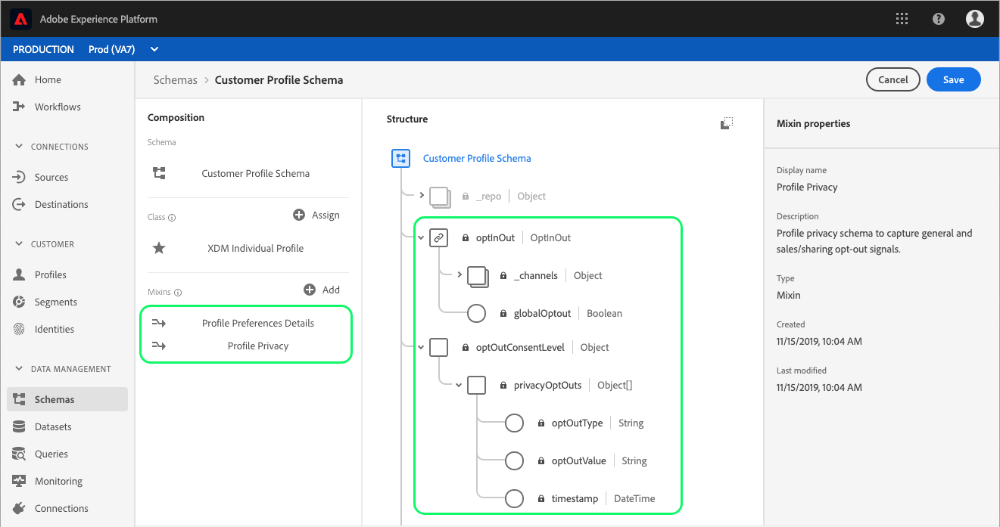
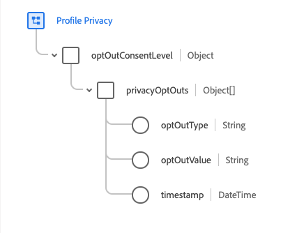
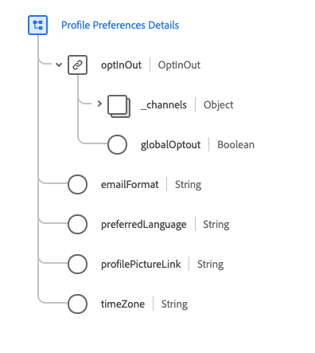
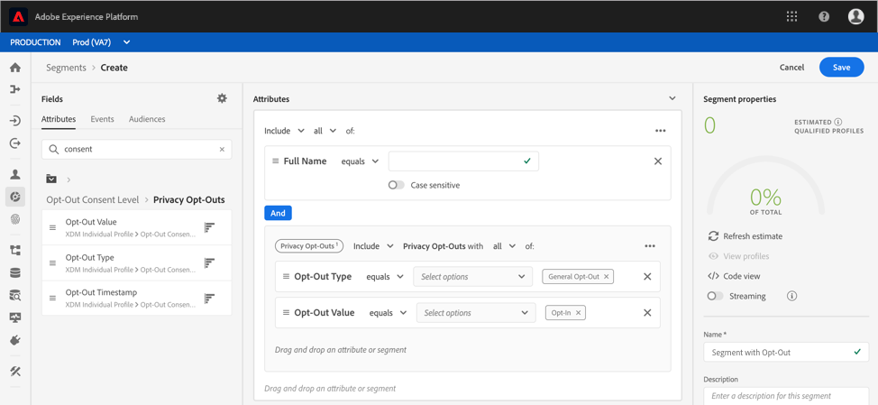
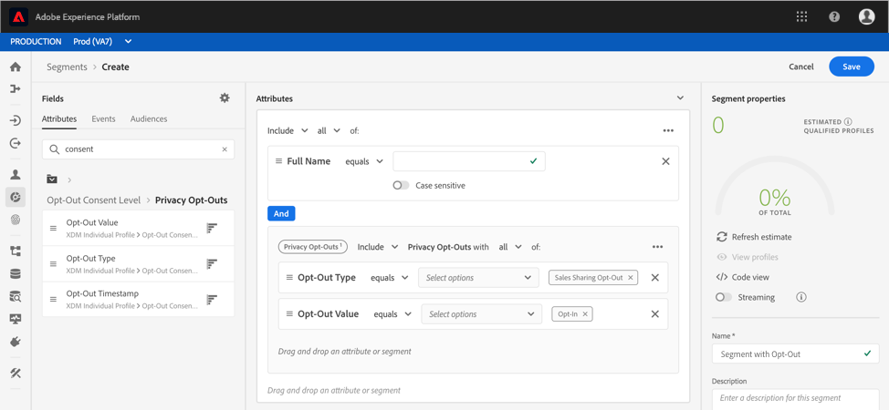

# Honoring opt-out requests in segments

[!DNL Experience Platform] allows your customers to send opt-out requests regarding the usage and storage of their data within [!DNL Real-time Customer Profile]. These opt-out requests are part of the [!DNL California Consumer Privacy Act] (CCPA), which provides California residents with the right to access and delete their personal data and to know whether their personal data is sold or disclosed (and to whom). 

Once a customer has opted-out, it is important that your organization honor those opt-outs when generating audiences for marketing activities. This document describes important details regarding honoring opt-out requests.

## Getting started

Honoring opt-out requests requires an understanding of the various [!DNL Adobe Experience Platform] services involved. Before working with opt-out requests, please review the documentation for the following services:

- [!DNL Real-time Customer Profile](../profile/home.md): Provides a unified, customer profile in real-time based on aggregated data from multiple sources.
- [!DNL Adobe Experience Platform Segmentation Service](./home.md): Allows you to build audience segments from [!DNL Real-time Customer Profile] data.
- [!DNL Experience Data Model (XDM)](../xdm/home.md): The standardized framework by which Platform organizes customer experience data.
- [!DNL Adobe Experience Platform Privacy Service](../privacy-service/home.md): Helps organizations to automate compliance with data privacy regulations involving customer data within [!DNL Platform].

## Opt-out mixins

In order to honor CCPA opt-out requests, one of the schemas that is a part of the union schema must contain the necessary [!DNL Experience Data Model] (XDM) opt-out fields. There are two mixins that can be used to add opt-out fields to a schema, each is covered in more detail in the sections that follow:

- [Profile Privacy](#profile-privacy): Used to capture different opt-out types (general or sales/sharing).
- [Profile Preferences Details](#profile-preferences-details): Used to capture opt-out requests for specific XDM channels.

For step-by-step instructions on how to add a mixin to a schema, please refer to the "Add a mixin" section in the following XDM documentation:
- [Schema Registry API tutorial](../xdm/api/getting-started.md).: Building a schema using the Schema Registry API.
- [Schema Editor tutorial](../xdm/tutorials/create-schema-ui.md): Building a schema using the Platform user interface.

Here is an example image showing the opt-out mixins added to a schema in the user interface:



The structure of each mixin, as well as a description of the fields they contribute to the schema, are outlined in more detail in the following sections.

### [!DNL Profile Privacy] {#profile-privacy}

The [!DNL Profile Privacy] mixin allows you to capture two kinds of CCPA opt-out requests from customers:

1. General opt-out
2. Sales/Sharing opt-out



The [!DNL Profile Privacy] mixin contains the following fields:

- Privacy Opt-Outs (`privacyOptOuts`): An array containing a list of opt-out objects.
- Opt-Out Type (`optOutType`): The type of opt-out. This field is an enum with two possible values:
    - General Opt-Out (`general_opt_out`)
    - Sales Sharing Opt-Out (`sales_sharing_opt_out`)
- Opt-Out Value (`optOutValue`): The active state of the opt-out, also known as the value of the opt-out signal, based on the opt-out type specified. This field is an enum with four possible values:
    - Not Provided (`not_provided`): An opt-out request has not been provided.
    - Pending Verification (`pending`): The opt-out request is pending verification.
    - Opt-Out (`out`): The customer has opted-out.
    - Opt-In (`in`): The customer has opted-in.
- Opt-Out Timestamp (`timestamp`): Timestamp of the received opt-out signal.

To view the full structure of the [!DNL Profile Privacy] mixin, please refer to the [XDM public GitHub repository](https://github.com/adobe/xdm/blob/master/schemas/context/profile-privacy.schema.json) or preview the mixin using the Platform UI.

### [!DNL Profile Preferences Details] {#profile-preferences-details}

The [!DNL Profile Preferences Details] mixin provides several fields that represent preferences for customer profiles (such as email format, preferred language, and time zone). One of the fields included in this mixin, OptInOut (`optInOut`), allows opt-out values to be set for individual channels. 



The [!DNL Profile Preferences Details] mixin contains the following fields related to opt-outs:

- OptInOut (`optInOut`): An object where each key represents a valid and known URI for a communication channel and the active state of the opt-out for each channel. Each channel may have one of four possible values:
    - Not Provided (`not_provided`): An opt-out request has not been provided for this channel.
    - Pending Verification (`pending`): The opt-out request for this channel is pending verification.
    - Opt-Out (`out`): The customer has opted-out of this channel.
    - Opt-In (`in`): The customer has opted-in to this channel.
- Global Opt-out (`globalOptout`): A boolean value that, when set to true, sets a global opt-out override for the profile. The default value for this field is false.

The example JSON below highlights how the OptInOut object can capture multiple opt-out signals for different communication channels:

```json
{
  "xdm:optInOut": {
    "https://ns.adobe.com/xdm/channels/email": "pending",
    "https://ns.adobe.com/xdm/channels/phone": "out",
    "https://ns.adobe.com/xdm/channels/sms": "in",
    "https://ns.adobe.com/xdm/channels/fax": "not_provided",
    "https://ns.adobe.com/xdm/channels/direct-mail": "not_provided",
    "https://ns.adobe.com/xdm/channels/apns": "not_provided",
    "xdm:globalOptout": false
  }
}
```

To view the full structure of the Profile Preferences Details mixin, please visit the [XDM public GitHub repository](https://github.com/adobe/xdm/blob/master/schemas/context/profile-preferences-details.schema.json) or preview the mixin using the [!DNL Platform] UI.

## Handling opt-outs in segmentation 

In order to ensure profiles marked with CCPA opt-out flags are not included in segments, special fields must be added to existing segments or included during segment creation.

The sections below demonstrate how to add the appropriate fields for the two types of opt-out flags:
1. General opt-out
2. Sales/Sharing opt-out

### General opt-out

[!DNL Segmentation] automatically honors all profiles containing the "[!UICONTROL General Opt-Out]" flag, meaning those profiles will not be included in audiences or exports by default. However, it is best practice to add the appropriate fields to ensure opted-out profiles are not included in audiences and marketing activities.

This can be done using the user interface by adding **[!UICONTROL Privacy Opt-Outs]** attributes. In this instance, the segment is set to include only those who have opted in (meaning they do not have a general opt-out flag on their profile. This is done by declaring that the "[!UICONTROL Opt-Out Type]" equals "[!UICONTROL General Opt-Out]" and the "[!UICONTROL Opt-Out Value]" equals "[!UICONTROL Opt-in]". 



### Sales/Sharing opt-out

If a user has a sales/sharing opt-out flag set on their profile, this profile should no longer be used for any segment creation or marketing activities. To ensure this flag is honored, the "[!UICONTROL Opt-Out Type]" must equal "[!UICONTROL Sales Sharing Opt-Out]" and the "[!UICONTROL Opt-Out Value]" must equal "[!UICONTROL Opt-in]".



<!-- ### Overriding default exclusions

In some instances, such as building a segment of people who have opted out, it may be necessary to override the default exclusion of opted-out profiles. This override can be done via the API or in the Segment Builder user interface. -->

## Next steps

For more information on segmentation, including working with segment definitions and audiences via the API and user interface, please begin by reading the [segmentation overview](./home.md).

To learn more about data privacy within [!DNL Platform], including how [!DNL Privacy Service] helps to facilitate automated compliance with legal and organizational privacy regulations, please refer to the documentation on [!DNL Privacy Service](../privacy-service/home.md).
