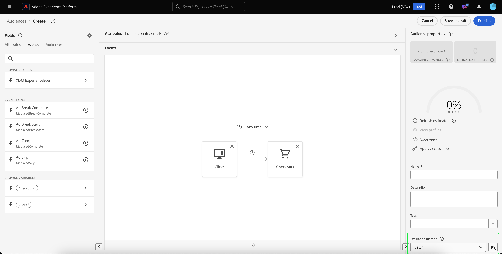
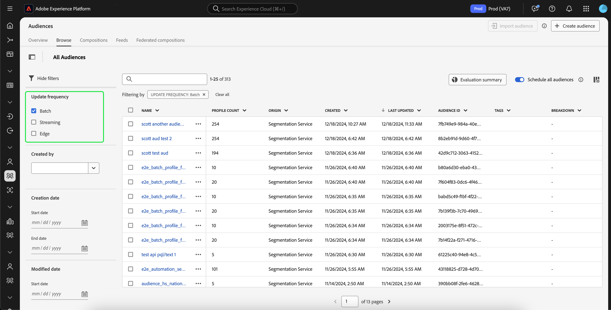

# Batch segmentation guide

Batch segmentation is a segmentation evaluation method that lets you move profile data all at once to create corresponding audiences. 

With batch segmentation, you can create detailed and rich audiences, and run segmentation jobs to determine when you want this data propagated to downstream services.

## Eligible query types {#query-types}

All queries are eligible for batch segmentation.

## Create audience {#create-audience}

You can create an audience that is evaluated using batch segmentation using either the Segmentation Service API or through Audience Portal in the UI.

>[!BEGINTABS]

>[!TAB Segmentation Service API]

**API format**

```http
POST /segment/definitions
```

**Request**

+++ A sample request to create a segment definition that is enabled for batch segmentation

```shell
curl -X POST https://platform.adobe.io/data/core/ups/segment/definitions
 -H 'Authorization: Bearer {ACCESS_TOKEN}' \
 -H 'Content-Type: application/json' \
 -H 'x-gw-ims-org-id: {ORG_ID}' \
 -H 'x-api-key: {API_KEY}' \
 -H 'x-sandbox-name: {SANDBOX_NAME}'
 -d '{
        "name": "People in the USA",
        "description: "An audience that looks for people who live in the USA",
        "expression": {
            "type": "PQL",
            "format": "pql/text",
            "value": "homeAddress.country = \"US\""
        },
        "evaluationInfo": {
            "batch": {
                "enabled": true
            },
            "continuous": {
                "enabled": false
            },
            "synchronous": {
                "enabled": false
            }
        },
        "schema": {
            "name": "_xdm.context.profile"
        }
     }'
```

+++

**Response**

A successful response returns HTTP status 200 with details of your newly created segment definition.

+++A sample response when creating a segment definition.

```json
{
    "id": "4afe34ae-8c98-4513-8a1d-67ccaa54bc05",
    "schema": {
        "name": "_xdm.context.profile"
    },
    "profileInstanceId": "ups",
    "imsOrgId": "{ORG_ID}",
    "sandbox": {
        "sandboxId": "28e74200-e3de-11e9-8f5d-7f27416c5f0d",
        "sandboxName": "prod",
        "type": "production",
        "default": true
    },
    "name": "People in the USA",
    "description": "An audience that looks for people who live in the USA",
    "expression": {
        "type": "PQL",
        "format": "pql/text",
        "value": "homeAddress.country = \"US\""
    },
    "evaluationInfo": {
        "batch": {
            "enabled": true
        },
        "continuous": {
            "enabled": false
        },
        "synchronous": {
            "enabled": false
        }
    },
    "dataGovernancePolicy": {
        "excludeOptOut": true
    },
    "creationTime": 0,
    "updateEpoch": 1579292094,
    "updateTime": 1579292094000
}
```

+++

More information about using this endpoint can be found in the [segment definition endpoint guide](../api/segment-definitions.md).

>[!TAB Audience Portal]

In Audience Portal, select **[!UICONTROL Create audience]**.


A popover appears. Select **[!UICONTROL Build rules]** to enter Segment Builder.


After creating your segment definition, select **[!UICONTROL Batch]** as the **[!UICONTROL Evaluation method]**.



To learn more about creating segment definitions, please read the [Segment Builder guide](../ui/segment-builder.md)

>[!ENDTABS]

## Retrieve audiences {#retrieve-audiences}

You can retrieve all audiences that are evaluated using batch segmentation using either the Segmentation Service API or through Audience Portal in the UI.

>[!BEGINTABS]

>[!TAB Segmentation Service API]

Retrieve a list of all segment definitions that are evaluated using batch segmentation within your organization by making a GET request to the `/segment/definitions` endpoint.

**API format**

You must include the query parameter `evaluationInfo.batch.enabled=true` in the request path to retrieve segment definitions evaluated using batch segmentation.

```http
GET /segment/definitions?evaluationInfo.batch.enabled=true
```

**Request**

+++ A sample request to list all the batch-enabled segment definitions

```shell
curl -X GET \
  'https://platform.adobe.io/data/core/ups/segment/definitions?evaluationInfo.batch.enabled=true' \
  -H 'Authorization: Bearer {ACCESS_TOKEN}' \
  -H 'Content-Type: application/json' \
  -H 'x-api-key: {API_KEY}' \
  -H 'x-gw-ims-org-id: {ORG_ID}' \
  -H 'x-sandbox-name: {SANDBOX_NAME}'
```

+++

**Response**

A successful response returns HTTP status 200 with an array of segment definitions in your organization that are evaluated using batch segmentation.

+++A sample response that contains a list of all the batch-segmentation-evaluated segment definitions in your organization

```json
{
    "segments": [
        {
            "id": "15063cb-2da8-4851-a2e2-bf59ddd2f004",
            "schema": {
                "name": "_xdm.context.profile"
            },
            "ttlInDays": 30,
            "imsOrgId": "{ORG_ID}",
            "sandbox": {
                "sandboxId": "",
                "sandboxName": "",
                "type": "production",
                "default": true
            },
            "name": " People who are NOT on their homepage ",
            "expression": {
                "type": "PQL",
                "format": "pql/text",
                "value": "select var1 from xEvent where var1._experience.analytics.endUser.firstWeb.webPageDetails.isHomePage = false"
            },
            "evaluationInfo": {
                "batch": {
                    "enabled": true
                },
                "continuous": {
                    "enabled": false
                },
                "synchronous": {
                    "enabled": false
                }
            },
            "creationTime": 1572029711000,
            "updateEpoch": 1572029712000,
            "updateTime": 1572029712000
        },
        {
            "id": "f15063cb-2da8-4851-a2e2-bf59ddd2f004",
            "schema": {
                "name": "_xdm.context.profile"
            },
            "ttlInDays": 30,
            "imsOrgId": "{ORG_ID}",
            "sandbox": {
                "sandboxId": "",
                "sandboxName": "",
                "type": "production",
                "default": true
            },
            "name": "Homepage_continuous",
            "description": "People who are on their homepage - continuous",
            "expression": {
                "type": "PQL",
                "format": "pql/text",
                "value": "select var1 from xEvent where var1._experience.analytics.endUser.firstWeb.webPageDetails.isHomePage = true"
            },
            "evaluationInfo": {
                "batch": {
                    "enabled": true
                },
                "continuous": {
                    "enabled": true
                },
                "synchronous": {
                    "enabled": false
                }
            },
            "creationTime": 1572021085000,
            "updateEpoch": 1572021086000,
            "updateTime": 1572021086000
        }
    ],
    "page": {
        "totalCount": 2,
        "totalPages": 1,
        "sortField": "creationTime",
        "sort": "desc",
        "pageSize": 2,
        "limit": 100
    },
    "link": {}
}
```

More detailed information about the segment definition returned can be found in the [segment definitions endpoint guide](../api/segment-definitions.md).

+++

>[!TAB Audience Portal]

You can retrieve all the audiences that are enabled for batch segmentation within your organization by using filters in Audience Portal. Select the  icon to display the list of filters.


Within the available filters, go to **[!UICONTROL Update frequency]** and select "[!UICONTROL Batch]". Using this filter displays all audiences in your organization that are evaluated using batch segmentation.



To learn more about viewing audiences in Experience Platform, please read the [Audience Portal guide](../ui/audience-portal.md).

>[!ENDTABS]

## Next steps

This guide explains how to create a segment definition that can be evaluated using batch segmentation on Adobe Experience Platform.

To learn more about using the Experience Platform user interface, please read the [Segmentation user guide](../ui/overview.md).

For frequently asked questions about batch segmentation, please read the [batch segmentation section of the FAQ](../faq.md#batch-segmentation).
