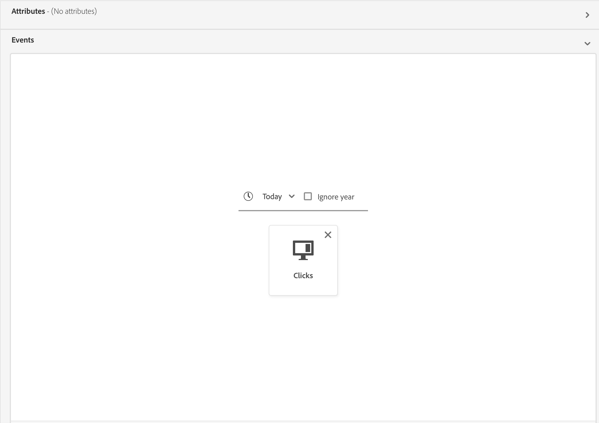

# Edge segmentation guide

Edge segmentation is the ability to evaluate segment definitions in Adobe Experience Platform instantaneously [on the edge](../../web-sdk/home.md), enabling same page and next page personalization use cases. 

>[!IMPORTANT]
>
> The edge data will be stored in an edge server location closest to where it was collected and may be stored in a location other than the one designated as the hub (or principal) Adobe Experience Platform data center.
>
> Additionally, the edge segmentation engine will only honor requests on the edge where there is **one** primary marked identity, which is consistent with non-edge-based primary identities.

## Edge segmentation query types {#query-types}

A query can be evaluated with edge segmentation if it meets any of the criteria outlined in the following table.

>[!NOTE]
>
>If the query matches any of the query types in the following table, it will automatically be evaluated using edge segmentation. The system determines this ability automatically based on the query expression.

| Query type | Details | Example |
| ---------- | ------- | ------- |
| Single event within a time window of less than 24 hours | Any segment definition that refers to a single incoming event within a time window of less than 24 hours. |  |
| Profile only | Any segment definition that refers to only a profile attribute. |  |
| Single event with a profile attribute within a relative time window of less than 24 hours | Any segment definition that refers to a single incoming event, with one or more profile attributes, and occurs within a relative time window of less than 24 hours. |  |
| Segment of segments | Any segment definition that contains one or more batch or edge segments. **Note:** If a segment of segments is used, profile disqualification will happen **every 24 hours**. |  |
| Multiple events with a profile attribute | Any segment definition that refers to multiple events **within the last 24 hours** and (optionally) has one or more profile attributes. |  |

Additionally, the segment definition **must** be tied to a merge policy that is active on edge. For more information about merge policies, please read the [merge policies guide](../../profile/api/merge-policies.md).

A segment definition will **not** be eligible for edge segmentation in the following scenario:

- The segment definition includes a combination of a single event and an `inSegment` event.
  - However, if the segment definition contained in the `inSegment` event is profile only, the segment definition **will** be enabled for edge segmentation.
- The segment definition uses "Ignore year" as part of its time constraints.

## Retrieve audiences evaluated using edge segmentation {#retrieve-audiences}

You can retrieve all audiences that are evaluated using edge segmentation using either the Segmentation Service API or through Audience Portal in the UI.

>[!BEGINTABS]

>[!TAB Segmentation Service API]

Retrieve a list of all segment definitions that are evaluated using edge segmentation within your organization by making a GET request to the `/segment/definitions` endpoint.

**API format**

You must include the query parameter `evaluationInfo.synchronous.enabled=true` in the request path to retrieve segment definitions evaluated using edge segmentation.

```http
GET /segment/definitions?evaluationInfo.synchronous.enabled=true
```

**Request**

+++ A sample request to list all the edge-enabled segment definitions

```shell
curl -X GET \
  'https://platform.adobe.io/data/core/ups/segment/definitions?evaluationInfo.synchronous.enabled=true' \
  -H 'Authorization: Bearer {ACCESS_TOKEN}' \
  -H 'x-api-key: {API_KEY}' \
  -H 'x-gw-ims-org-id: {ORG_ID}' \
  -H 'x-sandbox-name: {SANDBOX_NAME}'
```

+++

**Response**

A successful response returns HTTP status 200 with an array of segment definitions in your organization that are enabled for edge segmentation. 

+++ A sample response that contains a list of all edge-segmentation-enabled segment definitions in your organization

```json
{
    "segments": [
        {
            "id": "15063cb-2da8-4851-a2e2-bf59ddd2f004",
            "schema": {
                "name": "_xdm.context.profile"
            },
            "imsOrgId": "{ORG_ID}",
            "sandbox": {
                "sandboxId": "",
                "sandboxName": "",
                "type": "production",
                "default": true
            },
            "name": " People who are NOT on their homepage ",
            "expression": {
                "type": "PQL",
                "format": "pql/text",
                "value": "select var1 from xEvent where var1._experience.analytics.endUser.firstWeb.webPageDetails.isHomePage = false"
            },
            "evaluationInfo": {
                "batch": {
                    "enabled": false
                },
                "continuous": {
                    "enabled": false
                },
                "synchronous": {
                    "enabled": true
                }
            },
            "creationTime": 1572029711000,
            "updateEpoch": 1572029712000,
            "updateTime": 1572029712000
        },
        {
            "id": "f15063cb-2da8-4851-a2e2-bf59ddd2f004",
            "schema": {
                "name": "_xdm.context.profile"
            },
            "imsOrgId": "{ORG_ID}",
            "sandbox": {
                "sandboxId": "",
                "sandboxName": "",
                "type": "production",
                "default": true
            },
            "name": "Homepage_continuous",
            "description": "People who are on their homepage - continuous",
            "expression": {
                "type": "PQL",
                "format": "pql/text",
                "value": "select var1 from xEvent where var1._experience.analytics.endUser.firstWeb.webPageDetails.isHomePage = true"
            },
            "evaluationInfo": {
                "batch": {
                    "enabled": false
                },
                "continuous": {
                    "enabled": false
                },
                "synchronous": {
                    "enabled": true
                }
            },
            "creationTime": 1572021085000,
            "updateEpoch": 1572021086000,
            "updateTime": 1572021086000
        }
    ],
    "page": {
        "totalCount": 2,
        "totalPages": 1,
        "sortField": "creationTime",
        "sort": "desc",
        "pageSize": 2,
        "limit": 100
    },
    "link": {}
}
```

More detailed information about the segment definition returned can be found in the [segment definitions endpoint guide](../api/segment-definitions.md).

+++

>[!TAB Audience Portal]

You can retrieve all the audiences that are enabled for edge segmentation within your organization by using filters in Audience Portal. Select the  icon to display the list of filters.


Within the available filters, go to **Update frequency** and select "Edge". Using this filter displays all audiences in your organization that are evaluated using edge segmentation.


To learn more about viewing audiences in Platform, please read the [Audience Portal guide](../ui/audience-portal.md).

>[!ENDTABS]

## Audience details {#audience-details}

You can view details of a specific audience evaluated using edge segmentation by selecting it within Audience Portal.

After selecting an audience on Audience Portal, the audience details page appears. This displays information about the audience, including a summary of the audience details, the amount of qualified profiles over time, as well as the destinations the audience has been activated to.


For edge-enabled audiences, the **[!UICONTROL Profiles over time]** card is displayed, which shows the total qualified and the nwe audience updated metrics.

The **[!UICONTROL Total qualified]** metric represents the total number of qualified audiences, based on edge evaluations for this audience.

The **[!UICONTROL New audience updated]** metric is represented by a line graph that shows the change in audience size through edge segmentation. You can adjust the dropdown to show the last 24 hours, last week, or last 30 days.


For more details on audience details, please read the [Audience Portal overview](../ui/audience-portal.md#audience-details).

## Next steps

This guide explains what edge segmentation is, as well as how to create a segment definition that can be evaluated using edge segmentation on Adobe Experience Platform. 

To learn more about using the Experience Platform user interface, please read the [Segmentation user guide](./overview.md). 

For frequently asked questions about edge segmentation, please read the [edge segmentation section of the FAQ](../faq.md#edge-segmentation).

