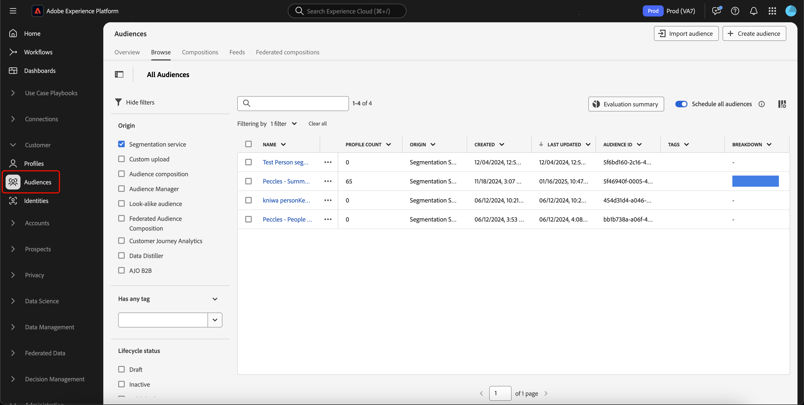
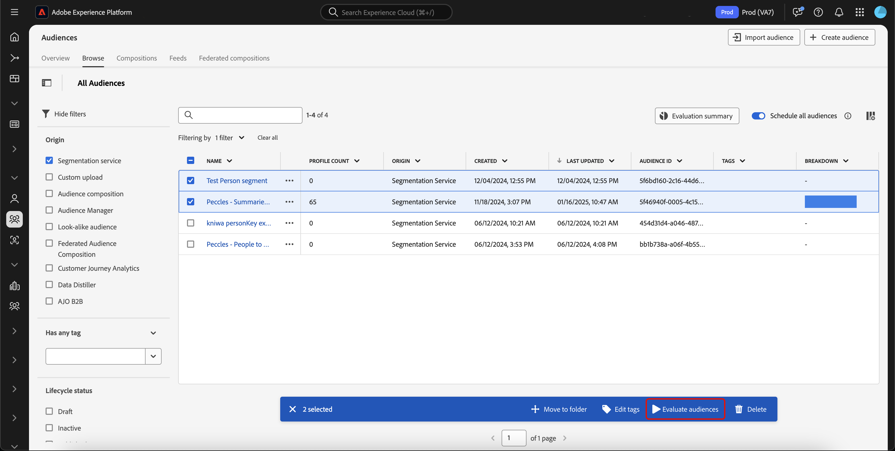
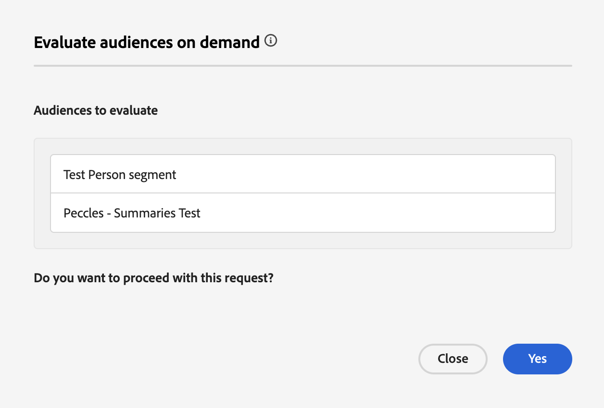

# Flexible audience evaluation guide

>[!AVAILABILITY]
>
>Flexible audience evaluation is **only** available on instances of Experience Platform running on [!DNL Microsoft Azure]. To learn more about the supported Experience Platform infrastructure, see the [Experience Platform multi-cloud overview](../../landing/multi-cloud.md).
>
>Additionally, flexible audience evaluation is **only** available for use with Real-Time CDP B2C Edition.

Flexible audience evaluation lets you run a batch segmentation job on demand. With flexible audience evaluation, you can run ad-hoc campaign launches, just-in-time communications, or other time-sensitive activities.

## Guardrails {#guardrails}

>[!CONTEXTUALHELP]
>id="platform_segmentation_browse_flexibleaudienceevaluation"
>title="Flexible audience evaluation limits"
>abstract="You can evaluate up to 20 audiences in a single flexible audience evaluation run.<br/><br/>Additionally, while the evaluation job runs as soon as possible, there may be system delays that may occur since on-demand evaluations <b>cannot</b> run simultaneously with another on-demand or batch evaluation."

When you run flexible audience evaluation, please keep the following conditions in mind:

- You can only use flexible audience evaluation **twice** per day per sandbox. This limit resets at midnight (UTC).
- You have a **maximum** of 50 flexible audience evaluation runs per year per **production** sandbox.
- You have a **maximum** of 100 flexible audience evaluation runs per year per **development** sandbox.
- All the audiences **must** have an origin of "Segmentation Service".
- All the audiences **must** be evaluated using batch segmentation.
- All the audiences **must** be people-based audiences.
- You can only select a maximum of 20 audiences per flexible audience evaluation run.

>[!NOTE]
>
>You can purchase additional flexible audience evaluation runs per year. For more information, contact Adobe Customer Care.

## Access {#access}

In order to use flexible audience evaluation, you must have the following permission:

- **[!UICONTROL Evaluate Segment to an Audience]** under the **[!DNL Profile Management]** section.

For more information on role-based access control, please read the [access control overview](../../access-control/home.md).

## Running flexible audience evaluation

You can run flexible audience evaluation by using either the Experience Platform APIs or UI.

>[!BEGINTABS]

>[!TAB Experience Platform APIs]

To run flexible audience evaluation within the Experience Platform APIs, you'll need to create a segment job that contains the IDs of all the segment definitions (audiences) you want to evaluate. 

>[!NOTE]
>
>You can only add a **maximum** of 20 segment definition IDs per segment job API call.

You can create a new segment job by making a POST request to the `/segment/jobs` endpoint and including the IDs of the segment definitions in the request body. 

+++A sample request for creating a new segment job

```shell
curl -X POST https://platform.adobe.io/data/core/ups/segment/jobs \
 -H 'Authorization: Bearer {ACCESS_TOKEN}' \
 -H 'Content-Type: application/json' \
 -H 'x-gw-ims-org-id: {ORG_ID}' \
 -H 'x-api-key: {API_KEY}' \
 -H 'x-sandbox-name: {SANDBOX_NAME}' \
 -d '[
    {
        "segmentId": "7863c010-e092-41c8-ae5e-9e533186752e"
    },
    {
        "segmentId": "07d39471-05d1-4083-a310-d96978fd7c85"
    }
 ]'
```

| Property | Description |
| -------- | ----------- |
| `segmentId` | The ID of the segment definition that you want to evaluate. These segment definitions can belong to different merge policies. |

+++

A successful response returns HTTP status 200 with information about your newly created segment job.

+++ A sample response when creating a new segment job.

```json
{
    "id": "b31aed3d-b3b1-4613-98c6-7d3846e8d48f",
    "imsOrgId": "{ORG_ID}",
    "sandbox": {
        "sandboxId": "28e74200-e3de-11e9-8f5d-7f27416c5f0d",
        "sandboxName": "prod",
        "type": "production",
        "default": true
    },
    "profileInstanceId": "ups",
    "source": "api",
    "status": "PROCESSING",
    "batchId": "678f53bc-e21d-4c47-a7ec-5ad0064f8e4c",
    "computeJobId": 8811,
    "computeGatewayJobId": "9ea97b25-a0f5-410e-ae87-b2d85e58f399",
    "segments": [
        {
            "segmentId": "7863c010-e092-41c8-ae5e-9e533186752e",
            "segment": {
                "id": "7863c010-e092-41c8-ae5e-9e533186752e",
                "expression": {
                    "type": "PQL",
                    "format": "pql/json",
                    "value": "workAddress.country = \"US\""
                },
                "mergePolicyId": "25c548a0-ca7f-4dcd-81d5-997642f178b9",
                "mergePolicy": {
                    "id": "25c548a0-ca7f-4dcd-81d5-997642f178b9",
                    "version": 1
                }
            }
        },
        {
            "segmentId": "07d39471-05d1-4083-a310-d96978fd7c85",
            "segment": {
                "id": "07d39471-05d1-4083-a310-d96978fd7c85",
                "expression": {
                    "type": "PQL",
                    "format": "pql/json",
                    "value": "workAddress.country = \"US\""
                },
                "mergePolicyId": "25c548a0-ca7f-4dcd-81d5-997642f178b9",
                "mergePolicy": {
                    "id": "25c548a0-ca7f-4dcd-81d5-997642f178b9",
                    "version": 1
                }
            }
        }
    ],
    "metrics": {
        "totalTime": {
            "startTimeInMs": 1573203617195,
            "endTimeInMs": 1573204395655,
            "totalTimeInMs": 778460
        },
        "profileSegmentationTime": {
            "startTimeInMs": 1573204266727,
            "endTimeInMs": 1573204395655,
            "totalTimeInMs": 128928
        },
        "segmentedProfileCounter":{
            "7863c010-e092-41c8-ae5e-9e533186752e":1033
        },
        "segmentedProfileByNamespaceCounter":{
            "7863c010-e092-41c8-ae5e-9e533186752e":{
                "tenantiduserobjid":1033,
                "campaign_profile_mscom_mkt_prod2":1033
            }
        },
        "segmentedProfileByStatusCounter":{
            "7863c010-e092-41c8-ae5e-9e533186752e":{
                "exited":144646,
                "realized":2056
            }
        },
        "totalProfiles":13146432,
        "totalProfilesByMergePolicy":{
            "25c548a0-ca7f-4dcd-81d5-997642f178b9":13146432
        }
    },
    "requestId": "4e538382-dbd8-449e-988a-4ac639ebe72b-1573203600264",
    "schema": {
        "name": "_xdm.context.profile"
    },
    "properties": {
        "scheduleId": "4e538382-dbd8-449e-988a-4ac639ebe72b",
        "runId": "e6c1308d-0d4b-4246-b2eb-43697b50a149"
    },
    "_links": {
        "cancel": {
            "href": "/segment/jobs/b31aed3d-b3b1-4613-98c6-7d3846e8d48f",
            "method": "DELETE"
        },
        "checkStatus": {
            "href": "/segment/jobs/b31aed3d-b3b1-4613-98c6-7d3846e8d48f",
            "method": "GET"
        }
    },
    "updateTime": 1573204395000,
    "creationTime": 1573203600535,
    "updateEpoch": 1573204395
}
```

+++

After creating the segment job, you can check on its status by making a GET request to the `/segment/jobs` endpoint, providing the ID of your newly created segment job in the request path.

+++Sample request to retrieve a segment job

```shell
curl -X GET https://platform.adobe.io/data/core/ups/segment/jobs/b31aed3d-b3b1-4613-98c6-7d3846e8d48f \
 -H 'Authorization: Bearer {ACCESS_TOKEN}' \
 -H 'x-gw-ims-org-id: {ORG_ID}' \
 -H 'x-api-key: {API_KEY}' \
 -H 'x-sandbox-name: {SANDBOX_NAME}'
```

+++

A successful response returns HTTP status 200 with detailed information about the specified segment job.


+++ A sample response for retrieving a segment job.

```json
{
    "id": "b31aed3d-b3b1-4613-98c6-7d3846e8d48f",
    "imsOrgId": "{ORG_ID}",
    "sandbox": {
        "sandboxId": "28e74200-e3de-11e9-8f5d-7f27416c5f0d",
        "sandboxName": "prod",
        "type": "production",
        "default": true
    },
    "profileInstanceId": "ups",
    "source": "api",
    "status": "SUCCEEDED",
    "batchId": "678f53bc-e21d-4c47-a7ec-5ad0064f8e4c",
    "computeJobId": 8811,
    "computeGatewayJobId": "9ea97b25-a0f5-410e-ae87-b2d85e58f399",
    "segments": [
        {
            "segmentId": "7863c010-e092-41c8-ae5e-9e533186752e",
            "segment": {
                "id": "7863c010-e092-41c8-ae5e-9e533186752e",
                "expression": {
                    "type": "PQL",
                    "format": "pql/text",
                    "value": "workAddress.country = \"US\""
                },
                "mergePolicyId": "25c548a0-ca7f-4dcd-81d5-997642f178b9",
                "mergePolicy": {
                    "id": "25c548a0-ca7f-4dcd-81d5-997642f178b9",
                    "version": 1
                }
            }
        },
        {
            "segmentId": "07d39471-05d1-4083-a310-d96978fd7c85",
            "segment": {
                "id": "07d39471-05d1-4083-a310-d96978fd7c85",
                "expression": {
                    "type": "PQL",
                    "format": "pql/json",
                    "value": "workAddress.country = \"US\""
                },
                "mergePolicyId": "25c548a0-ca7f-4dcd-81d5-997642f178b9",
                "mergePolicy": {
                    "id": "25c548a0-ca7f-4dcd-81d5-997642f178b9",
                    "version": 1
                }
            }
        }
    ],
    "metrics": {
        "totalTime": {
            "startTimeInMs": 1579304313411
        },
        "profileSegmentationTime": {}
    },
    "requestId": "4e538382-dbd8-449e-988a-4ac639ebe72b-1573203600264",
    "schema": {
        "name": "_xdm.context.profile"
    },
    "_links": {
        "cancel": {
            "href": "/segment/jobs/d3b4a50d-dfea-43eb-9fca-557ea53771fd",
            "method": "DELETE"
        },
        "checkStatus": {
            "href": "/segment/jobs/d3b4a50d-dfea-43eb-9fca-557ea53771fd",
            "method": "GET"
        }
    },
    "updateTime": 1579304339000,
    "creationTime": 1579304260897,
    "updateEpoch": 1579304339
}
```

+++

>[!TAB Experience Platform UI]

To run flexible audience evaluation within the Experience Platform UI, select **[!UICONTROL Audiences]** in the **[!UICONTROL Customers]** section.



The Audience Portal is displayed, showing a list of all the people audiences for the organization. In Audience Portal, you can choose the audiences you want to have evaluated and select **[!UICONTROL Evaluate audience]**.



The **[!UICONTROL Evaluate audiences on demand]** popover appears, displaying the list of audiences that will be evaluated with the on-demand-segment job. If an audience is ineligible to be evaluated on demand, it will automatically be removed from the evaluation job. Confirm that the listed audiences are the ones you want to be evaluated.



After confirming the correct audiences are listed, you can proceed with the request, and the flexible audience evaluation will begin. You can view the status of this audience evaluation in the [evaluation job monitoring view](../../dataflows/ui/monitor-audiences.md#evaluation-job-details).

>[!NOTE]
>
>The status of the segment job may be reported as in the "Queued" state within the monitoring dashboard. You can view the most up-to-date status of the segment job by making a GET request to the `/segment/jobs` endpoint, providing the ID of the segment job in the request path. More information about using this endpoint can be found in the API tab.
>
>If you run flexible audience evaluation and want the evaluation to activate the audience to a destination, you need to ensure the frequency is set to **[!UICONTROL After segment evaluation]**. Running flexible audience evaluation on audiences which are already set to be activated [after segment evaluation](../../destinations/ui/activate-batch-profile-destinations.md#export-full-files), will activate audiences as soon as the flexible audience evaluation job finishes, regardless of any previous daily activation jobs.

>[!ENDTABS]

## Video {#video}

The following video demonstrates how to access and use flexible audience evaluation in Experience Platform.

>[!VIDEO](https://video.tv.adobe.com/v/3453640?)

## Frequently asked questions {#faq}

The following section lists frequently asked questions related to flexible audience evaluation.

### How soon can I activate an audience using flexible audience evaluation?

+++ Answer

You can activate an audience using flexible audience evaluation immediately after its creation.

+++

### How long does flexible audience evaluation take?

+++ Answer

A flexible audience evaluation job can take up to four hours to complete.

+++

### Can I run scheduling with flexible audience evaluation?

+++ Answer

No, scheduling is not available to use with flexible audience evaluation.

+++

### Do I need to run an additional export job when using flexible audience evaluation?

+++ Answer

No, the export job is automatically run after the corresponding segment job is completed.

+++

### What services can I use audiences evaluated with flexible audience evaluation?

+++ Answer

You can use audiences in all downstream services including destinations and Adobe Journey Optimizer journeys.

+++

### When are the flexible audience evaluation limits reset?

+++ Answer

The daily limit is reset at midnight (UTC). The yearly limit is reset on your contract's anniversary date.

+++

### Which types of audiences are supported with flexible audience evaluation?

+++ Answer

Only audiences with the origin of Segmentation Service are supported for flexible audience evaluation. Other audiences, such as compositions, custom upload, or Data Distiller, are not supported for flexible audience evaluation.

+++

### What runs contribute to my flexible audience evaluation run count?

+++ Answer

Flexible audience evaluation runs that were created either using the API or the UI count towards the maximum limit. However, the daily batch segmentation job run that runs on a nightly basis does **not** contribute towards this limit.

+++

### Do I need to evaluate all dependent audiences when evaluating the main audience with flexible audience evaluation?

+++ Answer

No. Flexible audience evaluation will automatically evaluate all dependent audiences. For example, if Audience A depends on Audience B, you only need to evaluate Audience B. Flexible audience evaluation will automatically evaluate Audience A and then Audience B.

+++
